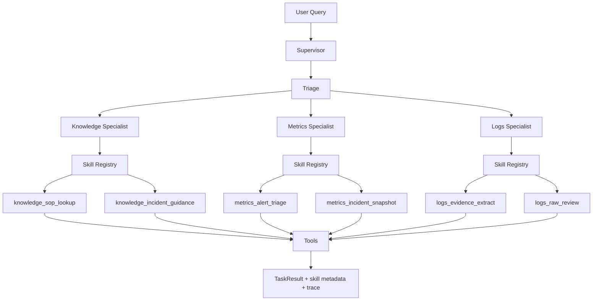

# Skills 化改造走读

## 1. 这次到底改了什么

这次不是简单加几个函数名叫 `skill`，而是把多智能体里的 specialist 真正改成了：

- `agent` 负责接任务、选 skill、打 trace
- `skill` 负责匹配任务、执行业务套路
- `tool` 负责做原子动作，比如查知识库、查 Prometheus、查日志

也就是说，项目从原来的：

`specialist agent -> 直接调 tool`

变成了：

`specialist agent -> skill registry -> selected skill -> tool`

## 2. 为什么要这样改

原来的 specialist 有两个问题：

1. `knowledge / metrics / logs` 三个 agent 都把“路由逻辑”和“执行逻辑”写死在一个 `Handle()` 里。
2. 能力虽然在 `Capabilities()` 里写了元数据，但运行时并没有真正落到“skill 级别的复用和观察”。

这会导致三个后果：

- 以后加一个处理套路，容易继续把 `Handle()` 写胖
- 很难解释“这个 agent 为什么这样处理这个请求”
- 面试时只能说“我有 agent 和 tool”，很难说自己做了可复用能力抽象

## 3. 现在的新结构

核心代码有两层。

第一层：通用 skills 框架

- `internal/ai/skills/registry.go`
- `internal/ai/skills/registry_test.go`

这里定义了：

- `Skill` 接口
- `Registry`
- `Resolve`
- `Execute`
- `AttachMetadata`
- `PrefixedCapabilities`

第二层：skills 版 specialist

- `internal/ai/agent/skillspecialists/knowledge/agent.go`
- `internal/ai/agent/skillspecialists/metrics/agent.go`
- `internal/ai/agent/skillspecialists/logs/agent.go`

这些 specialist 不再自己硬编码执行路径，而是都带一个 `skills.Registry`。

## 4. 请求是怎么流动的



## 5. 这次落了哪些 skill

### Knowledge

- `knowledge_sop_lookup`
  - 适合 SOP、runbook、文档、步骤类问题
- `knowledge_incident_guidance`
  - 作为默认回退 skill，用于更泛化的故障分析问题

### Metrics

- `metrics_alert_triage`
  - 适合告警、Prometheus、firing、severity 相关问题
- `metrics_incident_snapshot`
  - 回退 skill，用于健康快照和更宽泛的问题

### Logs

- `logs_evidence_extract`
  - 适合报错、异常、超时、panic、堆栈类问题
- `logs_raw_review`
  - 回退 skill，当拿不到结构化证据时至少给出原始日志片段

## 6. 这次不只是“能跑”，而且“能观察”

这次我特意把 skill 选择结果接到了 runtime trace 里。

现在运行时 detail 里会看到类似信息：

```text
[knowledge] selected skill=knowledge_incident_guidance
```

这样有两个直接好处：

1. 线上排查时能看到“这次到底选了哪个 skill”
2. 面试时可以讲“我不是只做了抽象，还把可观察性一起做了”

## 7. 这次怎么避免把旧代码改炸

这次我没有强行重写旧的 `specialists/knowledge|metrics|logs`，而是新建了一套：

- `internal/ai/agent/skillspecialists/...`

然后只改两个注册点：

- `internal/ai/agent/supervisor/supervisor.go`
- `internal/ai/service/ai_ops_service.go`

这样做的原因很务实：

- 旧文件有历史编码问题
- 新旧实现可以对照学习
- 真出问题时回滚只改注册点，不会伤到老代码

这是工程上很常见的“平行迁移”做法。

## 8. 这次怎么验证的

我跑的是定向测试：

```powershell
go test ./internal/ai/skills
go test ./internal/ai/agent/skillspecialists/...
go test ./internal/ai/agent/supervisor ./internal/ai/service
```

验证了三类事情：

- `skills.Registry` 的匹配和回退逻辑
- 每个 skills specialist 的 `skill_name` 是否正确写入 metadata
- `supervisor` 和 `service` 切到新实现后是否还能正常工作

## 9. 你以后怎么继续扩 skill

正确姿势不是继续把逻辑塞回 `Handle()`，而是：

1. 在某个 specialist 下新增一个 skill struct
2. 实现 `Name / Description / Match / Run`
3. 把它注册进 `mustNewSkillRegistry()`
4. 写一个对应测试
5. 看 runtime detail 是否出现正确的 `selected skill=...`

例如以后你可以继续加：

- `knowledge_release_sop`
- `metrics_capacity_regression`
- `logs_payment_timeout_trace`

## 10. 这次改造的边界

这次已经把项目补成了“真正有 skill 一等公民”的版本，但边界要讲清楚：

- 现在的 skill 主要落在 specialist 内部
- 最上层 triage 还是按 domain 路由，不是全局 skill 路由
- 这已经足够让系统从“agent + tools”升级成“agent + skills + tools”

如果以后你想再升一级，可以继续做：

- 全局 skill catalog
- 基于 capability 的统一路由
- skill 级别的评测 harness
- skill 命中率和失败率统计
