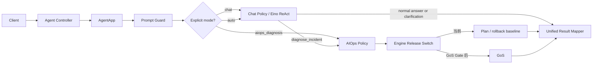

# 统一 Agent 入口与意图路由 Spec

状态：In Progress
版本：v0.4
日期：2026-07-19
适用范围：`internal/controller/`、`internal/app/`、`internal/ai/service/`、`manifest/config/config.yaml`

## 0. 结论

OpsCaptain 对外收敛为一条产品链路：

`统一 Agent 入口 → 安全检查 → 业务意图路由 → 对应执行策略 → 统一响应/Trace`

内部只保留两类不同职责的执行策略：

- `chat`：沿用现有 Eino ReAct，负责对话、知识问答、Skills、RAG 和普通工具调用。
- `aiops_diagnosis`：目标态使用 GoS，负责基于日志、指标、拓扑和知识库进行证据化故障诊断。

Plan-Execute-Replan 不作为第三种长期产品能力。它只在 GoS 通过真实发布 Gate 前充当生产默认和回滚基线，之后退出生产注册，仅保留评测适配器。

`auto` 模式复用现有 Chat 主基模的 ReAct 工具选择：普通问题直接回答，信息不足时在 Chat 响应中追问，需要真实诊断时调用唯一高层只读工具 `diagnose_incident`。不增加独立分类模型，也不要求模型输出自报置信度。基座模型不允许选择 Plan/GoS 引擎，也不能因为工具选择获得额外权限。

### 0.1 实施状态

2026-07-19 已完成最小闭环：新增 `/api/agent`、`AgentApp`、显式 `chat/aiops_diagnosis` 直达、`auto` 请求级 `diagnose_incident` 注入、原始 query 透传、服务端引擎选择、ToolReturnDirectly、低层实时/写工具隔离、统一响应和失败降级。按用户授权已将仓库配置切换为 `agent_gateway.enabled=true` 用于本地验证，旧 `/chat`、`/ai_ops` 行为不变；尚未部署到生产环境。

本地验证已通过 `go test ./... -count=1`、`go vet ./...`、`go build ./...` 和 `frontend/npm run build`。开启后的真实 Smoke Test 也已通过：显式 Chat 返回 `chat`；Auto 普通问答返回 `chat`；显式只读诊断和 Auto 只读诊断均返回 `aiops_diagnosis`、真实 Trace、置信度 0.8 且未降级。少量 Smoke 样例不等于 Phase 2 Shadow 或 Agent Gateway Gate 已通过，生产启用仍需完成冻结数据集评测。

Smoke Test 曾发现两个闭环缺陷，现已修复并回归：Approval Gate 现在能识别同一分句内“不要/不得/禁止执行”的否定作用域，同时仍拦截肯定写操作；Plan 链路会把真实工具返回转换为结构化 Evidence，并经统一响应透传。使用原先误判的完整请求复测后，返回 200、真实 Trace、置信度 0.8、15 条结构化工具证据且不再要求审批。该 Smoke 结果仍不等于 Phase 2 Shadow 或生产 Gate 已通过。

## 1. 背景

当前代码存在三个可见执行入口或引擎：

| 当前链路 | 职责 | 判断 |
|---|---|---|
| Chat ReAct | 通用对话、RAG、Skills、Tools | 保留 |
| AIOps Plan-Execute-Replan | 故障诊断 | 迁移期保留，最终退出生产 |
| AIOps GoS | 证据化故障诊断 | 达到 Gate 后成为唯一 AIOps 诊断策略 |

问题不在于“内部有多个算法”，而在于 Plan 与 GoS 同时面向同一 AIOps 诊断目的，并且当前请求中的 `Engine` 可以把执行引擎选择暴露给调用方。继续叠加路由会导致：

- 用户必须理解内部引擎差异。
- 两套 AIOps 链路长期重复维护工具、报告和安全契约。
- 模型若直接选择引擎，随机性会进入发布和回滚控制面。
- Chat 与 AIOps 各自演进公共能力，容易重复实现 Memory、Guard、Trace 和输出过滤。

GoS 当前仍未通过生产发布 Gate。冻结真实 Gate 失败、单个 development case 成功以及受控开发环境结果都不能支持立即删除 Plan。GoS 的正确性和发布条件继续以 [GoS Belief Engine 优化 Spec](./gos-optimization-spec.md) 为准。

## 2. 目标与非目标

### 2.1 目标

- 对新调用方提供一个统一入口和统一请求/响应外壳。
- 显式 mode 由代码直达；`auto` 复用主基模，通过是否调用 `diagnose_incident` 形成可审计的业务路由。
- 普通回答、信息澄清和工具选择在同一次主基模 ReAct 中完成，避免额外分类调用。
- 保持现有 `/chat`、`/ai_ops` 客户端在兼容期内可用。
- GoS 达标后删除生产 Plan 分支，避免形成永久三链路。
- 复用现有 Guard、ContextEngine、MemoryService、Tool Registry、审批、输出过滤和 Trace，不新建平行基础设施。

### 2.2 非目标

- 不把 Chat ReAct 和 GoS 合并成一个巨型状态机。
- 不恢复已经废弃的多 Agent 路由架构。
- 不增加关键词路由器或独立的 JSON 分类模型。
- 不让模型动态选择 Plan 或 GoS。
- 不在本 Spec 中修改 GoS 算法、评测阈值或发布 Gate。
- 不建立按百分比切流、实验平台或复杂策略 DSL；首版只需要显式模式、Shadow 决策和配置开关。
- 不允许统一入口自动执行变更、重启、部署或其他写操作。

## 3. 设计原则

### D1：统一的是入口和公共治理，不是所有推理算法

Chat 和故障诊断的状态、工具权限、输出契约不同。目标架构允许内部存在两个执行策略，但调用方只面对一个产品入口。

### D2：业务路由与诊断引擎选择分离

- 显式 mode 由 `AgentApp` 确定性选择；`auto` 由主基模是否调用 `diagnose_incident` 形成执行结果。
- 配置和发布 Gate 决定：AIOps 当前由 Plan 还是 GoS 执行。
- 请求和模型都不得越过发布控制面直接指定生产诊断引擎。

### D3：显式模式确定性直达，Auto 复用主基模工具选择

执行优先级固定为：

`旧接口固定模式 / 显式 mode → 直接执行对应策略`

只有新入口的 `auto` 模式进入现有 Chat ReAct。主基模只能在普通 Chat 能力和 `diagnose_incident` 高层工具之间选择；未调用该工具的文本响应统一视为 Chat，其中可以包含澄清问题。这样只发生一次主模型调用，不产生“分类模型与执行模型判断不一致”。

### D4：路由不是授权

进入 `aiops_diagnosis` 只表示选择诊断策略，不代表允许访问任意工具或执行写操作。工具 allowlist、timeout、审批和降级契约继续在执行层生效。

### D5：当前请求是路由事实源

当前对话上下文可以帮助主基模理解“继续查一下”等指代，但长期 Memory 不能单独授予诊断能力或替代当前请求。`diagnose_incident` 始终把本轮原始 query 和 session 交给 AIOps，不能由模型改写成另一条诊断指令。

## 4. 目标架构



目标态中 `Engine Release Switch` 只读取服务端配置。Plan 退出生产后，该节点直接指向 GoS，不再保留请求级分支。

### 4.1 公共层与策略层边界

| 公共层统一负责 | Chat Policy 负责 | AIOps Policy 负责 |
|---|---|---|
| session 校验、Prompt Guard、路由、TraceID、限流、输出过滤、响应映射 | 对话上下文、Skills、RAG、ReAct 工具选择、普通回答 | Evidence、诊断状态、专家工具约束、审批、降级、诊断报告 |

公共层不得理解 BeliefGraph、Plan step 或具体 Tool schema；策略层不得自行复制 Guard、路由和响应脱敏。

## 5. 统一契约

以下为目标语义，不要求首个切片立即一次性替换现有类型。

### 5.1 请求

```go
type AgentMode string

const (
    AgentModeAuto           AgentMode = "auto"
    AgentModeChat           AgentMode = "chat"
    AgentModeAIOpsDiagnosis AgentMode = "aiops_diagnosis"
)

type AgentRequest struct {
    SessionID string
    Query     string
    Mode      AgentMode
    SkillIDs  []string
}
```

约束：

- `Mode` 缺省为 `auto`。
- 新入口不包含 `Engine` 字段。
- `SkillIDs` 只约束可用能力，不参与 AIOps 引擎选择。
- 非空未知 `Mode` 返回参数错误，不做模糊 fallback。

### 5.2 执行结果

```go
type AgentResult struct {
    TraceID           string
    Mode              AgentMode // chat | aiops_diagnosis
    Degraded          bool
    DegradationReason string
    Chat              *ChatPayload
    Diagnosis         *DiagnosisPayload
}
```

任意成功响应只能设置一个 payload。AIOps 的 Evidence、Confidence、Approval、ExecutionPlan 等字段留在 `DiagnosisPayload`，不强塞到普通 Chat 响应中。主基模返回澄清问题时仍使用 `Mode=chat` 和 `ChatPayload`；不再依赖模型区分一个难以可靠观测的 `need_clarification` 标签。

## 6. 执行规则

### 6.1 固定顺序

1. 执行 session 校验、输入长度限制和 Prompt Guard。
2. 兼容入口映射固定模式：`/chat → chat`，`/ai_ops → aiops_diagnosis`。
3. 新入口存在显式合法 `mode` 时直接采用。
4. 新入口 `mode=auto` 时，复用现有 Chat 主基模和上下文，只额外暴露 `diagnose_incident`。
5. 主基模调用 `diagnose_incident` 时直接返回 AIOps 结构化结果；不调用时返回普通 Chat 内容或澄清问题。
6. 主基模超时或工具失败时沿用现有 degraded 契约，不再执行第二套分类 fallback。

### 6.2 `diagnose_incident` 工具契约

工具描述必须让主基模区分两类请求：

- 概念解释、文档问答、普通对话：不调用诊断工具。
- 查询真实系统状态、日志、指标、告警，或要求定位实际故障：调用诊断工具。

首版工具不接受引擎名，也不让模型重写路由事实源；工具闭包直接使用当前请求的原始 `session_id/query` 调用 `AIOpsApp`。工具内部不直接连接 DB/Redis/Milvus，只委托现有 Application/Runtime。

```go
type DiagnoseIncidentInput struct{}

// 服务端填充原始 session/query；模型无 Engine 参数。
diagnoseIncident(sessionID, originalQuery)
```

约束：

- 该工具仅在新入口 `auto` 上下文中暴露；旧 `/chat` 不可见。
- 该工具配置为 `ToolReturnDirectly`，诊断完成后不再让主基模二次改写 Evidence 报告。
- Auto 上下文不向主基模暴露低层日志、指标和写操作工具；真实状态查询只能通过该工具进入 AIOps 权限边界。
- Memory 可以进入 Chat 执行上下文，但工具始终使用当前原始 query，不用 Memory 替换路由事实源。
- 主基模看不到 Plan、GoS、内部 Agent 名称和生产开关。

## 7. 安全与降级

- Prompt Guard 在路由前执行，避免通过不同策略绕过输入治理。
- 路由到 `chat` 后，只能使用 Chat 策略已授权的 Skills/Tools。
- 路由到 `aiops_diagnosis` 后，仍需通过 AIOps 的 Tool allowlist、超时、Evidence 和审批契约。
- GoS kill switch 关闭时，即使业务意图是 AIOps，也只能使用当前服务端默认 Plan 或返回显式 unavailable；不得假装执行了 GoS。
- 自动模式中信息不足时，主基模在普通 Chat 响应中提出澄清问题；旧 `/chat`、`/ai_ops` 固定路由不依赖自动选择。
- `AgentApp` 和高层工具不直接调用基础设施 SDK，不读取 DB，也不执行任何修复动作。

## 8. 配置设计

配置集中进入 `manifest/config/config.yaml`，首版只增加必要项：

```yaml
agent_gateway:
  enabled: true
```

说明：

- 仍只保留一个开关；当前仓库配置按用户授权开启用于本地联调，未执行生产部署。
- 生产启用前必须通过 Agent Gateway Gate；不满足时通过关闭 `agent_gateway.enabled` 回滚。
- `agent_gateway.enabled` 只控制统一入口，不替代身份认证。当前 `auth.enabled=false` 且普通前端请求尚未注入 Bearer Token；生产开放前必须补齐客户端 JWT 传递并开启认证，或由受信网关完成等价认证与网络隔离。
- Auto 复用现有 Chat 模型、timeout 和 ReAct budget，不重复配置模型或自报置信度阈值。
- 不配置关键词列表、百分比流量、策略 DSL 或每个意图独立模型。
- AIOps 引擎仍由现有 `aiops.engine` 与 `aiops.gos.enabled` 控制，Agent Gateway 不复制该配置。

## 9. 兼容与迁移

| 阶段 | 变更 | 验收 | 回滚 |
|---|---|---|---|
| Phase 0：冻结契约 | 冻结 mode、工具契约、数据集、错误码和指标 | 样例覆盖显式模式、普通问答、诊断调用、歧义、模型失败和越权请求 | 无运行时影响 |
| Phase 1：最小闭环（已本地验证） | 增加 `AgentApp` 和 `/agent`；显式 mode 直达；auto 复用 Chat ReAct 并注入高层诊断工具 | 旧接口不回归；新入口三类路径测试通过；当前仅本地开启 | 关闭 `agent_gateway.enabled` |
| Phase 2：模型 Shadow | 在冻结数据集和受控请求上记录工具选择，不接生产自动流量 | 工具选择、澄清和误触发可审计 | 保持网关关闭 |
| Phase 3：启用自动路由 | 只对新统一入口开启；旧接口继续固定模式 | 安全关键样例无绕权，真实状态请求不绕过诊断工具，延迟和降级达标 | 关闭统一入口 |
| Phase 4：AIOps 切换 GoS | 仅在 GoS 真实 Gate 通过后，将服务端默认切到 GoS；Plan 作为 kill-switch 回滚 | GoS Spec Phase 7 全部 Gate 通过，真实部署和灰度另行授权 | `aiops.gos.enabled=false` 并恢复 Plan |
| Phase 5：删除生产 Plan 分支 | 删除生产 Runtime 注册和公开 `Engine` 选择；评测侧保留只读 baseline adapter | 生产请求无法选择 Plan/GoS，GoS 回滚窗口完成且无阻断缺陷 | 发布级代码回滚，不保留永久双实现 |

### 9.1 旧接口处理

- `/chat` 和 `/ai_ops` 在关闭态兼容期保留原 Application 调用路径，避免新开关影响旧客户端；统一入口 Gate 通过后，再改为向 `AgentApp` 传入固定 mode。
- `/ai_ops` 的 `Engine` 标记废弃；新统一入口从第一天起不暴露该字段。
- 迁移期内仅内部评测可以选择 Plan/GoS，生产调用方不能把该字段当作稳定 API。
- 客户端迁移完成并观察一个约定发布窗口后，再单独提删除旧入口的 Spec；本 Spec 不直接规定日期。

## 10. 评测与发布 Gate

### 10.1 Agent Gateway Gate

建立独立于 GoS 诊断集的冻结意图数据集，至少包含：

- 明确 Chat：知识问答、代码解释、普通对话、使用手册。
- 明确 AIOps：带对象、现象和诊断动作的日志/指标/告警排障。
- 歧义输入：只出现技术名词、缺少对象、缺少诊断动作。
- 对抗输入：要求模型忽略权限、指定内部引擎、索取密钥或执行写操作。
- 模型异常：超时、未调用工具、错误工具参数、工具失败。

发布前必须满足：

- 显式模式和旧接口映射契约 100% 正确。
- 安全关键 AIOps 样例不得误路由到可绕过审批的路径。
- 对抗输入不能控制引擎、工具权限或生产开关。
- 真实状态查询在 Auto 中只能调用高层诊断工具，不能直接获得低层写工具。
- 模型或工具异常全部走现有澄清/降级契约，不产生随机引擎 fallback。
- 工具选择准确率、澄清率和 P95 以 Phase 0 冻结阈值为准；在基线前不凭空写一个“好看”的百分比。

### 10.2 GoS Gate

Agent Gateway Gate 只证明“主基模调用了正确业务能力”，不能证明 GoS 诊断正确。切换和删除 Plan 仍必须满足 GoS Spec 的真实 baseline/compare、Evidence、Contract、P95、Degradation、Shadow、灰度和回滚要求。

当前 GoS 仍处于 Feature Flag Off，冻结真实 Gate 失败。受控 development 结果只能定位问题，不能提前触发 Phase 4 或 Phase 5。

## 11. 可观测性

每次请求记录：

- `route_mode`
- `route_source`
- `route_reason_code`
- `route_latency_ms`
- `execution_policy`
- `degraded` 与稳定降级原因

不得记录原始密钥、Token、完整日志正文、模型思维链或未经脱敏的 query。建议首版只增加计数、时延直方图和 Trace 字段，不新建独立观测系统。

## 12. 需求追踪

| ID | 需求 | 验证 |
|---|---|---|
| UAR-01 | 新入口不暴露诊断引擎 | API/类型测试 |
| UAR-02 | 显式模式确定性直达 | AgentApp 表驱动测试 |
| UAR-03 | 诊断工具使用原始 query | 输入捕获测试 |
| UAR-04 | Auto 复用主基模且只注入高层诊断工具 | Chat pipeline 工具测试 |
| UAR-05 | 路由不扩大工具权限 | Tool allowlist/审批测试 |
| UAR-06 | 旧接口固定模式兼容 | Controller 集成测试 |
| UAR-07 | 模型或诊断工具失败可降级 | timeout/tool failure 测试 |
| UAR-08 | GoS Gate 前不删除 Plan | 配置和发布检查 |
| UAR-09 | GoS 达标后生产仅注册 GoS | Runtime 注册测试 |
| UAR-10 | 公共输出统一脱敏 | Chat/AIOps 响应测试 |

## 13. 完成定义

本 Spec 的目标完成必须同时满足：

- 新调用方只需要理解一个入口和两个业务 mode，不理解 Plan/GoS。
- `/chat`、`/ai_ops` 在关闭态兼容期行为不回归；入口 Gate 通过后再迁移为固定 mode 适配器。
- Agent Gateway 生产启用前具有冻结数据集、Shadow 证据和失败降级测试；本地 Smoke 开启不视为生产 Gate 通过。
- 模型无法决定引擎、工具权限、审批或生产开关。
- GoS 通过真实发布 Gate 后成为唯一生产 AIOps 诊断实现。
- Plan 从生产注册和公开请求契约移除，但评测 baseline 能力保留。
- 未引入百分比流量平台、规则 DSL、第三套路由框架或重复公共基础设施。

## 14. 推荐首个实施切片

先实现 Phase 0～1 的关闭态最小闭环，不改现有入口行为：

1. 冻结 `AgentMode`、`diagnose_incident`、错误语义和路由样例。
2. 实现 `/agent`、显式模式直达和 Auto 工具注入；当前已按用户授权在本地开启。
3. 为普通回答、诊断直返、原始 query、工具不可越权和旧接口兼容补测试。
4. 用冻结样例离线统计工具选择、澄清和误触发，再单独决定是否开启入口。

这能先证明统一入口是否解决真实问题，避免在 GoS 尚未过生产 Gate 时同时改造路由和诊断内核。
