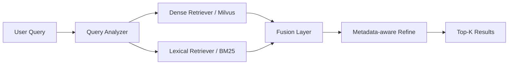

# Hybrid Retrieval 设计方案

## 1. 背景

当前 RAG 已经有了几条明确结论：

1. `retrieve / rewrite / full` 三组 telemetry baseline 几乎一致
2. `rewrite` 和 `rerank` 没有带来实际增益，只增加了延迟和不稳定性
3. 当前主要瓶颈在 first-pass retrieval，不在后排序
4. 评测口径已经拆成了 `fault / symptom / combined` 三套，后续优化终于有了可解释的评价标准

这意味着下一步不该继续堆 `LLM rewrite / rerank`，而应该优先提升召回层。

## 2. 问题定义

当前线上 retrieval 本质上还是：

- 单 query
- dense retrieval first pass
- 本地 metadata + lexical refine

这个架构的上限不高，原因有两个：

1. dense retrieval 擅长语义相似，但不擅长精确实体召回
2. AIOps/RCA 查询里存在大量硬信号：
   - `service`
   - `source/destination`
   - `metric name`
   - `trace operation`
   - `error/log keyword`

例如：

- `checkoutservice rrt timeout paymentservice`
- `frontend -> productcatalogservice trace latency`
- `cpu_usage spike on recommendationservice`

这类 query 如果 first-pass 没把正确案例召回，后面的 refine 和 rerank 都救不回来。

## 3. 目标

本次 Hybrid Retrieval 的目标是：

1. 提高 first-pass candidate recall
2. 保持默认路径稳定，不重新依赖 LLM
3. 尽量复用当前 telemetry metadata 和现有 dense retrieval
4. 先做轻量实现，不引入重型外部搜索系统

## 4. 核心思路

Hybrid Retrieval = 同时做两路召回，再融合排序：

1. `Dense Retrieval`
   - 基于 Milvus 向量召回
   - 优势：语义相似强
   - 劣势：精确术语召回弱

2. `Lexical Retrieval`
   - 基于关键词/BM25 召回
   - 优势：实体词、错误码、指标名、服务名命中强
   - 劣势：语义泛化弱

3. `Fusion`
   - 对两路结果去重、融合、轻量加权
   - 输出统一 candidate set

4. `Refine`
   - 继续复用当前本地 metadata-aware refine
   - 最终裁成 top-k

## 5. 架构图



## 6. 设计细节

### 6.1 Query Analyzer

目的不是做 LLM rewrite，而是做轻量结构化拆解。

从 query 中提取：

- `service tokens`
- `instance_type`
- `source/destination`
- `metric names`
- `trace operations`
- `log keywords`
- 剩余自然语言 token

例如：

`checkoutservice rrt timeout to paymentservice`

拆成：

- service: `checkoutservice`, `paymentservice`
- metric/log keyword: `rrt`, `timeout`
- path clue: `to paymentservice`

### 6.2 Dense Retrieval

保留当前 Milvus 路径，不重写：

- 继续使用当前 embedding
- 继续使用 `candidate_top_k`
- 默认先取 `top 50`

这是语义召回通道。

### 6.3 Lexical Retrieval

第一版不引入 Elasticsearch / OpenSearch。

建议实现为：

- 基于本地构建的 BM25 或简化 inverted index
- 索引来源：
  - 文档正文
  - sidecar metadata
  - telemetry 抽取出的结构字段

优先纳入索引的字段：

- `service`
- `instance_type`
- `source`
- `destination`
- `metric_names`
- `trace_operations`
- `log_keywords`
- `service_tokens`
- 文档正文中的关键短语

### 6.4 Fusion

不建议直接混合 dense score 和 BM25 score，因为两者量纲不同。

第一版推荐用 `RRF`，也就是 `Reciprocal Rank Fusion`：

公式：

`score(doc) = 1 / (k + rank_dense) + 1 / (k + rank_lexical)`

建议：

- `k = 60`
- dense 和 lexical 各取 `top 50`
- 融合后去重

RRF 的优点：

- 实现简单
- 不需要校准分数分布
- 对异构召回器很稳

### 6.5 Metadata-aware Refine

融合之后，不直接返回结果，而是继续走当前已有的轻量重排逻辑。

建议增加以下 boost：

- exact service match
- exact source/destination match
- metric overlap
- trace operation overlap
- lexical overlap count

注意：

- 这层是轻量本地排序
- 不是 LLM rerank
- 必须保证低延迟

## 7. 索引设计

### 7.1 第一版索引输入

不改现有 Milvus 文档格式，只新增 lexical 索引输入。

lexical 索引文档建议包含：

- `doc_id`
- `source_path`
- `content`
- `service`
- `instance_type`
- `source`
- `destination`
- `metric_names`
- `trace_operations`
- `log_keywords`
- `service_tokens`

### 7.2 构建方式

建议在 indexing pipeline 里同步产出：

1. Milvus dense index
2. 本地 lexical index artifact

例如：

- `baseline/lexical/index.jsonl`
- `baseline/lexical/postings.json`

或者：

- `baseline/lexical/bm25.gob`

第一版重点是“可跑通”，不是“最优实现”。

## 8. 配置建议

建议新增这些配置：

```yaml
rag:
  default_query_mode: retrieve
  hybrid_enabled: true
  hybrid_dense_top_k: 50
  hybrid_lexical_top_k: 50
  hybrid_fusion_k: 60
  hybrid_final_top_k: 10
  hybrid_metadata_boost_enabled: true
```

如果要更细：

```yaml
rag:
  hybrid_boost:
    service_exact: 3.0
    source_exact: 1.5
    destination_exact: 1.5
    metric_overlap: 1.0
    trace_overlap: 1.0
```

## 9. 评测方案

Hybrid Retrieval 上线前，必须先在离线评测里单独对比：

1. dense-only
2. lexical-only
3. hybrid

每组都跑三套口径：

- `holdout_related`
- `holdout_symptom`
- `holdout_combined`

至少记录：

- `Hit@1/3/5`
- `AvgRecall@1/3/5`
- `Avg Total Latency`
- candidate set 大小
- dense 命中占比
- lexical 命中占比

额外建议加两个内部指标：

1. `candidate_hit_rate`
   - 正确案例是否进入融合前候选池

2. `post_fusion_hit_rate`
   - 融合后是否进入 top-k

这样可以区分：

- 是召回没进来
- 还是融合排序没排上去

## 10. 实施顺序

### P0

先做设计收口，不写大改：

- 明确 lexical 索引字段
- 明确 fusion 策略
- 明确评测口径

### P1

先做离线 hybrid baseline：

- 不接线上 Query
- 先在 eval harness 里验证 hybrid 是否有增益

### P2

如果离线有效，再接入线上 `QueryWithMode(...)`

建议新增：

- `QueryModeHybrid`

默认仍然保持：

- `retrieve`

不要直接把默认模式切成 hybrid。

### P3

只有在 hybrid 稳定增益后，再考虑：

- 是否恢复 rewrite
- 是否保留 rerank

## 11. 为什么不先上重型方案

### 不先上 GraphRAG

因为当前问题还在召回第一层，图谱太早上会掩盖真正瓶颈。

### 不先上 Elasticsearch/OpenSearch

因为第一版目标是验证“lexical 通道是否带来实质提升”，不是先引入重型运维系统。

### 不先继续调 LLM

因为前面的 baseline 已经说明：

- LLM rewrite/rerank 现在没有带来收益
- 还会引入 429 和延迟

## 12. 风险与边界

1. lexical 通道如果字段设计过宽，会引入噪声
2. service 名字重复或前后缀相似时，可能造成误召回
3. telemetry 文档粒度如果仍然太粗，hybrid 增益也会受限
4. 如果 lexical index 只做正文，不纳入 metadata，收益会被削弱

## 13. 给评审员怎么讲

可以直接这样讲：

> 当前 RAG 的主要问题不在 LLM，而在 first-pass retrieval。dense retrieval 对语义相似有效，但对服务名、指标名、路径这类精确实体信号不够敏感。  
> 所以我设计了 hybrid retrieval，把 dense 和 lexical 两路召回并行，再用 RRF 融合，并继续走本地 metadata-aware refine。这样做的目标不是让链路更复杂，而是先把正确候选找回来，再谈排序和解释。

## 14. 我应该学会什么

1. RAG 优化优先级通常是：召回 > 排序 > LLM 润色
2. dense retrieval 不是万能的，AIOps 这种场景天然适合 hybrid
3. 做 hybrid 之前，要先把评测口径和默认运行路径收口
4. 第一版实现应该追求“低风险验证”，不是“架构炫技”
