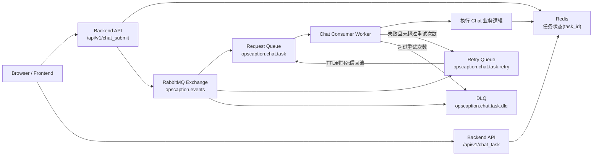
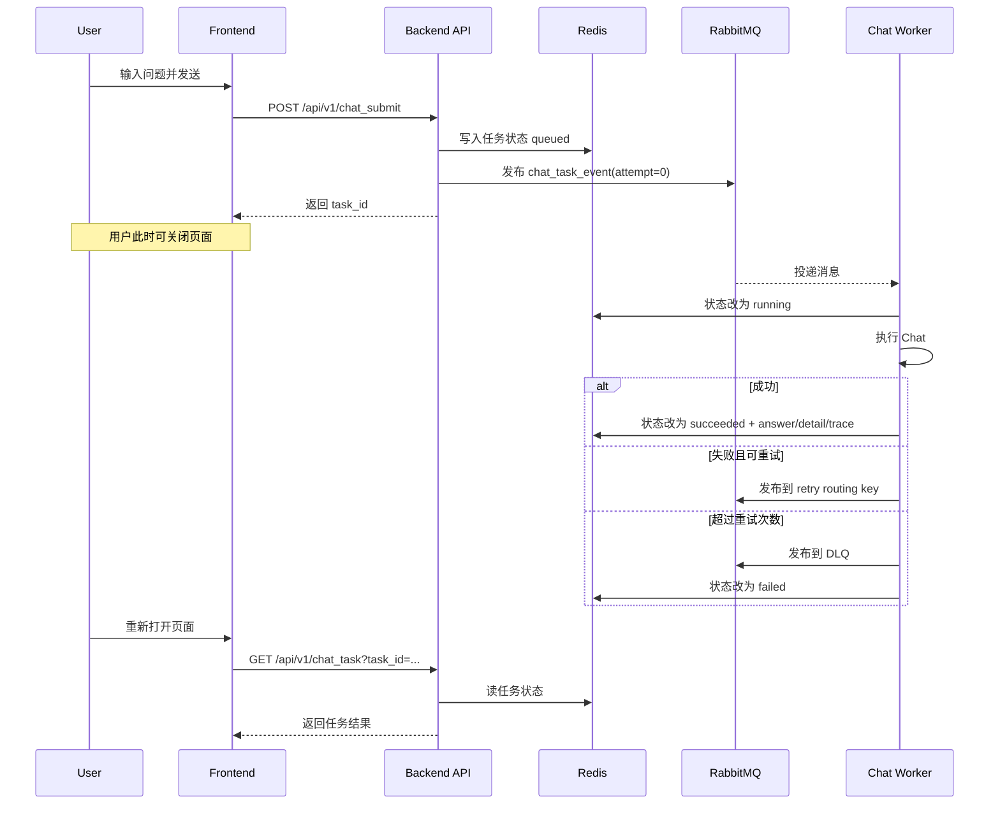

# OpsCaption 数据流详解

本文档详细讲解系统中每一类数据是怎么流转的。

---

## 第一章：用户请求的数据流

### 1.1 完整数据流

```
浏览器 POST /api/v1/chat
│
│  body: { "prompt": "checkoutservice CPU 告警", "session_id": "abc123" }
│
▼
Controller (chat_v1_chat.go)
│
│  提取 query, session_id
│  JWT 验证
│  Rate Limit 检查
│
▼
ShouldUseMultiAgentForChat(query)
│
│  query 包含 "告警" → true
│
▼
RunChatMultiAgent(ctx, sessionID, query)
│
│  ┌─ 检查降级开关 (degradation.go)
│  │  如果降级 → 直接返回降级响应
│  │
│  ├─ 获取/创建 Runtime (getOrCreateChatRuntime)
│  │  按 dataDir 复用 Runtime，不每次重建
│  │
│  ├─ 构建记忆上下文 (memory_service.go)
│  │  │
│  │  │  ContextAssembler.Assemble()
│  │  │  │
│  │  │  ├─ PolicyResolver 选择 Profile
│  │  │  ├─ 按 Budget 选择 History
│  │  │  ├─ 从 LongTermMemory 检索记忆
│  │  │  └─ 返回 ContextPackage
│  │  │
│  │  └─ 输出: memory_context (文本) + memory_refs (引用)
│  │
│  ├─ 构建 TaskEnvelope
│  │  │
│  │  │  goal = "checkoutservice CPU 告警"
│  │  │  assignee = "supervisor"
│  │  │  input = {
│  │  │    raw_query: "checkoutservice CPU 告警",
│  │  │    memory_context: "上次讨论过 checkoutservice 的部署配置...",
│  │  │    response_mode: "chat",
│  │  │    entrypoint: "chat"
│  │  │  }
│  │  │
│  │  └─ 输出: TaskEnvelope
│  │
│  └─ Runtime.Dispatch(task)
│     │
│     ▼
│  Supervisor.Handle(ctx, task)
│     │
│     ├─ 1. Dispatch → Triage
│     │     │
│     │     │  输入: goal = "checkoutservice CPU 告警"
│     │     │  匹配规则: "告警" → alert_analysis
│     │     │  输出: intent = "alert_analysis"
│     │     │        domains = ["metrics", "logs", "knowledge"]
│     │     │
│     │     └─ TaskResult { metadata: { intent, domains } }
│     │
│     ├─ 2. 并行 Dispatch → 3 个 Specialists
│     │     │
│     │     │  每个 specialist 收到的 task:
│     │     │    goal = "checkoutservice CPU 告警\n\n可参考的历史上下文：..."
│     │     │    input.raw_query = "checkoutservice CPU 告警"
│     │     │    input.memory_context = "..."
│     │     │    input.intent = "alert_analysis"
│     │     │
│     │     ├─ [goroutine 1] Metrics Specialist
│     │     │     │
│     │     │     │  调用 query_prometheus_alerts
│     │     │     │  返回: 活跃告警列表
│     │     │     │
│     │     │     └─ TaskResult {
│     │     │          status: succeeded,
│     │     │          summary: "发现 2 条活跃告警: CPUThrottling...",
│     │     │          evidence: [{ source_type: "prometheus", ... }]
│     │     │        }
│     │     │
│     │     ├─ [goroutine 2] Logs Specialist
│     │     │     │
│     │     │     │  调用 query_log
│     │     │     │  返回: 相关日志条目
│     │     │     │
│     │     │     └─ TaskResult {
│     │     │          status: succeeded,
│     │     │          summary: "发现 context canceled 错误日志...",
│     │     │          evidence: [{ source_type: "log", ... }]
│     │     │        }
│     │     │
│     │     └─ [goroutine 3] Knowledge Specialist
│     │           │
│     │           │  Skills Registry 选择 skill
│     │           │  调用 query_internal_docs
│     │           │  │
│     │           │  │  RAG 链路:
│     │           │  │  query → Rewrite → Retrieve (Milvus) → Rerank
│     │           │  │
│     │           │  返回: 相关知识文档
│     │           │
│     │           └─ TaskResult {
│     │                status: succeeded,
│     │                summary: "找到 3 篇相关文档...",
│     │                evidence: [{ source_type: "knowledge", ... }]
│     │              }
│     │
│     ├─ 3. wg.Wait() — 等待所有 specialist 完成
│     │
│     ├─ 4. Dispatch → Reporter
│     │     │
│     │     │  输入: query + intent + 3 个 specialist 的 results
│     │     │
│     │     │  Reporter 做的事:
│     │     │  ├─ 装配上下文 (ContextAssembler)
│     │     │  ├─ 如果 chat 模式 → 调 LLM 生成自然语言回答
│     │     │  └─ 如果 report 模式 → 生成 Markdown 报告
│     │     │
│     │     └─ TaskResult {
│     │          status: succeeded,
│     │          summary: "综合分析: checkoutservice CPU 使用率过高...",
│     │          evidence: [合并所有 specialist 的 evidence]
│     │        }
│     │
│     └─ 返回最终 TaskResult
│
▼
RunChatMultiAgent 收到结果
│
│  提取 summary, evidence, detail, trace_id
│  异步持久化记忆 (PersistOutcome)
│
▼
Controller 返回 HTTP 响应给浏览器
│
│  body: {
│    "content": "综合分析: checkoutservice CPU 使用率过高...",
│    "detail": ["triage: alert_analysis", "metrics: 2 alerts", ...],
│    "trace_id": "xxx"
│  }
```

---

## 第二章：RAG 检索的数据流

### 2.1 知识入库流程

```
用户上传文件 (chat_v1_file_upload.go)
│
▼
Knowledge Index Pipeline (knowledge_index_pipeline/)
│
├─ Loader: 读取文件内容 (Markdown/PDF/...)
├─ Transformer: 切分文档 (按标题/段落/固定长度)
├─ Embedder: 调 Doubao Embedding 生成向量
└─ Indexer: 写入 Milvus
│
▼
Milvus Collection
│
│  每条记录:
│  ├─ id: 文档片段 ID
│  ├─ content: 文档文本
│  ├─ metadata: 来源信息
│  └─ vector: 1536 维向量
```

### 2.2 知识检索流程

```
Knowledge Specialist 调用 query_internal_docs(query)
│
▼
query_internal_docs 工具
│
├─ 获取 SharedRetrieverPool（全局复用）
│
▼
rag.Query(ctx, pool, query)
│
├─ 1. Query Rewrite
│     │
│     │  调用 DeepSeek V3
│     │  prompt: "你是搜索优化器，把问题改写成关键词丰富的搜索查询"
│     │  "checkoutservice CPU 告警" → "checkoutservice CPU 高使用率 告警 pod throttling"
│     │  超时 3 秒，失败用原始 query
│     │
│     └─ 输出: rewritten_query
│
├─ 2. Retrieve
│     │
│     │  RetrieverPool.GetOrCreate()
│     │  │  按 Milvus 地址 + top_k 做缓存
│     │  │  如果缓存命中 → 复用
│     │  │  如果缓存未命中 → 新建 Milvus Retriever
│     │  │
│     │  Milvus Retriever:
│     │  │  把 rewritten_query 用 Doubao Embedding 转成向量
│     │  │  在 Milvus 里做 ANN (近似最近邻) 搜索
│     │  │  返回 top_k 个最相似的文档片段
│     │  │
│     │  └─ 输出: []*schema.Document (raw results)
│
├─ 3. Rerank
│     │
│     │  调用 DeepSeek V3
│     │  prompt: "给每个文档打 0-10 的相关性分"
│     │  对每个文档评分，然后按分数重排
│     │  超时 5 秒，失败用原始排序
│     │
│     └─ 输出: []*schema.Document (reranked, top_k)
│
└─ 输出: docs + QueryTrace
```

---

## 第三章：记忆系统的数据流

### 3.1 记忆写入

```
对话结束后
│
▼
MemoryService.PersistOutcome()
│
├─ 构建要保存的对话内容
├─ 用 LLM 提取记忆候选 (ExtractMemoryCandidates)
│     │
│     │  prompt: "从对话中提取值得记住的关键信息"
│     │  超时保护 (configurable, 默认 1.5 秒)
│     │
│     └─ 输出: 记忆候选列表
│
├─ 校验每条记忆 (ValidateMemoryCandidate)
│     │
│     │  过滤掉:
│     │  ├─ 太短的
│     │  ├─ 太长的
│     │  ├─ 纯代码块的
│     │  └─ assistant boilerplate 的
│     │
│     └─ 输出: 有效记忆列表
│
└─ 写入 LongTermMemory
      │
      │  每条记忆:
      │  ├─ SessionID
      │  ├─ Content (文本)
      │  ├─ AccessCnt (访问次数)
      │  └─ LastUsed (最后使用时间)
```

### 3.2 记忆读取

```
新请求进来
│
▼
MemoryService.BuildContextPlan()
│
├─ ContextAssembler.Assemble()
│     │
│     ├─ PolicyResolver 选择 Profile
│     │     根据 mode (chat/aiops) 决定是否允许 memory
│     │
│     ├─ LongTermMemory.Retrieve(sessionID, query, limit)
│     │     │
│     │     │  按 query 相似度排序
│     │     │  返回最相关的 N 条记忆
│     │     │
│     │     └─ 输出: []Entry
│     │
│     └─ selectMemories(entries, profile)
│           │
│           │  按 budget 裁剪
│           │  按 freshness 排序
│           │  超出预算的丢弃
│           │
│           └─ 输出: MemoryItems
│
└─ 输出: memory_context (文本) + memory_refs (引用)
```

---

## 第四章：评测数据的流转

### 4.1 Baseline 生成

```
GenerateAIOPSBaselineArtifacts()
│
├─ 读取 input.json + groundtruth.jsonl
│
├─ 划分 build / holdout split (70% / 30%)
│
├─ 为 build cases 生成:
│     ├─ Evidence Docs (只含观测信号，不含标签)
│     └─ History Docs (含历史标签和结论)
│
├─ 为 holdout cases 生成:
│     └─ Eval Cases (query + expected results)
│
└─ 输出:
      ├─ baseline/docs_evidence_build/
      ├─ baseline/docs_history_build/
      ├─ baseline/eval/eval_cases_holdout_related.jsonl
      └─ baseline/eval/build_split.json
```

### 4.2 Telemetry 预处理

```
build_telemetry_evidence.py
│
├─ 读取 input.json + groundtruth.jsonl
├─ 读取 build_split.json
│
├─ 对每个 case:
│     │
│     ├─ 确定时间窗口
│     ├─ 定位相关 parquet 文件
│     │
│     ├─ 提取 Metric Signals
│     │     baseline 窗口 vs incident 窗口对比
│     │
│     ├─ 提取 Log Signals
│     │     过滤 → 归一化 → 聚合 → 评分
│     │
│     ├─ 提取 Trace Signals
│     │     过滤 → 分组 → 统计 → 评分
│     │
│     └─ 渲染 Markdown Evidence Doc + metadata
│
└─ 输出:
      ├─ baseline/docs_evidence_telemetry_build/  (build split)
      ├─ baseline/docs_evidence_telemetry/  (全量)
      └─ baseline/telemetry/  (汇总 JSONL + report)
```

### 4.3 远程评测

```
run_telemetry_baseline_remote.sh
│
├─ 启动 Milvus (Docker)
├─ Go prep: 生成 eval cases
├─ Go indexing: 把 evidence docs 索引进 Milvus
├─ Go eval: RunQueryEval
│     │
│     │  对每个 eval case:
│     │  ├─ 发送 query 到 RAG
│     │  ├─ 获取 top-K 结果
│     │  ├─ 与 expected 对比
│     │  └─ 计算 Recall@K, Hit@K
│     │
│     └─ 输出: report JSON
│
└─ 输出:
      └─ baseline/eval/report_evidence_telemetry_build_related.json
```

---

## 第五章：关键数据结构速查

### TaskEnvelope（任务信封）

```
task_id        → 任务唯一 ID
parent_task_id → 父任务 ID（子任务才有）
session_id     → 用户会话 ID
trace_id       → 追踪 ID
goal           → 任务目标
assignee       → 执行者（agent 名称）
input          → 附加参数
status         → 当前状态
memory_refs    → 记忆引用
```

### TaskResult（任务结果）

```
task_id            → 任务 ID
agent              → 执行者
status             → succeeded / failed / degraded
summary            → 摘要文本
confidence         → 置信度 0~1
evidence           → 证据列表
degradation_reason → 降级原因
```

### ContextPackage（上下文包）

```
HistoryMessages → 对话历史
MemoryItems     → 长期记忆
DocumentItems   → RAG 检索结果
ToolItems       → 工具调用结果
Trace           → 装配过程追踪
```

### QueryTrace（RAG 查询追踪）

```
Mode              → retrieve / rewrite / full
OriginalQuery     → 原始查询
RewrittenQuery    → 改写后查询
CacheHit          → RetrieverPool 是否命中缓存
RetrieveLatencyMs → 检索耗时
RewriteLatencyMs  → 改写耗时
RerankLatencyMs   → 重排耗时
RawResultCount    → 原始结果数
ResultCount       → 最终结果数
RerankEnabled     → 是否启用了重排
```

---

## 第六章：MQ 异步任务详解（面试版）

这一章专门回答三个问题：

1. 为什么要加 MQ，而不是直接在请求里做完
2. 用户关网页后，任务怎么继续跑
3. 在已有 MQ 的前提下，是否还需要引入 ants 协程池

### 6.1 为什么引入 MQ

核心目标是把「请求生命周期」和「任务生命周期」解耦。

- 请求生命周期：浏览器发起请求、等待响应、可能中途断开
- 任务生命周期：任务被接收后，应该尽量完整执行、可重试、可追踪

如果没有 MQ，常见问题是：

- 用户断网/关页面时，请求上下文被取消，后台任务容易跟着中断
- 峰值流量时，HTTP 线程直接背压，抖动明显
- 重试逻辑分散在业务代码里，不统一

### 6.2 MQ 结构图（当前实现）



### 6.3 聊天异步数据流（用户关页面场景）



你可以把它记成一句话：

`chat_submit` 只负责「收任务+入队」，`chat_task` 负责「查结果」，执行与重试在 MQ worker 内完成。

### 6.4 记忆抽取的数据流（第二条 MQ 链路）

系统里还有一条异步链路：`memory extraction`。

流程是：

1. `PersistOutcome` 先写 SimpleMemory
2. 优先尝试 `enqueueMemoryExtractionDefault` 发 MQ
3. MQ 可用：由 memory consumer 异步抽取并写长期记忆
4. MQ 不可用：回落到本地 fallback worker（当前是 semaphore + goroutine）

这条链路的价值是：就算消息队列暂时不可用，核心记忆能力仍有降级兜底，不会完全丢。

### 6.5 可靠性机制（面试必须说出的点）

1. 至少一次投递（At-least-once）
消息可能重复，但尽量不丢；因此消费端要考虑幂等。

2. 重试与死信分层
失败先进入 retry queue，超过阈值进入 DLQ，避免无限重试。

3. 明确状态机
`queued -> running -> succeeded/failed`，状态持久化在 Redis，前端可查询。

4. 超时保护
消费者执行逻辑有超时（如 `chat_async.execute_timeout_ms`、`memory.extract_timeout_ms`），防止任务长期卡死。

5. 启动自愈
服务启动时会尝试连接 MQ，失败则按重连间隔自动重试。

### 6.6 核心配置速查

聊天异步（chat task）：

- `chat_async.enabled`
- `chat_async.task_ttl_seconds`
- `chat_async.execute_timeout_ms`
- `rabbitmq.chat_task_queue`
- `rabbitmq.chat_task_prefetch`
- `rabbitmq.chat_task_max_retries`
- `rabbitmq.chat_task_retry_delay_ms`

记忆抽取（memory extraction）：

- `rabbitmq.memory_extract_queue`
- `rabbitmq.prefetch`
- `rabbitmq.max_retries`
- `rabbitmq.retry_delay_ms`
- `memory.extract_timeout_ms`

### 6.7 面试答题模板

问题：用户输入后立刻关闭网页，系统如何保证任务继续执行？

答题模板：

1. 我们把请求和执行解耦，接口先返回 `task_id`，执行交给 MQ consumer
2. 任务状态持久化在 Redis，用户回来后可按 `task_id` 查询
3. 失败任务走重试队列和 DLQ，不会因为一次错误直接丢失
4. 消费端有超时和幂等控制，防止卡死和重复副作用

问题：既然有 MQ，为什么还讨论 ants？

答题模板：

1. MQ 是跨进程异步解耦，解决的是系统边界与可靠投递
2. ants 是进程内并发治理，解决的是本机资源控制
3. 两者不冲突：主链路用 MQ，本地 fallback 可以用 ants 做更稳的并发上限

### 6.8 什么时候再引入 ants（决策线）

先不引入 ants 的情况：

- 本地 fallback 触发频率低
- 现有 semaphore 限流能稳定控制 goroutine 数
- 没出现明显的内存/调度抖动

建议引入 ants 的信号：

- MQ 故障期间 fallback 任务激增
- goroutine 数和内存出现尖峰，恢复慢
- 需要更细粒度的池指标（running/capacity/free）和拒绝策略

一句话总结：

先把 MQ 主链路跑稳，再按监控数据决定是否把 fallback worker 升级为 ants 池化执行。
