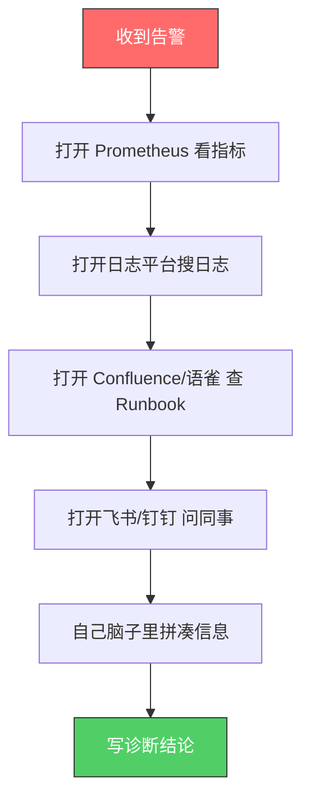
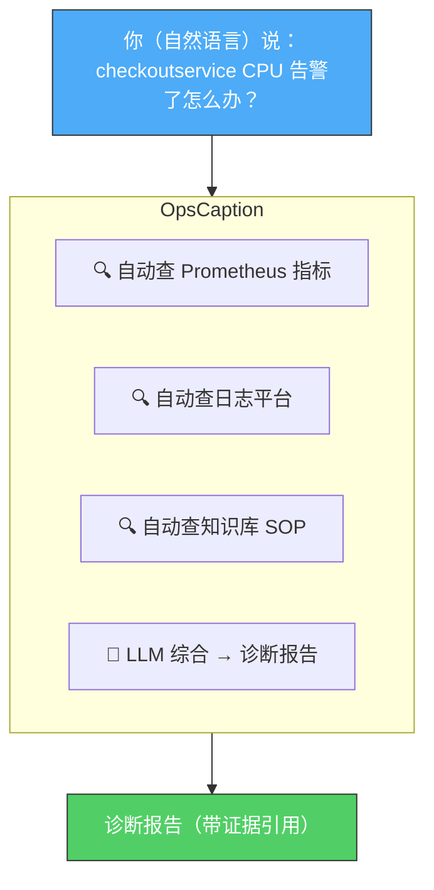
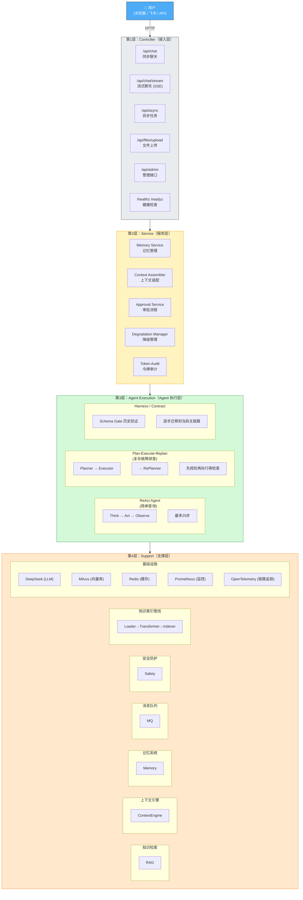
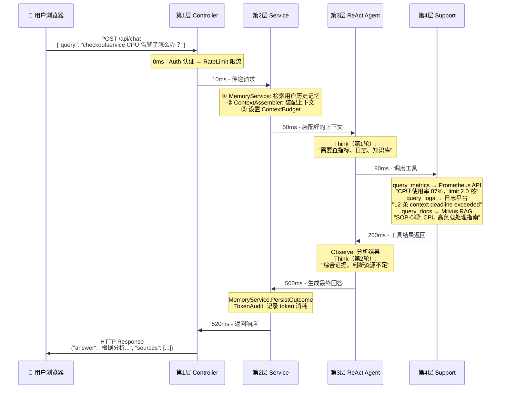

# 第1章：项目概览

> **目标：** 30 分钟建立全局地图。学完这章，你能用一句话讲清楚 OpsCaption 是什么、用了什么技术、整体架构长什么样。

---

## 1. 一句话概括

> **OpsCaption 是一个用 Go 语言写的智能运维助手。运维人员用自然语言描述故障，系统自动查指标、查日志、查知识库，整合成带证据的诊断报告。**

用人话：你在 Slack / 飞书 / Web 上 @机器人 说 "checkoutservice CPU 告警了怎么办"，它自动帮你去 Prometheus 查指标、去日志平台查错误日志、去知识库查 SOP 文档，最后让 LLM 综合这些信息给出诊断建议——你不需要在四五个系统之间来回切。

---

## 2. 解决的问题

### 痛点：运维的"多窗口地狱"



**问题：**
- 来回切换 4+ 个系统，信息分散
- 新人不知道查什么、去哪查
- 凌晨 3 点被叫醒，脑子不清醒，容易漏步骤

### OpsCaption 怎么做



**诊断报告示例：**
> "根据 Prometheus 数据显示 CPU 使用率 87%，接近 limit 2.0 核；
> 日志中出现 12 次 context deadline exceeded；
> 建议：1) 调高 resource limits 到 3.0 核 2) 检查下游服务超时配置"

**核心价值：** 把运维经验产品化——不是替代运维，而是让每个运维都像带着一个资深搭档。

---

## 3. 技术栈速记表（含 trade-off）

| 技术 | 在项目里做什么 | 为什么选它 | 不选什么 & trade-off |
|------|---------------|-----------|---------------------|
| **Go 1.24** | 整个后端的编程语言 | 编译成单二进制（Docker 镜像 <20MB）、goroutine 天然并发、Agent 编排和工具调用不需要引入第二语言 | **不选 Python**：Python 的 asyncio 写并行 tool calling 没有 Go context 包统一，部署镜像轻松过 1GB |
| **GoFrame v2** | HTTP 框架：路由、中间件、SSE | 国产 Go 框架中文档最完整，自带配置/日志/缓存/校验，开箱即用 | **不选 Gin**：更轻但需自己拼中间件生态，GoFrame 一体化节省配置成本 |
| **Eino** | LLM 编排框架，构建 Agent 执行图 | 字节开源，Go-native，原生 ReAct 和 Plan-Execute-Replan 模式，ADK 理念提供完整 Agent 运行时 | **不选 LangGraph**：生态更好但需引入 Python——多一套部署和依赖，个人项目太重 |
| **GLM-4.5-AIR / DeepSeek V3** | 推理/Query Rewrite/Rerank | 兼容 OpenAI API 的国产大模型，推理能力强，中文能力优秀，价格有竞争力。代码中通过 `OpenAIForGLM` / `OpenAIForGLMFast` 两个工厂函数创建，实际模型名在 config.yaml 中配置（当前为 `deepseek-v3-1-terminus`） | **不选 GPT-4**：RAG 链路大量 LLM 调用，每次走 GPT-4 成本不可接受 |
| **Milvus** | 向量数据库，ANN 近似检索 | 开源标杆，Go SDK 官方维护，原生支持向量+标量过滤 | **不选 Pinecone**：SaaS 需数据上云，内部运维文档有安全风险。**不选 Weaviate**：Go 客户端社区维护，API 覆盖不全 |
| **BGE-M3 (via SiliconFlow)** | 文档→1024维向量 | BAAI 开源的多语言 embedding 模型，中文技术文档效果优秀，通过 SiliconFlow API 调用 | **不选 text-embedding-3-small**：需额外网络出口，中文运维术语 embedding 质量未验证 |
| **RabbitMQ** | 消息队列：异步任务+记忆抽取 | 消息级 ACK、TTL+DLX 天然支持延迟重试、单节点部署无 ZK 依赖 | **不选 Kafka**：适合高吞吐日志流，我的场景是任务队列——RabbitMQ 的任务语义更匹配。Kafka 最小部署吃 2GB+ 内存 |
| **Redis** | 缓存+会话状态+限流计数+任务状态机 | 内存级速度，SETNX 做幂等，过期策略做自动清理 | 无——后端标配 |
| **Prometheus** | 指标采集和监控 | 云原生监控事实标准，Go 生态完美集成 | 无 |
| **OpenTelemetry** | 分布式链路追踪 | 行业标准 API，不锁厂商 | 无 |
| **Docker** | 容器化部署 | 环境一致，部署简单 | 无 |
| **React + TypeScript** | 前端 SPA（20组件） | Framer Motion 动画、暗色模式、打字机流式渲染、SkillPanel 可视化开关、AIOpsPanel 三路证据诊断卡片 | **不选原生 HTML/JS**：随着交互复杂度增长（技能面板、证据卡片、流式渲染），React 组件化 + 状态管理成为刚需——从原生 HTML 重构为 React 是刻意的架构升级 |

> 💡 **面试技巧：** 按三列回答——"做了什么 + 为什么选它 + 不选什么"。**说出 trade-off 是 Senior Engineer 的标志**，不要只说"我选了最好的技术"。

---

## 4. 架构全景图

OpsCaption 采用**四层架构**，从外到内分别是：



### 四层职责一句话总结

| 层 | 一句话 | 类比 |
|----|--------|------|
| **Controller** | "接待来访"——接收 HTTP 请求，返回 HTTP 响应 | 公司的前台 |
| **Service** | "后勤保障"——管理记忆、装配上下文、审批、降级 | 行政/后勤部门 |
| **Agent** | "思考执行"——接收问题，调用工具，生成回答 | 技术专家 |
| **Support** | "基础设施"——知识库、缓存、消息队列、监控 | 公司的水电网 |

> 💡 **面试时画架构图的口诀：** "四层架构，从上到下：接入层收请求，服务层做保障，Agent 层做推理，支撑层提供基础设施。数据流从 Controller 进 → Service 装配上下文 → Agent 推理执行 → 调用 Support 层工具 → 原路返回。"

---

## 5. 一次请求的旅行

下面跟踪一条真实的用户请求，从 HTTP 请求进来到响应返回的完整路径。

假设用户问了：**"checkoutservice CPU 告警了怎么办？"**



### 这条路径的关键信息

| 环节 | 谁在做 | 做了什么 |
|------|--------|---------|
| 接入 | Controller（GoFrame） | 认证、限流、解析请求 |
| 准备 | Service | 加载记忆、装配上下文、设定预算 |
| 推理 | ReAct / Plan-Execute-Replan（Eino） | 简单查询走 ReAct，复杂故障走 Plan-Execute-Replan |
| 数据 | Support | 查 Prometheus、查日志、查 Milvus 知识库 |
| 收尾 | Service | 保存记忆、审计 token |

---

## 6. 面试问答

### Q: "介绍一下你的项目"

#### 🎯 30 秒版（面试开场自我介绍）

> "我独立开发了一个叫 OpsCaption 的智能运维助手，用 Go 语言写的。核心功能是：运维人员用自然语言描述故障，比如 'checkoutservice CPU 告警了怎么办'，系统自动去查 Prometheus 指标、查日志、查知识库，然后由 LLM 综合这些信息生成带证据引用的诊断报告。
>
> 技术栈是 Go + GoFrame + 字节的 Eino 编排框架 + GLM-4.5-AIR 大模型 + Milvus 向量数据库。前端用 React + TypeScript 重构了 20 个组件，支持打字机流式渲染和暗色模式。Agent 层有两条主链路：普通问答走 ReAct，复杂运维分析走 Plan-Execute-Replan。我还做了 Harness/Contract 的雏形，在历史 runtime 中验证了 Schema Gate 和 `EnforceContract`，后续会把可校验输出逐步迁移到当前主链路。目前核心链路已跑通，正在做 RAG 检索的基线评测。"

#### 🎯 2 分钟版（面试官追问"展开说说"）

> "好的，我从三个维度展开。
>
> **第一，为什么做这个项目。** 我们运维团队日常排障要在 Prometheus、日志平台、知识库、飞书之间来回切，信息分散，新人上手慢。我就想做一个统一入口，用自然语言驱动排障流程。
>
> **第二，技术架构。** 整体是四层加两个横向能力：
> - Controller 层用 GoFrame 做 HTTP 服务，支持同步聊天、SSE 流式响应和异步任务；
> - Service 层负责记忆管理、上下文装配、降级和审批；
> - Agent 层是核心，基于 Eino 框架实现了两条主链路：简单查询用 ReAct Agent（边想边做），复杂故障排查用 Plan-Execute-Replan（先规划、再执行、再检查）。另外我做了 Harness MVP——Contract / Schema Gate 的历史 runtime 验证，用来约束结构化输出、降级原因和证据策略；当前主链路的重点是把这些校验能力逐步迁移到 ReAct 与 Plan-Execute-Replan 的关键输出节点；
> - Support 层提供基础设施：Milvus 存向量化的运维文档做 RAG 检索，Redis 做缓存和会话状态，RabbitMQ 处理异步任务，Prometheus + OpenTelemetry 做可观测性。新增了知识索引管线（文件上传→解析→分块→向量化→写入 Milvus）。
> - 前端用 React + TypeScript 重构了 20 个组件，Framer Motion 做动画，支持暗色模式和打字机流式渲染。特色 UI：AIOpsPanel 三路证据诊断卡片——让运维直观看到 Metrics/Logs/Knowledge 三路证据的收集进度，SkillPanel 可视化开关让用户自主选择技能组合。
>
> **第三，我个人的贡献和收获。** 这个项目是我一个人从零搭建的，包括架构设计、技术选型、全部编码实现。最大的挑战是——如何让 LLM 在运维这个专业领域不出错。我的解法是四层防御：第一层用 Harness/Contract 明确结构化输出和证据边界，第二层给 LLM 注入高质量的 RAG 文档作为证据，第三层 ContextEngine 做上下文预算控制，第四层做结果校验和降级兜底。这个过程让我深刻理解了怎么把一个 LLM Demo 变成一个生产可用的系统。"

---

## 7. 自测

学完本章，试着回答以下 3 个问题。**能不看答案讲出来，才算真懂了。**

### 问题 1

**OpsCaption 是做什么的？请用一句话概括，然后展开成三句话。**

<details>
<summary>点击查看参考答案</summary>

- 一句话：OpsCaption 是一个用 Go 写的智能运维助手，运维人员用自然语言提问，系统自动查指标、查日志、查知识库，生成带证据的诊断报告。
- 三句话：
  1. 它解决运维排障时需要在多个系统间来回切换的痛点。
  2. 核心架构是四层：Controller 接入 → Service 装配 → Agent 推理 → Support 支撑。
  3. 技术栈是 Go + Eino + DeepSeek + Milvus，所有核心模块独立完成。
</details>

### 问题 2

**画出四层架构图，并说出每层的一句话职责。**

<details>
<summary>点击查看参考答案</summary>

```
Controller（接入层）→ "接收 HTTP 请求，返回 HTTP 响应"
Service（服务层）  → "管理记忆、装配上下文、审批、降级"
Agent（推理层）    → "ReAct Agent：Think → Act → Observe 循环"
Support（支撑层）  → "知识库、缓存、消息队列、监控等基础设施"
```

数据流向：请求从 Controller 进 → Service 装配上下文 → Agent 推理执行 → 调用 Support 层工具 → 结果原路返回。
</details>

### 问题 3

**用户发了一条消息 "MySQL 连接池满了怎么办"，这条消息在系统中经历了哪些关键步骤？请按时间顺序说出来。**

<details>
<summary>点击查看参考答案</summary>

1. **Controller 接入：** GoFrame HTTP Server 收到 POST 请求，经过 Auth 认证和 RateLimit 限流。
2. **Service 准备：** MemoryService 检索用户历史记忆，ContextAssembler 装配上下文（注入记忆 + System Prompt + 设定 Token 预算）。
3. **Agent 推理：** ReAct Agent 启动 Think-Act-Observe 循环。
   - Think：LLM 分析需要查什么信息。
   - Act：调用工具（query_metrics 查 MySQL 连接数、query_logs 查错误日志、query_docs 查 MySQL 连接池 SOP）。
   - Observe：分析工具返回结果。
4. **Support 执行：** 工具层调用 Prometheus API、日志平台、Milvus 向量检索。
5. **Agent 生成回答：** LLM 综合所有信息生成诊断建议。
6. **Service 收尾：** 保存对话记忆、记录 Token 消耗。
7. **Controller 返回：** HTTP Response 返回诊断报告给用户。
</details>

---

> 📌 **学完本章，你应该能做到：**
> - 脱稿讲出 OpsCaption 是什么（30 秒版 + 2 分钟版）
> - 闭眼画出四层架构图
> - 讲清楚一次请求的完整生命周期
>
> 下一章 → [第2章：main.go 启动流程](./02-main启动流程.md)
