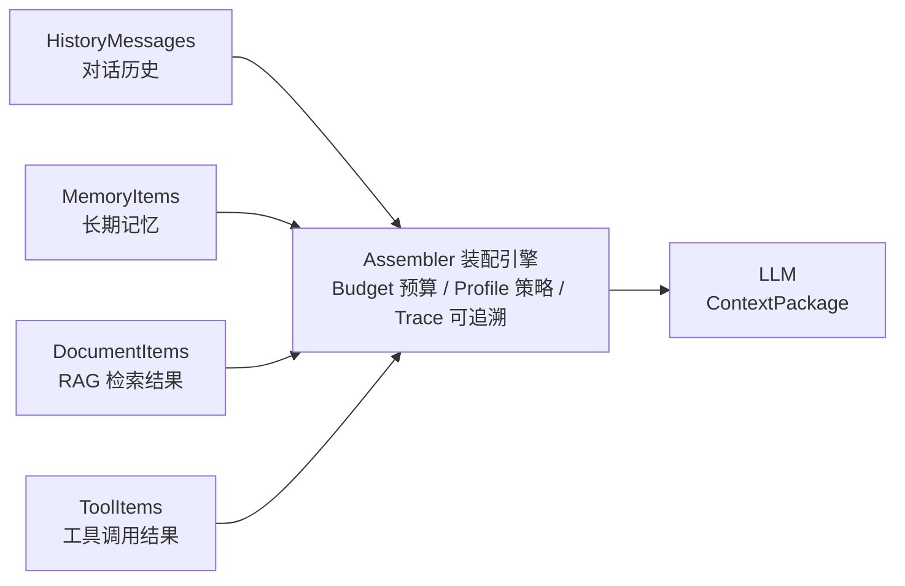
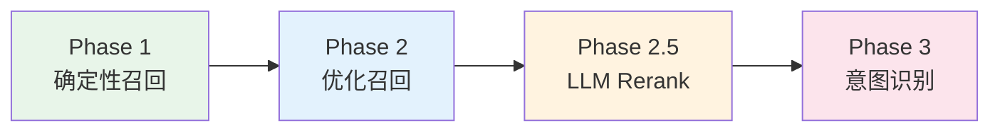
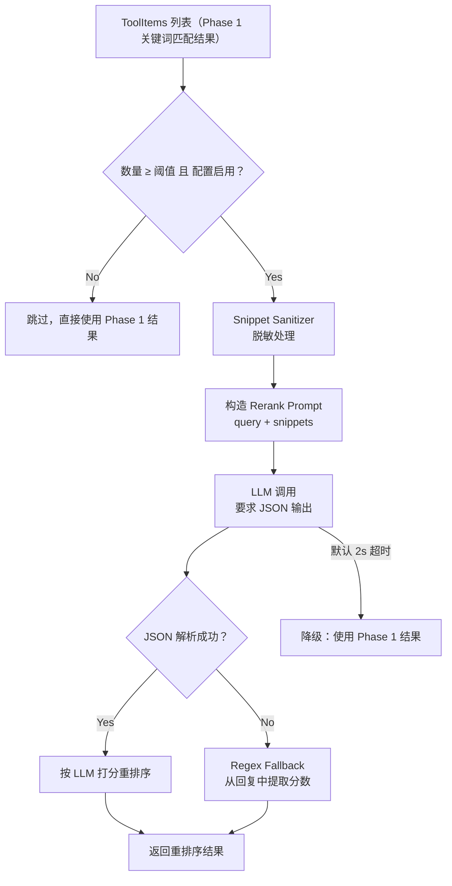
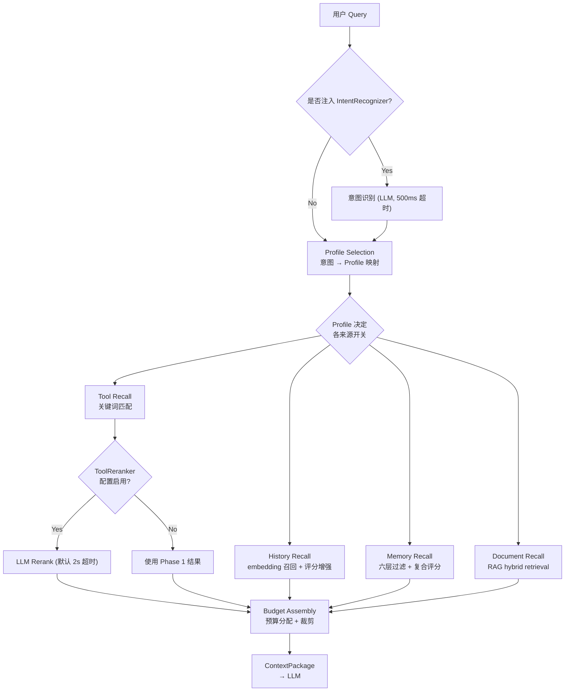
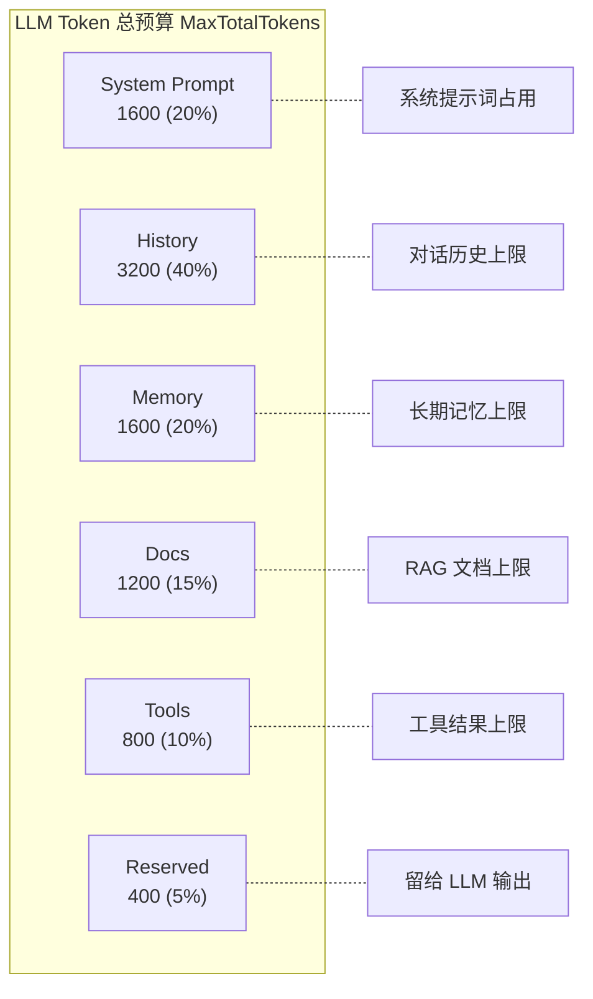
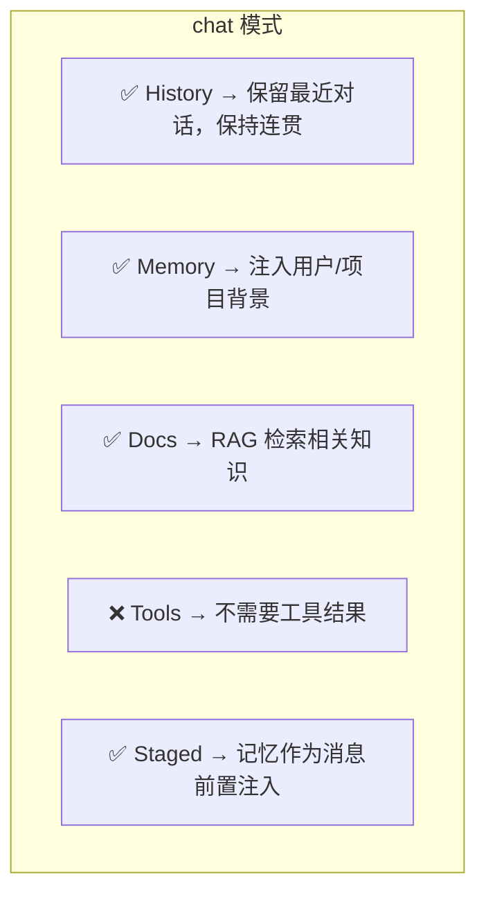
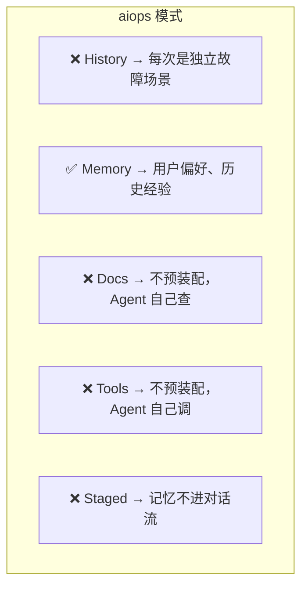
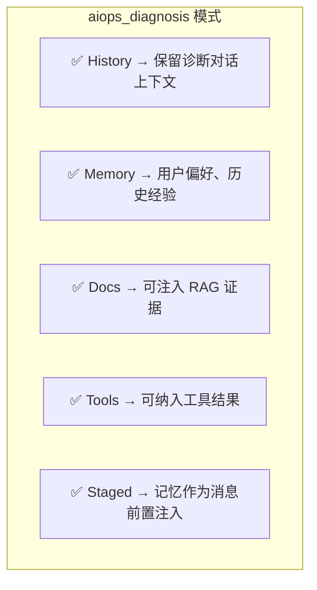

# 第 5 章：Context Engine — \"给 LLM 装上智能编辑器\"

> **本章目标**：理解 Context Engine 的设计理念、预算机制和 Profile 策略，能向面试官清晰解释\"为什么要单独做上下文装配\"以及\"四个来源如何协同工作\"。

---

## 1. 白话理解：什么是 Context Engine？

### 1.1 一句话解释

**Context Engine = 一个\"智能编辑\"**，它从多个来源（对话历史、长期记忆、RAG 文档、工具结果）中挑出最重要的信息，在预算范围内打包发给 LLM。挑什么、留什么、扔什么，全部有据可查。

### 1.2 一个类比：打包行李箱

想象你要出差 3 天，行李箱限重 **20kg**。你有一堆东西：

| 类别 | 物品 | 原始重量 |
|------|------|---------|
| 👕 换洗衣物 | 10 件衣服 | 8kg |
| 📖 工作资料 | 5 本文件夹 | 6kg |
| 🍪 零食特产 | 3 袋零食 | 4kg |
| 🔧 工具设备 | 笔记本电脑 + 充电器 | 5kg |
| **合计** | | **23kg** ❌ 超重了！|

你必须做取舍：

```
行李箱 20kg 上限
├── 👕 换洗衣物: 最多 7kg → 选最重要的 7 件
├── 📖 工作资料: 最多 5kg → 选最核心的 3 本
├── 🍪 零食特产: 最多 2kg → 选最想吃的 2 袋
└── 🔧 工具设备: 最多 5kg → 全部带上（必须的）
```

**Context Engine 做的就是这个**。LLM 有 token 上限（行李箱 20kg），你需要把对话历史、长期记忆、RAG 文档、工具结果打包进去，但不能超限。Context Engine 就是那个\"打包专家\"：

- 给每类东西定好预算上限（衣物最多 7kg，文档最多 3000 token）
- 挑最重要的放进去
- 超出的丢弃，并记录删了什么、为什么删

### 1.3 一张图看懂



---

## 2. 为什么需要 Context Engine？

### 2.1 没有 Context Engine 会怎样？

| 做法 | 问题 |
|------|------|
| **全塞进去** | 超过 LLM token 上限，API 报错或静默截断 |
| **只塞最新几条消息** | 丢失历史记忆和关键上下文，回答质量下降 |
| **手动拼接** | 代码到处散落拼接逻辑，改一个参数要改十几处 |

这些问题在 Demo 阶段不明显（对话短、数据少），但在**生产系统中**会集中爆发：

- 一个运维会话可能持续几十轮对话
- 长期记忆可能积累了数百条
- RAG 可能检索出几十篇相关文档
- 工具返回的日志/告警结果可能非常长

**Context Engine 就是 Demo 和生产系统的分水岭。**

### 2.2 Context Engine 的核心价值

```
没有 Context Engine 的简单拼接:
    content := history + memory + docs + tools
    // 超限 → 截断末尾 → 用户问题可能被截掉，关键信息丢失
    // 改参数 → 要改十几处 hardcode

有 Context Engine:
    pkg := assembler.Assemble(ctx, req, history)
    // 按预算逐类处理 → 超限时按规则裁剪 → 可追溯
    // 改参数 → 改一处 config.yaml（或代码常量）
```

**三个核心价值**：

| 价值 | 说明 |
|------|------|
| **预算控制** | 每类来源独立预算，防止某一类来源\"霸占\"整个上下文窗口 |
| **策略分离** | 不同场景（chat / aiops / report）使用不同的装配策略，按需配置 |
| **完全可追溯** | ContextTrace 记录每一类的选中数、丢弃数、丢弃原因，方便排查\"为什么 LLM 没看到某条信息\" |

---

## 3. 四类上下文来源

Context Engine 管理四类信息来源，最终打包成 `ContextPackage`：

```go
// types.go - ContextPackage（上下文包裹）
type ContextPackage struct {
    Request         ContextRequest      // 原始请求信息
    Profile         ContextProfile      // 使用的策略
    Query           string              // 用户问题
    HistoryMessages []*schema.Message   // ① 对话历史（短期记忆）
    MemoryItems     []ContextItem       // ② 长期记忆（跨会话）
    DocumentItems   []ContextItem       // ③ RAG 检索结果
    ToolItems       []ContextItem       // ④ 工具调用结果
    Trace           ContextAssemblyTrace // 装配追溯
}
```

### 3.1 HistoryMessages — 对话历史（短期记忆）

- **来源**：当前会话中用户与 LLM 的对话记录
- **生命周期**：会话级，会话结束即失效
- **作用**：让 LLM 知道"刚刚聊了什么"，保持对话连贯性
- **预算**：默认 3200 token（= MaxTokens × 40%，基于公式 `HistoryReserve = maxTokens × 0.40`，默认 maxTokens=8000）
- **选择策略**：从最新消息开始逆向选取，优先保留最近的对话

```mermaid
graph TD
    subgraph 原始对话历史 - 10条消息
        A1["msg1: Redis 怎么查慢查询？ ← 最旧"]
        A2["msg2: 可以用 SLOWLOG GET 命令..."]
        A3["msg3: 我发现有很多 KEYS * 调用"]
        A4["..."]
        A5["msg9: 帮我分析一下 CPU 飙升的原因 ← 较新"]
        A6["msg10: 好的，请提供时间范围... ← 最新"]
    end

    subgraph selectHistory - 从最新开始逆向选取
        B1["msg10 ✓ 300 tokens"]
        B2["msg9 ✓ 250 tokens"]
        B3["msg8 ✓ 400 tokens"]
        B4["msg7 ✓ 350 tokens → 累计 1300/3200"]
        B5["msg6 ✓ 500 tokens → 累计 1800/3200"]
        B6["msg5 ✓ 600 tokens → 累计 2400/3200"]
        B7["msg4 ✓ 550 tokens → 累计 2950/3200"]
        B8["msg3 ✗ 400 tokens → 超预算丢弃"]
        B9["msg2 ✗ → 丢弃"]
    end

    原始对话历史 - 10条消息 --> selectHistory - 从最新开始逆向选取
```

> **面试要点**：从最新消息开始逆向选取。如果包含 `[对话历史摘要]` 前缀的消息（超长对话摘要），会强制保留。

#### Phase 2: combinedHistoryScore — 多维评分增强

Phase 1 的逆向选取是纯确定性的（越新越优先），Phase 2 在此基础上引入 **embedding 语义相似度 + 确定性权重增强**，让选取结果既保留时间优势，又能召回语义相关的历史消息。

**评分公式**：

```
combinedScore = cosineSimilarity × (1 + recencyBoost + roleBoost + entityBoost)
```

其中：
- **cosineSimilarity**：当前 query 与历史消息的 embedding 余弦相似度（通过 `doubao-embedding` 批量计算）
- **recencyBoost = 0.3 × 0.9^(distance)**：时间衰减增强，distance=0 表示最近一条消息，越旧衰减越快
- **roleBoost = 0.2**：对 user 消息的固定加分（用户消息通常比 assistant 回复更具信息量）
- **entityBoost = 0.3**：当历史消息中包含当前 query 的服务名、实体名（如 `redis-prod`、`payment-service`）时加分

**示例计算**：

```
query: "redis-prod 的 CPU 为什么飙高？"

msg_recent (user, 距离=0, 含 "redis-prod"):
  cosineSim=0.65, recencyBoost=0.3, roleBoost=0.2, entityBoost=0.3
  combinedScore = 0.65 × (1 + 0.3 + 0.2 + 0.3) = 0.65 × 1.8 = 1.17

msg_old (assistant, 距离=5, 含 "redis-prod"):
  cosineSim=0.70, recencyBoost=0.3×0.9^5=0.177, roleBoost=0, entityBoost=0.3
  combinedScore = 0.70 × (1 + 0.177 + 0 + 0.3) = 0.70 × 1.477 = 1.034

msg_unrelated (user, 距离=1, 不含相关实体):
  cosineSim=0.15, recencyBoost=0.27, roleBoost=0.2, entityBoost=0
  combinedScore = 0.15 × (1 + 0.27 + 0.2 + 0) = 0.15 × 1.47 = 0.221
```

**关键机制**：

- **pairAwareSelect**：user + assistant 消息作为配对单元选取，不拆散对话对。如果 user 消息被选中，其紧接着的 assistant 回复也一并保留，保证对话语义完整性
- **recentKeep = 3**：无论评分如何，最近 3 条消息**始终保留**，确保对话连贯性底线
- **embedding 批量计算**：对所有历史消息做 batch embedding，使用 content hash 做 LRU 缓存（10min TTL），避免重复计算
- **超时降级**：embedding 计算设置 500ms 超时，超时后降级为纯逆向选取（Phase 1 模式）

### 3.2 MemoryItems — 长期记忆（跨会话）

- **来源**：`LongTermMemory`，跨会话持久化的重要信息
- **生命周期**：跨会话，持久化存储
- **作用**：让 LLM 知道\"这个用户/项目的历史背景\"
- **预算**：默认 800 token（= MaxTokens × 10%，基于公式 `MemoryReserve = maxTokens × 0.10`）
- **选择策略**：多维过滤 — 过期、Scope、置信度、安全标签、预算、数量窗口

```go
// assembler.go - selectMemories 过滤逻辑
for _, entry := range entries {
    // 1. 过期检查
    if memoryItemExpired(item, now) → 丢弃 (memory_expired)

    // 2. 作用域检查（Session / User / Project / Global）
    if !memoryScopeAllowed(item.Scope, profile.AllowedMemoryScopes) → 丢弃 (memory_scope)

    // 3. 置信度过滤（低于 MinMemoryConfidence 丢弃）
    if item.Confidence < profile.MinMemoryConfidence → 丢弃 (memory_confidence)

    // 4. 安全标签过滤（非 internal/trusted_internal/safe 丢弃）
    if !memorySafetyAllowed(item.SafetyLabel) → 丢弃 (memory_safety)

    // 5. 数量窗口（超过 MaxMemoryItems 丢弃）
    if selectedCount >= profile.MaxMemoryItems → 丢弃 (memory_window)

    // 6. Token 预算（超出 MemoryTokens 丢弃）
    if item.TokenEstimate > remaining → 丢弃 (memory_budget)

    // 全部通过 → 选中 ✓
}
```

#### Phase 2: memoryCompositeScore — 复合评分排序

通过六层过滤的条目，并非直接按原始顺序选取，而是进入 **Phase 2 复合评分**阶段，按综合得分排序后再做预算选取。

**评分公式**：

```
memoryCompositeScore = confidence × 0.5 + freshness × 0.3 + scopePriority × 0.2
```

其中：
- **confidence**：记忆置信度（0~1），来自记忆抽取时 LLM 的评估
- **freshness = 1 / (1 + hours_since_last_used / 24)**：新鲜度衰减，最近使用过的记忆得分更高。例如：1 小时前使用 → freshness = 1/(1+1/24) ≈ 0.96；3 天前 → 1/(1+72/24) = 0.25
- **scopePriority**：作用域优先级权重

| Scope | priority | 含义 |
|-------|:--------:|------|
| session | 0.4 | 当前会话记忆，最相关 |
| user | 0.3 | 用户级记忆，跨会话通用 |
| project | 0.2 | 项目级记忆，团队共享 |
| global | 0.1 | 全局记忆，最低优先级 |

**排序逻辑**：所有通过过滤的条目先计算 composite score，按得分**降序排列**，然后从高到低依次选取直到预算用完。这样确保在有限的 token 预算内，优先保留"高置信 + 最近使用 + 高优先级作用域"的记忆。

### 3.3 DocumentItems — RAG 检索结果

- **来源**：RAG 链路（当前 ContextEngine 调用 `rag.Query()`，走 hybrid retrieval；Query Rewrite / Rerank 是评测与后续可选增强）
- **生命周期**：请求级
- **作用**：让 LLM 参考知识库中的相关文档回答问题
- **预算**：默认 1200 token（= MaxTokens × 15%，基于公式 `DocumentReserve = maxTokens × 0.15`）
- **选择策略**：沿用 hybrid retrieval 返回顺序，从头开始填充直到预算用完；超预算的文档会被裁剪（trim）后尝试放入

```go
// documents.go - selectDocuments
// 超预算时的处理：
if item.TokenEstimate > remaining {
    trimmed := mem.TrimToTokenBudget(item.Content, remaining)  // 裁剪到剩余预算
    if strings.TrimSpace(trimmed) == "" {
        item.DroppedReason = "document_budget"  // 裁剪后为空 → 丢弃
    }
    item.Content = trimmed                        // 裁剪后放入
    item.CompressionLevel = "trimmed"             // 标记为已裁剪
}
```

### 3.4 ToolItems — 工具调用结果

- **来源**：Agent 调用工具（查日志、查告警、查数据库等）返回的结果
- **生命周期**：请求级
- **作用**：让 LLM 基于实时工具调用结果做推理
- **预算**：默认 800 token（= MaxTokens × 10%，基于公式 `ToolTokens = int(MaxTokens × 0.10)`）
- **选择策略**：按顺序处理，支持数量窗口（MaxToolItems）+ token 预算双重限制

### 3.5 Recall Layer — 多路召回

前面 3.1~3.4 描述了四类上下文来源的**静态选取逻辑**（逆向选取、六层过滤、RAG 检索等）。实际上，Context Engine 采用**渐进式多路召回**策略，分三个阶段逐步提升召回质量：



| Phase | 方法 | 延迟 | 成本 | 说明 |
|-------|------|:----:|:----:|------|
| Phase 1 | 确定性规则（逆向选取、关键词匹配） | ~1ms | 0 | 始终执行，保证基线 |
| Phase 2 | embedding 语义召回 + 多维评分增强 | ~200ms | 低 | 批量 embedding + 缓存 |
| Phase 2.5 | ToolItems LLM Rerank（可选） | 默认 2s 超时 | 中 | `context.tool_rerank.*` 配置驱动，默认关闭 |
| Phase 3 | LLM 意图识别 → Profile 映射（可选注入） | 500ms | 中 | 只有注入 `IntentRecognizer` 后才执行 |

**设计理念**：先轻量后重量，先确定性后概率性。Phase 1 保证"不会太差"，Phase 2/2.5/3 逐步"更好"，任何阶段超时或失败都自动降级到上一阶段的结果。

#### Phase 2.5: ToolReranker — LLM 重排序

当 ToolItems 召回结果较多（≥ 阈值）时，可选启用 LLM Rerank 做精细排序：

**触发条件**：
- 配置项 `context.tool_rerank.enabled = true`（默认 false）
- 召回的 ToolItems 数量 ≥ `context.tool_rerank.min_candidates`（默认 6）

**处理流程**：



**关键设计**：

- **Snippet Sanitizer**：发送给 LLM 前对 snippet 做脱敏处理，正则替换敏感信息
  - IP 地址：`192.168.x.x` → `[IP_REDACTED]`
  - Token/Secret：`sk-abc123...` → `[TOKEN_REDACTED]`
  - UUID：`550e8400-e29b-41d4-a716-446655440000` → `[UUID_REDACTED]`
- **JSON 输出约束**：Prompt 明确要求 LLM 返回 `{"scores":[{"id":1,"score":9}]}` 格式
- **Regex Fallback**：如果 JSON 解析失败，用正则从 LLM 回复中提取 `[id] score` 形式的分数
- **超时降级**：默认 2s 超时后直接使用 Phase 1 关键词匹配结果，不阻塞主流程

#### Phase 3: IntentRecognizer — 意图识别

这是可选注入能力：只有调用 `WithIntentRecognizer()` 后，Assembler 才会在装配流程前端通过独立 LLM 调用识别用户意图，决定使用哪个 Profile。`NewAssembler()` 默认不会启用它。

**处理流程**：

```go
// intent_recognizer.go - 核心逻辑
func (r *IntentRecognizer) Recognize(ctx context.Context, query string) IntentResult {
    // 1. 构造意图识别 Prompt（轻量，只做分类）
    // 2. 独立 LLM 调用（500ms 超时）
    // 3. 解析结果 → 返回 IntentResult
}
```

**意图 → Profile 映射**：

| 意图标识 | 映射 Profile | 说明 |
|---------|-------------|------|
| `fault_diagnosis` | `aiops_diagnosis` | 故障诊断场景 |
| `knowledge_query` | `chat` | 知识查询场景 |
| `chat` | `chat` | 日常对话 |
| 未知/超时 | `chat` | 降级到默认 Profile |

**关键设计**：

- **独立 LLM 调用**：不复用主对话的 LLM 调用，避免意图识别结果污染对话上下文
- **500ms 硬超时**：超时后直接返回默认 Profile（`chat`），不阻塞主流程
- **轻量 Prompt**：意图识别 Prompt 只需要几十个 token，不消耗大量预算
- **Profile 覆盖**：注入启用后，识别结果可以覆盖 `req.Mode`，例如用户在 chat 模式下问故障问题，自动切换到 `aiops_diagnosis` Profile

#### 多路召回完整流程



### 3.6 四类来源总结

| 来源 | 作用 | 生命周期 | 预算（maxTokens=8000） | 代码位置 |
|------|------|---------|------|---------|
| HistoryMessages | 对话连贯性 | 会话级 | 3200 tokens (40%) | `selectHistory()` |
| MemoryItems | 用户/项目背景 | 跨会话持久 | 1600 tokens (20%) | `selectMemories()` |
| DocumentItems | 知识库参考 | 请求级 | 1200 tokens (15%) | `selectDocuments()` |
| ToolItems | 实时工具结果 | 请求级 | 800 tokens (10%) | `selectToolItems()` |

---

## 4. Budget 预算机制

### 4.1 预算结构

每类来源都有一个独立的 token 预算上限，定义在 `ContextBudget` 中：

```go
// types.go - ContextBudget
type ContextBudget struct {
    MaxTotalTokens int  // 总 token 上限（全局）
    SystemTokens   int  // System Prompt 占用
    HistoryTokens  int  // 对话历史预算
    MemoryTokens   int  // 长期记忆预算
    DocumentTokens int  // RAG 文档预算
    ToolTokens     int  // 工具结果预算
    ReservedTokens int  // 预留 token（答案输出等）
}
```



### 4.2 预算分配公式（实际实现）

预算分两阶段计算：**第一阶段**在 `utility/mem/token_budget.go:GetTokenBudget()` 中从配置计算基础预留；**第二阶段**在 `resolver.go:Resolve()` 中由 Profile 覆盖并计算工具和预留 token。

#### 4.2.1 第一阶段：全局基础预留

```go
// utility/mem/token_budget.go - GetTokenBudget() 实际实现
maxTokens := defaultMaxContextTokens  // 默认 8000，可由 memory.max_context_tokens 配置覆盖

SystemReserve   = maxTokens × 0.20    // System Prompt 占 20%
HistoryReserve  = maxTokens × 0.40    // 对话历史占 40%
MemoryReserve   = maxTokens × 0.20    // 长期记忆占 20%
DocumentReserve = maxTokens × 0.15    // RAG 文档占 15%
```

以 **maxTokens = 8000** 为例（默认值）：

| 预留项 | 比例 | 计算公式 | 数值 |
|--------|:----:|---------|:----:|
| `SystemReserve` | 20% | `int(8000 × 0.20)` | **1600** |
| `HistoryReserve` | 40% | `int(8000 × 0.40)` | **3200** |
| `MemoryReserve` | 20% | `int(8000 × 0.20)` | **1600** |
| `DocumentReserve` | 15% | `int(8000 × 0.15)` | **1200** |
| **小计（已分配）** | 95% | — | **7600** |
| **剩余池（待 Profile 分配）** | 5% | — | **400** |

> **注**：`GetTokenBudget()` 使用 `sync.Once` 确保全局单例，配置变更需重启生效。配置项为 `memory.max_context_tokens`，从 `manifest/config/config.yaml` 读取。

#### 4.2.2 第二阶段：Profile 级分配（`resolver.go`）

在第一阶段基础值之上，`PolicyResolver.Resolve()` 完成最终分配：

```go
// resolver.go - Resolve() 实际实现
ToolTokens     = int(float64(budget.MaxTokens) × 0.10)   // 额外从剩余池分 10%
ReservedTokens = budget.MaxTokens - SystemReserve - HistoryReserve
                 - MemoryReserve - DocumentReserve - ToolTokens
// 代入 8000：= 8000 - 1600 - 3200 - 800 - 1200 - 800 = 400
```

完整计算过程（maxTokens=8000）：

| 字段 | 公式 | 数值 |
|------|------|:----:|
| `MaxTotalTokens` | `budget.MaxTokens` | **8000** |
| `SystemTokens` | `budget.SystemReserve` = `8000 × 0.20` | **1600** |
| `HistoryTokens` | `budget.HistoryReserve` = `8000 × 0.40` | **3200** |
| `MemoryTokens` | `budget.MemoryReserve` = `8000 × 0.10` | **800** |
| `DocumentTokens` | `budget.DocumentReserve` = `8000 × 0.15` | **1200** |
| `ToolTokens` | `int(8000 × 0.10)` | **800** |
| `ReservedTokens` | `8000 - 1600 - 3200 - 800 - 1200 - 800` | **400** |

> **公式总结**（一步到位）：
> ```
> ToolTokens     = MaxTokens × 10%
> ReservedTokens = MaxTokens × 5%    （因为 100% - 20% - 40% - 10% - 15% - 10% = 5%）
> ```

#### 4.2.3 Token 估算公式（`EstimateTokens`）

预算控制依赖 token 估算，`utility/mem/token_budget.go:EstimateTokens()` 的实际实现：

```go
// 不同字符类型的 token 权重
CJK 字符 (U+4E00~U+9FFF)  → 每个字符 = 1.5 tokens
ASCII 字符 (33~126)       → 每 4 个字符 = 1 token（即每个字符 0.25 tokens）
其他字符                   → 每个字符 = 0.5 tokens

total = CJK字符数 × 1.5 + ASCII字符数 ÷ 4 + 其他字符数 × 0.5
if total < 1 && len(text) > 0 { total = 1 }  // 非空文本至少 1 token
```

示例：
- `"你好世界"`（4 个 CJK）→ 4 × 1.5 = **6 tokens**
- `"hello world"`（11 个 ASCII）→ 11 ÷ 4 = **2 tokens**（取整）
- `"Redis 慢查询排查"`（5 CJK + 1 空格 + 5 ASCII）→ 5×1.5 + 0.5 + 1 = **9 tokens**

### 4.3 预算用完了怎么办？

每种来源都有独立的处理方式：

| 来源 | 超出预算时的行为 |
|------|----------------|
| HistoryMessages | 旧消息被丢弃（`history_budget`），新消息优先保留 |
| MemoryItems | 内存条目被丢弃（`memory_budget`），不裁剪 |
| DocumentItems | **先裁剪（trim），裁剪后仍空则丢弃**（`document_budget`） |
| ToolItems | 先裁剪（trim），裁剪后仍空则丢弃（`tool_budget`） |

```go
// assembler.go - selectToolItems 预算处理
if item.TokenEstimate > remaining {
    trimmed := mem.TrimToTokenBudget(item.Content, remaining)  // 尝试裁剪
    if strings.TrimSpace(trimmed) == "" {
        item.DroppedReason = "tool_budget"   // 裁剪后为空 → 丢弃
        continue
    }
    item.Content = trimmed                    // 裁剪后放入
    item.CompressionLevel = "trimmed"
}
```

> **为什么文档和工具可以裁剪，但记忆不能？** 文档和工具结果是辅助参考信息，截断部分不影响核心含义；而记忆条目通常较短且是关键背景信息，裁剪会造成信息丢失，所以超预算直接丢弃而非裁剪。

---

## 5. Profile 策略机制

### 5.1 为什么需要 Profile？

不同场景需要不同的上下文组合：

- **日常聊天（chat）**：需要对话历史保持连贯，也需要知识和记忆辅助回答
- **运维诊断（aiops）**：不需要对话历史（每次是独立故障场景），但需要记忆（用户偏好）和工具结果（实时告警/日志）
- **报告生成（report）**：只需要工具结果做素材，不需要历史和记忆

如果用一个策略覆盖所有场景，要么浪费 token（塞了不需要的东西），要么缺少关键信息。

### 5.2 三种 Profile 对比

| Profile | AllowHistory | AllowMemory | AllowDocs | AllowToolResults | Staged | 使用场景 |
|---------|:-----------:|:-----------:|:---------:|:----------------:|:------:|---------|
| **chat** | ✅ | ✅ | ✅ | ❌ | ✅ | 日常对话、知识问答 |
| **aiops / specialist** | ❌ | ✅ | ❌ | ❌ | ❌ | Plan-Execute-Replan 执行前的轻量诊断上下文 |
| **aiops_diagnosis** | ✅ | ✅ | ✅ | ✅ | ✅ | 诊断 replay / 带证据上下文的综合分析 |

#### chat 模式



#### aiops 模式



> **为什么 aiops 不预装配 Docs 和 Tools？**
> 因为 aiops 走的是 Plan-Execute-Replan 链路，Agent 在执行过程中会自主调用工具（查 Prometheus、查日志、查知识库）。
> 这些工具结果是**动态的**——取决于 Planner 制定的执行计划，不可能在请求开始前就预知需要哪些文档。
> 所以 ContextEngine 只负责装配 Memory（用户偏好），Docs 和 Tools 由 Agent 在 ReAct/Plan-Execute 循环中自行获取。

#### aiops_diagnosis 模式



### 5.3 Profile 解析逻辑

`PolicyResolver.Resolve()` 根据 `req.Mode` 决定使用哪个 Profile：

```go
// resolver.go - Profile 解析
func (r *PolicyResolver) Resolve(ctx context.Context, req ContextRequest) ContextProfile {
    base := ContextProfile{
        Name: "chat-default",               // 默认是 chat
        AllowHistory: true,
        AllowMemory:  true,
        AllowDocs:    true,
        Staged:       true,
        // ... 默认预算 ...
    }

    switch req.Mode {
    case "aiops", "specialist":
        base.Name = "aiops-default"
        base.AllowHistory = false           // ← 关掉 History
        base.AllowDocs = false              // ← 关掉 Docs
        base.AllowToolResults = false
        base.Staged = false
        // Budget: HistoryTokens = 0, ToolTokens = 0

    case "aiops_diagnosis":
        base.Name = "aiops-diagnosis"
        base.AllowHistory = true
        base.AllowDocs = true
        base.AllowToolResults = true
        base.Staged = true
        base.Budget.ToolTokens = MaxTokens × 15%

    case "chat":
        // 使用默认配置，不需要修改
    }

    return base
}
```

### 5.4 三种 Profile 预算分配对比表

以下基于 **maxTokens=8000** 展示三种 Profile 的实际预算分配。注意：当前仓库配置 `memory.max_context_tokens=4096`，运行时会按相同比例缩放；这里用 8000 是为了便于心算。

> **实现口径**：表格按当前 `resolver.go:Resolve()` 说明，不是理想配比。`ToolTokens` 是在 `GetTokenBudget()` 的 95% 基础预留之外额外计算的 10%/15%，所以 `ReservedTokens` 在 8000 示例下会出现负数。这是实现层后续应优化的点，面试时不要把它讲成"固定预留 5%"。

#### 5.4.1 预算分配明细（数值）

| 预算字段 | **chat**（默认） | **aiops / specialist** | **aiops_diagnosis** | 来源 |
|---------|:---:|:---:|:---:|------|
| `MaxTotalTokens` | 8000 | 8000 | 8000 | `budget.MaxTokens` |
| `SystemTokens` | 1600 | 1600 | 1600 | `MaxTokens × 20%` |
| `HistoryTokens` | **3200** | **0** ❌ | **3200** | aiops/specialist 覆盖为 0 |
| `MemoryTokens` | **1600** | **1600** | **1600** | `MemoryReserve` |
| `DocumentTokens` | **1200** | 1200（禁用） | **1200** | aiops/specialist `AllowDocs=false`，预算字段存在但不会使用 |
| `ToolTokens` | 800（禁用） | **0** ❌ | **1200** | chat 默认 10% 但不启用；aiops_diagnosis 覆盖为 15% |
| `ReservedTokens` | -400 | -400 | -400 | 当前实现未重新归一化，应作为优化点 |
| **有效上下文预算** | **6000** | **1600** | **7200** | = 已启用来源的预算之和，不计 System |

> **"有效上下文预算"** = 启用的来源预算之和。chat 模式用于 History/Memory/Docs；aiops/specialist 只把 Memory 注入执行前上下文；aiops_diagnosis 会把 History/Memory/Docs/Tools 都纳入诊断上下文。

#### 5.4.2 功能开关一览

| 功能开关 | **chat** | **aiops / specialist** | **aiops_diagnosis** | 含义 |
|---------|:---:|:---:|:---:|------|
| `AllowHistory` | ✅ | ❌ | ✅ | 是否注入对话历史 |
| `AllowMemory` | ✅ | ✅ | ✅ | 是否检索长期记忆 |
| `AllowDocs` | ✅ | ❌ | ✅ | 是否触发 RAG 检索 |
| `AllowToolResults` | ❌ | ❌ | ✅ | 是否纳入工具调用结果 |
| `Staged` | ✅ | ❌ | ✅ | 记忆是否以消息形式前置注入 |
| `MaxHistoryMessages` | 10 | 0 | 10 | 数量窗口：最大历史消息数 |
| `MaxMemoryItems` | 5 | 5 | 5 | 数量窗口：最大记忆条目数 |
| `MaxToolItems` | 0 | 0 | 8 | 数量窗口：最大工具结果数 |
| `MinMemoryConfidence` | 0.50 | 0.50 | 0.50 | 记忆置信度阈值 |
| `AllowedMemoryScopes` | session/user/project/global | session/user/project/global | session/user/project/global | 记忆作用域允许列表 |

#### 5.4.3 各 Profile 预算占比可视化

```mermaid
graph TD
    subgraph ChatMode["chat 模式 maxTokens=8000"]
        direction LR
        C1["System 1600"] --- C2["History 3200"] --- C3["Memory 1600"] --- C4["Docs 1200"] --- C5["Tool 800 字段存在但禁用"]
    end

    subgraph AIOpsMode["aiops/specialist 模式 maxTokens=8000"]
        direction LR
        A1["System 1600"] --- A2["History=0"] --- A3["Memory 1600"] --- A4["Docs 字段存在但禁用"] --- A5["Tool=0"]
    end

    subgraph AIOpsDiagnosisMode["aiops_diagnosis 模式 maxTokens=8000"]
        direction LR
        R1["System 1600"] --- R2["History 3200"] --- R3["Memory 1600"] --- R4["Docs 1200"] --- R5["Tool 1200"]
    end
```



> **设计理念**：`aiops/specialist` 只带必要的 Memory，避免执行前上下文被历史对话和预取文档污染；`aiops_diagnosis` 面向综合诊断和 replay，需要把 History、Memory、Docs、Tools 都作为可审计证据纳入。

### 5.5 Staged 模式是什么？

当 `Staged = true`（chat 模式）时，记忆不会直接放入 `MemoryItems`，而是**转换为消息前置到对话历史中**：

```go
// assembler.go - Staged 处理
if profile.Staged && len(pkg.MemoryItems) > 0 {
    pkg.HistoryMessages = append(
        memoryItemsAsMessages(pkg.MemoryItems),  // 记忆 → 消息
        pkg.HistoryMessages...,                   // 原始历史
    )
}
```

生成的记忆消息格式：

```go
// assembler.go - memoryItemsAsMessages
return []*schema.Message{
    {
        Role:    schema.User,
        Content: "[关键记忆]\n- [故障偏好] 用户更关注 Redis 相关问题\n- [历史经验] 上周处理过类似 CPU 告警",
    },
    schema.AssistantMessage("好的，我已了解这些背景信息。", nil),
}
```

**效果**：LLM 像\"看到\"两条额外的消息一样，自然地获取了记忆上下文，而不是被\"告知\"这是记忆。这种方式让记忆注入更自然，LLM 理解更好。

---

## 6. Assembler 装配流程

### 6.1 完整装配流程图

```mermaid
graph TD
    A["Step 0: 记录开始时间"] --> B{"Step 0.5: 是否注入 IntentRecognizer?"}
    B -->|Yes| B1["独立 LLM 意图识别 (500ms 超时)<br/>意图 → Profile 映射"]
    B -->|No| C["Step 1: PolicyResolver.Resolve<br/>根据 req.Mode 选择 Profile"]
    B1 --> C["Step 1: PolicyResolver.Resolve<br/>根据意图 + req.Mode 选择 Profile"]
    C --> D["Step 2: 初始化 ContextPackage + Trace<br/>记录 BudgetBefore"]
    D --> E{"profile.AllowHistory?"}
    E -->|Yes| F["Step 3: History Recall<br/>Phase 1: 逆向选取 (recentKeep=3)<br/>Phase 2: embedding 语义召回<br/>combinedScore 评分增强<br/>pairAwareSelect 配对保留"]
    E -->|No| F2["跳过"]
    F --> G{"profile.AllowMemory?"}
    F2 --> G
    G -->|Yes| H["Step 4: Memory Recall<br/>六层过滤 (过期/Scope/置信度/安全/数量/预算)<br/>Phase 2: compositeScore 排序<br/>confidence×0.5 + freshness×0.3 + scopePriority×0.2"]
    G -->|No| H2["跳过"]
    H --> I{"profile.AllowDocs?"}
    H2 --> I
    I -->|Yes| J["Step 5: Document Recall<br/>RAG: hybrid retrieval<br/>超出预算 trim 或丢弃"]
    I -->|No| J2["跳过"]
    J --> K{"profile.AllowToolResults?"}
    J2 --> K
    K -->|Yes| L["Step 6: Tool Recall<br/>关键词匹配召回<br/>Phase 1 结果"]
    K -->|No| L2["跳过"]
    L --> M{"ToolReranker<br/>配置启用?"}
    M -->|Yes| N["Step 6.5: LLM Rerank<br/>snippet 脱敏 → LLM 重排序<br/>JSON scores + Regex fallback<br/>默认 2s 超时降级"]
    M -->|No| N2["跳过"]
    N --> O{"Staged 启用?"}
    N2 --> O
    L2 --> O
    O -->|Yes| P["Step 7: memoryItemsAsMessages<br/>记忆消息前置到 HistoryMessages"]
    O -->|No| P2["跳过"]
    P --> Q["Step 8: 返回 ContextPackage<br/>记录 BudgetAfter + LatencyMs"]
    P2 --> Q
```



### 6.2 代码对应

| 步骤 | 代码位置 | 核心函数 |
|------|---------|---------|
| 意图识别 | `intent_recognizer.go` | `IntentRecognizer.Recognize()` |
| Profile 解析 | `resolver.go:25` | `PolicyResolver.Resolve()` |
| History 召回 | `history_recall.go` | `HistoryRecall()` + `combinedHistoryScore()` |
| Memory 检索 | `assembler.go:65-68` | `mem.GetLongTermMemory().RetrieveScoped()` |
| Memory 过滤 | `assembler.go:292` | `selectMemories()` + `memoryCompositeScore()` |
| Document 检索 | `documents.go:29` | `selectDocuments()` |
| Tool 召回 | `tool_recall.go` | `ToolRecall()` |
| Tool Rerank | `tool_reranker.go` | `ToolReranker.Rerank()` |
| Staged 注入 | `assembler.go:114-116` | `memoryItemsAsMessages()` |

---

## 7. ContextTrace — 可追溯的装配记录

### 7.1 Trace 数据结构

每步装配操作都被记录下来，形成完整的装配追溯链：

```go
// types.go - ContextAssemblyTrace
type ContextAssemblyTrace struct {
    Profile           string           // 使用的 Profile 名称（chat-default / aiops-default / aiops-diagnosis）
    Stages            []StageTrace     // 每个阶段的详细信息
    SourcesConsidered int             // 考虑的来源总数
    SourcesSelected   int             // 最终选中的来源数
    DroppedItems      []ContextItem   // 被丢弃的条目（含丢弃原因）
    BudgetBefore      BudgetSnapshot  // 装配前预算
    BudgetAfter       BudgetSnapshot  // 装配后预算使用量
    LatencyMs         int64           // 装配总耗时（毫秒）
}

type StageTrace struct {
    Name          string                // 阶段名：history / memory / documents / tool_results
    SelectedCount int                   // 选中数量
    DroppedCount  int                   // 丢弃数量
    Notes         []string              // 备注（如 tokens=1800/2000）
    Retrieval     *RetrievalStageMetrics // RAG 检索耗时详情（仅 documents 阶段）
}
```

### 7.2 丢弃原因字典

每个被丢弃的条目都带有一个 `DroppedReason`，方便排查问题：

| 丢弃原因 | 来源 | 含义 |
|---------|------|------|
| `history_window` | History | 超出 MaxHistoryMessages 数量窗口 |
| `history_budget` | History | 超出 HistoryTokens 预算 |
| `memory_expired` | Memory | 记忆已过期 |
| `memory_scope` | Memory | Scope 不在允许列表 |
| `memory_confidence` | Memory | 置信度低于阈值 |
| `memory_safety` | Memory | 安全标签不允许 |
| `memory_window` | Memory | 超出 MaxMemoryItems 数量窗口 |
| `memory_budget` | Memory | 超出 MemoryTokens 预算 |
| `document_budget` | Document | 超出 DocumentTokens 预算 |
| `tool_window` | Tool | 超出 MaxToolItems 数量窗口 |
| `tool_budget` | Tool | 超出 ToolTokens 预算 |

### 7.3 Trace 的实际用途

```go
// assembler.go - TraceDetails 格式化输出
func TraceDetails(trace ContextAssemblyTrace) []string {
    details := []string{
        fmt.Sprintf("context profile=%s", trace.Profile),
        fmt.Sprintf("context sources selected=%d/%d", trace.SourcesSelected, trace.SourcesConsidered),
    }
    // 每个阶段的详细信息
    for _, stage := range trace.Stages {
        line := fmt.Sprintf("%s selected=%d dropped=%d", stage.Name, stage.SelectedCount, stage.DroppedCount)
        // ... 附加 notes 和 retrieval metrics
    }
    // 丢弃原因的统计
    // context dropped memory_budget=3, history_window=5, memory_expired=2
    return details
}
```

**典型输出示例**：

```
context profile=chat-default
context sources selected=15/38
history selected=6 dropped=5 (tokens=2900/3200)
memory selected=3 dropped=8 (tokens=750/800; min_confidence=0.50)
documents selected=4 dropped=12 (tokens=1100/1200; retrieval cache_hit=false init_ms=12 rewrite_ms=0 retrieve_ms=120 rerank_ms=0 raw=20 final=4 rerank=false)
context dropped history_window=3, history_budget=2, memory_confidence=5, memory_budget=2, memory_expired=1, document_budget=12
latency_ms=45
```

> **面试要点**：ContextTrace 让上下文装配从\"黑盒\"变成\"白盒\"。如果 LLM 回答不理想，可以快速排查：是不是关键信息被 budget 裁掉了？是不是记忆过期了？是不是 RAG 没召回？

---

## 8. STAR 法则面试讲解

### 上下文管理 STAR 讲法

**Situation：**

LLM 有 token 上限，不能把所有信息都塞进去。OpsCaptain 的 LLM 需要从多个来源获取上下文：对话历史、长期记忆、RAG 文档、工具调用结果。这些内容的总 token 数可能远超 LLM 的上下文窗口。

**Task：**

设计一个上下文引擎，根据场景动态组装上下文包，按 token 预算分配各来源的容量，并支持意图识别动态切换策略。

**Action：**

1. **Profile 机制**：四种模式（chat/aiops/aiops_diagnosis/specialist），每种模式有独立的 ContextProfile
2. **五阶段组装**：策略解析 → 历史选择 → 记忆选择 → 文档选择 → 工具结果选择
3. **Token 预算分配**：基于 `memory.max_context_tokens` 做比例预留，Mode 再覆盖 History/Docs/Tools 的启用状态
4. **渐进式降级**：每个外部依赖都有超时和 fallback
5. **上下文压缩**：工具输出和 RAG 文档支持 audit/optimize 两种模式；当前配置默认 audit/关闭，评测口径可单独说明 78.81% 压缩率

**Result：**

- 同一引擎服务聊天和诊断两种场景
- 意图识别动态升级 profile
- 全链路 trace 观测
- ContextTrace 能解释每个来源被选择或丢弃的原因

---

## 9. 面试问答

### Q1: Context Engine 是什么？（一句话）

<details>
<summary>点击查看答案</summary>

**一句话**：Context Engine 是一个**智能上下文装配器**，它从对话历史、长期记忆、RAG 文档、工具结果四个来源中按预算选取最重要的信息打包发给 LLM。

**展开**：
- 它解决了 LLM token 限制与信息量之间的矛盾
- 每类来源有独立的 token 预算，防止单一来源霸占窗口
- 不同场景（chat/aiops/report）使用不同的 Profile 策略
- 所有装配决策通过 ContextTrace 完全可追溯

</details>

### Q2: 为什么要单独做 Context Engine？跟简单拼接有什么区别？

<details>
<summary>点击查看答案</summary>

**核心区别**：简单拼接只解决\"怎么拼\"，Context Engine 解决\"拼什么\"和\"为什么这样拼\"。

| | 简单拼接 | Context Engine |
|---|---|---|
| 预算控制 | ❌ 无，超限就截断 | ✅ 每类独立预算，按规则裁剪 |
| 策略分离 | ❌ 全部场景一样 | ✅ chat/aiops/report 三种 Profile |
| 可追溯 | ❌ 不知道删了什么 | ✅ ContextTrace 完整记录 |
| 记忆管理 | ❌ 无/手动 | ✅ 六层过滤（过期/Scope/置信度/安全/数量/预算） |
| 配置化 | ❌ hardcode 散落各处 | ✅ config.yaml + 常量集中管理 |

**一句话**：简单拼接是 Demo 级方案，Context Engine 是生产级方案。

</details>

### Q3: Budget 怎么算的？公式和数值是什么？

<details>
<summary>点击查看答案</summary>

预算分两阶段计算，全部是比例制（基于 `MaxTokens`，默认 8000，可通过 `memory.max_context_tokens` 配置）：

**第一阶段：`GetTokenBudget()` — 全局基础预留**（`utility/mem/token_budget.go`）

```
SystemReserve   = MaxTokens × 20%    // 1600（示例）
HistoryReserve  = MaxTokens × 40%    // 3200
MemoryReserve   = MaxTokens × 20%    //  1600
DocumentReserve = MaxTokens × 15%    // 1200
                 ─────────────────
                 已占用 85%          // 6800
                 剩余 15%            // 1200 → 注意当前 ToolTokens 会额外计算
```

**第二阶段：`Resolve()` — Profile 级覆盖**（`resolver.go`）

```
ToolTokens     = MaxTokens × 10%     //  800（从剩余池分配）
ReservedTokens = MaxTokens - System - History - Memory - Docs - Tool
```

然后根据 `req.Mode` 覆盖：

| 覆盖项 | **chat** | **aiops / specialist** | **aiops_diagnosis** |
|--------|:---:|:---:|:---:|
| `HistoryTokens` | 3200（不变） | **→ 0** | 3200（不变） |
| `MemoryTokens` | 1600（不变） | 1600（不变） | 1600（不变） |
| `DocumentTokens` | 1200（不变） | 字段保留但 `AllowDocs=false` | 1200（不变） |
| `ToolTokens` | 800（`AllowToolResults=false`） | **→ 0** | **→ 1200** |
| 有效上下文预算 | **6000** | **1600** | **7200** |

**Token 估算**（`EstimateTokens`）：

```
CJK 字符  (U+4E00~U+9FFF) → 每个 = 1.5 tokens
ASCII 字符 (33~126)       → 每4个 = 1 token
其他字符                   → 每个 = 0.5 tokens
```

**为什么要分开设？**
- History 独占 40%（最大块），因为对话连贯性对回答质量影响最大
- 每类独立预算防止单一来源（如 RAG 返回大量文档）挤掉对话历史
- aiops/specialist 主动关闭 History、Docs、Tools，避免执行前上下文噪音
- aiops_diagnosis 保留四类来源，适合带证据的综合诊断和 replay

</details>

---

## 9. 自测

### 问题 1

chat 模式下，对话历史已经很长（15 条消息），用户又问了一个新问题。selectHistory 会怎么处理这些历史消息？哪些会被保留，哪些会被丢弃？

<details>
<summary>点击查看答案</summary>

**处理流程**：

1. **数量窗口过滤**：如果 `MaxHistoryMessages` = 10，超过 10 条的部分（最旧的 5 条）首先被 `history_window` 丢弃
2. **Token 预算过滤**：从最新消息（第 10 条）开始逆向累积 token
   - 如果累积到第 8 条时 token 超过 `HistoryTokens`（3200，默认值 = MaxTokens × 40%），第 7 条及更旧的被 `history_budget` 丢弃
3. **摘要优先保留**：如果第 1 条消息以 `[对话历史摘要]` 开头且未被选中，会尝试单独纳入（如果 token 预算允许）

**结果**：最近的 8-10 条消息（约 3200 token 内）被保留，更旧的消息被丢弃。

</details>

### 问题 2

为什么 DocumentItems 超预算时可以裁剪（trim），而 MemoryItems 超预算时只能丢弃？

<details>
<summary>点击查看答案</summary>

**原因**：两者的性质和使用场景不同。

- **DocumentItems（文档）**：通常是较长的参考文本，截断部分内容不影响核心含义。LLM 看到前半段仍然能获取有效信息。裁剪后标记 `CompressionLevel = "trimmed"`。

- **MemoryItems（记忆）**：通常是短文本，内容高度浓缩。裁剪会造成关键信息的不可逆丢失。例如一条记忆 \"用户上次处理 Redis 故障时发现 maxconn 配置太低，建议调整为 1000\"——裁掉后半段后变成 \"用户上次处理 Redis 故障时发现 maxconn\"，完全失去了有效信息。

**设计原则**：能裁则裁（文档、工具结果），不能裁就丢（记忆），并记录丢弃原因。

</details>

### 问题 3

aiops 模式下，为什么 AllowHistory = false，但 AllowMemory = true？这两者不都是\"以前的信息\"吗？

<details>
<summary>点击查看答案</summary>

**两者本质上完全不同**：

| | History（对话历史） | Memory（长期记忆） |
|---|---|---|
| 内容 | 本次会话的原始对话记录 | 跨会话提炼的关键信息 |
| 特点 | 冗长、包含闲聊和试探 | 精炼、经 LLM 提取和去噪 |
| 价值 | 帮助 LLM 理解当前对话上下文 | 帮助 LLM 了解用户偏好和历史经验 |
| 在 aiops 场景 | 每次是独立故障，上次的对话不相关 | 用户偏好（如\"关注 Redis\"/\"优先看日志\"）仍然相关 |

**一个例子**：

- History 包含：\"帮我查一下 Redis\" → \"好的\" → \"不对，查 MySQL\" → \"MySQL 也没问题\" → ...（对当前故障诊断无帮助）
- Memory 包含：\"用户 John 的集群是 Kubernetes 1.28，节点在 us-east-1\"（对当前故障诊断有帮助）

所以 aiops 模式保留了 Memory（有价值的长线信息），去掉了 History（无价值的会话噪音）。

</details>

### 问题 4

讲一下 History Recall 的 embedding 召回 + 确定性权重增强是怎么配合工作的？

<details>
<summary>点击查看答案</summary>

**Phase 1（确定性）**：从最新消息逆向选取，recentKeep=3 保证最近 3 条消息始终保留，纯规则无依赖

**Phase 2（embedding 增强）**：
- 对所有历史消息做 batch embedding（content hash LRU 缓存，10min TTL）
- 计算 query 与每条消息的 cosine similarity
- 融合评分：`combinedScore = cosineSimilarity × (1 + recencyBoost + roleBoost + entityBoost)`
  - recencyBoost 确保新消息不会因语义相似度低而被遗漏
  - roleBoost 倾向保留 user 消息（信息量更大）
  - entityBoost 命中服务名/实体名时加分（运维场景高频）
- pairAwareSelect 保证 user+assistant 配对不被拆散

**配合关系**：Phase 1 保证"不会太差"（最近的消息一定在），Phase 2 在此基础上"更好"（语义相关的旧消息也能被召回）。Phase 2 超时（500ms）时自动降级到 Phase 1。

</details>

### 问题 5

Phase 2.5 ToolRerank 的触发条件和降级策略是什么？

<details>
<summary>点击查看答案</summary>

**触发条件**（两个必须同时满足）：
- 配置项 `context.tool_rerank.enabled = true`（默认 false，需要手动开启）
- 召回的 ToolItems 数量 ≥ `context.tool_rerank.min_candidates`（默认 6）

**降级策略**（三级降级）：
1. **配置未启用**：直接跳过，使用 Phase 1 关键词匹配结果
2. **LLM 超时（默认 2s）**：返回 Phase 1 结果，不阻塞主流程
3. **JSON 解析失败**：Regex Fallback，从 LLM 回复中提取 `[id] score` 分数；如果正则也失败，返回 Phase 1 结果

**Snippet Sanitizer**：发送给 LLM 前对 IP/Token/UUID 做脱敏，防止敏感信息泄露给 LLM。

</details>

### 问题 6

为什么不一开始就用 LLM？讲讲"先轻量后 LLM"的渐进策略。

<details>
<summary>点击查看答案</summary>

**核心原因**：延迟、成本、稳定性。

**渐进策略**：

| Phase | 延迟 | 成本 | 失败影响 |
|-------|:----:|:----:|:--------:|
| Phase 1（确定性规则） | ~1ms | 0 | 无 |
| Phase 2（embedding） | ~200ms | 低 | 降级到 Phase 1 |
| Phase 2.5（ToolItems LLM Rerank） | 默认 2s 超时 | 中 | 降级到 Phase 1 |
| Phase 3（意图识别，可选注入） | 500ms | 中 | 降级到默认 Profile |

**为什么这样设计？**
- **Phase 1 始终可用**：确定性规则无外部依赖，1ms 完成，保证基线质量
- **Phase 2 性价比高**：embedding 调用便宜（比 LLM 便宜 10-100 倍），结果可缓存（content hash），200ms 可接受
- **Phase 2.5/3 按需启用**：LLM 调用贵且慢，只在配置启用或显式注入时触发，且都有超时降级
- **用户体感**：大多数请求走 Phase 1+2（~200ms），少数复杂请求才走 Phase 2.5/3，永远不会因为 LLM 调用而卡住

**一句话**：能不用 LLM 就不用，用了必须有降级，降级后结果不能太差。

</details>

---

> **下一章预告**：Memory 记忆系统 — 三层记忆架构（短期/长期/工作）如何协同，以及 LLM 异步记忆抽取的完整链路。
