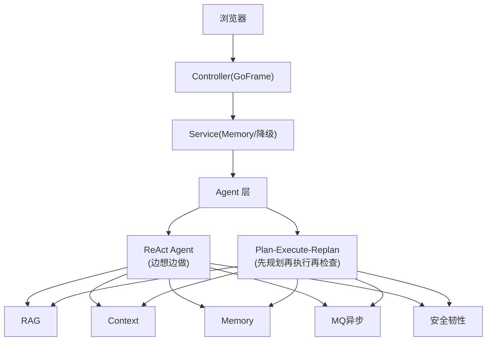

# 第 9 章：面试速记卡

> **面试前 1 小时看这个。** 每一张卡回答一个高频问题。脱稿讲出来才算过关。
>
> **面试前 1 天看 [第10章：全真模拟面试](./10-全真模拟面试.md)** — 四维深挖 LLM/Agent/后端/选型。
> **面试前 1 天看 [第11章：简历模拟面试](./11-简历模拟面试.md)** — 面试官逐行挖你的简历。
> **面试前 2 天看 [第13章：Agent 评测体系](./13-Agent评测体系.md)** — 面试必问："你怎么证明 Agent 变好了？"

---

## 当前口径总表

| 模块 | 当前主线 | 可选增强 / 后续 | 历史口径 |
|------|---------|----------------|---------|
| Chat | Eino ReAct + ProgressiveDisclosure | 防幻觉管线五层防线 | 废弃聊天多角色链路不再作为主线 |
| AIOps | Plan-Execute-Replan + GoS Belief Engine | 信念图 FSM 收敛、事件追踪 | 旧多角色实验链路不再作为主线 |
| RAG | Hybrid Retrieval (Dense+BM25+RRF) | Query Rewrite / Rerank 评测与开关化 | 不再把 Rewrite/Rerank 当默认主链路讲 |
| Context | history / memory / docs / tools + budget / trace + 压缩 | ToolRerank、IntentRecognizer 可选注入 | 简单拼 prompt |
| Skill | 三级渐进披露 (AlwaysOn/SkillGate/OnDemand) | 用户自定义 Skill 扩展 | 无 |
| MCP | 连接池 + 三级降级 (SSE→HTTP→降级占位) | 用户 MCP 工具审批注册 | 无 |
| 安全 | 多层防护 (注入检测→输出脱敏→审批→限流→熔断) | 幻觉检测 LLM 校验 | 无 |
| 压缩 | 上下文压缩 (audit/optimize) | 样例评测 78.81% 压缩率；当前是否实际压缩看 config | 不要把 audit 说成线上强制压缩 |

---

## 🎯 卡 1：自我介绍（30 秒）

> OpsCaption 是一个用 Go 语言开发的智能运维助手。运维人员用自然语言描述故障，系统自动查 Prometheus 指标、查日志、查知识库，LLM 整合成带证据的诊断报告。
>
> 技术栈是 Go + Eino + DeepSeek V4 + Milvus。我独立完成从架构设计到编码实现，做了上下文压缩（audit/optimize，样例评测 78.81% 压缩率）、防幻觉体系（五层摘要 / 十四层展开）、渐进式工具披露、多层安全防护等生产级工程。

---

## 🎯 卡 1.1：STAR 法则 — 项目整体（2 分钟）

> **Situation：** 运维团队排障需要在 4+ 个系统间切换，信息分散，新人上手慢。
>
> **Task：** 设计智能运维助手，统一排障入口，自动查指标/日志/知识库，生成带证据的诊断报告。
>
> **Action：** 四层架构（Controller→Service→Agent→Support），双引擎（ReAct + Plan-Execute-Replan），生产级工程（上下文压缩、防幻觉管线、渐进式工具披露、多层安全防护）。
>
> **Result：** RAG 历史样例评测口径 Recall@10=78%（面试时带 eval runbook / report），上下文压缩样例压缩率 78.81%，防幻觉体系通过工具调用闭环、指标溯源和结构化校验降低编造风险。

---

## 🎯 卡 2：架构（1 分钟）

> 系统分四层。最上是 GoFrame 做 HTTP 路由，支持 Chat、流式、异步三种模式。中间是 Service 层，管记忆、上下文、降级。核心是 Agent 层——简单查询走 ReAct Agent，复杂故障排查走 Plan-Execute-Replan（先规划再执行再检查）。底层四个支撑：RAG 检索引擎、ContextEngine 上下文管理、三层记忆系统、MQ 异步任务。

闭眼能画出这张图：

---

## 🎯 卡 3：RAG（1 分钟）

> RAG 就是让 LLM 能查内部知识库。当前生产主链路是 Hybrid Retrieval：向量检索负责语义相似，BM25 负责精确关键词，两路结果用 RRF 融合，再用 RetrieveRefine 做轻量重排。工程上用 RetrieverPool 复用 Milvus 连接，失败短 TTL 缓存，避免 Milvus 异常时每个请求都重复初始化。Query Rewrite 和 Rerank 已实现为评测/可选增强，不默认放进生产 `Query()`。

**关键词：** Hybrid Retrieval + Dense/BM25 + RRF + RetrieveRefine + RetrieverPool + QueryForEval 可选增强

---

## 🎯 卡 4：ReAct Agent（45 秒）

> ReAct = Reasoning + Acting。普通 LLM 只能凭训练数据回答——ReAct 让 LLM 能主动调工具。执行流程用 Eino 的图编排：输入处理 → Prompt 组装 → ReAct 循环（最多 25 步）。Prompt 分三层设计：静态规则可缓存、动态配置从 config 读、RAG 文档不进 System Prompt——防注入攻击，也为未来 Anthropic Prompt Caching 预留了空间。

**关键词：** Eino Graph + ReAct 循环 + Prompt 三层 + 防注入

---

## 🎯 卡 4.5：Plan-Execute-Replan（30 秒）

> 复杂故障排查不能"边想边做"——我用的是 Eino ADK 的 Plan-Execute-Replan 模式。三个角色协作：Planner 先把问题拆成执行步骤，Executor 按计划调工具执行，RePlanner 检查结果——不够就调整计划重来，最多 5 轮。Planner 和 RePlanner 用更强的模型做推理，Executor 用快速模型跑工具——按能力选模型。

**关键词：** 三个执行角色 + Planner→Executor→RePlanner + 按能力选模型

---

## 🎯 卡 4.6：Agent Contract 合约系统（30 秒）

> 这是我的 Harness MVP——Contract 把 Agent 的 Role、Responsibilities、Inputs/Outputs、Must/MustNot、EvidencePolicy 结构化下来。历史 runtime / Harness 路径里有 `EnforceContract()` 能力，ChatStream 侧也接入了轻量 contract/schema/LLM 校验。更准确的说法是：**Contract 能力已经具备，当前主链路正在逐步迁移接入，不说成每个 Agent 都已强制校验。**

**关键词：** Contract + Harness + 轻量校验 + Evidence Policy + 后续主链路统一接入

---

## 🎯 卡 5：Context Engine（30 秒）

> LLM 有 token 上限，不能把所有信息都塞进去。Context Engine 是"智能剪辑师"——四类来源（历史对话/长期记忆/RAG 文档/工具结果），每类有 token 预算，三种 Profile 按场景选策略，全链路可追溯。这比简单拼字符串工程化得多——出了问题能回溯，做 A/B 测试能控制变量。

History 用 embedding 相似度召回（复用 Doubao Embedding，LRU 缓存），ToolItems 用关键词匹配。按需引入 LLM Rerank——关键词粗筛后 LLM 精排，配置驱动默认关闭。

**关键词：** 四类来源 + Token Budget + Profile 策略 + Trace + 多路召回 + Embedding 相似度 + 关键词匹配 + LLM Rerank（按需）

---

## 🎯 卡 5.1：ContextEngine Recall Layer（45 秒）

> ContextEngine 的召回层我分三个阶段。Phase 1 是纯轻量方案——History 用 Embedding 相似度（带 LRU 缓存，500ms 超时降级），ToolItems 用关键词匹配。Phase 2 是确定性优化——History 加 recency/role/entity 权重，Memory 按 confidence/freshness/scope 综合排序。Phase 2.5 是按需引入 LLM Rerank——benchmark 证明某个召回源是瓶颈时才启用，关键词粗筛→脱敏→LLM 精排，配置驱动默认关闭。核心原则：先用轻量方案，效果不够再上大模型。

**关键词：** 渐进式引入 + Benchmark 驱动 + 确定性优先 + 配置化开关

---

## 🎯 卡 5.2：为什么不一开始就用 LLM？（20 秒）

> 三个原因。延迟——LLM 调用 200-2000ms，Embedding 100-400ms，关键词 <10ms。成本——LLM 按 token 计费，Embedding 便宜 10-100 倍。稳定性——LLM 输出有随机性，Embedding 和关键词是确定性的。所以先用轻量方案跑 Benchmark，证明效果不够再局部引入 LLM。

**关键词：** 延迟/成本/稳定性 + 先确定性后 LLM

---

## 🎯 卡 5.3：意图识别怎么做的？（20 秒）

> IntentRecognizer 是可选注入能力，不是 NewAssembler 默认开启。它用独立 LLM 调用做轻量分类，500ms 超时降级；当前支持 fault_diagnosis / knowledge_query / chat，映射到 aiops_diagnosis 或 chat Profile。主线说法要强调"可选增强"，不要说成所有请求默认都会先识别意图。

**关键词：** 独立调用 + JSON 约束 + Profile 映射 + 超时降级

---

## 🎯 卡 6：Memory 记忆系统（30 秒）

> 三层记忆：短期（当前对话）、长期（跨会话）、工作（工具结果）。核心是长期记忆的异步提取——对话结束先同步写短期，再通过 MQ 异步触发 LLM 提取关键信息。MQ 不可用有本地 fallback。记忆写入前校验过滤，有全局上限防无限增长，读锁优化只短暂写锁。

**关键词：** 三层记忆 + MQ 异步提取 + 多维过滤 + 全局上限

---

## 🎯 卡 7：MQ 异步任务（30 秒）

> AIOps 分析可能跑几分钟，HTTP 不能一直等着。MQ 解耦请求和任务——用户提交拿 task_id，关页面，回来查结果。RabbitMQ 配了 Retry Queue（TTL 死信回流）+ DLQ，Redis 做状态机持久化。另外记忆抽取也用 MQ 异步，不可用时本地 goroutine fallback。

**关键词：** 解耦请求/执行 + Retry+DLQ + Redis 状态机

---

## 🎯 卡 8：安全与韧性（30 秒）

> AI 系统比普通系统多一层风险。安全上：JWT + 限流 + Prompt Guard 防注入 + Output Filter 防泄露 + 工具白名单。韧性上：RetrieverPool 失败短 TTL 缓存、MQ 不可用走本地 fallback、AI 不可用手动降级开关；Rewrite/Rerank 作为可选增强接入时必须有超时和回退。核心哲学：局部失败不崩溃，降级而非 Fatal。

**关键词：** 分层安全 + 全链路降级 + 降级而非崩溃

---

## 🎯 卡 9：技术选型（45 秒）

> 为什么选 Go？运维场景对实时性有要求，Go 的 goroutine 天然适合并发查多个数据源。而且 Go 编译成单个二进制，部署简单。字节的 Eino 框架也是 Go 原生，技术栈统一。
>
> 为什么选 Eino？字节开源，Go-native，不需要引入 Python。原生支持 ReAct 和 Plan-Execute-Replan。
>
> 为什么选 Milvus？开源向量数据库里性能最好，Go SDK 成熟。
>
> 为什么 RabbitMQ？成熟稳定，原生支持重试和死信队列——这是异步任务必需的能力。

---

## 🎯 卡 9.1：Redis 在项目中的应用（30 秒）

> Redis 在 OpsCaption 中有三个核心用途。第一是分布式限流——用 Lua 脚本实现滑动窗口算法，按 clientID 限流，保证原子性。第二是异步任务状态机——Chat 任务和记忆提取任务的状态都存在 Redis，支持查询和超时。第三是降级开关——`kill_switch` 键控制 AI 服务降级。
>
> Redis 挂了怎么办？限流自动降级到本地内存，任务状态丢失需要重建，但核心服务不中断。

**关键词：** 滑动窗口限流 + Lua 原子性 + 任务状态机 + 降级开关

---

## 🎯 卡 9.2：MySQL 安全查询设计（30 秒）

> Agent 需要查询业务数据，但不能让 LLM 直接写 SQL。我设计了 `mysql_crud` 工具：只允许 SELECT，禁止 DROP/DELETE/UPDATE 等危险关键词，表白名单校验，强制 LIMIT 防止全表扫描。查询超时 10 秒，连接池用 `sync.Once` 单例初始化。
>
> 为什么不用 GORM？Agent 需要执行动态查询，无法预知表结构，GORM 限制太多。但安全是第一位——白名单 + 关键词过滤 + 强制 LIMIT。

**关键词：** 只读安全 + 关键词过滤 + 表白名单 + 强制 LIMIT + 超时控制

---

## 🎯 卡 9.3：Milvus 向量检索优化（30 秒）

> Milvus 在 OpsCaption 中做 RAG 的向量检索。核心是 HNSW 索引——分层导航小世界图，`M=16` 平衡内存和精度，`efConstruction=200` 保证构建质量。查询时 `ef=128`，测试发现比 64 的 Recall@10 提升 7%，但延迟增加 30ms，最终选择精度优先。
>
> 工程上用 RetrieverPool 复用连接，按 Milvus 地址和 top_k 做 key，失败短 TTL 缓存避免重复初始化。

**关键词：** HNSW 索引 + M/efConstruction/ef 参数调优 + RetrieverPool 复用 + 短 TTL 缓存

---

## 🎯 卡 9.4：RabbitMQ 可靠性设计（30 秒）

> 异步任务必须保证不丢、不重、可重试。RabbitMQ 配了三层保障：Confirm 模式保证生产者到 Broker 不丢，手动 ACK 保证消费者处理完才确认，Retry Queue + DLQ 保证失败任务可追溯。
>
> 具体流程：消息发布到 Retry Queue，设置 TTL，过期后死信回流到正常队列重试，最多 3 次，最终失败进 DLQ。记忆提取也用 MQ，不可用时降级到本地 goroutine。

**关键词：** Confirm + 手动 ACK + Retry Queue + TTL 死信 + DLQ + 降级 fallback

---

## 🎯 卡 9.5：AIOpsPanel 三路证据诊断（30 秒）

> 前端做了一个运维诊断面板——不是简单的聊天框。顶部展示事件等级(SEV-2)、影响服务和值班人。核心是三路证据并行卡片：Metrics（已拉取）→ Logs（分析中）→ Knowledge（已匹配），每条有实时状态。右侧是建议处置节奏（三步安全操作路径），底部有风险提示。**这不是 Demo——这是真正考虑运维工作流的产品设计。**

**关键词：** 三路证据并行 + 处置节奏 + 运维视角 UX

---

## 🎯 卡 10：最大挑战（30 秒）

> RAG 评测时，想把 11GB 原始遥测数据上传到云端做预处理。但那台服务器根盘只有 40G，数据传上去后盘直接满了。我没有硬撑——先做了资源归因，查清楚每个目录的占用，然后改方案：本地做重预处理，云端只接收轻量产物。学到一点："能做"不等于"应该做"——部署要考虑资源约束。

---

## 🎯 卡 11：改进方向（20 秒）

> 三个方向。一是 RAG 评测闭环，固化 build/holdout split，持续跟踪 Recall@K。二是 Prompt 管理，目前写在代码里，后续抽到外部文件做版本管理。三是接入更多知识源，扩大知识库覆盖面。

---

## 🎯 卡 12：Skill 系统（30 秒）

> Skill 是语义层，通过关键词匹配识别用户意图，输出 Focus hint 引导推理方向。三个 Domain：Metrics（4 个 skill）、Logs（6 个 skill）、Knowledge（5 个 skill）。Progressive Disclosure 三级工具披露：AlwaysOn 始终可用，SkillGate 域匹配后开放，OnDemand 按需展开。注入风险时只暴露 AlwaysOn 工具。

**关键词：** Skill 语义层 + 三个 Domain + Progressive Disclosure + 安全分层

---

## 🎯 卡 13：MCP 工具集成（30 秒）

> 日志工具通过 MCP 协议连接，有三级降级链：SSE MCP → HTTP Fallback → 降级占位工具。连接池复用，断线重连指数退避。用户可自定义 MCP 工具，CIDR 白名单校验，审批流程（pending→approved）。ToolWrapper 装饰器统一拦截：参数校验、结果压缩、事件发射。

**关键词：** MCP 连接池 + 三级降级 + ToolWrapper + 用户扩展

---

## 🎯 卡 14：安全系统（30 秒）

> 多层防护：Prompt Guard（正则+LLM 两层注入检测）→ Output Filter（脱敏 API key/内网IP/系统 prompt）→ Approval Gate（区分"分析"和"执行"，"请给出回滚步骤"允许，"请立即回滚"需审批）→ 限流（Redis 滑动窗口+内存令牌桶双后端）→ 熔断（三态状态机）。

**关键词：** 两层注入检测 + 输出脱敏 + 分析/执行区分 + 双后端限流

---

## 🎯 卡 15：上下文压缩（30 秒）

> 工具输出和 RAG 文档经常很长，大部分内容冗余。压缩系统支持三种策略：JSON 数组（保留首尾+错误项）、日志（保留 ERROR/WARN+上下文窗口）、JSON 对象（提取关键字段）。两种模式：audit 只观察不压缩，optimize 实际压缩。样例评测压缩率 78.81%，证据保留率 100%；当前是否生效以 `context_compression.enabled/mode` 为准。

**关键词：** 三种策略 + audit/optimize + 78.81% 压缩率 + 100% 证据保留

---

## 🎯 卡 16：防幻觉管线（30 秒）

> 五层防线是面试摘要版：SchemaGate（矛盾检测）→ OutputValidator（指标溯源，验证 LLM 输出的数值是否来自工具结果）→ ContractCollector（契约校验）→ NoToolCallDetection（检测没有工具调用的运维问题）→ LLMValidation（LLM 交叉校验）。第 14 章的十四层防线是工程展开版，两者不是两套系统。不能只靠 prompt 约束，需要工程化硬校验。

**关键词：** 五层防线 + 指标溯源 + 矛盾检测 + 工程化校验

---

## 🎯 卡 17：信念图与 FSM（30 秒）

> GoS 诊断引擎用信念图+FSM 替代 chain-of-thought。BeliefGraph 有三类节点（Signal/Evidence/Hypothesis），四种边（support/refute/refines/causal）。FSM 三阈值决策：GapDelta（假设差距）、MinSupport（最少证据）、MaxSteps（最大步数）。Copy-on-Write 保证并发安全。新证据可以推翻旧假设。

**关键词：** 信念图 + FSM 三阈值 + Copy-on-Write + 假设可修正

## ✅ 自测清单

面试前逐条过，脱口而出才算过关：

- [ ] 能用 STAR 法则讲清楚项目整体（Situation/Task/Action/Result）
- [ ] 能画出四层架构图
- [ ] 能讲清楚 RAG 的 Hybrid Retrieval（Dense+BM25+RRF）
- [ ] 能讲清楚 ReAct Agent 的执行流程
- [ ] 能讲清楚 Plan-Execute-Replan 的原理
- [ ] 能讲清楚 Context Engine 的五阶段组装
- [ ] 能讲清楚记忆系统的三层设计和异步提取
- [ ] 能讲清楚 Skill 系统的三级渐进披露
- [ ] 能讲清楚 MCP 工具的三级降级链
- [ ] 能讲清楚安全系统的多层防护
- [ ] 能讲清楚上下文压缩的三种策略
- [ ] 能讲清楚防幻觉管线的五层摘要，以及它和十四层工程展开版的关系
- [ ] 能讲清楚信念图+FSM 的推理收敛
- [ ] 能讲清楚多 Agent 运行时的调度机制
- [ ] 能讲出至少 3 个降级场景
- [ ] 能讲出技术选型的 trade-off

---

## 📊 你的项目"技术含量"总结

| 层级 | 做了什么 | 面试亮点 |
|------|---------|---------|
| Agent | ReAct + Plan-Execute-Replan | 两种模式、按能力选模型 |
| Contract | Harness Contract + ChatStream 轻量校验 | Evidence Policy、Schema/Contract 能力，主链路后续统一接入 |
| RAG | 完整检索链路 + 知识索引管线 | Hybrid-only 混合检索、BM25 融合、RRF、文件上传入向量库 |
| Context | 上下文装配引擎 | 多路召回 + Budget 控制 + Profile + Trace + LLM Rerank（按需） |
| Memory | 三层记忆系统 | MQ 异步 + 多维过滤 + 锁优化 |
| MQ | 双链路异步架构 | 解耦 + 重试死信 + 状态机 |
| 韧性 | 全链路降级 | 每环节超时 + fallback |
| 安全 | 多层防护 | Prompt Guard + 工具白名单 |
| 前端 | React 重构 (20组件) + AIOpsPanel | 打字机流式、暗色模式、三路证据诊断卡片 |
