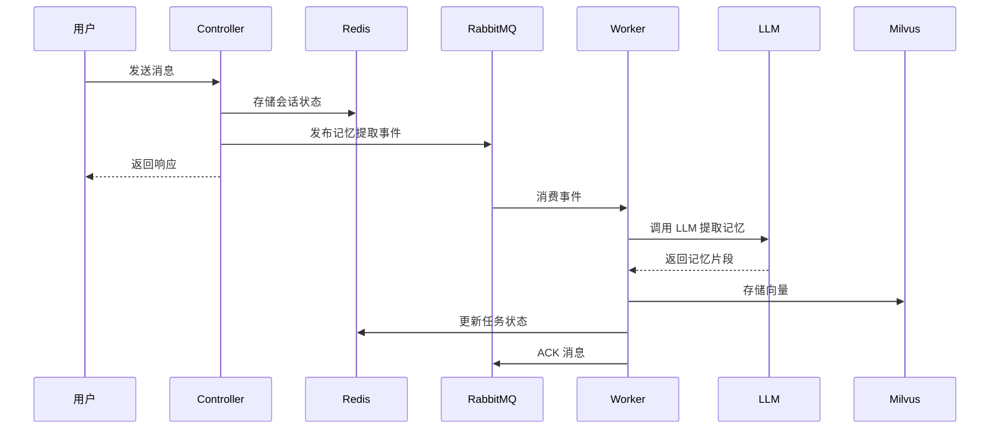

# 第 16 章：后端组件面试总结 — Redis / MySQL / Milvus / MQ

> **本章目标**：掌握 Redis、MySQL、Milvus、RabbitMQ 在 OpsCaption 项目中的具体用法，能回答面试官关于这些组件的技术问题，特别是与项目相关的追问。
>
> **面试前 1 天看 [第10章：全真模拟面试](./10-全真模拟面试.md)** — 四维深挖 LLM/Agent/后端/选型。
> **面试前 1 小时看 [第9章：面试速记卡](./09-面试速记卡.md)** — 高频问题速记。

---

## 1. Redis 在 OpsCaption 中的用法

### 1.1 核心应用场景

| 场景 | 用途 | 关键实现 |
|------|------|---------|
| **分布式限流** | API 限流，防止恶意请求 | `RedisRateLimiter` 使用滑动窗口算法 |
| **任务状态机** | 异步任务状态持久化 | `chat_task` 和 `memory_extract` 任务状态 |
| **降级开关** | AI 服务降级控制 | `kill_switch` 键控制降级 |
| **审批缓存** | 审批请求状态缓存 | `approval` 前缀键存储审批状态 |
| **连接池管理** | GoFrame Redis 连接池 | 通过 `g.Redis()` 统一管理 |

### 1.2 关键代码实现

#### 滑动窗口限流器
```go
// utility/auth/redis_rate_limiter.go
type RedisRateLimiter struct {
    rate     int           // 窗口内允许的最大请求数
    window   time.Duration // 时间窗口大小
    redisCfg *gredis.Config
}

// Lua 脚本实现原子性滑动窗口
var slidingWindowScript = `
local key = KEYS[1]
local limit = tonumber(ARGV[1])
local window = tonumber(ARGV[2])
local now = tonumber(ARGV[3])

redis.call('ZREMRANGEBYSCORE', key, 0, now - window)
local count = redis.call('ZCARD', key)
if count < limit then
    redis.call('ZADD', key, now, now .. '-' .. math.random(1, 1000000))
    redis.call('PEXPIRE', key, window)
    return 1
end
return 0
`
```

**面试追问点：**
- 为什么用 Lua 脚本？（原子性，避免竞态条件）
- 为什么用 ZSET 而不是简单的计数器？（支持滑动窗口，更平滑）
- 为什么用 `math.random()`？（避免 ZADD 分数冲突）

#### Redis 健康检查
```go
func IsRedisAvailable(ctx context.Context) bool {
    v, err := g.Cfg().Get(ctx, "redis.default.address")
    if err != nil || v.String() == "" {
        return false
    }
    defer func() { recover() }()
    result, err := g.Redis().Do(ctx, "PING")
    if err != nil {
        g.Log().Debugf(ctx, "redis ping failed, falling back to in-memory rate limiter: %v", err)
        return false
    }
    return result.String() == "PONG"
}
```

### 1.3 Redis 面试题

#### Q1：为什么选择 Redis 做限流而不是本地内存？

**标准答案：**
> 分布式环境下，本地内存限流无法跨实例共享状态。假设每台服务器限流 100 次/分钟，3 台服务器实际能承受 300 次/分钟，无法实现全局限流。Redis 作为共享存储，所有实例读写同一个键，能实现真正的全局限流。

**项目追问：**
- 如果 Redis 挂了怎么办？（降级到本地内存限流，见 `IsRedisAvailable` 逻辑）
- 限流粒度怎么定？（按 `clientID` 限流，支持 IP、用户 ID、API Key 等）

#### Q2：滑动窗口 vs 固定窗口 vs 令牌桶，有什么区别？

**标准答案：**
| 算法 | 优点 | 缺点 | 适用场景 |
|------|------|------|---------|
| 固定窗口 | 实现简单 | 窗口边界突发流量 | 简单限流 |
| 滑动窗口 | 平滑限流 | 内存占用较高 | API 限流 |
| 令牌桶 | 允许突发流量 | 实现复杂 | 流量整形 |

**项目选择：** OpsCaption 用滑动窗口，因为 API 限流需要平滑控制，避免窗口边界突发。

#### Q3：Redis 分布式锁怎么实现？有什么坑？

**标准答案：**
```go
// 基础实现
SET resource_name my_random_value NX PX 30000

// 释放锁（Lua 脚本保证原子性）
if redis.call("get", KEYS[1]) == ARGV[1] then
    return redis.call("del", KEYS[1])
else
    return 0
end
```

**常见坑：**
1. **锁过期问题**：业务未完成锁已过期，其他客户端获取锁
2. **锁误删**：A 客户端删除了 B 客户端的锁
3. **时钟漂移**：不同服务器时钟不一致

**项目中的应用：** OpsCaption 用 Redis 做审批状态缓存，需要保证并发安全。

#### Q4：Redis 持久化方式有哪些？怎么选？

**标准答案：**
| 方式 | 原理 | 优点 | 缺点 |
|------|------|------|------|
| RDB | 定时快照 | 恢复快，文件小 | 可能丢数据 |
| AOF | 追加写命令 | 数据安全 | 文件大，恢复慢 |
| 混合 | RDB + AOF | 兼顾两者 | 配置复杂 |

**OpsCaption 选择：** `--appendonly yes`（AOF），因为任务状态数据不能丢。

#### Q5：Redis 集群方案有哪些？

**标准答案：**
1. **主从复制**：读写分离，但不能自动故障转移
2. **哨兵模式**：自动故障转移，但写仍是单点
3. **Cluster 模式**：数据分片，支持水平扩展

**OpsCaption 当前：** 单机 Redis（开发/测试环境），生产环境可扩展到 Cluster。

---

## 2. MySQL 在 OpsCaption 中的用法

### 2.1 核心应用场景

| 场景 | 用途 | 关键实现 |
|------|------|---------|
| **知识库查询** | Agent 工具查询业务数据 | `mysql_crud` 工具 |
| **只读安全** | 防止 SQL 注入和误操作 | 白名单表 + 禁止关键词 |
| **连接池管理** | GORM 连接池 | `sync.Once` 单例初始化 |
| **查询超时** | 防止慢查询阻塞 | `context.WithTimeout` |

### 2.2 关键代码实现

#### MySQL CRUD 工具
```go
// internal/ai/tools/mysql_crud.go
type MysqlCrudInput struct {
    SQL         string `json:"sql" jsonschema:"description=The SQL SELECT query to execute"`
    OperateType string `json:"operate_type" jsonschema:"description=The type of SQL operation"`
}

// 安全校验
func validateMysqlQuery(sql string, policy mysqlQueryPolicy) (string, error) {
    trimmed := strings.TrimSpace(sql)
    trimmed = strings.TrimSuffix(trimmed, ";")

    // 1. 禁止多语句
    if strings.Contains(trimmed, ";") {
        return "", fmt.Errorf("multiple statements are not allowed")
    }

    // 2. 只允许 SELECT
    upper := strings.ToUpper(strings.TrimSpace(trimmed))
    if !strings.HasPrefix(upper, "SELECT") {
        return "", fmt.Errorf("only SELECT queries are allowed")
    }

    // 3. 禁止危险关键词
    for _, forbidden := range forbiddenPatterns {
        if forbidden.MatchString(upper) {
            return "", fmt.Errorf("forbidden SQL keyword detected")
        }
    }

    // 4. 表白名单检查
    if len(policy.allowedTables) > 0 {
        for _, tableName := range referencedTableNames(trimmed) {
            if _, ok := policy.allowedTables[tableName]; !ok {
                return "", fmt.Errorf("table %q is not in the allowlist", tableName)
            }
        }
    }

    // 5. 强制 LIMIT
    return fmt.Sprintf("SELECT * FROM (%s) AS opscaptionai_safe_query LIMIT %d", trimmed, policy.maxRows), nil
}
```

#### 连接池管理
```go
var (
    mysqlDB   *gorm.DB
    mysqlOnce sync.Once
    mysqlErr  error
)

func initMysqlDB(ctx context.Context) (*gorm.DB, error) {
    mysqlOnce.Do(func() {
        dsn, err := g.Cfg().Get(ctx, "mysql.dsn")
        if err != nil {
            mysqlErr = fmt.Errorf("failed to read mysql.dsn from config: %w", err)
            return
        }
        db, err := gorm.Open(mysql.Open(dsn.String()), &gorm.Config{})
        if err != nil {
            mysqlErr = fmt.Errorf("failed to connect to mysql: %w", err)
            return
        }
        mysqlDB = db
    })
    return mysqlDB, mysqlErr
}
```

### 2.3 MySQL 面试题

#### Q1：为什么用 GORM 而不是原生 SQL？

**标准答案：**
> GORM 提供：
> 1. **连接池管理**：自动管理连接生命周期
> 2. **防 SQL 注入**：参数化查询
> 3. **结构体映射**：减少手动解析
> 4. **事务支持**：简化事务代码
>
> 但 OpsCaption 的 `mysql_crud` 工具用原生 SQL，因为 Agent 需要执行动态查询，无法预知表结构。

**项目追问：**
- 为什么不让 Agent 直接用 GORM？（Agent 需要灵活性，GORM 限制太多）
- 怎么保证安全？（白名单 + 禁止关键词 + 强制 LIMIT）

#### Q2：SQL 注入怎么防？

**标准答案：**
> OpsCaption 的防注入策略：
> 1. **参数化查询**：GORM 默认使用
> 2. **关键词过滤**：正则匹配 `DROP/DELETE/UPDATE/INSERT` 等
> 3. **表名白名单**：只允许查询配置的表
> 4. **强制 LIMIT**：防止全表扫描
> 5. **超时控制**：`context.WithTimeout` 防止慢查询

**项目追问：**
- 为什么不用存储过程？（灵活性不够，Agent 需要动态查询）
- 为什么限制只读？（防止 Agent 误操作数据）

#### Q3：数据库连接池怎么配置？

**标准答案：**
```go
// GORM 连接池配置
db, err := gorm.Open(mysql.Open(dsn), &gorm.Config{})
sqlDB, _ := db.DB()
sqlDB.SetMaxOpenConns(100)        // 最大连接数
sqlDB.SetMaxIdleConns(10)         // 最大空闲连接
sqlDB.SetConnMaxLifetime(time.Hour) // 连接最大生命周期
```

**项目追问：**
- 为什么用 `sync.Once`？（保证连接只初始化一次）
- 连接池大小怎么定？（根据并发量和数据库承受能力）

#### Q4：索引优化怎么做？

**标准答案：**
> 索引优化原则：
> 1. **最左前缀**：联合索引按顺序使用
> 2. **覆盖索引**：查询字段都在索引中
> 3. **避免索引失效**：函数、类型转换、OR 条件
> 4. **explain 分析**：查看执行计划

**项目追问：**
- OpsCaption 的表有哪些索引？（根据实际表结构回答）
- 怎么监控慢查询？（MySQL 慢查询日志 + Prometheus 指标）

#### Q5：事务隔离级别有哪些？

**标准答案：**
| 级别 | 脏读 | 不可重复读 | 幻读 |
|------|------|-----------|------|
| READ UNCOMMITTED | ✓ | ✓ | ✓ |
| READ COMMITTED | ✗ | ✓ | ✓ |
| REPEATABLE READ | ✗ | ✗ | ✓ |
| SERIALIZABLE | ✗ | ✗ | ✗ |

**OpsCaption 选择：** 默认 `REPEATABLE READ`，因为只读查询不需要更高隔离级别。

---

## 3. Milvus 在 OpsCaption 中的用法

### 3.1 核心应用场景

| 场景 | 用途 | 关键实现 |
|------|------|---------|
| **向量存储** | 存储文档 embedding | `entity.FieldTypeFloatVector` |
| **向量检索** | 语义相似度搜索 | `Search` API + HNSW 索引 |
| **多租户** | 按项目隔离数据 | 不同 Collection 或 Partition |
| **元数据过滤** | 结合标量和向量搜索 | `metadata` JSON 字段 |

### 3.2 关键代码实现

#### Milvus 客户端初始化
```go
// utility/client/client.go
func NewMilvusClient(ctx context.Context) (cli.Client, error) {
    addr := common.GetMilvusAddr(ctx)
    collectionName := common.GetMilvusCollectionName(ctx)

    // 1. 连接默认数据库
    defaultClient, err := cli.NewClient(ctx, cli.Config{
        Address: addr,
        DBName:  "default",
    })
    defer defaultClient.Close()

    // 2. 检查并创建业务数据库
    databases, err := defaultClient.ListDatabases(ctx)
    agentDBExists := false
    for _, db := range databases {
        if db.Name == common.MilvusDBName {
            agentDBExists = true
            break
        }
    }
    if !agentDBExists {
        err = defaultClient.CreateDatabase(ctx, common.MilvusDBName)
    }

    // 3. 连接业务数据库
    agentClient, err := cli.NewClient(ctx, cli.Config{
        Address: addr,
        DBName:  common.MilvusDBName,
    })

    // 4. 检查并创建 Collection
    collections, err := agentClient.ListCollections(ctx)
    bizCollectionExists := false
    for _, collection := range collections {
        if collection.Name == collectionName {
            bizCollectionExists = true
            break
        }
    }
    if !bizCollectionExists {
        collSchema := &entity.Schema{
            CollectionName: collectionName,
            Description:    "Business knowledge collection",
            Fields:         BuildMilvusFields(ctx),
        }
        err = agentClient.CreateCollection(ctx, collSchema, entity.DefaultShardNumber)

        // 5. 创建向量索引
        vectorIndex, err := buildMilvusVectorIndex(ctx)
        err = agentClient.CreateIndex(ctx, collectionName, "vector", vectorIndex, false)
    }

    // 6. 加载 Collection 到内存
    err = agentClient.LoadCollection(ctx, collectionName, false)
    return agentClient, nil
}
```

#### Collection Schema 设计
```go
func BuildMilvusFields(ctx context.Context) []*entity.Field {
    return []*entity.Field{
        {
            Name:       "id",
            DataType:   entity.FieldTypeVarChar,
            TypeParams: map[string]string{"max_length": "256"},
            PrimaryKey: true,
        },
        {
            Name:       "vector",
            DataType:   entity.FieldTypeFloatVector,
            TypeParams: map[string]string{"dim": strconv.Itoa(common.GetVectorDimension(ctx))},
        },
        {
            Name:       "content",
            DataType:   entity.FieldTypeVarChar,
            TypeParams: map[string]string{"max_length": "8192"},
        },
        {
            Name:     "metadata",
            DataType: entity.FieldTypeJSON,
        },
    }
}
```

#### 向量索引配置
```go
func buildMilvusVectorIndex(ctx context.Context) (entity.Index, error) {
    metricType, err := resolveMilvusMetricType(ctx) // IP/L2/COSINE

    switch strings.ToUpper(common.GetMilvusIndexType(ctx)) {
    case "HNSW":
        m := common.GetMilvusHNSWM(ctx)
        efConstruction := common.GetMilvusHNSWEfConstruction(ctx)
        return entity.NewIndexHNSW(metricType, m, efConstruction)
    case "AUTOINDEX":
        return entity.NewIndexAUTOINDEX(metricType)
    default:
        return nil, fmt.Errorf("unsupported milvus.index_type")
    }
}
```

### 3.3 Milvus 面试题

#### Q1：为什么用 Milvus 而不是 Elasticsearch 做向量搜索？

**标准答案：**
| 特性 | Milvus | Elasticsearch |
|------|--------|---------------|
| 向量搜索 | 原生支持，性能优化 | 插件支持，性能一般 |
| 索引类型 | HNSW/IVF_FLAT/IVF_SQ8 | 只有 HNSW |
| 标量过滤 | 支持，与向量结合 | 支持，但性能一般 |
| 扩展性 | 分布式，水平扩展 | 分布式，但向量搜索扩展性差 |
| 生态 | 专注向量数据库 | 全文搜索为主 |

**OpsCaption 选择：** Milvus，因为 RAG 场景需要高性能向量搜索，且需要标量过滤（按项目、类型筛选）。

#### Q2：HNSW 索引原理是什么？参数怎么调？

**标准答案：**
> **HNSW（Hierarchical Navigable Small World）**：
> 1. **分层结构**：底层包含所有节点，上层节点逐渐稀疏
> 2. **导航搜索**：从最高层开始，逐层向下搜索最近邻
> 3. **小世界图**：每个节点连接少量远距离节点和大量近距离节点
>
> **关键参数：**
> - `M`：每个节点的最大连接数，越大精度越高但内存越大
> - `efConstruction`：构建时的搜索范围，越大构建越慢但质量越高
> - `ef`：查询时的搜索范围，越大精度越高但查询越慢

**项目配置：**
```yaml
milvus:
  index_type: HNSW
  metric_type: COSINE
  hnsw_m: 16
  hnsw_ef_construction: 200
```

#### Q3：向量维度怎么选？

**标准答案：**
> 维度选择权衡：
> - **高维度**：表达能力强，但存储大、查询慢
> - **低维度**：存储小、查询快，但表达能力弱
>
> **常见选择：**
> - 768 维：BERT-base
> - 1024 维：BERT-large
> - 1536 维：OpenAI text-embedding-ada-002
>
> **OpsCaption 选择：** 根据 Doubao Embedding 模型输出维度配置。

#### Q4：Milvus 集群方案有哪些？

**标准答案：**
| 模式 | 架构 | 适用场景 |
|------|------|---------|
| Standalone | 单机 | 开发测试 |
| Cluster | 分布式 | 生产环境 |
| Cloud | 托管服务 | 无需运维 |

**OpsCaption 当前：** Standalone（开发/测试），生产可扩展到 Cluster。

#### Q5：向量搜索性能怎么优化？

**标准答案：**
> 1. **索引优化**：选择合适的索引类型和参数
> 2. **分区/分片**：按业务逻辑分区，减少搜索范围
> 3. **缓存**：热门查询结果缓存
> 4. **批量查询**：减少网络往返
> 5. **资源限制**：设置查询超时和返回数量限制

**项目追问：**
- RetrieverPool 怎么复用连接？（按 Milvus 地址和 top_k 复用，失败短 TTL 缓存）
- 搜索超时怎么设置？（配置项控制，默认 10s）

---

## 4. RabbitMQ 在 OpsCaption 中的用法

### 4.1 核心应用场景

| 场景 | 用途 | 关键实现 |
|------|------|---------|
| **异步任务** | Chat 任务异步执行 | `chat_task_queue` |
| **记忆提取** | 长期记忆异步提取 | `memory_extract_queue` |
| **重试机制** | 任务失败自动重试 | Retry Queue + TTL 死信 |
| **死信队列** | 多次失败的任务 | DLQ 存储失败任务 |
| **流量削峰** | 平滑处理突发请求 | 队列缓冲 |

### 4.2 关键代码实现

#### RabbitMQ 拓扑设计
```go
// internal/ai/service/memory_queue.go
const (
    defaultRabbitMQExchange                  = "opscaption.events"
    defaultMemoryExtractRoutingKey           = "memory.extract.request"
    defaultMemoryExtractRetryRoutingKey      = "memory.extract.retry"
    defaultMemoryExtractDLQRoutingKey        = "memory.extract.dlq"
    defaultMemoryExtractQueue                = "opscaption.memory.extract"
    defaultMemoryExtractPrefetch             = 8
    defaultMemoryExtractMaxRetries           = 3
    defaultMemoryExtractRetryDelay           = 2 * time.Second
    defaultMemoryExtractPublishTimeout       = 2 * time.Second
)
```

#### 消息结构设计
```go
type memoryExtractionEvent struct {
    EventID     string `json:"event_id"`
    SessionID   string `json:"session_id"`
    UserID      string `json:"user_id,omitempty"`
    ProjectID   string `json:"project_id,omitempty"`
    TraceID     string `json:"trace_id,omitempty"`
    Query       string `json:"query"`
    Summary     string `json:"summary"`
    RequestedAt int64  `json:"requested_at"`
    Attempt     int    `json:"attempt"`
}
```

#### 重试和死信机制
```go
// 队列声明
ch.QueueDeclare(queueName, true, false, false, false, amqp.Table{
    "x-dead-letter-exchange":    exchange,
    "x-dead-letter-routing-key": dlqRoutingKey,
    "x-message-ttl":             retryDelay.Milliseconds(),
})

// 消费失败时重试
if attempt < maxRetries {
    // 重新发布到重试队列
    publishWithRetry(ctx, retryRoutingKey, event)
} else {
    // 发布到死信队列
    publishWithRetry(ctx, dlqRoutingKey, event)
}
```

#### 优雅关闭
```go
type rabbitMQMemoryClient struct {
    conn      *amqp.Connection
    publishCh *amqp.Channel
    consumeCh *amqp.Channel

    consumeCtx    context.Context
    consumeCancel context.CancelFunc
    consumeDone   chan struct{}
    closed        bool
}

func (c *rabbitMQMemoryClient) Close() error {
    c.stateMu.Lock()
    if c.closed {
        c.stateMu.Unlock()
        return nil
    }
    c.closed = true
    c.consumeCancel() // 取消消费上下文
    c.stateMu.Unlock()

    <-c.consumeDone // 等待消费完成
    return c.conn.Close()
}
```

### 4.3 RabbitMQ 面试题

#### Q1：为什么用 RabbitMQ 而不是 Kafka？

**标准答案：**
| 特性 | RabbitMQ | Kafka |
|------|----------|-------|
| 协议 | AMQP | 自定义协议 |
| 消息模型 | 队列 | 发布订阅 |
| 吞吐量 | 中等 | 高 |
| 延迟 | 低 | 中等 |
| 消息确认 | 灵活 | 批量 |
| 适用场景 | 任务队列、RPC | 日志、流处理 |

**OpsCaption 选择：** RabbitMQ，因为：
1. 任务队列场景，需要低延迟
2. 需要灵活的消息确认和重试机制
3. 运维熟悉 RabbitMQ

#### Q2：消息丢失怎么保证？

**标准答案：**
> **生产者 -> Broker：**
> 1. **事务模式**：`channel.TxSelect()`，性能差
> 2. **Confirm 模式**：`channel.Confirm()`，异步确认
>
> **Broker -> 消费者：**
> 1. **手动 ACK**：`channel.Ack()`，处理完才确认
> 2. **预取数量**：`channel.Qos(prefetchCount)`，控制未确认消息数
>
> **Broker 持久化：**
> 1. **队列持久化**：`durable: true`
> 2. **消息持久化**：`deliveryMode: persistent`

**OpsCaption 实现：**
```go
// 生产者：Confirm 模式
ch.Confirm(false)
// 消费者：手动 ACK
ch.Ack(tag, false)
// 队列：持久化
ch.QueueDeclare(name, true, false, false, false, nil)
```

#### Q3：死信队列怎么用？

**标准答案：**
> **死信产生原因：**
> 1. 消息被拒绝（`basic.reject` 或 `basic.nack`）且 `requeue=false`
> 2. 消息 TTL 过期
> 3. 队列达到最大长度
>
> **OpsCaption 的 DLQ 设计：**
> ```
> 正常队列 -> TTL 过期 -> 重试队列 -> 多次失败 -> 死信队列
> ```
>
> 重试队列设置 TTL，消息过期后自动回到正常队列，实现延迟重试。

#### Q4：怎么保证消息顺序？

**标准答案：**
> RabbitMQ 保证**单个队列内**消息有序，但：
> 1. **多消费者**：无法保证顺序，需要业务逻辑处理
> 2. **重试机制**：失败重试会打乱顺序
>
> **OpsCaption 的处理：**
> - 记忆提取不需要严格顺序
> - Chat 任务用 task_id 标识，结果存储在 Redis，不依赖消息顺序

#### Q5：连接断开怎么处理？

**标准答案：**
```go
// 自动重连机制
func (c *rabbitMQMemoryClient) reconnect() {
    for {
        select {
        case <-c.consumeCtx.Done():
            return
        case err := <-c.conn.NotifyClose(make(chan *amqp.Error)):
            if err != nil {
                g.Log().Warningf(context.Background(), "[memory] rabbitmq connection lost: %v", err)
                time.Sleep(reconnectDelay)
                // 重新连接
                conn, err := amqp.Dial(url)
                if err != nil {
                    continue
                }
                c.conn = conn
                // 重新初始化 channel
                c.initChannels()
                // 重新启动消费
                c.startConsumer()
            }
        }
    }
}
```

**项目追问：**
- 重连间隔怎么定？（指数退避，避免频繁重试）
- 重连期间消息怎么办？（生产者端缓存，消费者端暂停）

#### Q6：怎么监控 RabbitMQ？

**标准答案：**
> **监控指标：**
> 1. **队列深度**：消息积压情况
> 2. **消费速率**：处理能力
> 3. **连接数**：客户端连接情况
> 4. **内存/磁盘**：资源使用情况
>
> **OpsCaption 的监控：**
> ```go
> metrics.ObserveMemoryExtraction("rabbitmq", "published")
> metrics.ObserveMemoryExtraction("rabbitmq", "publish_failed")
> metrics.ObserveMemoryExtraction("rabbitmq", "bootstrap_connected")
> ```

---

## 5. 组件协作：以异步记忆提取为例

### 5.1 完整流程



### 5.2 组件职责

| 组件 | 职责 | 关键特性 |
|------|------|---------|
| **Redis** | 状态存储、缓存、限流 | 高性能、原子操作 |
| **MySQL** | 业务数据查询 | 持久化、事务 |
| **Milvus** | 向量存储和检索 | 语义搜索、高维数据 |
| **RabbitMQ** | 异步任务、解耦 | 可靠投递、重试机制 |

---

## 6. 面试高频追问汇总

### 6.1 架构设计类

1. **为什么用这些组件？**
   - Redis：高性能缓存和状态管理
   - MySQL：结构化数据持久化
   - Milvus：向量相似度搜索
   - RabbitMQ：异步任务解耦

2. **组件之间怎么协作？**
   - Redis 存储任务状态，RabbitMQ 负责任务调度，Milvus 存储向量，MySQL 存储业务数据

3. **单点故障怎么处理？**
   - Redis：降级到本地内存
   - MySQL：主从复制
   - Milvus：集群模式
   - RabbitMQ：镜像队列

### 6.2 性能优化类

1. **Redis 怎么优化？**
   - Pipeline 批量操作
   - 合理设置过期时间
   - 避免大 Key

2. **MySQL 怎么优化？**
   - 索引优化
   - 查询优化
   - 连接池配置

3. **Milvus 怎么优化？**
   - 索引参数调优
   - 分区策略
   - 批量查询

4. **RabbitMQ 怎么优化？**
   - 预取数量
   - 批量确认
   - 队列分片

### 6.3 故障处理类

1. **Redis 挂了怎么办？**
   - 降级到本地内存限流
   - 任务状态丢失需要重建

2. **MySQL 挂了怎么办？**
   - 只读查询失败，Agent 工具报错
   - 业务降级，不提供数据查询

3. **Milvus 挂了怎么办？**
   - RAG 检索失败，降级到纯 LLM
   - RetrieverPool 短 TTL 缓存避免重复初始化

4. **RabbitMQ 挂了怎么办？**
   - 记忆提取降级到本地 goroutine
   - 异步任务降级到同步执行

---

## 7. 面试模拟：项目相关追问

### Q1：你们项目为什么用 Redis 做限流而不是 Nginx？

**回答：**
> Nginx 限流是网关层限流，只能按 IP 或接口限流。我们需要更细粒度的限流，比如按用户 ID、按 API Key。Redis 可以存储复杂的限流状态，支持滑动窗口算法，而且可以跨多个后端实例共享状态。

**追问：** 如果 Redis 挂了，限流怎么办？
> 我们有降级机制，检测到 Redis 不可用时，自动切换到本地内存限流。虽然不能全局限流，但至少能保护单个实例。

### Q2：Milvus 的 HNSW 索引参数怎么调优？

**回答：**
> 我们通过基准测试调优：
> - `M=16`：平衡内存和精度
> - `efConstruction=200`：构建时质量优先
> - `ef=128`：查询时精度优先
>
> 测试发现 `ef` 从 64 增加到 128，Recall@10 从 0.85 提升到 0.92，但查询延迟增加 30ms。最终选择 128，因为精度对 RAG 效果影响更大。

### Q3：RabbitMQ 消息积压怎么办？

**回答：**
> 我们有监控告警：
> 1. **队列深度**：超过阈值告警
> 2. **消费速率**：下降告警
> 3. **处理时间**：超时告警
>
> 处理方案：
> 1. **临时扩容**：增加消费者数量
> 2. **限流**：降低生产者速率
> 3. **降级**：非关键任务延迟处理

### Q4：MySQL 查询超时怎么设置？

**回答：**
> 我们用 `context.WithTimeout` 控制查询超时：
> ```go
> queryCtx, cancel := context.WithTimeout(ctx, policy.timeout)
> defer cancel()
> db.WithContext(queryCtx).Raw(query).Scan(&results)
> ```
> 默认超时 10 秒，可通过配置调整。超时后查询自动取消，避免慢查询阻塞连接池。

---

## 8. 总结

### 8.1 组件选型原则

| 原则 | 说明 |
|------|------|
| **场景匹配** | 根据业务特点选择组件 |
| **性能平衡** | 精度、延迟、成本权衡 |
| **可靠性** | 故障处理和降级机制 |
| **可维护性** | 监控、日志、配置管理 |

### 8.2 OpsCaption 的组件组合

```
用户请求
  ↓
Redis（限流、状态缓存）
  ↓
RabbitMQ（异步任务队列）
  ↓
Milvus（向量检索）
  ↓
MySQL（业务数据查询）
  ↓
返回结果
```

### 8.3 面试要点

1. **理解原理**：不只是会用，要理解底层机制
2. **结合项目**：用具体场景说明技术选型
3. **量化数据**：用数字说明性能和效果
4. **故障处理**：展示系统可靠性设计
5. **持续优化**：展示技术深度和思考

---

**最后更新：2026-05-06**
