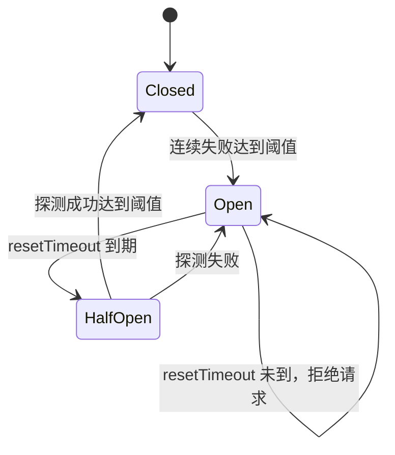

# 17-熔断降级设计与面试

这篇文档的目标不是背概念，而是让你能把 OpsCaption 项目里的熔断、降级、限流、缓存和 Agent 工具链说清楚。

面试官问“你们系统怎么做熔断”时，最容易踩坑的地方是把 AIOps 诊断系统说成“直接控制业务微服务流量”。OpsCaption 当前更准确的定位是：它不是业务网关，也不是服务网格，而是一个面向运维分析的 Agent 平台。它会调用 LLM、日志系统、Prometheus、RAG、Redis、MySQL 等外部依赖，所以熔断主要保护的是这些依赖调用，避免某个依赖异常拖垮整条问答链路。

---

## 1. 先建立正确口径

### 1.1 项目里“熔断”保护的是什么

OpsCaption 的主链路是：

```text
用户问题
  -> Chat / AIOps 入口
  -> ContextEngine 组装上下文
  -> Agent 判断是否需要工具
  -> 调用 LLM / 日志 / Prometheus / RAG / Redis / MySQL
  -> 汇总证据
  -> 返回 JSON 或 SSE
```

因此这里的熔断对象不是 checkout、payment、order 这些业务服务本身，而是 Agent 在分析过程中依赖的外部能力：

| 依赖 | 为什么需要熔断 | 熔断后的处理 |
|---|---|---|
| LLM | 模型超时、限流、网络错误会拖慢整条问答 | 返回可解释的降级响应，避免请求一直等待 |
| 日志查询工具 | 日志平台不可用或配置缺失时，Agent 容易卡在工具调用 | 返回结构化降级结果，让 Agent 继续用其他证据分析 |
| Prometheus | 指标系统慢查询或不可用会影响告警分析 | 返回降级结果，明确“指标证据缺失” |
| Milvus / RAG | 向量库不可用会导致知识检索失败 | 跳过 docs，并在 ContextTrace 标记 documents unavailable |
| Redis | 缓存、限流、kill switch 依赖 Redis | Redis 异常时不能影响主问答链路，走本地默认策略 |
| MySQL | 会话、任务、审计等持久化依赖 | 按场景降级或返回明确错误 |

一句面试回答：

> 我们的熔断不是直接替业务服务做流量治理，而是保护 Agent 链路里的外部依赖调用。比如 LLM、日志工具、Prometheus 和 RAG 检索异常时，系统会快速失败或降级，让 Agent 保留可用证据继续回答，而不是整条 SSE 请求被一个慢依赖拖死。

---

## 2. 当前项目已有能力

项目里已经有基础熔断和降级能力，但它更像“第一版保险丝”，还不是完整的生产级滑动窗口熔断器。

核心位置：

```text
utility/resilience/resilience.go
utility/resilience/semaphore.go
internal/ai/models/instrumented_chat_model.go
internal/ai/service/degradation.go
internal/controller/chat/response_helpers.go
utility/metrics/metrics.go
```

### 2.1 当前 CircuitBreaker 状态机

当前熔断器有三个状态：



状态含义：

| 状态 | 含义 | 请求怎么处理 |
|---|---|---|
| Closed | 下游正常 | 正常放行 |
| Open | 下游异常 | 直接拒绝，不再访问下游 |
| HalfOpen | 恢复探测 | 放少量请求探测下游是否恢复 |

当前实现的核心逻辑：

| 动作 | 当前行为 |
|---|---|
| 失败统计 | 连续失败计数 |
| 打开条件 | 连续失败次数达到阈值 |
| 恢复判断 | Open 持续一段时间后进入 HalfOpen |
| 探测成功 | HalfOpen 下成功次数达到阈值后关闭熔断 |
| 探测失败 | HalfOpen 下任意失败重新打开熔断 |

这版能解决最基本的问题：依赖持续失败时不反复打下游。

但它还不够“真正生产级”，因为它缺少：

| 缺口 | 影响 |
|---|---|
| 没有滑动窗口 | 不能按最近一段时间的错误率判断 |
| 没有最小请求数 | 低流量下容易因为少量失败误熔断 |
| 没有超时率 / 慢调用比例 | 只能看失败，不能识别“没失败但很慢” |
| 没有按依赖配置策略 | LLM、日志、Prometheus 的阈值应该不同 |
| 抖动控制较弱 | 依赖刚恢复时可能反复 Open / Closed |
| 降级原因没有完全结构化 | 前端和 Agent 不一定能解释“为什么降级” |

---

## 3. 真正的熔断策略应该怎么设计

我建议把项目里的熔断升级成“依赖级熔断器”，每个外部依赖有独立策略和独立状态。

```text
llm:chat:deepseek
tool:query_logs
tool:query_prometheus_alerts
rag:milvus
cache:redis
db:mysql
```

这样一个依赖异常不会影响其他依赖。例如日志平台不可用，不应该导致 Prometheus 告警查询和 RAG 知识检索也被拒绝。

---

## 4. 问题 1：通过哪些指标判断服务异常

建议用四类指标判断一个依赖是否异常。

### 4.1 错误率 failure rate

错误率表示最近窗口内失败请求占比。

```text
failure_rate = failed_requests / total_requests
```

典型失败包括：

| 类型 | 示例 |
|---|---|
| 网络错误 | connection refused、connection reset |
| HTTP 5xx | 日志系统或内部服务返回 500 |
| SDK 错误 | Milvus 查询失败 |
| LLM 错误 | 模型服务返回错误 |
| 工具执行失败 | query_logs 返回不可用 |

错误率适合判断“下游明确失败”。

### 4.2 超时率 timeout rate

超时率表示最近窗口内超时请求占比。

```text
timeout_rate = timeout_requests / total_requests
```

超时比普通错误更危险，因为它会占住 goroutine、连接和 SSE 请求时间。AIOps 场景里，日志和指标查询很容易出现慢查询，所以超时率应该是独立指标。

### 4.3 慢调用比例 slow call rate

有些依赖不会报错，但响应特别慢。比如 Prometheus 慢查询 8 秒才返回，LLM 首 token 等 30 秒，这类请求从业务上看也应该触发保护。

```text
slow_call_rate = slow_requests / total_requests
```

其中 slow request 由配置决定：

```yaml
resilience:
  policies:
    tool_query_logs:
      slow_call_threshold_ms: 8000
    rag_milvus:
      slow_call_threshold_ms: 5000
    llm:
      slow_call_threshold_ms: 30000
```

### 4.4 连续失败 consecutive failures

连续失败适合快速保护。

比如 query_logs 连续 5 次都返回 `mcp.log_url is not configured`，没必要等完整滑动窗口统计，应该快速打开熔断。

### 4.5 为什么要设置 min_requests

如果没有最小请求数，低流量场景会误判。

比如最近 1 分钟只有 1 次请求，这 1 次失败，错误率就是 100%。如果直接按错误率打开熔断，就会过于敏感。

所以需要：

```text
total_requests >= min_requests
```

满足最小请求数后，错误率、超时率、慢调用比例才参与熔断判断。

---

## 5. 问题 2：服务恢复正常时依据什么判断

服务恢复不能只看“时间到了”。时间到了只能说明可以试探，不代表真的恢复。

推荐恢复流程：

```text
Open
  -> 等待 open_duration
  -> HalfOpen
  -> 只放少量探测请求
  -> 连续成功达到阈值
  -> Closed
```

### 5.1 Open 到 HalfOpen

Open 状态下，不再访问下游。等一段时间后进入 HalfOpen。

```yaml
open_duration_ms: 30000
```

意思是：打开熔断后至少 30 秒内不打这个依赖。

### 5.2 HalfOpen 探测

HalfOpen 不是全量恢复，而是探测恢复。

建议配置：

```yaml
half_open_max_calls: 3
half_open_success_threshold: 2
```

含义：

| 配置 | 含义 |
|---|---|
| half_open_max_calls | HalfOpen 同时最多允许几个探测请求 |
| half_open_success_threshold | 成功几次后认为恢复 |

如果 HalfOpen 探测失败，立即回到 Open。

### 5.3 恢复标准

一个依赖可以恢复到 Closed，需要满足：

```text
HalfOpen 探测请求成功数 >= success_threshold
并且探测期间没有失败或超时
```

更严格一点可以加上：

```text
探测请求平均耗时 < slow_call_threshold_ms
```

这样可以避免“虽然成功了，但慢到不可用”的依赖被误判为恢复。

---

## 6. 问题 3：如何防止频繁切换造成抖动

抖动就是状态反复变化：

```text
Open -> HalfOpen -> Closed -> Open -> HalfOpen -> Closed
```

这通常发生在下游刚恢复但还不稳定的时候。

建议用四个办法控制。

### 6.1 最小打开时间

Open 后必须至少等待一段时间，不能马上恢复。

```yaml
open_duration_ms: 30000
```

### 6.2 指数退避

如果一个依赖反复熔断，下一次 Open 的持续时间应该变长。

```text
第 1 次 Open: 30s
第 2 次 Open: 60s
第 3 次 Open: 120s
最大不超过 300s
```

配置：

```yaml
open_duration_ms: 30000
max_open_duration_ms: 300000
```

### 6.3 HalfOpen 并发探测限制

HalfOpen 只允许少量请求通过，避免刚恢复就被打满。

```yaml
half_open_max_calls: 3
```

### 6.4 恢复阈值和熔断阈值分开

打开熔断可以相对敏感，恢复必须更保守。

例如：

```text
错误率 > 50% 触发 Open
HalfOpen 连续 2 次成功才恢复 Closed
```

这就是一种简单的 hysteresis。

---

## 7. 问题 4：熔断后流量如何处理

熔断后的策略不能一刀切。不同依赖要用不同兜底方式。

### 7.1 LLM 熔断

LLM 熔断后不能继续等模型。

可选策略：

| 场景 | 处理 |
|---|---|
| 有缓存答案 | 返回缓存，并标记 degraded |
| 没有缓存 | 返回友好的降级响应 |
| SSE 请求 | 发送 degraded message + done |

用户看到的不是 Go error，而是：

```text
AI 服务暂时不可用，请稍后重试。当前请求未继续调用模型，以避免长时间等待。
```

### 7.2 日志查询工具熔断

日志工具熔断后，Agent 不应该直接停止回答，而应该返回结构化工具结果：

```json
{
  "status": "degraded",
  "source": "query_logs",
  "reason": "circuit_open",
  "message": "日志查询工具暂时不可用，已跳过实时日志证据"
}
```

Agent 再继续使用 Prometheus、RAG、用户问题里的上下文生成回答。

面试时可以这样讲：

> 日志工具不可用时，我们不会把它包装成“没有日志异常”，而是明确标记为证据缺失。这样最终回答会说“实时日志证据暂不可用”，避免把工具失败误解释成业务正常。

### 7.3 Prometheus 熔断

Prometheus 熔断后返回：

```json
{
  "status": "degraded",
  "source": "query_prometheus_alerts",
  "reason": "circuit_open",
  "message": "指标和告警查询暂不可用"
}
```

重点是不能把“查询失败”说成“没有告警”。

### 7.4 RAG / Milvus 熔断

Milvus 熔断后，ContextEngine 可以继续组装 history、memory、tool outputs，但 docs 为空，并在 trace 里记录：

```text
documents unavailable: circuit_open
```

最终回答中要提示“知识库证据缺失”，而不是假装检索到了完整知识。

### 7.5 Redis 熔断

Redis 是治理能力的依赖，不能因为 Redis 挂了导致主链路挂掉。

处理策略：

| Redis 功能 | Redis 异常时 |
|---|---|
| 缓存 | cache miss，继续主流程 |
| 限流 | 使用本地保守策略 |
| kill switch | 使用 config 默认值 |
| token 审计 | 记录本地日志或指标，后续补偿 |

---

## 8. 推荐配置设计

新增配置应该走 `manifest/config/config.yaml`，不要硬编码。

建议结构：

```yaml
resilience:
  enabled: true
  default:
    window_ms: 60000
    bucket_count: 12
    min_requests: 20
    failure_rate_threshold: 0.5
    timeout_rate_threshold: 0.3
    slow_call_threshold_ms: 5000
    slow_call_rate_threshold: 0.6
    consecutive_failure_threshold: 5
    open_duration_ms: 30000
    max_open_duration_ms: 300000
    half_open_max_calls: 3
    half_open_success_threshold: 2

  policies:
    llm:
      min_requests: 10
      slow_call_threshold_ms: 30000
      failure_rate_threshold: 0.4

    tool_query_logs:
      min_requests: 5
      slow_call_threshold_ms: 8000
      failure_rate_threshold: 0.5
      timeout_rate_threshold: 0.4

    tool_query_prometheus_alerts:
      min_requests: 5
      slow_call_threshold_ms: 5000
      failure_rate_threshold: 0.5

    rag_milvus:
      min_requests: 5
      slow_call_threshold_ms: 5000
      failure_rate_threshold: 0.6

    redis:
      min_requests: 20
      slow_call_threshold_ms: 1000
      failure_rate_threshold: 0.8
```

配置设计要点：

| 配置 | 目的 |
|---|---|
| enabled | 支持灰度开关 |
| default | 避免每个依赖重复配置 |
| policies | 不同依赖单独调参 |
| window_ms / bucket_count | 控制滑动窗口粒度 |
| min_requests | 防低流量误判 |
| failure_rate_threshold | 判断错误率 |
| timeout_rate_threshold | 判断超时率 |
| slow_call_threshold_ms | 定义慢调用 |
| open_duration_ms | 熔断打开多久 |
| max_open_duration_ms | 指数退避上限 |
| half_open_* | 控制恢复探测 |

---

## 9. 推荐代码结构

建议把当前 `utility/resilience` 升级成更完整的依赖保护模块。

```text
utility/resilience/
  resilience.go       当前入口可以保留
  policy.go           Policy 配置结构和默认值
  sliding_window.go   滑动窗口统计
  breaker.go          状态机
  registry.go         按 name 管理 breaker
  outcome.go          成功/失败/超时/慢调用分类
```

### 9.1 调用接口

目标调用方式：

```go
result, err := resilience.Execute(ctx, resilience.CallOption{
    Name:    "tool:query_logs",
    Timeout: 8 * time.Second,
}, func(ctx context.Context) (string, error) {
    return queryLogs(ctx, req)
})
```

或者工具场景：

```go
toolResult, err := resilience.ExecuteTool(ctx, "tool:query_logs", func(ctx context.Context) (ToolResult, error) {
    return queryLogs(ctx, args)
})
```

工具被熔断时，不返回裸 error，而是返回结构化 degraded result。

### 9.2 Outcome 分类

每次调用结束后，要记录 outcome：

| Outcome | 含义 |
|---|---|
| success | 正常成功 |
| failure | 普通失败 |
| timeout | 超时 |
| slow_success | 成功但慢 |
| rejected | 熔断打开，被拒绝 |

注意：业务上的“没有查到结果”不一定是失败。

比如 Prometheus 返回 0 个活跃告警，如果请求成功，这应该算 success，而不是 failure。只有查询失败、超时、连接错误才算失败。

---

## 10. 可观测性设计

熔断一定要能被看见，否则线上只能靠猜。

建议暴露 Prometheus 指标：

```text
opscaptionai_circuit_breaker_state{name}
opscaptionai_circuit_breaker_requests_total{name,outcome}
opscaptionai_circuit_breaker_rejected_total{name}
opscaptionai_circuit_breaker_open_total{name,reason}
opscaptionai_dependency_duration_seconds{name}
```

状态值：

```text
Closed = 0
Open = 1
HalfOpen = 2
```

同时在 SSE / ContextTrace 中记录：

```json
{
  "event": "tool_call_end",
  "name": "query_logs",
  "status": "degraded",
  "reason": "circuit_open"
}
```

这样前端执行过程可以解释：

```text
检索日志特征：跳过，日志工具处于熔断状态
检索告警状态：成功，发现 2 条活跃告警
检索知识库：降级，Milvus 暂不可用
```

---

## 11. 和限流、重试、降级的关系

这四个概念要分清。

| 能力 | 解决什么问题 | 项目里的例子 |
|---|---|---|
| 限流 | 防止请求过多 | LLM 并发槽位、token 审计 |
| 超时 | 防止单次调用等太久 | LLM/tool/query timeout |
| 重试 | 处理短暂抖动 | LLM Generate 短重试 |
| 熔断 | 下游持续异常时快速失败 | LLM / logs / RAG breaker |
| 降级 | 熔断或失败后给可用兜底 | 返回 degraded result，继续用其他证据 |

一句话：

> 限流保护自己，超时保护单次请求，重试处理偶发失败，熔断避免持续打坏依赖，降级保证用户还能拿到可解释结果。

---

## 12. 以 checkout timeout 日志为例

用户问：

```text
请分析 checkout path 最近的 timeout 日志
```

理想链路：

```text
1. Agent 识别这是日志/故障分析类问题
2. ContextEngine 装配 history / memory / docs
3. Agent 调用 query_logs
4. query_logs 被熔断或不可用
5. 工具返回 degraded result，而不是抛出不可解释错误
6. Agent 继续调用 query_prometheus_alerts
7. Agent 检索内部 docs / case
8. 最终回答明确说明：
   - 实时日志证据不可用
   - 当前可用证据来自告警 / 指标 / 知识库 / 用户上下文
   - 给出下一步排查建议
```

错误回答：

```text
没有发现 checkout timeout 日志。
```

为什么错：

```text
工具不可用不等于没有日志。
```

正确回答：

```text
我无法获取实时日志证据，因为日志查询工具当前不可用。
但我检查了当前告警和已有知识库，没有发现与 checkout timeout 直接匹配的证据。
建议优先确认日志系统配置和 checkout 服务的 timeout 指标，再结合请求延迟、错误率、依赖服务状态继续排查。
```

---

## 13. 分阶段落地方案

### P0：升级熔断器核心

目标：把连续失败熔断升级为滑动窗口熔断。

要做：

```text
1. 增加 Policy 配置结构
2. 增加滑动窗口 bucket
3. 统计 total / failure / timeout / slow
4. 支持 min_requests
5. 支持 failure_rate / timeout_rate / slow_call_rate
6. 支持 HalfOpen 探测并发限制
7. 支持指数退避
```

验收：

```text
go test ./utility/resilience/...
```

重点测试：

```text
错误率达到阈值 -> Open
请求数不足 min_requests -> 不 Open
Open 未到时间 -> reject
Open 到期 -> HalfOpen
HalfOpen 成功达到阈值 -> Closed
HalfOpen 失败 -> Open
反复 Open -> open duration 增长
```

### P1：接入关键依赖

优先接入：

```text
1. LLM Generate / Stream
2. query_logs
3. query_prometheus_alerts
4. query_internal_docs / Milvus
```

注意：

```text
Stream 不能简单套普通 Execute timeout，因为流式连接生命周期更长。
可以在“创建 stream”阶段做熔断和超时，读取阶段记录 read error / duration。
```

### P2：前端和可观测性闭环

要做：

```text
1. SSE 事件展示 degraded reason
2. ContextTrace 展示 dependency unavailable
3. Prometheus 暴露 breaker state 和 rejected count
4. 增加只读 admin 接口查看 breaker 状态
5. 增加 replay case 验证真实链路
```

---

## 14. 面试题扩展

### Q1：你们项目为什么需要熔断？

回答要点：

```text
OpsCaption 的问答链路依赖 LLM、日志系统、Prometheus、RAG 和缓存等多个外部组件。
如果某个依赖异常，直接等待会拖慢 SSE 响应，也可能造成 goroutine、连接和模型调用资源堆积。
所以我们在依赖调用层做熔断，异常时快速失败或返回结构化降级结果，让 Agent 可以继续基于其他可用证据回答。
```

### Q2：你们熔断的是业务微服务吗？

回答要点：

```text
不是直接熔断业务微服务流量。
这个项目是 AIOps Agent 平台，不在业务网关层转发 checkout/payment 的用户流量。
我们熔断的是 Agent 分析链路里的外部依赖，比如 LLM、日志查询、Prometheus、Milvus。
业务服务异常由 Agent 通过日志、指标和知识库证据进行诊断。
```

### Q3：通过哪些指标判断依赖异常？

回答要点：

```text
主要看错误率、超时率、慢调用比例和连续失败次数。
错误率适合判断明确失败，超时率适合识别长时间无响应，慢调用比例用于识别成功但不可用的依赖。
同时设置 min_requests，避免低流量下一两次失败就误触发熔断。
```

### Q4：为什么只看连续失败不够？

回答要点：

```text
连续失败实现简单，适合快速保护，但不够稳定。
比如 100 次请求里穿插 60 次失败，可能没有连续达到阈值，但整体已经不可用。
所以生产级熔断更适合使用滑动窗口统计错误率、超时率和慢调用比例。
```

### Q5：服务恢复正常后怎么关闭熔断？

回答要点：

```text
Open 状态不会立刻恢复。
先等待 open duration，然后进入 HalfOpen，只放少量探测请求。
如果探测请求连续成功并且耗时正常，再切回 Closed。
如果 HalfOpen 中出现失败或超时，立即回到 Open。
```

### Q6：如何避免熔断状态频繁抖动？

回答要点：

```text
一是设置最小 Open 时间；
二是 HalfOpen 限制探测并发；
三是恢复阈值比打开阈值更保守；
四是反复熔断时使用指数退避，逐步延长 Open 时间。
```

### Q7：熔断后请求怎么处理？

回答要点：

```text
不同依赖有不同降级策略。
LLM 熔断时返回降级响应或缓存结果；
日志工具熔断时返回结构化 degraded tool result，让 Agent 继续查 Prometheus 和知识库；
RAG 熔断时跳过 docs，但保留 history、memory 和工具结果；
Redis 异常时缓存视为 miss，不能阻断主链路。
```

### Q8：为什么工具不可用不能回答“没有异常”？

回答要点：

```text
工具不可用代表证据缺失，不代表系统正常。
比如 query_logs 失败时，只能说实时日志证据不可用，不能说没有 timeout 日志。
所以工具结果里要区分 empty result 和 degraded result。
```

### Q9：熔断和降级有什么区别？

回答要点：

```text
熔断是决策：判断这个依赖现在不能继续打。
降级是结果：熔断后用什么方式给用户一个可接受的响应。
例如 query_logs 被熔断是熔断，返回“日志证据暂不可用，继续使用告警和知识库分析”是降级。
```

### Q10：熔断和限流有什么区别？

回答要点：

```text
限流通常是保护自己，防止流量或并发超过系统承载能力。
熔断主要是保护下游依赖和当前链路，当下游持续异常时快速失败。
OpsCaption 里 LLM 并发槽位属于限流，LLM 服务持续超时后打开 breaker 属于熔断。
```

### Q11：熔断和重试如何配合？

回答要点：

```text
先做超时，再做有限重试，最后记录结果给熔断器。
重试次数不能太多，否则会放大下游压力。
如果 breaker 已经 Open，就不应该继续重试，而是直接走降级。
```

### Q12：LLM 流式请求为什么不能简单套普通 timeout？

回答要点：

```text
流式请求分两个阶段：创建 stream 和持续读取 stream。
创建 stream 可以做超时和熔断，因为这是建立连接阶段。
但读取阶段可能持续较久，不能用普通一次性 timeout 包住整个生成过程，否则长回答会被误杀。
读取阶段更适合记录首 token 延迟、总耗时和 read error，用于指标和后续熔断判断。
```

### Q13：如果 Prometheus 查询成功但没有告警，算失败吗？

回答要点：

```text
不算。
请求成功且返回空结果是正常业务结果，应该记录 success。
只有连接失败、查询错误、超时、返回不可解析等才算 failure 或 timeout。
```

### Q14：如何验证熔断策略真的生效？

回答要点：

```text
单测覆盖状态机和滑动窗口；
replay case 覆盖真实 Agent 链路；
故障注入模拟 query_logs 超时、Prometheus 500、Milvus 不可用；
观察 Prometheus 指标和 SSE 事件是否出现 circuit_open / degraded；
确认最终回答能解释证据缺失，而不是胡编。
```

### Q15：线上看到 breaker open，你会怎么排查？

回答要点：

```text
先看 breaker name，确认是 LLM、query_logs、Prometheus 还是 RAG；
再看最近的 failure_rate、timeout_rate、slow_call_rate 和 rejected count；
然后看对应依赖日志和网络连通性；
如果是配置缺失，比如日志 URL 未配置，应该修配置而不是盲目调高阈值；
最后观察 HalfOpen 探测是否恢复。
```

### Q16：你会如何把这个能力讲成项目亮点？

回答要点：

```text
我没有只把 Agent 做成一个串行调用工具的链路，而是把外部依赖都当成不稳定资源处理。
通过超时、重试、熔断、降级和可观测性，把 LLM、日志、指标、RAG 的失败控制在局部。
这样即使日志工具不可用，Agent 也能基于告警和知识库继续给出可解释结论，并明确标注证据缺失。
```

### Q17：这个熔断策略和 Sentinel / Hystrix 有什么关系？

回答要点：

```text
思想类似，都是 Closed / Open / HalfOpen 状态机，加错误率、慢调用比例和降级策略。
区别是本项目没有引入完整治理框架，而是在 Go 服务内部实现轻量依赖级熔断。
这样更贴合 Agent 工具调用场景，也便于把 degraded reason 写入 ContextTrace 和 SSE 事件。
```

### Q18：什么时候应该直接失败，什么时候应该兜底？

回答要点：

```text
如果这个依赖是非核心证据来源，比如日志、RAG、部分指标，可以返回 degraded result，让 Agent 继续使用其他证据。
如果这个依赖是生成最终回答必须依赖的 LLM，而且没有缓存，就只能返回降级提示。
判断标准是：缺少这个依赖后，系统还能不能给出不误导用户的结果。
```

### Q19：如果 Redis 挂了，kill switch 查不到怎么办？

回答要点：

```text
Redis 是治理依赖，不能让它阻断主流程。
Redis 查询失败时，kill switch 使用 config 默认值，缓存视为 miss，限流使用本地保守策略。
同时记录 degraded metric，便于后续排查 Redis 可用性。
```

### Q20：如果下游正在恢复，为什么不能马上放全量？

回答要点：

```text
下游刚恢复时最容易再次被流量打垮。
HalfOpen 的意义就是只放少量探测请求，确认稳定后再恢复全量。
如果探测失败，说明恢复不稳定，要重新 Open 并延长等待时间。
```

---

## 15. 一段完整面试表达

可以这样说：

```text
我们项目里做熔断主要是为了保护 Agent 链路中的外部依赖，比如 LLM、日志查询、Prometheus 和 Milvus。
因为 AIOps 问答通常会串联多个工具，只要一个依赖超时，就可能拖慢整条 SSE 链路。

当前项目已有基础 CircuitBreaker，支持 Closed、Open、HalfOpen 三态，连续失败达到阈值后打开，等待 reset timeout 后进入 HalfOpen，探测成功后恢复。
后续我会把它升级成滑动窗口策略：按最近 60 秒统计错误率、超时率、慢调用比例和连续失败数，同时设置 min_requests 防止低流量误判。

恢复时不会直接放全量，而是 HalfOpen 只放少量探测请求。探测成功达到阈值后才关闭熔断；如果失败，重新 Open，并通过指数退避延长下一次探测时间，避免频繁抖动。

熔断后的处理不是统一报错。比如日志工具熔断时，会返回结构化 degraded result，Agent 会继续使用 Prometheus 和知识库证据，并在最终回答里说明实时日志证据缺失；LLM 熔断时，如果有缓存就返回缓存，否则返回友好的降级提示。这样可以保证系统在依赖异常时仍然可解释、可观测、可恢复。
```

---

## 16. 你应该怎么学这块代码

按下面顺序看，不要一上来就陷进所有细节。

### 第一步：先看状态机

看：

```text
utility/resilience/resilience.go
```

你只需要先回答四个问题：

```text
1. Closed 什么时候变 Open？
2. Open 什么时候变 HalfOpen？
3. HalfOpen 什么时候变 Closed？
4. HalfOpen 失败后会怎样？
```

能画出这张图，就说明状态机已经懂了。

### 第二步：看 LLM 如何接入

看：

```text
internal/ai/models/instrumented_chat_model.go
```

重点看两条链路：

```text
Generate: token audit -> 并发槽位 -> resilience.Execute -> metrics
Stream: token audit -> 并发槽位 -> breaker.Allow -> 创建 stream -> metrics
```

这里要理解一个关键点：

```text
非流式请求可以用 Execute 包 timeout / retry / breaker。
流式请求不能简单这么包，因为 stream 创建成功后还要持续读取。
```

### 第三步：看降级如何给用户

看：

```text
internal/ai/service/degradation.go
internal/controller/chat/response_helpers.go
```

你要分清两类降级：

```text
1. 全局 kill switch：直接让 chat/chat_stream 返回降级消息。
2. 依赖级降级：某个工具或依赖不可用，但主链路继续。
```

### 第四步：看指标如何暴露

看：

```text
utility/metrics/metrics.go
```

重点找：

```text
opscaptionai_llm_calls_total
opscaptionai_llm_call_duration_seconds
opscaptionai_circuit_breaker_state
```

面试里你只需要能说清楚：

```text
我们不仅做了熔断决策，还把状态和调用结果暴露给 Prometheus，方便排查哪个依赖正在熔断。
```

### 第五步：用一个真实问题串起来

用这个问题练习：

```text
请分析 checkout path 最近的 timeout 日志
```

你要能说出：

```text
1. Agent 会尝试调用 query_logs。
2. 如果 query_logs 不可用，工具应该返回 degraded result。
3. Agent 不应该说“没有 timeout 日志”，而应该说“实时日志证据不可用”。
4. 然后继续使用 Prometheus 告警、RAG 知识库、历史上下文做辅助分析。
5. 最终回答要把证据来源和缺失证据讲清楚。
```

---

## 17. 最终设计结论

真正适合 OpsCaption 的熔断策略，不是“给所有请求套一个 breaker”，而是：

```text
依赖级熔断
+ 滑动窗口统计
+ 错误率 / 超时率 / 慢调用比例
+ HalfOpen 探测恢复
+ 指数退避防抖
+ 结构化降级结果
+ Prometheus / SSE / ContextTrace 可观测
```

这套设计和 Agent 项目是融合的：

```text
传统后端关注服务稳定性；
Agent 系统还要关注证据可信度。
```

所以熔断后的重点不是“随便返回一个兜底答案”，而是告诉用户：

```text
哪些证据拿到了；
哪些证据因为依赖异常没拿到；
当前结论基于什么；
下一步应该怎么补证据。
```

这就是你这个项目里熔断设计最有价值的地方。
