# OpsCaptain RAG 全链路与面试手册

> 适用场景：校招或初级社招的后端、AI 应用、Agent、RAG 项目面试。
>
> 事实口径：以当前仓库代码、OpenSpec 记录和 Development 离线报告为准。
> 证据边界：本文中的效果数字均为本地 Development 离线评测，不代表线上或生产收益。

## 0. 先背这三段

### 0.1 30 秒版本

OpsCaptain 是面向 AIOps 的智能运维助手。我在项目里实现了一套可评测的 Hybrid RAG：离线侧先按 Markdown 结构切分，超长段再做语义切分，向量写入 Milvus，同时构建本地 BM25 索引；在线侧并行执行 Dense 和 BM25 召回，用 RRF 融合，再结合元数据和显式查询意图做有界精排，最终结果经过 ContextEngine 的 token budget 裁剪后交给 Agent。为了避免只看最终 Recall，我还增加了 Dense、Lexical、Fusion、Candidate、Final 五阶段诊断，能定位相关文档具体在哪一层丢失。

### 0.2 90 秒版本

这个 RAG 主要解决两个问题：一是通用大模型不知道内部 SOP、Runbook 和故障复盘；二是 AIOps 查询既有自然语言语义，也包含服务名、指标名、错误码这类精确实体，单纯向量检索不够稳定。

离线阶段使用 Eino Pipeline。文档加载时合并 sidecar metadata，并从 Markdown 提取 document ID、title、provider、tags 等字段；先按标题层级切分，超过 800 字符的块再用 embedding 做语义切分，然后写入 Milvus。索引完成后重建 BM25，使 Dense 与 Lexical 使用同一批知识源。

在线阶段由 `rag.Query` 统一编排。Milvus Dense 和内存 BM25 并行召回，各取 Top50；因为两种分数不在同一量纲，我没有直接加权原始分数，而是使用 RRF 按排名融合。融合结果再做轻量元数据精排，保留 CandidateTop20，最终返回 Top5。Query Rewrite、LLM Rerank、覆盖度选择和显式意图精排都是可配置能力，默认关闭或按实验结论控制，失败时尽量保留原结果而不是让整个 Agent 崩溃。

评测上，项目构建了 60 条 Development 数据，覆盖精确实体、语义改写、多文档、跨语言和 hard-negative。最新候选 MRR 从 0.7125 提升到 0.7181，Recall@5 保持 0.8056，全部非回归 Gate 通过。但这只是 Development 离线证据，生产默认仍然关闭意图精排，下一步需要新的独立 holdout 验证。

### 0.3 一句话亮点

我没有把 RAG 优化理解成“继续堆 LLM”，而是把问题拆成索引质量、双路召回、融合排序、上下文预算和分阶段评测，并用可观测数据定位瓶颈。

---

## 1. 项目里的 RAG 到底负责什么

RAG 是 Retrieval-Augmented Generation，即检索增强生成。它不是让模型凭参数记忆回答，而是在回答前从受控知识库取回证据，把证据注入模型上下文。

在 OpsCaptain 中要严格区分两层：

- RAG 层：文档加载、切分、索引、召回、融合、精排、TopK、引用和 trace。
- Agent / 模型层：决定何时查询知识库，结合 metrics、logs、CMDB、RAG 证据推理并生成答案。

所以面试时不要说“RAG 自己生成了答案”。更准确的说法是：

> RAG 负责把与问题相关的内部知识变成结构化证据，上层 ReAct、Plan 或 GoS 再基于这些证据生成诊断结论。

### 1.1 两个消费入口

RAG 当前有两个主要消费方式：

1. ContextEngine 主动检索文档
   - `selectDocuments` 调用 `rag.Query`。
   - 对文档做压缩、token 估算和 DocumentTokens 预算裁剪。
   - 选中的内容以 `[ctx-doc-n]` 形式注入上下文。

2. Agent 动态调用知识库工具
   - `query_internal_docs` 是 AlwaysOn 工具。
   - 工具调用 `rag.Query`，返回 `citations` 和 `evidence`。
   - 知识 Skill 会按 rollback、release SOP、错误码、通用故障指引等场景构造查询。

RAG 不参与统一入口的路由判断，Memory 也不能替代原始 query 做 routing。RAG 是执行阶段的知识能力。

---

## 2. 总体架构

```mermaid
flowchart TB
    subgraph Offline["离线索引链路"]
        A["Markdown / 文档"] --> B["FileLoader"]
        A2["metadata sidecar"] --> B
        B --> C["Markdown 标题切分"]
        C --> D{"块长度 > 800 字符?"}
        D -->|是| E["Embedding 语义切分"]
        D -->|否| F["保留结构块"]
        E --> G["Milvus Indexer"]
        F --> G
        B --> H["BM25 全量重建"]
    end

    subgraph Online["在线检索链路"]
        Q["原始 Query"] --> R["可选 Rewrite"]
        R --> P["RetrieverPool"]
        P --> DENSE["Dense / Milvus Top50"]
        R --> LEX["Lexical / BM25 Top50"]
        DENSE --> RRF["Weighted RRF"]
        LEX --> RRF
        RRF --> REFINE["元数据 + 可选意图精排"]
        REFINE --> CAND["Candidate Top20"]
        CAND --> RR["可选 LLM Rerank"]
        RR --> FINAL["Final Top5"]
        FINAL --> TRACE["Citation + 五阶段 Trace"]
        TRACE --> CTX["ContextEngine Token Budget"]
        CTX --> AGENT["ReAct / Plan / GoS"]
    end
```



### 2.1 关键代码位置

| 能力 | 代码入口 | 能证明什么 |
|---|---|---|
| 依赖组装 | `main.go` | BM25 启动同步、Milvus Indexer/Retriever 注入 |
| 索引服务 | `internal/ai/rag/indexing_service.go` | 文档索引、旧 chunk 清理、BM25 同步 |
| 索引 Pipeline | `internal/ai/agent/knowledge_index_pipeline/orchestration.go` | Loader → Transformer → Milvus Indexer |
| 两阶段切分 | `internal/ai/agent/knowledge_index_pipeline/transformer.go` | 标题切分 + 超长块语义切分 |
| metadata | `internal/ai/loader/loader.go`、`markdown_metadata.go` | sidecar 合并和 Markdown 字段提取 |
| 在线入口 | `internal/ai/rag/query.go` | Rewrite、Hybrid、Rerank、Final 的编排 |
| Hybrid | `internal/ai/rag/hybrid.go` | Dense/BM25 并行、RRF、阶段 trace |
| BM25 | `internal/ai/rag/bm25.go` | 中英文分词、正文与字段 BM25 |
| 轻量精排 | `internal/ai/rag/retrieve_refine.go` | 元数据、词项、覆盖度排序 |
| 意图精排 | `internal/ai/rag/query_intent.go` | 对比意图解析和有界加减分 |
| 引用证据 | `internal/ai/rag/citation.go` | citation、evidence、逐文档 trace |
| 上下文预算 | `internal/ai/contextengine/documents.go` | 文档压缩、裁剪和 token budget |
| 评测执行 | `internal/ai/rag/eval/online.go` | Recall、MRR、延迟、失败率统计 |
| 阶段诊断 | `internal/ai/rag/eval/stage_diagnostics.go` | 文档在哪个阶段丢失 |
| 报告与 Gate | `internal/ai/cmd/rag_online_eval_cmd/report.go` | 可比性校验和非回归门禁 |

---

## 3. 离线索引链路

### 3.1 文档加载与 metadata 合并

`NewFileLoader` 在 Eino FileLoader 外包了一层 `metadataSidecarLoader`：

1. 加载原始文档。
2. 查找同名 `.metadata.json` sidecar。
3. 把 sidecar 字段合并进 `Document.MetaData`。
4. 如果是 Markdown，再解析文档自身字段。

Markdown 会提取：

- `knowledge_doc_id`：默认取文件名去扩展名。
- `title`：优先取第一个一级标题。
- `provider`：从列表字段读取。
- `tags`：逗号分隔并结构化保存。
- `source_uri` 和 `_source`：用于来源追踪、权限隔离和旧版本清理。

这一步很重要，因为元数据不只是展示信息，它会同时影响：

- BM25 字段召回；
- 本地 metadata-aware refine；
- canonical document ID；
- citation 来源；
- 用户知识范围隔离；
- 离线评测标签匹配。

### 3.2 为什么采用两阶段 Chunking

第一阶段按 Markdown 标题切分：

- `#` → title
- `##` → subtitle
- `###` → section
- `####` → subsection

运维文档天然是结构化的，例如“现象、影响、排查、恢复、验证”。优先保留标题边界，比固定字符切块更容易维持语义完整性。

第二阶段只处理超过 800 字符的大块：

- 使用 Doubao Embedding 计算语义边界；
- `BufferSize = 1`；
- `MinChunkSize = 50`；
- `Percentile = 0.85`；
- 支持中英文句号、问号、感叹号、分号和换行分隔。

如果第二阶段语义切分失败，代码会退回第一阶段的标题块，不会让一次增强失败破坏整个索引结果。

### 3.3 为什么不是固定 chunk size

固定长度简单，但会出现两个问题：

- 一个排障步骤可能被从中间切断；
- 不同章节被拼进同一个 chunk，embedding 表达被稀释。

当前方案先利用人工文档结构，再只对超长块支付语义切分成本，是准确性、成本和可维护性的折中。

### 3.4 写入 Milvus

索引 Pipeline 是：

```text
START → FileLoader → MarkdownSplitter → MilvusIndexer → END
```

`main.go` 负责把基础设施层的 Milvus Client、Collection 和 Fields 注入 Domain Pipeline，避免 `internal/ai/rag` 直接依赖 Milvus SDK。

这体现了一个工程设计：RAG 依赖 Retriever/Indexer 接口，基础设施实现由启动入口组装。这样单元测试可以注入 fake retriever，也能通过 import guard 防止领域层继续耦合基础设施。

### 3.5 文档更新与旧 chunk 清理

`IndexSource` 的顺序是：

1. 加载文档并解析 source；
2. 执行新索引 Pipeline，得到新的 chunk IDs；
3. 删除同一 source 下、不属于新 IDs 的旧 chunk；
4. 同步重建 BM25。

这里不是“先全部删掉再写入”，而是先拿到新 IDs，再执行 `DeleteBySourceExcept`。这样能够清理旧版本，同时保留本次刚写入的 chunk。

### 3.6 BM25 索引如何同步

BM25 当前是进程内索引。索引完成后会扫描知识文件目录，跳过 metadata sidecar 和 quarantine 目录，对全部文档重新加载并原子替换共享 BM25 实例。

优点：

- 实现简单；
- 当前小规模知识库下足够稳定；
- 删除和更新不会留下复杂的增量状态。

局限：

- 文档量大时全量重建成本会上升；
- 多实例部署要求共享 `file_dir`，每个 Pod 各自重建；
- BM25 状态不是跨实例集中式服务。

这是下一阶段可以演进为持久化倒排索引或 OpenSearch 的位置，但当前代码不能宣称已经实现。

---

## 4. 在线检索链路

### 4.1 统一入口 `rag.Query`

`Query` 的实际步骤：

1. 空 query 直接返回空结果。
2. 读取 Rewrite/Rerank 开关。
3. 可选执行 Query Rewrite。
4. 从 RetrieverPool 获取 Milvus Retriever。
5. 获取共享 BM25 索引和 Hybrid 配置。
6. 调用 Hybrid Retrieval。
7. 可选执行 LLM Rerank。
8. 执行 FinalTopK 或覆盖度选择。
9. 写入 Final 阶段 ID 和 QueryTrace。

当前默认配置：

```yaml
retriever:
  top_k: 5

rag:
  rewrite_enabled: false
  rerank_enabled: false
  hybrid_dense_top_k: 50
  hybrid_lexical_top_k: 50
  hybrid_fusion_k: 60
  hybrid_dense_weight: 1.0
  hybrid_lexical_weight: 1.0
  hybrid_candidate_top_k: 20
  hybrid_final_top_k: 5
  hybrid_metadata_boost_enabled: true
  knowledge_field_boost_enabled: false
  coverage_enabled: false
  intent_refinement_enabled: false
```

配置文件可能由环境变量覆盖；面试时讲默认策略即可，不要背部署密钥或地址。

### 4.2 RetrieverPool 为什么必要

Milvus Retriever 初始化涉及 Client、Collection 和配置。如果每次 query 都重新初始化，会产生重复连接和额外延迟。

RetrieverPool 做了两类缓存：

- 成功缓存：相同 cache key 复用 Retriever。
- 失败短缓存：初始化失败后，在 TTL 内直接复用最近错误，避免依赖不可用时每个请求都触发初始化风暴。

默认共享失败 TTL 是 15 秒。QueryTrace 会记录：

- `cache_key`
- `cache_hit`
- `init_failure_cached`
- `init_latency_ms`

面试中的价值不是“用了一个单例”，而是把外部依赖初始化做成可观测、可恢复的复用机制。

### 4.3 Dense Retrieval

Dense 通道使用 Milvus Retriever：

- query 通过 embedding 转为向量；
- 在 Milvus 中执行相似度检索；
- 默认召回 Top50。

优势：能处理语义改写。例如“应用升级失败后怎样退回之前的 chart 状态”即使没有直接出现 `helm rollback`，也有机会召回相关文档。

不足：对错误码、service 名、metric 名等精确实体不一定稳定。

### 4.4 Lexical Retrieval：BM25

BM25 通道对正文和 metadata 字段分开统计。核心思想是：词在当前文档中越重要、在全库越稀有，分数越高；同时对长文档做长度归一化。

简化公式：

```text
BM25(q, d) = Σ IDF(t) × TFNorm(t, d)

IDF(t) = log(1 + (N - df(t) + 0.5) / (df(t) + 0.5))

TFNorm = tf × (k1 + 1) / (tf + k1 × (1 - b + b × dl / avgdl))
```

当前参数：

- `k1 = 1.2`
- `b = 0.75`

中文分词采用单字加相邻双字，英文和数字按连续 token 保留。它不是完整中文分词器，但无需引入额外服务，能覆盖很多运维实体和混合查询。

字段增强支持：

- `knowledge_doc_id`
- `title`
- `tags`
- `provider`

字段增强目前默认关闭，因为它是 Development 评测中的候选能力，尚未通过新一代独立 holdout 决定生产默认值。

### 4.5 为什么 Dense 和 BM25 要并行

两路召回彼此独立，串行执行会把耗时直接相加。`HybridRetrieveWithRetriever` 用两个有缓冲 channel 并行发起 Dense 和 Lexical 查询，等待两路结果后再融合。

这样总召回耗时更接近较慢的一路，而不是两路之和。代码也分别记录 Dense、Lexical 和 Fusion latency，便于发现瓶颈。

### 4.6 用户知识范围隔离

Dense 和 BM25 结果在融合前都会经过 source scope 过滤：

- 允许当前用户自己的知识前缀；
- 允许共享知识；
- 拒绝其他用户的 `users/` 前缀文档。

两路都过滤非常重要。如果只过滤向量通道而忘记 BM25，融合后仍可能泄露其他用户文档。

---

## 5. RRF 融合

### 5.1 为什么不直接相加 Dense Score 和 BM25 Score

Dense 相似度和 BM25 分数的分布、范围和含义不同。直接相加需要持续校准，很容易因为一个通道数值更大而吞掉另一路。

RRF 只使用排名：

```text
RRF(doc) = wd / (k + rank_dense) + wl / (k + rank_lexical)
```

当前默认：

- `k = 60`
- `wd = 1`
- `wl = 1`

如果文档只在一路出现，就只有一路贡献；两路都出现则累加。RRF 的优势是简单、稳定、无需归一化异构分数。

### 5.2 文档去重身份

融合需要稳定的 document key。当前优先使用：

- `case_id`
- `caseid`
- `doc_id`
- 最后退回 chunk `doc.ID`

评测 trace 使用更完整的 canonical ID，还会读取 `knowledge_doc_id` 或 source 文件名。这里要区分：

- Fusion key 的目标是避免把不同 chunk 错误合并；
- Eval canonical ID 的目标是把检索结果与文档级标签匹配。

### 5.3 Fusion Trace

每个文档会保存：

- Dense Rank
- Lexical Rank
- Fusion Score
- Fusion Position

整个 HybridTrace 还保存 Dense-only、Lexical-only 和 Both 的数量，便于判断两路通道的互补程度。

---

## 6. 融合后的轻量精排

### 6.1 基础 metadata-aware refine

融合之后不会立即裁成 FinalTopK，而是先对候选做本地确定性评分。评分保留原有排名作为基础，同时加入：

- 正文 token overlap；
- metric names overlap；
- trace operation/service overlap；
- service、pod、node、namespace token overlap；
- service、instance type、source、destination 精确命中；
- 可选的 document ID、title、tags、provider 字段增强。

这层不调用 LLM，延迟和行为都更可控。

### 6.2 显式查询意图精排

hard-negative 查询常包含“我要 A，不要 B”。如果把整句话交给普通 BM25，A 和 B 都是正向词项，干扰文档可能反而排得很高。

当前实现只解析明确对比结构：

- `A，而不是 B`
- `只想看 A，不需要 B`
- `只查 A，不执行 B`
- `A instead of B`

解析结果：

```text
QueryIntent {
  PositiveTerms
  ExcludedTerms
  Rule
  ContrastClause
}
```

安全边界：

- 任一侧为空时放弃解析；
- 双重否定或两侧仍包含连接词时放弃解析；
- 正负两侧共享 token 会被移除；
- 最大意图词项数可配置；
- 只读取原始 query，不读取 Memory、category、relevant IDs 或 distractor IDs。

评分规则：

- 命中正向词项：获得不超过 `intent_positive_bonus` 的加分；
- 只命中排除词且没有正向命中：施加不超过 `intent_excluded_penalty` 的惩罚；
- 同时命中正向和排除词：保留文档，不施加排除 penalty；
- 永远不硬过滤候选。

为什么不硬过滤？综合 SOP 可能同时解释目标概念和对比概念，硬删会伤害多文档召回。这里选择有界 soft signal，并通过非回归 Gate 约束风险。

当前生产默认：`intent_refinement_enabled: false`。

### 6.3 CandidateTopK 与 FinalTopK

当前先保留 CandidateTop20，再输出 FinalTop5。这样做有三个好处：

- 可选 Rerank 有足够候选；
- 能诊断是召回失败还是 Final 预算裁剪；
- 不把过多文档直接塞进模型上下文。

### 6.4 可选 LLM Rerank

Rerank 会截取候选文档标题和前 100 个字符，调用快速模型输出逐文档分数，再稳定排序。

保护机制：

- 独立超时；
- 模型初始化失败则保留原文档；
- 调用失败则降级；
- 分数格式错误则降级；
- 只有结果合法才标记 Enabled。

默认关闭的原因不是“LLM Rerank 没用”，而是当前离线实验没有证明它值得承担额外延迟和不稳定性。

### 6.5 可选 Coverage Selection

Coverage 模式在 FinalTopK 内尝试选择能覆盖更多 query token 的文档，并限制最多向后移动的位置，避免为了多样性破坏主排序。

它同样默认关闭，因为多样性提升不能替代可比评测。

---

## 7. ContextEngine：检索到不等于全部塞给模型

RAG 返回 TopK 后，还要经过 ContextEngine 的文档预算：

1. 根据 profile 判断是否允许文档。
2. 给 RAG query 设置独立超时。
3. 把 Document 转成 ContextItem。
4. 可选做上下文压缩。
5. 估算 token。
6. 超预算时裁剪当前文档或丢弃后续文档。
7. 记录 `document_budget`、压缩方式、使用 token 和 dropped items。

为什么需要两层 TopK + token budget？

- TopK 控制“文档数量”；
- token budget 控制“真实上下文体积”；
- 同样是 5 篇文档，长度可能相差十倍；
- 模型还需要为 system prompt、history、memory、tool results 和回答预留空间。

面试中可以强调：

> 检索质量不只是把正确文档排进 TopK，还要保证它在上下文预算内真正进入模型，否则离线检索命中了，线上生成仍然看不到。

---

## 8. Citation、Evidence 与防幻觉

`query_internal_docs` 不返回一段不可解释的文本，而是返回：

- `Citations`：ID、来源、标题、分数、摘要、排序 trace；
- `Evidence`：citation ID 与具体证据文本的绑定；
- `Success/Degraded/Error`：明确工具状态。

逐文档 CitationTrace 支持：

- Dense/Lexical Rank；
- Fusion Score/Position；
- Refine/Final Position；
- Metadata/Field/Coverage Boost；
- Intent Rule；
- Positive/Excluded Hits；
- Intent Bonus/Penalty/Net Score。

如果知识库不可用，工具返回结构化 degraded payload，要求上层继续使用 metrics、logs 和用户上下文，同时明确缺少知识库证据，而不是制造一个 Go error 触发框架重试风暴。

RAG 可以降低无依据回答风险，但不能承诺“消除幻觉”。模型是否严格引用、证据是否新鲜、知识库是否正确，仍然需要上层约束和数据治理。

---

## 9. 五阶段可观测与问题定位

### 9.1 为什么只看 Final Recall 不够

相关文档没出现在最终 Top5，可能有四种原因：

1. Dense 和 Lexical 都没召回；
2. 至少一路召回，但 Fusion 后丢失；
3. Fusion 中存在，但 CandidateTopK 截断；
4. Candidate 中存在，但 FinalTopK 或最终排序丢失。

如果不知道丢在哪一层，就容易盲目调 embedding、RRF、TopK 或 rerank。

### 9.2 当前诊断模型

每次查询保存有界 ID 列表：

- Dense IDs
- Lexical IDs
- Fusion IDs
- Candidate IDs
- Final IDs

评测器再使用 relevant IDs 计算：

- 每个阶段 Recall@1/3/5/20；
- 每个相关文档在各阶段的 rank；
- 最后出现阶段；
- gap class。

Gap 分类：

| Gap | 含义 | 优先优化方向 |
|---|---|---|
| `not_recalled` | Dense/Lexical 都没有 | 数据、chunk、embedding、BM25 |
| `lost_at_fusion` | 召回了但融合丢失 | identity、RRF、通道权重 |
| `lost_at_candidate` | Fusion 有但 Candidate 没有 | 本地精排、CandidateTopK |
| `lost_at_final` | Candidate 有但 Final 没有 | Final 排序、预算、覆盖度 |
| `reached_final` | 成功进入 Final | 无缺口 |

Trace 只保存已有 TopK 边界内的 canonical ID，不复制正文、向量和评测标签，控制在线体积并避免标签泄漏。

---

## 10. 离线评测体系

### 10.1 数据集结构

每个 EvalCase 包含：

- `id`
- `query`
- `relevant_ids`
- `category`
- `difficulty`
- `language`
- hard-negative 可带 `distractor_ids`

当前数据分类：

| 类别 | Development 数量 | 目的 |
|---|---:|---|
| exact_entity | 12 | 服务名、组件名、精确术语 |
| semantic_paraphrase | 15 | 同义表达和自然语言改写 |
| multi_document | 12 | 一个问题需要多篇证据 |
| cross_language | 6 | 中英文和混合技术词 |
| hard_negative | 15 | 相邻概念、排除意图和干扰文档 |

Development 共 60 条；仓库也定义了 100 条 holdout 和数据隔离校验，但最新意图候选没有运行或查看 sealed holdout 逐案例结果。下一轮设计应新建独立 holdout，而不是继续用当前 Development 自证。

### 10.2 数据质量校验

数据校验包括：

- 最小案例数量；
- case ID 和 query 唯一性；
- relevant/distractor ID 必须存在于 corpus manifest；
- relevant 与 distractor 不能重叠；
- hard-negative 必须包含 distractor；
- category、difficulty、language 枚举合法；
- 每类占比允许误差；
- Development 与 Holdout ID 隔离；
- 跨 split 近重复检测；
- 数据集 fingerprint 与 manifest 声明一致；
- 语料文档覆盖率。

当前 dataset validation 报告为 valid，Development 和已声明 holdout 对语料覆盖率都是 1，跨 split 近重复为 0。

### 10.3 指标怎么解释

#### Recall@K

```text
Recall@K = TopK 中命中的相关文档数 / 该问题全部相关文档数
```

适合衡量多文档问题的覆盖程度。

#### Hit Rate@K

只要 TopK 中至少命中一个相关文档，该 case 就记为 hit。它回答“能不能找到至少一条线索”，但不能反映多文档是否找全。

#### MRR

```text
MRR = mean(1 / 第一个相关文档的排名)
```

它强调第一个正确文档是否足够靠前，适合衡量排序质量。

#### Failure / Empty Rate

- Failure Rate：查询执行失败比例。
- Empty Rate：执行成功但没有返回文档的比例。

质量提升不能以错误率或空结果上升为代价。

#### P95 Latency

95% 查询耗时不超过该值。单轮离线 P95 会受到本机、缓存和 Milvus 状态影响，只适合作为非回归门禁，不应直接写成稳定线上性能收益。

### 10.4 为什么报告要有 fingerprint 和 effective config

只比较两个 MRR 数字没有意义，必须保证：

- 数据角色一致；
- 数据 fingerprint 一致；
- corpus version 一致；
- K 值一致；
- per-query timeout 一致；
- Dense/Lexical/Fusion/Candidate/Final 预算一致。

报告比较层会拒绝不可比结果，也会拒绝把 holdout 报告当成 Development baseline。

### 10.5 Gate

候选至少检查：

- 主指标 MRR 不低于要求；
- Recall@5 不回退；
- Failure Rate 不超限；
- Empty Rate 不回退；
- P95 不超过允许比例；
- multi-document Recall@5 不回退；
- hard-negative Recall@5 不回退。

这比“挑几条问答看起来更好了”更可信，因为它约束整体、分层、可靠性和延迟。

---

## 11. 最新 Development 结果

实验保持同一数据 fingerprint、同一 corpus version、同一检索预算，只比较关闭意图和开启意图两个版本。

| 指标 | v5 关闭基线 | 唯一意图候选 | 变化 |
|---|---:|---:|---:|
| MRR | 0.7125 | 0.7181 | +0.0056 |
| Recall@1 | 0.4556 | 0.4806 | +0.0250 |
| Recall@3 | 0.7833 | 0.7889 | +0.0056 |
| Recall@5 | 0.8056 | 0.8056 | 持平 |
| Hit Rate@5 | 0.8500 | 0.8500 | 持平 |
| Multi-document Recall@5 | 0.7222 | 0.7222 | 持平 |
| Hard-negative Recall@5 | 0.6000 | 0.6000 | 持平 |
| Failure / Empty | 0 / 0 | 0 / 0 | 持平 |
| P95 | 285ms | 187ms | 本轮更低，仅作非回归参考 |

意图候选：

- 解析 13/60 条 query，覆盖率 21.67%；
- 13 条均产生精排信号；
- 记录 209 个候选降权；
- 全部 Gate 通过。

不要把 `209` 理解成“删除了 209 篇文档”。它表示跨 13 次查询，对候选结果累计记录了 209 次有界 penalty，文档仍然保留在候选集合中。

### 11.1 阶段 Recall@5

| 阶段 | Recall@5 |
|---|---:|
| Dense | 0.8778 |
| Lexical | 0.5750 |
| Fusion | 0.7944 |
| Candidate | 0.8056 |
| Final | 0.8056 |

当前跨 60 个案例共有 83 个 relevant 文档标注项：

- 66 个进入 Final；
- 17 个停留在 Candidate，在 FinalTopK 边界丢失；
- 没有发现 CandidateTopK 前完全丢失的 relevant identity。

这里不能简单得出“Fusion 比 Dense 差，所以 Hybrid 无效”。Dense Top5 与 Fusion Top5 是不同排序切片，而 CandidateTop20 最终覆盖了全部 relevant identity；还需要结合 MRR、精确实体、hard-negative 和最终排序看整体结果。

### 11.2 当前结论

可以说：

> 在固定 Development 数据上，显式意图精排候选通过了整体和分层非回归 Gate，并改善了 MRR 与浅层 Recall。

不能说：

- “线上准确率提升了”；
- “生产 P95 降低了 34%”；
- “hard-negative 问题已经解决”；
- “RAG 达到生产级最优效果”。

---

## 12. 关键技术决策与 Trade-off

### 12.1 为什么先 Hybrid，而不是继续堆 Rewrite/Rerank

早期评测显示 Rewrite/Rerank 增加了延迟，却没有稳定提高召回。对于 AIOps，service、metric、error code、trace operation 等精确实体天然适合 Lexical；自然语言改写又适合 Dense。因此先补召回通道，比继续增加模型调用更合理。

### 12.2 为什么用 RRF

- 不需要校准 Dense 与 BM25 分数；
- 对异构召回器稳定；
- 实现和解释成本低；
- 支持后续可配置通道权重。

代价是它只利用 rank，不利用原始 score 的置信信息。

### 12.3 为什么意图只做精排，不改召回 query

如果解析错误并从原 query 删除词项，Dense 和 BM25 都可能失去原始语义，直接伤害召回。当前方案始终用搜索 query 做双路召回，只在融合后用原始 query 的显式意图调整候选顺序，风险更可控。

### 12.4 为什么不硬过滤排除词

一篇综合文档可能同时包含 A 和 B。硬过滤会导致相关证据消失；有界 penalty 能降噪但保留恢复空间。

### 12.5 为什么能力通过 Gate 仍默认关闭

同一 Development 被多轮用于设计，继续在上面优化容易过拟合。通过 Development 只说明“值得进入下一轮”，不能替代新的独立 holdout 或真实流量验证。

### 12.6 为什么不直接扩大 FinalTopK

阶段诊断显示 17 个 relevant identity 在 FinalTopK 丢失，但扩大 TopK 会：

- 增加上下文 token；
- 引入更多噪声；
- 提高模型推理成本；
- 可能降低答案聚焦度。

下一步应先设计更好的 Final 选择与上下文预算评测，而不是只把 5 改成 10。

---

## 13. 异常、降级与可靠性

| 故障点 | 当前行为 |
|---|---|
| Milvus 启动失败 | HTTP 服务仍可启动，Retriever 不可用并记录 warning |
| Retriever 初始化失败 | RetrieverPool 短 TTL 缓存失败，避免初始化风暴 |
| Dense 查询失败 | Hybrid 返回错误，上层工具转 degraded payload |
| BM25 为空 | Dense-only 仍可工作 |
| Semantic splitter 失败 | 回退 Markdown 标题块 |
| Rewrite 模型失败 | 保留原始 query 并写 degraded trace |
| Rerank 模型失败/格式错误 | 保留原候选顺序 |
| Context 文档超预算 | 裁剪当前文档或丢弃后续文档并记录原因 |
| 知识工具不可用 | Agent 继续使用 metrics/logs/用户上下文，明确证据不足 |

注意：当前 Dense 失败时不会自动退化成 BM25-only，这是一个真实缺口。面试时可以把它作为下一步可靠性设计，而不要说已经具备双向独立降级。

---

## 14. 测试与工程证据

当前测试覆盖的重点包括：

- BM25 中文、英文、字段权重和 chunk 保留；
- RRF 去重、加权和空输入；
- Dense/BM25 Hybrid 集成；
- CandidateTopK 与 FinalTopK 边界；
- RetrieverPool 成功复用和失败缓存；
- 用户知识 source scope 隔离；
- 字段精排关闭兼容；
- QueryIntent 中英文/混合解析和歧义降级；
- hard-negative penalty、综合文档保留、稳定 tie-break；
- 五阶段 gap 分类；
- 数据集规模、分布、覆盖、fingerprint 和 split 隔离；
- 报告可比性、延迟、分层非回归 Gate；
- ContextEngine 文档预算和裁剪；
- citation/evidence 输出结构。

本轮完成过的验证：

```text
go test ./internal/ai/rag/... ./internal/ai/cmd/rag_online_eval_cmd
go test ./internal/ai/contextengine/...
go test ./...
go build ./...
frontend npm run build
git diff --check
openspec validate ... --strict
```

这些能证明代码和离线评测链路通过，但不等于云端部署或生产流量验证。

---

## 15. 面试官高频追问

### Q1：为什么不用纯向量检索？

Dense 擅长语义泛化，但 AIOps 有大量精确实体。BM25 对 service、metric、error code 更敏感，两者互补，所以采用 Hybrid。

### Q2：为什么不用 Elasticsearch/OpenSearch？

当前语料规模较小，第一目标是验证 Lexical 通道能否改善召回。进程内 BM25 实现成本低、依赖少；规模和多实例需求上来后再评估外部倒排服务。

### Q3：为什么用 RRF，不做分数归一化？

Dense 和 BM25 分数不可直接比较。RRF 只依赖 rank，减少标定成本，对异构检索器更稳定。缺点是忽略原始置信分，后续可以用学习排序或校准融合替代。

### Q4：BM25 的 k1 和 b 是什么？

`k1` 控制词频饱和，当前 1.2；`b` 控制文档长度归一化，当前 0.75。词重复很多后边际收益会下降，长文档也不会天然占优。

### Q5：中文为什么用单字加双字？

这是轻量折中，不依赖外部分词器，能覆盖很多技术实体和中文短语。局限是噪声更大，未来可评估专业词典或更成熟分词方案。

### Q6：Chunk 怎么切？

先按 Markdown 标题保持运维文档结构；超过 800 字符的块再做 embedding 语义切分，最小块 50 字符，语义 splitter 失败则退回标题块。

### Q7：为什么不是固定 500 token + overlap？

运维文档结构边界比固定长度更有意义。当前方案减少跨章节混合；不足是不同格式文档需要专门策略，JSONL 等结构化数据不能照搬 Markdown。

### Q8：索引更新如何避免旧数据？

新索引生成 IDs 后，通过 source 删除不在新 ID 集合中的旧 chunk，再重建 BM25。

### Q9：BM25 与 Milvus 如何保持一致？

两者都从同一知识目录和 metadata loader 构建。每次 IndexSource 后重建 BM25。当前不是事务性双写，进程异常时仍可能短暂不一致，这是后续可优化点。

### Q10：CandidateTopK 为什么是 20，FinalTopK 为什么是 5？

Candidate 保留更多排序空间，Final 控制上下文噪声和 token。当前数字来自配置和 Development 实验，不应说是理论最优。

### Q11：Query Rewrite 为什么默认关闭？

已有实验没有证明它带来稳定质量收益，却增加模型调用、延迟和失败点。能力保留并可配置，等有匹配场景和独立评测再启用。

### Q12：Rerank 失败怎么办？

保留原候选，不让增强能力破坏基础检索；trace 会记录 attempted、degraded 和 reason。

### Q13：你怎么处理“要 A 不要 B”？

只解析明确对比连接词，分成 PositiveTerms 和 ExcludedTerms。正向命中加有限分；仅命中排除词且没有正向命中才扣有限分，不硬过滤。

### Q14：为什么解析只用原始 query？

Rewrite 可能改掉否定关系，Memory 可能带入历史主题，评测标签更不能参与线上行为。原始 query 才是用户当轮真实意图。

### Q15：怎么防止规则过拟合评测集？

连接词是通用语言结构，不使用 case ID、relevant IDs、distractor IDs 或领域答案词表；只运行一个候选，不做权重网格，并要求新 holdout。

### Q16：Recall、Hit Rate 和 MRR 有什么区别？

Recall 看相关文档覆盖；Hit Rate 看至少命中一个；MRR 看第一个相关结果的位置。多文档问题不能只看 Hit Rate。

### Q17：为什么要按 category 分层？

总平均会掩盖问题。精确实体、语义改写、多文档、跨语言、hard-negative 对检索器的要求不同，候选必须同时通过关键分层非回归。

### Q18：为什么不能反复调 Development？

每次根据逐案例结果改规则，都会把评测集信息编码进系统。Development 用于开发选择，最终结论必须来自未参与设计的新 holdout。

### Q19：阶段诊断带来了什么？

它把“最终没命中”定位为召回、融合、候选还是最终裁剪问题。本轮发现剩余 17 个相关文档都在 Candidate 中，只是没进 Final，因此不该继续盲目扩大 Dense TopK。

### Q20：为什么 Dense Recall@5 高于 Fusion Recall@5？

RRF 会把 Lexical 高排名文档插入前部，可能改变浅层切片；但 Fusion 扩大了候选来源，不能只用单个阶段 Top5 判断价值，要结合 Candidate 覆盖、Final MRR 和分层表现。

### Q21：ContextEngine 和 RAG 的边界是什么？

RAG 决定“哪些文档相关”，ContextEngine 决定“哪些内容能在总 token 预算内进入模型”，并与 history、memory、tool result 竞争预算。

### Q22：RAG 如何降低幻觉？

通过 citation/evidence 把回答绑定到检索来源，工具失败时显式降级。但它不能保证知识库正确或模型一定忠实，所以不能宣称彻底解决幻觉。

### Q23：多实例部署有什么问题？

BM25 是每实例内存索引，要求共享文件目录并在各 Pod 重建；上传文件也要共享存储。否则不同实例会看到不同知识状态。

### Q24：当前最大技术债是什么？

新的独立 holdout 尚未建立；意图和字段增强仍默认关闭；BM25 是全量内存重建；Dense 失败暂不自动走 BM25-only；FinalTopK 的选择还需要结合答案质量评测。

### Q25：下一步你会怎么设计？

先建立新 holdout 和真实查询回放，再针对 Final 阶段设计选择策略，同时评估 BM25 持久化与 Dense/BM25 独立降级。没有新证据前不扩大预算、不继续调同一 Development。

---

## 16. 一道完整系统设计题怎么答

题目：设计一个面向企业运维知识库的 RAG。

推荐回答顺序：

1. 需求
   - 内部 SOP、Runbook、复盘可更新；
   - 中英文混合；
   - 精确实体与语义问法并存；
   - 返回证据；
   - 可控制延迟和 token 成本。

2. 离线链路
   - Loader + metadata；
   - 结构优先、语义补充的 chunk；
   - embedding + vector store；
   - lexical index；
   - source 版本清理。

3. 在线链路
   - query 安全校验；
   - Dense/BM25 并行；
   - RRF；
   - metadata/intent refine；
   - Candidate/Final 两级预算；
   - citation/evidence。

4. 可靠性
   - timeout；
   - Retriever cache；
   - optional enhancer degrade；
   - source scope；
   - token budget。

5. 评测
   - Development/Holdout 隔离；
   - Recall、MRR、Hit Rate、Failure、Empty、P95；
   - category 分层；
   - stage diagnostics；
   - regression gate。

6. Trade-off
   - 内存 BM25 vs 外部倒排；
   - soft penalty vs hard filter；
   - TopK 质量 vs token 成本；
   - LLM 增强 vs 延迟和稳定性。

---

## 17. 个人贡献如何表述

如果这些模块确实是你负责实现和验证的，可以说：

> 我负责了 OpsCaptain RAG 的召回与评测优化：把原来的单路检索扩展成 Dense + BM25 Hybrid，用 RRF 做异构排名融合，补充 metadata-aware 和显式意图精排；同时建设 Development 数据、分层指标、五阶段 trace 和非回归 Gate，让优化从单条问答观察变成可重复评测。

如果部分代码不是你独立完成，更稳妥的说法：

> 我参与梳理并实现了 RAG 关键链路，重点负责 Hybrid 召回、阶段诊断和离线评测部分。

不要主动使用这些没有证据的表述：

- 主导生产级 RAG 平台；
- 支撑大规模并发；
- 线上准确率提升；
- 彻底解决幻觉；
- 自动学习用户反馈并持续优化。

---

## 18. 可以写进简历的一条

> 实现面向 AIOps 知识库的 Hybrid RAG，结合 Milvus Dense、BM25 与 RRF 完成双路召回和融合排序，补充 metadata/显式意图有界精排、ContextEngine token budget 及 citation trace；建设 60 条 Development 分层评测与五阶段召回诊断，候选在固定离线集上 MRR 由 0.7125 提升至 0.7181、Recall@5 保持 0.8056，并通过整体与 hard-negative/multi-document 非回归 Gate。

如果简历空间很小：

> 实现 Dense + BM25 + RRF 的 Hybrid RAG 与五阶段召回诊断，通过分层离线评测和非回归 Gate 约束 metadata/意图精排优化，并接入 ContextEngine token budget 与可追溯 citation。

数字旁边最好保留“固定 Development 离线集”口径，面试时主动说明不是线上指标。

---

## 19. 当前不足与下一步设计

### P0：建立新一代独立 Holdout

- 从未参与当前设计的真实查询构造新数据；
- 保持 corpus version、fingerprint 和 split 隔离；
- 冻结后一次性评估；
- 决定字段增强和意图精排是否能修改生产默认值。

### P1：优化 Final 阶段

阶段诊断显示当前缺口集中在 FinalTopK：

- 评估相关性与证据覆盖度联合选择；
- 把检索 Recall 和最终答案 citation coverage 联动；
- 评估不同文档长度下的 token-aware selection；
- 不直接扩大 TopK，先测答案质量和上下文噪声。

### P1：增强降级能力

- Dense 失败时尝试 BM25-only；
- BM25 未构建时保持 Dense-only；
- 区分依赖失败与真正空结果；
- 为两路独立降级补充 trace 和测试。

### P2：BM25 持久化与多实例一致性

- 文档量变大后改增量索引；
- 评估 OpenSearch 或持久化 posting；
- 通过版本号或事件广播同步各实例；
- 监控 Dense 与 Lexical index freshness。

### P2：更完整的生成质量评测

当前主要评测检索质量。下一步还应增加：

- 引用正确性；
- 引用覆盖率；
- 答案忠实度；
- 无证据时的拒答/降级质量；
- token 成本；
- 真实用户任务成功率。

---

## 20. 最后一分钟速记

```text
业务问题：内部知识 + AIOps 精确实体，纯 LLM/纯 Dense 不够。

离线：
Loader + sidecar metadata
→ Markdown 标题切分
→ >800 字符语义切分
→ Milvus
→ BM25 重建

在线：
原始 Query
→ RetrieverPool
→ Dense Top50 || BM25 Top50
→ RRF(k=60)
→ metadata / 可选 intent refine
→ Candidate20
→ 可选 rerank/coverage
→ Final5
→ citation/evidence
→ ContextEngine token budget
→ Agent

评测：
60 Development，5 类分层
Recall + Hit Rate + MRR + Failure + Empty + P95
Dense/Lexical/Fusion/Candidate/Final 五阶段诊断
同 fingerprint / corpus / budget 才可比较

结果：
MRR 0.7125 → 0.7181
Recall@5 0.8056 持平
全部 Gate 通过
仅 Development 离线证据，生产默认仍关闭，等待新 holdout。
```

## 21. 权威证据索引

- 当前架构与工程约束：`AGENTS.md`、`CLAUDE.md`
- RAG 入口：`internal/ai/rag/query.go`
- Hybrid 与 RRF：`internal/ai/rag/hybrid.go`
- BM25：`internal/ai/rag/bm25.go`
- 元数据/意图精排：`internal/ai/rag/retrieve_refine.go`、`query_intent.go`
- 文档索引：`internal/ai/rag/indexing_service.go`
- Loader 与 Markdown metadata：`internal/ai/loader/`
- Chunking Pipeline：`internal/ai/agent/knowledge_index_pipeline/`
- Context budget：`internal/ai/contextengine/documents.go`
- Knowledge tool：`internal/ai/tools/query_internal_docs.go`
- Eval：`internal/ai/rag/eval/`
- v5 基线：`evals/rag/reports/development-v5-stage-baseline.json`
- v5 候选：`evals/rag/reports/development-v5-intent-candidate.json`
- OpenSpec 实施记录：`openspec/changes/improve-rag-query-intent-and-stage-diagnostics/implementation-record.md`
