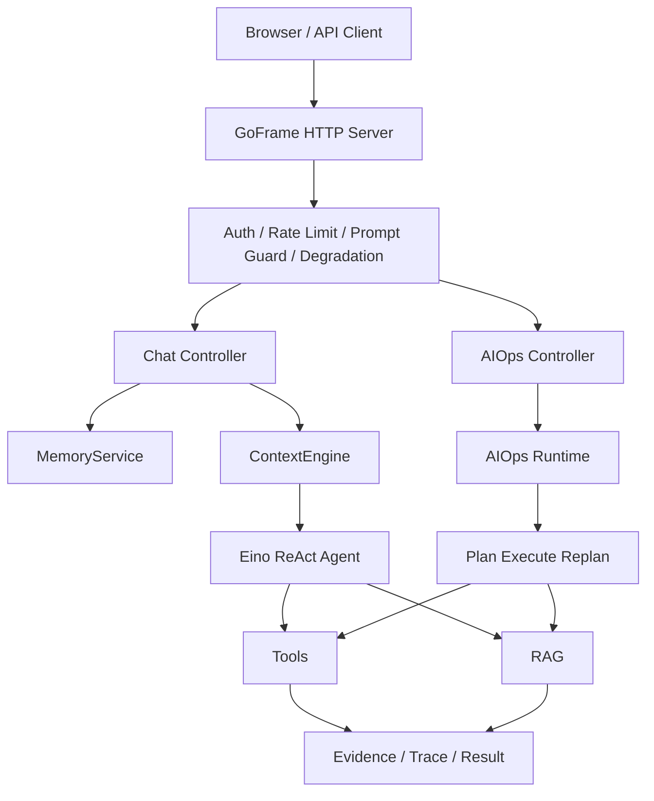

# OpsCaptionAI

[](https://github.com/ZhangJYe/OpsCaptain/actions/workflows/ci.yml)

OpsCaptionAI 是一个面向 AIOps 场景的智能运维助手。它面向内部运维团队，把告警、日志、指标、知识库和历史上下文组织到同一条分析链路里，帮助运维人员用自然语言完成问题定位、证据检索、故障分析和处置建议生成。

这个仓库不是一个单纯聊天 Demo。当前主干已经收敛为两条有效链路：

- Chat：`ContextEngine / MemoryService -> Eino ReAct Agent -> Tools / RAG -> JSON / SSE`
- AIOps：`Approval / Degradation / Memory -> Runtime -> Plan-Execute-Replan -> Trace / Result`

历史 `supervisor / triage / reporter / skillspecialists / chat_multi_agent` 相关内容仍可能作为实验或复盘材料存在，但不再代表当前聊天主入口。

## 核心能力

| 能力 | 说明 |
|---|---|
| 运维对话 | 普通 JSON 对话与 SSE 流式对话，支持会话上下文、记忆、工具调用和降级输出 |
| AIOps 分析 | 基于 Plan-Execute-Replan 的复杂排障链路，保留 runtime、ledger、artifact 和 trace 能力 |
| RAG 知识检索 | Query Rewrite、Milvus Retriever、LLM Rerank、Evidence Assembly |
| ContextEngine | 统一装配 history、memory、docs、tool outputs，并做上下文预算控制 |
| MemoryService | 封装短期记忆、长期记忆、聊天结果持久化和异步记忆抽取 |
| 工具体系 | Prometheus 告警/指标、日志查询、内部文档查询、只读 MySQL、时间工具 |
| 安全与韧性 | Prompt Guard、Output Filter、限流、审批门、降级开关、成本审计 |
| 可观测性 | Prometheus metrics、Jaeger tracing、健康检查、ready 检查、事件健康上报 |
| 前端界面 | React + TypeScript + Vite 前端，目录为 `frontend/` |

## 架构概览



## 技术栈

| 层次 | 技术 |
|---|---|
| 后端 | Go 1.24+、GoFrame v2 |
| Agent 编排 | CloudWeGo Eino / eino-ext |
| 模型 | DeepSeek V3 系列、Doubao Embedding |
| RAG | Milvus、Query Rewrite、Rerank、BM25/Hybrid 评测 |
| 异步与缓存 | Redis、RabbitMQ |
| 可观测性 | Prometheus、Jaeger、healthz、readyz |
| 前端 | React 18、TypeScript、Vite、Tailwind CSS、Framer Motion |
| 部署 | Docker、Docker Compose、Caddy、GitHub Actions |

## 目录结构

```text
api/                                  HTTP API 类型定义
cmd/                                  辅助命令入口
internal/controller/                  GoFrame HTTP 控制器
internal/ai/agent/chat_pipeline/      Chat ReAct 主链路
internal/ai/agent/plan_execute_replan/ AIOps Plan-Execute-Replan 主链路
internal/ai/contextengine/            上下文装配与预算控制
internal/ai/rag/                      RAG 查询、重写、重排与评测
internal/ai/runtime/                  AIOps runtime、ledger、bus、artifact
internal/ai/service/                  memory、approval、ai_ops、异步任务等服务层
internal/ai/tools/                    指标、日志、知识库、数据库等工具
utility/                              auth、cache、health、logging、mem、metrics、safety、tracing
frontend/                             React 前端
docs/knowledge/                       RAG 知识语料（索引入库）
docs/reference/                       工程参考文档（不进 RAG）
Learn/system/                         当前系统架构、数据流、代码地图、Prompt 导览
Learn/operations/                     上线、域名、日常更新等运维手册
todo/                                 设计稿与执行计划
res/                                  历史复盘与阶段性记录
deploy/                               生产 compose、Caddy、Prometheus、部署脚本
manifest/config/                      配置文件
scripts/                              数据预处理与知识库脚本
skills/                               Agent skill 定义与候选材料
```

## 快速开始

### 环境要求

- Go 1.24+
- Node.js 22+，用于前端构建
- Docker，可选，用于镜像构建和本地依赖服务
- Redis、RabbitMQ、Milvus、Prometheus 等依赖按功能启用；默认配置可启动服务，但完整 RAG、异步任务和线上观测能力需要配套依赖

### 配置模型密钥

启动时会读取 `.env.local` 或 `.env`。生产环境 `APP_ENV=production` 时读取 `.env.production`。

```bash
cat > .env.local <<'EOF'
DEEPSEEK_API_KEY=replace-with-your-deepseek-key
ARK_API_KEY=replace-with-your-ark-key
AUTH_JWT_SECRET=replace-with-a-strong-secret
EOF
```

默认 `startup.require_model_secrets=false`，密钥缺失时服务可以启动，但 AI 请求会降级或失败。生产环境应配置真实密钥，并开启合适的认证、CORS、限流和观测配置。

### 启动后端

```bash
go run .
```

默认监听 `:8000`。

```bash
curl -sS http://127.0.0.1:8000/healthz
curl -sS http://127.0.0.1:8000/readyz
```

### 启动前端

```bash
cd frontend
npm install
npm run dev
```

前端运行时默认通过相对路径访问 `./api`。生产环境由 Caddy 统一转发；本地直接运行 Vite 时，可以通过同源代理或本地 runtime config 将 API 指向 `http://127.0.0.1:8000/api`。

## 常用接口

### 普通对话

```bash
curl -sS http://127.0.0.1:8000/api/chat \
  -H 'Content-Type: application/json' \
  -d '{"Id":"demo-session","Question":"帮我分析一下最近的 Kubernetes CrashLoopBackOff 告警"}'
```

### 流式对话

```bash
curl -N http://127.0.0.1:8000/api/chat_stream \
  -H 'Content-Type: application/json' \
  -d '{"Id":"demo-session","Question":"排查 paymentservice 超时和错误率升高"}'
```

### 异步 AIOps 分析

```bash
curl -sS http://127.0.0.1:8000/api/ai_ops_runs \
  -H 'Content-Type: application/json' \
  -d '{"query":"分析 frontend 到 productcatalogservice 的延迟升高","engine":"plan_execute_replan"}'
```

拿到 `trace_id` 后查询 trace 和结果：

```bash
curl -sS 'http://127.0.0.1:8000/api/ai_ops_trace?trace_id=TRACE_ID'
curl -sS 'http://127.0.0.1:8000/api/ai_ops_result?trace_id=TRACE_ID'
```

### 文件上传与知识索引状态

```bash
curl -sS -F 'file=@./example.md' http://127.0.0.1:8000/api/upload
curl -sS 'http://127.0.0.1:8000/api/upload_status?file_id=FILE_ID'
```

## 测试与构建

提交或推送前应执行：

```bash
go build ./...
go test ./...
cd frontend && npm run build
```

也可以使用 Makefile：

```bash
make test
make build
```

前端镜像构建：

```bash
docker build -f frontend/Dockerfile -t opscaptain-frontend:local frontend
```

后端镜像构建：

```bash
docker build -t opscaptain-backend:local .
```

## 部署

生产部署以 `deploy/docker-compose.prod.yml`、`.env.production`、`release.env`、`deploy/remote-deploy.sh` 为主。生产 compose 使用已构建镜像：

- `BACKEND_IMAGE`
- `FRONTEND_IMAGE`

执行 compose 前需要加载 `release.env`，否则镜像变量会缺失。

```bash
set -a
. ./release.env
set +a
docker compose --env-file .env.production -f docker-compose.prod.yml ps
```

部署、域名、日常更新流程请优先看：

- `Learn/operations/01-上线流程总览.md`
- `Learn/operations/03-小白一步步部署教程.md`
- `Learn/operations/04-domain-https.md`
- `Learn/operations/05-daily-update-sop.md`

## 配置说明

主配置文件是 `manifest/config/config.yaml`。关键配置包括：

| 配置段 | 作用 |
|---|---|
| `server` | HTTP 服务监听地址 |
| `startup` | 启动时是否强制校验模型密钥 |
| `auth` | JWT、认证开关、限流参数 |
| `safety` | Prompt Guard、Output Filter、注入分类器 |
| `tracing` | Jaeger tracing |
| `events` | 事件健康上报 |
| `cache` | LLM 响应缓存 |
| `degradation` | 全局降级开关 |
| `approval` | 高风险请求审批 |
| `cost` | token 成本与告警阈值 |
| `milvus` | 向量数据库地址与 collection |
| `chat_model` / `chat_model_fast` | 对话模型配置 |
| `embedding_model` | embedding 模型配置 |
| `memory` | 会话记忆、长期记忆和抽取参数 |
| `chat_async` | 异步聊天任务 |
| `context` | 上下文预算和 rerank 策略 |
| `aiops` | AIOps 引擎、GOS、incident 参数 |
| `rabbitmq` / `redis` | 异步任务与缓存依赖 |
| `prometheus` / `mysql` / `mcp` | 外部工具依赖 |

不要把真实密钥写入仓库。配置中的 `${ENV_NAME}` 会从环境变量或 env file 中解析。

## 文档导航

| 文档 | 内容 |
|---|---|
| `AGENTS.md` | Agent 协作规则、架构口径、提交与推送约束 |
| `Learn/system/01-system-architecture-guide.md` | 当前系统架构导览 |
| `Learn/system/02-data-flow-guide.md` | 数据流说明 |
| `Learn/system/03-code-map.md` | 代码阅读地图 |
| `Learn/system/04-prompt-architecture-guide.md` | Prompt 架构 |
| `docs/knowledge/README.md` | RAG 知识库语料说明 |
| `docs/reference/README.md` | 工程参考文档说明 |
| `todo/rag-engineering-complete-design.md` | RAG 工程设计 |
| `res/harness-engineering-for-opscaptionai.md` | Harness Engineering 记录 |
| `frontend/README.md` | 前端开发与部署说明 |
| [快速开始](docs/getting-started.md) | 新开发者 3 分钟上手指南 |
| [面试准备](docs/interview/) | 面试准备材料集 |
| [技术决策](docs/tech-decisions/) | 技术选型与评审记录 |
| [实施计划](docs/superpowers/plans/) | 功能实施计划与设计规格 |

## 协作约定

- 代码修改前先阅读 `AGENTS.md`。
- 不主动 commit / push，除非用户明确要求。
- commit message 使用中文。
- push 前先 `git pull --rebase`，并确保 `go build ./...`、`go test ./...`、`npm run build` 通过。
- 新增能力应走配置项，避免硬编码 budget、top_k、timeout、feature flag。
- 错误处理优先走降级与可观测路径，不直接让服务 fatal。
- 不要重新接回 `chat_multi_agent` 路由，也不要让当前 Chat 链路重新依赖旧 supervisor / triage / reporter 入口。

## 当前状态

项目当前处于 RAG baseline 评测、Harness Engineering 和 AIOps 证据工程持续演进阶段。若要改动 RAG、Agent、ContextEngine、Memory 或 AIOps runtime，请先阅读 `Learn/system/`、`todo/`、`res/` 中的当前设计文档，并补充对应 package 测试或 replay case。
