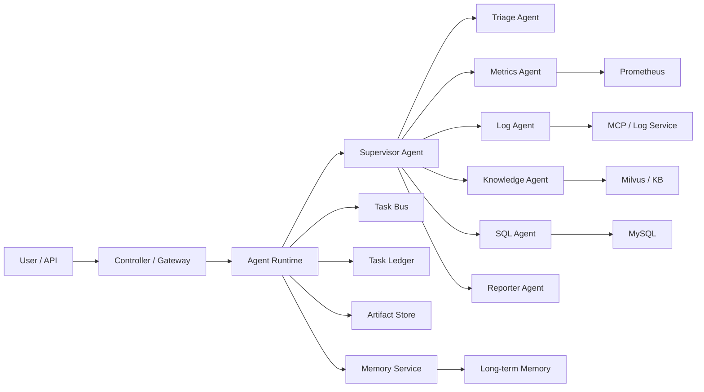
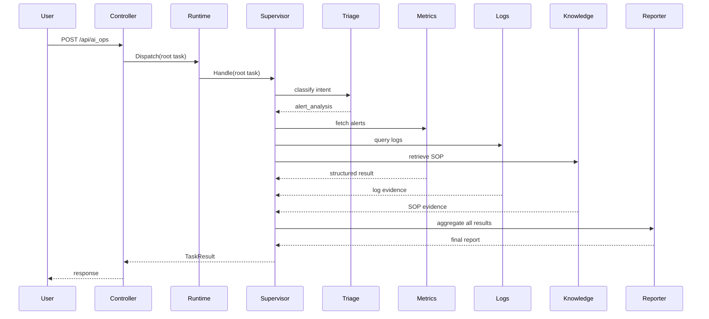

# Multi-Agent 系统实施设计稿

## 1. 文档目的

本文档基于当前仓库现状，给出一版可落地的 Multi-Agent 系统实施设计稿，覆盖以下内容：

- 可行性判断
- 当前代码基础与可复用资产
- 目标系统架构
- 目录设计
- 接口设计
- 数据结构设计
- Agent 间通信机制
- 任务分配与协调策略
- 典型调用链
- 技术选型建议
- 风险、挑战与解决方案
- 分阶段实施计划

本文档既用于方案评审，也用于后续开发拆解。

---

## 2. 结论摘要

### 2.1 是否可行

结论：可行。

当前项目已经具备 Multi-Agent 化的关键基础：

- 已有单 Agent 对话链路：`internal/ai/agent/chat_pipeline/`
- 已有多角色代理雏形：`internal/ai/agent/plan_execute_replan/`
- 已有工具层：日志 MCP、Prometheus、RAG、时间、MySQL
- 已有记忆层：`utility/mem/`
- 已有知识库能力：Milvus 检索和入库链路

因此，本项目不需要从零重建，可以在现有单体内先演进为编排式 Multi-Agent 系统。

### 2.2 推荐路线

推荐采用两阶段路线：

1. Phase 1：单体内 Multi-Agent
   - 所有 Agent 仍运行在当前 Go 服务进程内
   - 通过统一任务信封、任务账本、Agent Runtime 进行编排
   - 优先验证业务价值和协作模型
2. Phase 2：分布式 A2A
   - 将 specialist agent 拆分为独立服务
   - 引入消息总线、统一 A2A 协议、分布式追踪
   - 仅在复杂度和规模确实需要时再演进

当前阶段不建议直接做分布式 A2A。

---

## 3. 当前项目基础盘点

### 3.1 当前已有能力

- 对话入口
  - `internal/controller/chat/chat_v1_chat.go`
  - `internal/controller/chat/chat_v1_chat_stream.go`
- AI Ops 入口
  - `internal/controller/chat/chat_v1_ai_ops.go`
- 单 Agent + RAG 对话链
  - `internal/ai/agent/chat_pipeline/orchestration.go`
  - `internal/ai/agent/chat_pipeline/flow.go`
- Planner / Executor / Replanner 雏形
  - `internal/ai/agent/plan_execute_replan/`
- 工具层
  - `internal/ai/tools/query_log.go`
  - `internal/ai/tools/query_metrics_alerts.go`
  - `internal/ai/tools/query_internal_docs.go`
  - `internal/ai/tools/mysql_crud.go`
  - `internal/ai/tools/get_current_time.go`
- 检索与索引
  - `internal/ai/retriever/retriever.go`
  - `internal/ai/indexer/indexer.go`
  - `internal/ai/agent/knowledge_index_pipeline/`
- 记忆层
  - `utility/mem/mem.go`
  - `utility/mem/long_term.go`

### 3.2 当前限制

- 聊天链路仍是单 Agent，不是 Multi-Agent
- AI Ops 只有轻量的代理式工作流，没有统一 Runtime
- 没有统一的 Agent 注册中心
- 没有任务账本和 Artifact 管理
- 没有真正 A2A 协议
- 记忆层目前面向 session，对 agent 粒度隔离不够
- 缺少统一 trace_id / task_id 体系

---

## 4. 目标能力定义

目标不是“多个模型并行跑”，而是建立一套可管理、可审计、可扩展的 Multi-Agent 运行体系。

### 4.1 目标能力

- 能将复杂问题拆分为多个 specialist agent 并发执行
- 能通过统一消息结构在 agent 间传递任务和结果
- 能对工具权限进行按 agent 隔离
- 能保存中间证据和产物
- 能在失败时降级、重试、重规划
- 能支持人工审批
- 能逐步升级到分布式 A2A

### 4.2 非目标

- 第一阶段不实现跨服务自治 Agent 网络
- 第一阶段不做 fully autonomous agent swarm
- 第一阶段不允许 agent 自主执行高风险副作用动作

---

## 5. 目标系统架构



### 5.1 架构角色

- `Controller / Gateway`
  负责接收 HTTP 请求，建立会话上下文，调用 Runtime
- `Agent Runtime`
  管理 agent 注册、任务派发、生命周期、trace 和权限
- `Supervisor Agent`
  负责任务分解、路由、收敛和终止条件判断
- `Specialist Agents`
  专注在单一问题域
- `Task Bus`
  在 agent 间传递任务事件
- `Task Ledger`
  记录任务状态、输入输出、错误、耗时
- `Artifact Store`
  保存中间结果引用，避免大文本直接在 agent 间传输
- `Memory Service`
  管理 session memory、long-term memory、memory injection

---

## 6. Agent 拆分方案

### 6.1 第一阶段建议的 6 个 Agent

#### 1. Supervisor Agent

职责：

- 接收用户目标
- 调用 `Triage Agent` 做意图判定
- 生成执行 DAG
- 并发调度 specialist
- 汇总结果并决定是否 replan

#### 2. Triage Agent

职责：

- 判断问题类型
- 给出路由标签
- 给出初步约束

输出示例：

- `intent=alert_analysis`
- `domains=["metrics","logs","knowledge"]`
- `priority=high`

#### 3. Metrics Agent

职责：

- 查询当前活跃告警
- 必要时查询指标数据
- 返回结构化告警证据

依赖：

- `query_prometheus_alerts`

#### 4. Log Agent

职责：

- 调用 MCP 日志工具
- 检索与问题相关的日志片段
- 抽取关键异常、时间窗口、错误模式

依赖：

- `query_log` MCP 工具

#### 5. Knowledge Agent

职责：

- 使用 Milvus 检索 SOP、Runbook、FAQ
- 返回与问题最相关的文档证据和处理建议

依赖：

- `query_internal_docs`

#### 6. Reporter Agent

职责：

- 聚合 specialist 结果
- 做证据排序和冲突检测
- 生成最终答案
- 输出面向用户的报告

### 6.2 第二阶段可选扩展 Agent

- `SQL Agent`
  负责受控数据查询
- `Memory Agent`
  专门负责记忆抽取、归档、召回
- `Action Agent`
  用于未来执行审批后的自动化动作

---

## 7. 目录设计

建议在现有目录结构上新增以下内容：

```text
internal/
  ai/
    runtime/
      runtime.go
      registry.go
      dispatcher.go
      bus.go
      ledger.go
      artifacts.go
      context.go
      errors.go
    protocol/
      envelope.go
      task.go
      result.go
      artifact.go
      event.go
    agent/
      supervisor/
        supervisor.go
        planner.go
        router.go
        policy.go
      triage/
        triage.go
        prompt.go
      specialists/
        metrics/
          agent.go
          prompt.go
          mapper.go
        logs/
          agent.go
          prompt.go
          mapper.go
        knowledge/
          agent.go
          prompt.go
          mapper.go
        sql/
          agent.go
          prompt.go
          guard.go
      reporter/
        reporter.go
        prompt.go
        merger.go
      memory/
        memory_agent.go
        extractor.go
        injector.go
    service/
      multi_agent_service.go
      ai_ops_service.go
    tools/
      ...
```

### 7.1 与现有代码的关系

- `internal/ai/agent/chat_pipeline/` 保留
  - 继续服务普通聊天
  - 后续可由 Supervisor 接管
- `internal/ai/agent/plan_execute_replan/` 可逐步下线
  - 或临时作为 `Supervisor Agent` 的实验实现
- `utility/mem/` 保留
  - 但增加面向 runtime 的统一 memory service 封装

---

## 8. 接口设计

### 8.1 Agent 统一接口

建议新增统一 Agent 接口：

```go
package runtime

import "context"

type Agent interface {
    Name() string
    Capabilities() []string
    Handle(ctx context.Context, task *TaskEnvelope) (*TaskResult, error)
}
```

### 8.2 Runtime 接口

```go
package runtime

import "context"

type Runtime interface {
    Register(agent Agent) error
    Dispatch(ctx context.Context, task *TaskEnvelope) (*TaskResult, error)
    Publish(ctx context.Context, event *TaskEvent) error
    LoadTask(ctx context.Context, taskID string) (*TaskEnvelope, error)
}
```

### 8.3 Bus 接口

```go
package runtime

import "context"

type Bus interface {
    Publish(ctx context.Context, event *TaskEvent) error
    Subscribe(topic string, handler EventHandler) error
}

type EventHandler func(ctx context.Context, event *TaskEvent) error
```

### 8.4 Ledger 接口

```go
package runtime

import "context"

type Ledger interface {
    CreateTask(ctx context.Context, task *TaskEnvelope) error
    UpdateTaskStatus(ctx context.Context, taskID string, status TaskStatus) error
    AppendResult(ctx context.Context, taskID string, result *TaskResult) error
    ListChildren(ctx context.Context, parentTaskID string) ([]*TaskEnvelope, error)
}
```

### 8.5 Artifact Store 接口

```go
package runtime

import "context"

type ArtifactStore interface {
    Put(ctx context.Context, artifact *Artifact) (*ArtifactRef, error)
    Get(ctx context.Context, ref *ArtifactRef) (*Artifact, error)
}
```

---

## 9. 数据结构设计

### 9.1 TaskEnvelope

这是 agent 间传递任务的核心结构。

```go
type TaskEnvelope struct {
    TaskID       string                 `json:"task_id"`
    ParentTaskID string                 `json:"parent_task_id,omitempty"`
    SessionID    string                 `json:"session_id"`
    TraceID      string                 `json:"trace_id"`
    Goal         string                 `json:"goal"`
    Assignee     string                 `json:"assignee"`
    Creator      string                 `json:"creator"`
    Intent       string                 `json:"intent,omitempty"`
    Priority     string                 `json:"priority,omitempty"`
    Status       TaskStatus             `json:"status"`
    Input        map[string]interface{} `json:"input,omitempty"`
    Constraints  map[string]interface{} `json:"constraints,omitempty"`
    MemoryRefs   []MemoryRef            `json:"memory_refs,omitempty"`
    ArtifactRefs []ArtifactRef          `json:"artifact_refs,omitempty"`
    CreatedAt    int64                  `json:"created_at"`
    UpdatedAt    int64                  `json:"updated_at"`
    DeadlineAt   int64                  `json:"deadline_at,omitempty"`
}
```

### 9.2 TaskResult

```go
type TaskResult struct {
    TaskID       string                 `json:"task_id"`
    Agent        string                 `json:"agent"`
    Status       ResultStatus           `json:"status"`
    Summary      string                 `json:"summary"`
    Confidence   float64                `json:"confidence"`
    Evidence     []EvidenceItem         `json:"evidence,omitempty"`
    ArtifactRefs []ArtifactRef          `json:"artifact_refs,omitempty"`
    NextActions  []string               `json:"next_actions,omitempty"`
    Metadata     map[string]interface{} `json:"metadata,omitempty"`
    Error        *TaskError             `json:"error,omitempty"`
    StartedAt    int64                  `json:"started_at"`
    FinishedAt   int64                  `json:"finished_at"`
}
```

### 9.3 EvidenceItem

```go
type EvidenceItem struct {
    SourceType string  `json:"source_type"`
    SourceID   string  `json:"source_id"`
    Title      string  `json:"title"`
    Snippet    string  `json:"snippet"`
    Score      float64 `json:"score"`
    URI        string  `json:"uri,omitempty"`
}
```

### 9.4 ArtifactRef

```go
type ArtifactRef struct {
    ID   string `json:"id"`
    Type string `json:"type"`
    URI  string `json:"uri,omitempty"`
}
```

### 9.5 TaskEvent

```go
type TaskEvent struct {
    EventID   string                 `json:"event_id"`
    TaskID    string                 `json:"task_id"`
    TraceID   string                 `json:"trace_id"`
    Type      string                 `json:"type"`
    Agent     string                 `json:"agent"`
    Payload   map[string]interface{} `json:"payload,omitempty"`
    CreatedAt int64                  `json:"created_at"`
}
```

---

## 10. Agent 间通信机制

### 10.1 第一阶段

第一阶段采用进程内 A2A：

- 通过 `TaskEnvelope` 统一任务表示
- 通过 `Runtime.Dispatch()` 执行 agent 调用
- 通过 `Bus.Publish()` 发布事件
- 通过 `Ledger` 记录状态变化

特点：

- 不跨服务
- 不引入额外网络复杂度
- 易于调试和落地

### 10.2 第二阶段

第二阶段升级为跨服务 A2A：

- 同步控制面：gRPC 或 HTTP
- 异步事件面：NATS 或 Redis Streams
- 统一使用 `TaskEnvelope` 作为消息体
- 大结果通过 `Artifact Store` 持久化，只传引用

推荐协议：

- `POST /agent/tasks`
- `GET /agent/tasks/{task_id}`
- `POST /agent/tasks/{task_id}/cancel`

---

## 11. 任务分配与协调策略

### 11.1 第一版策略

采用规则驱动路由，不做复杂博弈式调度。

流程：

1. 用户请求进入 `Supervisor Agent`
2. `Supervisor` 调用 `Triage Agent`
3. `Triage` 输出意图、域标签、优先级
4. `Supervisor` 生成 DAG
5. 可并行任务并行执行
6. `Reporter` 聚合输出
7. 若证据不足或冲突明显，`Supervisor` 触发 replan

### 11.2 路由规则示例

- `intent=alert_analysis`
  - 调 `Metrics Agent`
  - 调 `Knowledge Agent`
  - 调 `Log Agent`
  - 最后调 `Reporter`
- `intent=kb_qa`
  - 调 `Knowledge Agent`
  - 直接返回或交给 `Reporter`
- `intent=data_query`
  - 调 `SQL Agent`
  - 必要时调用 `Knowledge Agent` 做语义补充

### 11.3 终止条件

- 达到用户问题目标
- 所有必要 specialist 已返回有效结果
- 达到最大迭代次数
- 触发高风险动作且未审批
- 所有候选路径均失败

---

## 12. 调用链设计

### 12.1 告警分析调用链



### 12.2 普通对话调用链

第一阶段建议保留现状：

- 普通聊天仍走 `chat_pipeline`
- 只有复杂问答或显式请求时才进入 `Supervisor`

第二阶段可升级为：

- `Triage Agent` 判断是否需要 specialist 参与
- 简单问答继续单 Agent
- 复杂问答走 Multi-Agent

### 12.3 文档入库调用链

文档入库保持现有链路：

- Loader
- Splitter
- Indexer

后续可增加 `Knowledge Curator Agent`：

- 审核文档质量
- 自动打标签
- 构建知识图谱索引

---

## 13. 技术选型建议

### 13.1 第一阶段

- 编排框架：继续使用 `cloudwego/eino`
- 模型接入：继续使用现有 `internal/ai/models/open_ai.go`
- 工具集成：继续使用现有 tool + MCP
- 检索：Milvus
- Ledger：先用 MySQL 或内存实现
- Artifact Store：先用本地存储或 MySQL/Redis 引用表
- Trace：OpenTelemetry

### 13.2 第二阶段

- 同步通信：gRPC
- 异步总线：NATS 或 Redis Streams
- Ledger：MySQL
- Artifact Store：MinIO / S3 兼容存储
- 共享缓存：Redis

### 13.3 推荐顺序

- 先内存 Runtime
- 再 Ledger 落 MySQL
- 再接 Redis/NATS
- 最后再做分布式 Agent 服务化

---

## 14. 权限与安全设计

### 14.1 Tool 权限隔离

不同 agent 只能访问自己的工具白名单：

- `Metrics Agent`
  - `query_prometheus_alerts`
- `Log Agent`
  - `query_log` MCP 工具
- `Knowledge Agent`
  - `query_internal_docs`
- `SQL Agent`
  - 只允许受控只读查询

### 14.2 高风险动作控制

下列动作必须人工审批：

- 数据写入
- 运维变更
- 执行 Shell/脚本
- 删除或修改知识库

### 14.3 上下文隔离

- session 上下文对所有 agent 可见，但按需裁剪
- specialist 只拿子任务需要的最小上下文
- 长期记忆通过 `Memory Service` 注入，不允许直接共享整个 memory map

---

## 15. 记忆设计

### 15.1 当前可复用

可复用现有：

- `SimpleMemory`
- `LongTermMemory`
- `ExtractMemories`

### 15.2 推荐升级

新增 `Memory Service`：

- 统一对接 `utility/mem`
- 提供：
  - `InjectSessionContext(sessionID, task)`
  - `InjectLongTermMemories(sessionID, query)`
  - `PersistResultMemories(sessionID, result)`

### 15.3 原则

- 记忆不直接在 agent 间传播
- 通过 memory ref 或注入结果传播
- 避免一个 agent 把全部历史塞给另一个 agent

---

## 16. 可观测性设计

### 16.1 必须有的标识

- `session_id`
- `trace_id`
- `task_id`
- `parent_task_id`
- `agent_name`

### 16.2 日志要求

每个任务至少记录：

- 输入摘要
- 分派目标
- 调用工具列表
- 结果状态
- 耗时
- 失败原因

### 16.3 Metrics 要求

- 单 agent 平均耗时
- 单 agent 错误率
- 工具调用成功率
- replan 次数
- fan-out 任务数量
- 平均 token 消耗

---

## 17. 潜在挑战与解决方案

### 17.1 上下文膨胀

问题：

- 多个 agent 并发后，上下文容易失控

方案：

- specialist 只拿局部上下文
- 统一使用结构化 `TaskInput`
- 结果返回摘要 + evidence，不返回无界长文本

### 17.2 死循环重规划

问题：

- `Supervisor` 可能在失败后重复路由

方案：

- 限制 `max_iterations`
- 定义失败终止条件
- 区分“重试”和“重新规划”

### 17.3 结果冲突

问题：

- 指标、日志、文档结论可能不一致

方案：

- `Reporter` 做冲突检测
- 对低置信度结论明确标注
- 必要时返回“存在冲突证据，需人工确认”

### 17.4 调试困难

问题：

- 多 agent 系统天然难 debug

方案：

- 全链路 trace
- Ledger 记录所有任务节点
- 统一 ArtifactRef 存储中间证据

### 17.5 成本上升

问题：

- 多 agent 增加 token 消耗和延迟

方案：

- 先 triage 再 fan-out
- 简单问题继续单 Agent
- 使用快模型给 Triage / Reporter，深度模型给 Planner

---

## 18. 分阶段实施计划

### Phase 0：设计与协议落地

目标：

- 定义 `TaskEnvelope`
- 定义 `TaskResult`
- 定义 Agent 接口
- 定义 Runtime / Ledger / Bus 接口

产出：

- `internal/ai/protocol/`
- `internal/ai/runtime/`

### Phase 1：单体内 Multi-Agent MVP

目标：

- 上线 `Supervisor`
- 上线 `Triage / Metrics / Log / Knowledge / Reporter`
- AI Ops 入口切到新 Runtime

产出：

- `/ai_ops` 进入 Multi-Agent 调度
- 可并发执行 specialist
- 可输出结构化 detail

### Phase 2：记忆与证据系统增强

目标：

- Memory Service
- Artifact Store
- Task Ledger 持久化

### Phase 3：通用对话接入

目标：

- 普通聊天场景也能按需路由到 specialist

### Phase 4：分布式 A2A

目标：

- 让 specialist 独立部署
- Runtime 通过消息总线或 RPC 调用

---

## 19. 第一阶段的最小可交付范围

建议把 MVP 严格收敛为：

- 只改 AI Ops 链路
- 只接 5 个 agent
  - Supervisor
  - Triage
  - Metrics
  - Log
  - Knowledge
  - Reporter
- 只做进程内通信
- 不做分布式 A2A
- 不开放高风险 Action Agent

这样做的原因：

- 风险最低
- 最容易验证价值
- 能复用当前 AI Ops 业务需求

---

## 20. 与当前代码的迁移关系

### 20.1 可以直接复用

- `query_log`
- `query_prometheus_alerts`
- `query_internal_docs`
- `get_current_time`
- `utility/mem`
- `Milvus retriever/indexer`

### 20.2 建议保留但逐步边缘化

- `plan_execute_replan`

原因：

- 它适合作为过渡方案
- 但不够承载完整 Runtime、Ledger、Artifact、A2A 模型

### 20.3 建议新增而不是硬改

- `internal/ai/runtime/`
- `internal/ai/protocol/`
- `internal/ai/agent/supervisor/`
- `internal/ai/agent/specialists/`

---

## 21. 建议的下一步开发顺序

建议按以下顺序推进：

1. 定义协议对象：`TaskEnvelope`、`TaskResult`、`TaskEvent`
2. 实现 `Agent Registry` 和 `Runtime`
3. 实现 `Supervisor Agent`
4. 将现有 tools 封装进 specialist agent
5. 将 AI Ops 入口接入 Runtime
6. 加入 Ledger 和 trace
7. 再讨论分布式 A2A

---

## 22. 最终建议

本项目适合建设 Multi-Agent 系统，但最佳策略不是一步到位做分布式网络，而是：

- 先做单体内的编排式 Multi-Agent
- 先从 AI Ops 场景切入
- 先把通信、任务、证据、状态四个基础对象设计好
- 等运行模型稳定后，再做真正跨服务 A2A

这是对当前代码基础、团队复杂度和落地成本最合理的路径。

