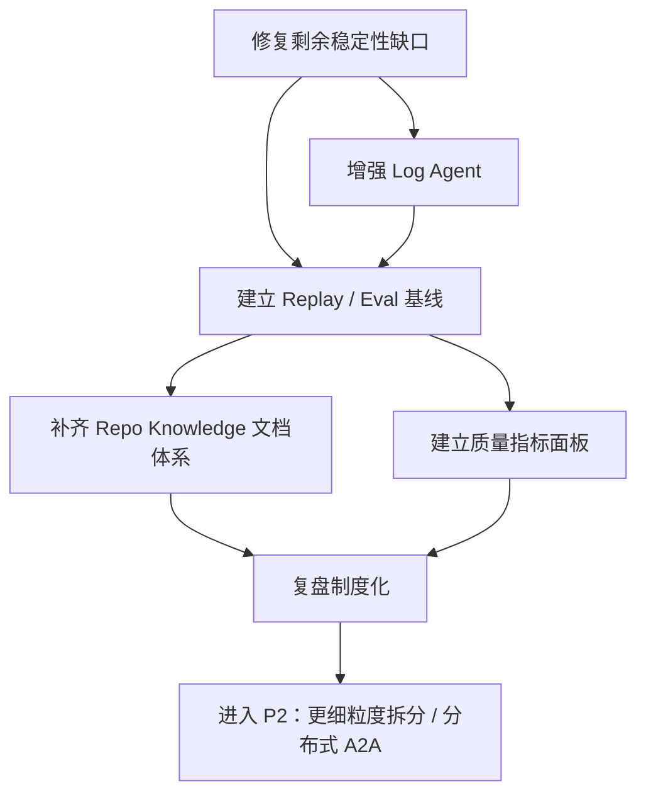

# OnCallAI 下一阶段推进与复盘手册

## 1. 文档定位

本文档用于替代“内部推理式 CoT”文档，提供一套可执行、可复用、可独立复盘的项目推进与复盘方法。

适用场景：

- 当前 Multi-Agent MVP 已落地，P1 关键基础设施已完成
- 需要明确下一阶段推进顺序、依赖关系和验收标准
- 需要建立可重复执行的项目复盘方法
- 需要将复盘结论沉淀为后续阶段的输入，而不是停留在会议纪要

本文档基于以下现状：

- `res/todo.md`
- `res/multi-agent-system-design.md`
- `res/harness-engineering-for-oncallai.md`

---

## 2. 当前阶段判断

### 2.1 已完成能力

- Multi-Agent MVP 已具备 `protocol + runtime + supervisor + triage + specialists + reporter`
- AI Ops 已切换到新 runtime
- Task Ledger / Artifact Store 已具备文件持久化版本
- Memory Service / Approval Gate 已接入 AI Ops
- 关键中期风险项已修复，包括 revoked token cleanup、LTM 容量限制、Metrics Agent 错误处理统一、CORS 收紧等

### 2.2 当前仍需推进的主要缺口

- `ExtractMemories` 异步执行仍缺少超时与取消保护
- `Log Agent` 仍偏保守，尚未成为强能力 specialist
- Replay / Eval 体系仍未建立
- Repo Knowledge 文档体系仍不完整
- Multi-Agent 运行质量还缺少更系统的回放、指标、复盘闭环

### 2.3 下一阶段目标

建议将下一阶段定义为：

> 从“已具备 P1 基础设施”推进到“具备可持续演进、可复盘、可验证的 P1 完整阶段”。

核心目标：

- 关闭剩余稳定性与可维护性缺口
- 建立复盘闭环
- 为后续 P2 的分布式 A2A 或更细粒度 agent 拆分做好准备

---

## 3. 下一阶段推进总原则

推进时建议遵守以下 5 条原则：

1. 先补运行风险，再扩功能边界
2. 先补验证闭环，再做更复杂自治
3. 先补文档与证据沉淀，再扩大 agent 数量
4. 先保证 AI Ops 场景质量，再考虑推广到普通聊天链路
5. 每个阶段结束都必须留下可复用的复盘产物

---

## 4. 下一阶段行动拆解

## 4.1 优先级总览

| 优先级 | 主题 | 目标 | 依赖 |
| --- | --- | --- | --- |
| P0 | Memory 异步安全 | 给 `ExtractMemories` 增加超时/取消保护 | 无 |
| P0 | Log Agent 增强 | 从“发现+降级”升级为更可靠的日志 specialist | 现有 MCP 工具可用 |
| P0 | Replay / Eval 基线 | 建立 AI Ops 回放样例与验收基线 | Task Ledger / Artifact Store |
| P1 | Repo Knowledge 文档体系 | 让 agent 与人都能快速理解系统边界 | 当前目录结构稳定 |
| P1 | 质量指标面板 | 定义 runtime、agent、tool 三层指标 | Replay 用例与 trace 数据 |
| P1 | 复盘闭环制度化 | 将问题沉淀为测试、规则、文档和决策记录 | 前述基础工作完成 |
| P2 | 更细粒度 specialist 或分布式 A2A | 进入更复杂治理阶段 | P1 稳定后再进入 |

---

## 4.2 详细行动步骤

### 步骤 1：修复剩余稳定性缺口

优先级：`P0`

目标：

- 修复当前仍然明确存在的运行风险

当前建议项：

1. 给 `MemoryService.PersistOutcome` 中的 `mem.ExtractMemories(...)` 增加超时控制
2. 明确超时后的日志与降级策略
3. 为异步记忆抽取补测试

依赖：

- 无

完成标准：

- 后台记忆抽取不再无限制运行
- 超时不会影响主请求返回
- 有可观测日志或错误计数

建议输出物：

- 代码修改
- 单元测试
- `res/todo.md` 的问题关闭记录

---

### 步骤 2：增强 Log Agent

优先级：`P0`

目标：

- 让 `Log Agent` 从“可发现工具”提升到“可交付证据”

建议内容：

1. 明确日志查询输入结构
2. 为日志结果抽取证据片段
3. 给日志查询失败定义统一 degraded 语义
4. 为 MCP 不可用、超时、空结果分别做降级策略
5. 产出更稳定的 `EvidenceItem`

依赖：

- MCP 配置可用
- 当前 runtime / artifact store 已存在

完成标准：

- `Log Agent` 能输出可读 summary
- 至少返回结构化日志证据或明确降级说明
- 在异常场景不会破坏整条 AI Ops 链路

---

### 步骤 3：建立 Replay / Eval 基线

优先级：`P0`

目标：

- 建立“每次改动后都能回放验证”的最小评测体系

建议内容：

1. 选 5 到 10 条 AI Ops 典型问题作为 golden cases
2. 每条 case 固定：
   - 输入问题
   - 预期 intent
   - 预期调用域
   - 最低可接受 summary 关键词
   - 最低可接受 evidence 数量
3. 建立回放脚本或测试入口
4. 在 `res/` 留下 case 列表和预期输出说明

依赖：

- Task Ledger
- Artifact Store
- 稳定的 runtime 链路

完成标准：

- 每次关键修改后可自动执行 replay
- 能快速发现 triage 漂移、tool 失败、reporter 质量下降

---

### 步骤 4：补齐 Repo Knowledge 文档体系

优先级：`P1`

目标：

- 让项目对“人”和“agent”都更容易被理解和扩展

建议目录：

- `docs/architecture/`
- `docs/agents/`
- `docs/tools/`
- `docs/policies/`
- `docs/runbooks/`

每类文档至少回答：

- 这个模块负责什么
- 它不能做什么
- 依赖哪些工具或配置
- 出错时如何降级
- 如何测试和验证

依赖：

- 目录结构基本稳定

完成标准：

- 新成员无需通读源码即可理解主链路
- Agent 能通过文档快速理解边界和能力

---

### 步骤 5：建立质量指标面板

优先级：`P1`

目标：

- 把“好不好”从主观讨论变成可量化判断

建议指标：

- 请求成功率
- degraded 比例
- specialist 平均耗时
- tool 超时率
- artifact 生成成功率
- replay 通过率
- triage 分类准确率
- 记忆注入命中率

依赖：

- replay / trace / artifact 已经落地

完成标准：

- 每轮复盘至少能拿到一版量化数据

---

### 步骤 6：将复盘制度化

优先级：`P1`

目标：

- 不再让复盘停留在“知道了”，而是转成下轮输入

建议机制：

1. 每轮迭代结束必须做一次轻量复盘
2. 每次线上问题或重要回归必须做一次问题复盘
3. 每次复盘必须产出：
   - 事实
   - 根因
   - 修复
   - 防复发机制
   - 下阶段动作

依赖：

- 前述文档、指标和 replay 机制已初步建立

完成标准：

- 每个问题都能追溯到修复与制度沉淀

---

## 5. 依赖关系图



---

## 6. 障碍识别与缓解框架

## 6.1 障碍识别维度

建议从 5 个维度检查风险：

1. 技术风险
2. 依赖风险
3. 数据/证据风险
4. 测试与验证风险
5. 组织与协作风险

---

## 6.2 风险分析模板

| 风险项 | 触发条件 | 影响 | 发现方式 | 缓解策略 | 兜底方案 |
| --- | --- | --- | --- | --- | --- |
| MCP 服务不稳定 | 超时、连接失败 | Log Agent 失效 | replay、运行日志 | 超时、重试、degraded 返回 | 跳过日志域，仅输出知识和告警 |
| 记忆抽取阻塞 | LLM 卡死或抽取链路慢 | goroutine 堆积 | goroutine 数、日志 | context timeout、异步限流 | 禁用抽取，仅保留 SimpleMemory |
| Triage 误路由 | 规则不全或 query 模糊 | specialist 跑错域 | replay 失败、人工抽检 | 扩规则、加样例 | 默认走 `metrics + knowledge + logs` |
| Reporter 总结失真 | 输入冲突、证据不足 | 结论误导 | replay、人工 review | 结构化输入、冲突标注 | 返回“证据不足”而不是强结论 |
| 文档滞后 | 代码已变但文档没跟 | 新人/agent 理解错误 | 复盘、PR review | 文档作为验收项 | 在 `todo.md` 记录缺口 |

---

## 6.3 常见障碍与建议

### 障碍 1：功能推进快于验证建设

表现：

- 代码能跑，但质量不可判断

缓解：

- 任何新增 agent 或 tool 前，先补最小 replay case

### 障碍 2：为了“智能”牺牲确定性

表现：

- 路由、总结、工具选择越来越难预测

缓解：

- 优先增加规则、schema、contract tests，而不是一味改 prompt

### 障碍 3：复盘只有结论，没有证据

表现：

- 会后大家知道“有问题”，但不知道问题具体在哪

缓解：

- 复盘必须绑定 trace、artifact、测试结果和代码位置

### 障碍 4：问题修了，但没形成机制

表现：

- 同类问题再次出现

缓解：

- 每个问题至少要落成以下之一：
  - 新测试
  - 新规则
  - 新文档
  - 新监控
  - 新审批门

---

## 7. 复盘执行框架

## 7.1 复盘目标

一场有效复盘至少要回答 5 个问题：

1. 我们这轮到底改了什么
2. 哪些目标达成了，哪些没达成
3. 问题是偶发缺陷还是系统性缺口
4. 哪些经验值得保留
5. 下轮具体应该改什么

---

## 7.2 复盘流程

### 第一步：收集事实

输入来源：

- `res/todo.md`
- 本轮代码 diff
- 测试结果
- replay / eval 结果
- trace / artifact
- 关键运行日志

输出：

- 一份事实清单，不包含推测

示例：

- 已新增文件型 ledger
- `go test ./...` 通过
- `ExtractMemories` 仍无超时
- Log Agent 在 MCP 不可用时只会降级，不会输出真实日志证据

---

### 第二步：对照目标

把本轮结果与目标逐条对比：

| 目标 | 状态 | 证据 | 结论 |
| --- | --- | --- | --- |
| P1 持久化 runtime | 已完成 | 文件型 ledger/artifact store | 达成 |
| AI Ops 记忆接入 | 已完成 | memory service 已接入 | 达成 |
| 异步抽取安全 | 未完成 | `context.Background()` 无超时 | 未达成 |
| Log Agent 强化 | 部分完成 | 仍偏保守 | 部分达成 |

---

### 第三步：识别问题类型

建议把问题分为 4 类：

- `实现缺陷`
- `设计缺口`
- `验证缺口`
- `治理缺口`

示例：

- `ExtractMemories` 无超时：实现缺陷
- `Log Agent` 能力不足：设计缺口
- 缺少 replay：验证缺口
- 文档体系薄弱：治理缺口

---

### 第四步：做根因分析

建议使用简化版 5 Whys：

1. 问题是什么
2. 为什么发生
3. 为什么之前没有被发现
4. 为什么现有机制没拦住
5. 应该新增什么机制防止复发

示例：

问题：

- `ExtractMemories` 无超时

根因：

- 实现时把它视为“后台小任务”
- 没建立异步任务超时规范
- 没有针对 goroutine 生命周期的测试或监控

防复发机制：

- 为异步 AI 任务统一加 timeout helper
- 增加异步任务安全检查清单

---

### 第五步：提炼经验与动作

每条复盘结论都必须落成动作项：

| 结论 | 动作 | 优先级 | 负责人 | 截止条件 |
| --- | --- | --- | --- | --- |
| 异步 AI 任务缺少保护 | 给所有后台 AI 任务增加 context timeout | P0 | 工程负责人 | 测试通过 |
| Log 证据质量不足 | 升级 Log Agent 输出结构化 evidence | P0 | AI 模块负责人 | replay 通过 |
| 文档理解成本高 | 建立 `docs/agents/` 文档 | P1 | 架构负责人 | 首批文档完成 |

---

## 7.3 复盘关键指标

建议至少跟踪以下指标：

### 交付质量

- `go test ./...` 通过率
- replay 通过率
- 关键用例回归数

### 运行稳定性

- 请求成功率
- degraded 比例
- tool timeout 比例
- goroutine 增长趋势

### 结果质量

- triage 分类准确率
- reporter 结论可用率
- evidence 覆盖率

### 治理质量

- 文档补齐率
- 问题闭环率
- 同类问题复发率

---

## 7.4 成功标准

一轮推进建议满足以下成功标准：

### 最低成功标准

- 所有 P0 项已关闭
- 全量测试通过
- `res/todo.md` 已更新
- 至少完成一次结构化复盘

### 理想成功标准

- replay 基线已建立
- Log Agent 能输出稳定证据
- 关键异步任务全部有超时保护
- 有第一版质量指标面板

---

## 8. 复盘模板与实例

## 8.1 轻量复盘模板

```md
# 迭代复盘

## 1. 本轮目标
- 

## 2. 实际完成
- 

## 3. 未完成项
- 

## 4. 主要问题
- 问题：
  - 影响：
  - 根因：
  - 修复：
  - 防复发措施：

## 5. 数据与证据
- 测试结果：
- replay 结果：
- 关键日志：
- trace / artifact：

## 6. 结论
- 保留：
- 改进：
- 下轮动作：
```

---

## 8.2 问题复盘模板

```md
# 问题复盘：<问题名称>

## 1. 现象

## 2. 影响范围

## 3. 发现方式

## 4. 根因分析

## 5. 修复方案

## 6. 验证结果

## 7. 防复发措施

## 8. 后续行动
```

---

## 8.3 动作追踪模板

```md
# Action Register

| ID | Action | Priority | Owner | Depends On | Exit Criteria | Status |
| --- | --- | --- | --- | --- | --- | --- |
| A-01 | 给 ExtractMemories 增加 timeout | P0 |  | 无 | 单测通过、无阻塞风险 | Todo |
| A-02 | 增强 Log Agent evidence 输出 | P0 |  | MCP 可用 | replay 通过 | Todo |
| A-03 | 建立 AI Ops replay 样例集 | P0 |  | A-02 | 5~10 个用例可执行 | Todo |
```

---

## 8.4 结合当前项目的实例

### 示例 1：复盘 “P1 已完成，但还不能算阶段收口”

事实：

- runtime 持久化已完成
- memory service 已接入
- approval gate 已接入
- 关键风险项大多已修复
- `ExtractMemories` 仍无超时
- replay / eval 尚未建立

结论：

- 当前阶段不是“继续扩 agent”
- 而是“先收口稳定性与验证体系”

下轮动作：

- 先做超时保护
- 再做 Log Agent 强化
- 再做 replay

### 示例 2：复盘 “Triage 质量是否值得继续优化”

判断方法：

- 如果 replay 中 triage 错误率高，进入 P0/P1 优化
- 如果 replay 中主要问题不在 triage，而在 tool 可靠性和 evidence 质量，则 triage 保持 MVP 即可

这类判断可以避免过早优化低收益模块。

---

## 9. 如何记录发现并沉淀到下一阶段

## 9.1 记录要求

每次复盘或重要问题处理后，至少更新以下一项：

- `res/todo.md`
- 新增问题复盘文档
- 新增或更新架构/agent/tool 文档

建议记录格式：

1. 事实
2. 影响
3. 根因
4. 修复
5. 验证
6. 后续动作

---

## 9.2 问题沉淀规则

不要只记录“修了什么”，还要记录“为什么以后不会再犯”。

建议每个问题都转成至少一项具体沉淀：

- 一个测试
- 一条规则
- 一份文档
- 一项监控
- 一个审批门

示例：

- `ExtractMemories` 无超时
  - 修复：加 timeout
  - 沉淀：新增异步 AI 任务规范文档
  - 验证：新增测试

---

## 9.3 下阶段输入生成方法

每轮复盘结束后，输出一份“下一阶段输入清单”：

| 类型 | 内容 | 来源 |
| --- | --- | --- |
| 新任务 | 给异步记忆抽取加超时 | 本轮复盘 |
| 新测试 | replay case: MCP 不可用 | 本轮问题案例 |
| 新文档 | `docs/agents/log-agent.md` | Log Agent 强化 |
| 新规则 | 后台 AI 任务必须可取消 | 根因分析 |

这张表就是下一轮推进的直接输入。

---

## 10. 推荐执行节奏

建议按以下节奏推进：

### 第 1 周

- 修复剩余 P0 风险
- 补测试
- 更新 `res/todo.md`

### 第 2 周

- 强化 Log Agent
- 建立 5 到 10 个 replay case

### 第 3 周

- 建立第一版 docs 体系
- 建立第一版质量指标表

### 第 4 周

- 做一次完整复盘
- 输出下一阶段输入清单

---

## 11. 最终执行建议

对当前项目，最合理的下一阶段顺序不是继续扩展 agent 数量，而是：

1. 先关闭剩余运行风险
2. 再提升 Log Agent 的证据能力
3. 再建立 replay / eval
4. 再补文档和治理闭环
5. 最后再考虑更复杂的 specialist 拆分或分布式 A2A

一句话总结：

> 下一阶段的重点不是“让系统更聪明”，而是“让系统更稳定、更可解释、更可复盘，并且每轮改动都能被重复验证”。

