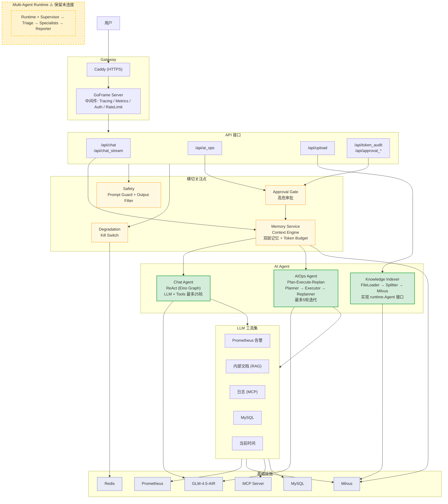
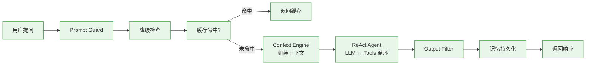
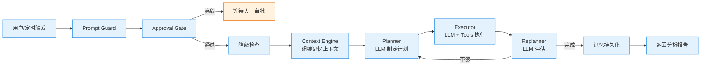

# OpsCaptain 整体架构图

> 生成日期: 2026-04-08

## 整体架构

```mermaid
graph TB
    User["用户"]

    subgraph Gateway["Gateway"]
        Caddy["Caddy (HTTPS)"] --> GoFrame["GoFrame Server<br/>中间件: Tracing / Metrics / Auth / RateLimit"]
    end

    subgraph API["API 接口"]
        Chat["/api/chat<br/>/api/chat_stream"]
        AIOps["/api/ai_ops"]
        Upload["/api/upload"]
        Admin["/api/token_audit<br/>/api/approval_*"]
    end

    subgraph CrossCutting["横切关注点"]
        Safety["Safety<br/>Prompt Guard + Output Filter"]
        Degrade["Degradation<br/>Kill Switch"]
        Approval["Approval Gate<br/>高危审批"]
        Memory["Memory Service<br/>Context Engine<br/>双层记忆 + Token Budget"]
    end

    subgraph Agents["AI Agent"]
        ReAct["Chat Agent<br/>ReAct (Eino Graph)<br/>LLM + Tools 最多25轮"]
        PER["AIOps Agent<br/>Plan-Execute-Replan<br/>Planner → Executor → Replanner<br/>最多5轮迭代"]
        KIP["Knowledge Indexer<br/>FileLoader → Splitter → Milvus<br/>实现 runtime.Agent 接口"]
    end

    subgraph Tools["LLM 工具集"]
        direction LR
        T1["Prometheus 告警"]
        T2["内部文档 (RAG)"]
        T3["日志 (MCP)"]
        T4["MySQL"]
        T5["当前时间"]
    end

    subgraph Infra["基础设施"]
        direction LR
        LLM["GLM-4.5-AIR"]
        Prom["Prometheus"]
        Milvus["Milvus"]
        Redis["Redis"]
        MySQL["MySQL"]
        MCP["MCP Server"]
    end

    subgraph Reserved["Multi-Agent Runtime ⚠️ 保留未连接"]
        direction LR
        RT["Runtime + Supervisor → Triage → Specialists → Reporter"]
    end

    User --> Caddy
    GoFrame --> API
    API --> Safety
    API --> Degrade
    Chat --> Memory --> ReAct
    AIOps --> Approval --> Memory
    Memory --> PER
    Upload --> KIP
    Admin --> Approval

    ReAct --> Tools
    PER --> Tools
    ReAct --> LLM
    PER --> LLM

    Tools --> Prom
    Tools --> Milvus
    Tools --> MCP
    Tools --> MySQL
    KIP --> Milvus
    Degrade --> Redis
    Memory --> Milvus

    classDef agent fill:#d4edda,stroke:#28a745,stroke-width:2px
    classDef reserved fill:#fff3cd,stroke:#ffc107,stroke-width:2px,stroke-dasharray:5 5
    classDef infra fill:#e8eaf6,stroke:#5c6bc0,stroke-width:1px
    classDef cross fill:#fff8e1,stroke:#ff8f00,stroke-width:1px

    class ReAct,PER,KIP agent
    class Reserved,RT reserved
    class LLM,Prom,Milvus,Redis,MySQL,MCP infra
    class Safety,Degrade,Approval,Memory cross
```

## Chat 请求流程

```mermaid
graph LR
    A["用户提问"] --> B["Prompt Guard"]
    B --> C["降级检查"]
    C --> D["缓存命中?"]
    D -->|"命中"| Z["返回缓存"]
    D -->|"未命中"| E["Context Engine<br/>组装上下文"]
    E --> F["ReAct Agent<br/>LLM ↔ Tools 循环"]
    F --> G["Output Filter"]
    G --> H["记忆持久化"]
    H --> I["返回响应"]

    classDef step fill:#e8f5e9,stroke:#43a047
    class A,B,C,D,E,F,G,H,I,Z step
```

## AIOps 请求流程

```mermaid
graph LR
    A["用户/定时触发"] --> B["Prompt Guard"]
    B --> C["Approval Gate"]
    C -->|"高危"| X["等待人工审批"]
    C -->|"通过"| D["降级检查"]
    D --> E["Context Engine<br/>组装记忆上下文"]
    E --> F["Planner<br/>LLM 制定计划"]
    F --> G["Executor<br/>LLM + Tools 执行"]
    G --> H["Replanner<br/>LLM 评估"]
    H -->|"不够"| F
    H -->|"完成"| I["记忆持久化"]
    I --> J["返回分析报告"]

    classDef step fill:#e3f2fd,stroke:#1e88e5
    classDef warn fill:#fff3e0,stroke:#ef6c00
    class A,B,C,D,E,F,G,H,I,J step
    class X warn
```
