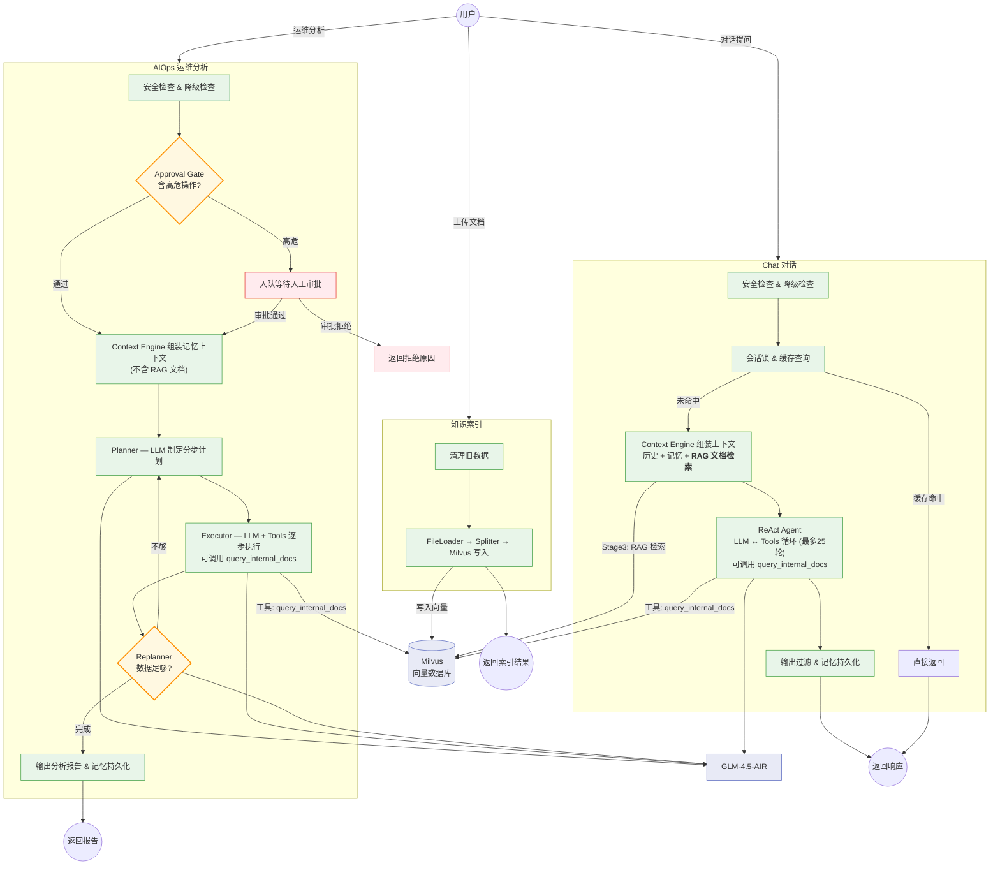

# OpsCaptain 业务流程图

> 生成日期: 2026-04-08

## 总业务流程

## RAG 使用说明

| 业务路径 | RAG 使用方式 | 触发时机 |
|---------|-------------|---------|
| **Chat** | ① Context Engine Stage 3 自动检索文档注入上下文 | 每次请求必触发 |
| **Chat** | ② LLM 主动调用 `query_internal_docs` 工具 | LLM 自主判断是否需要 |
| **AIOps** | ① Context Engine **不检索文档** (AllowDocs=false) | — |
| **AIOps** | ② Executor 阶段 LLM 可调用 `query_internal_docs` 工具 | LLM 自主判断是否需要 |
| **知识索引** | 文档向量化写入 Milvus | 用户上传时触发 |
