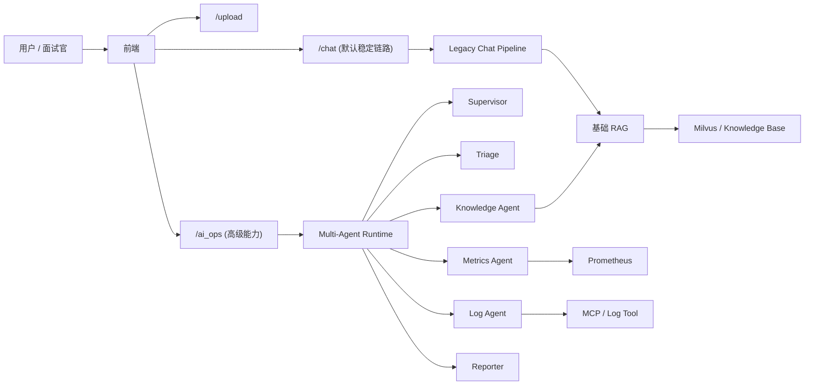

# 校招上线版收敛方案（供 Review）

Date: 2026-04-05

## 1. 结论先行

当前项目**不应该继续朝“全面多智能体平台”扩张**，而应该收敛成一个：

- 能稳定部署
- 能直接演示
- 能讲清楚架构取舍
- 不会在面试时被质疑“只是玩具 demo”

的版本。

这不意味着要删除 Multi-Agent。  
相反，**Multi-Agent 应该保留，但要从“默认主路径”降级为“亮点能力 + 高级能力”**。

一句话概括：

> 上线版本以“稳定可用的 Chat + 知识库 + AI Ops 多智能体亮点能力”为主，不以“全面多智能体化”作为上线目标。

---

## 2. 为什么现在不能把复杂度继续做满

### 2.1 当前项目已经有亮点，但主矛盾不是“功能不够多”

当前项目已经有这些足够能讲的内容：

- 普通 Chat 链路
- 文件上传与知识库入库
- RAG 检索
- AI Ops 多智能体链路
- runtime / protocol / trace / artifact
- 前端 trace 可视化
- replay baseline 与评测文档

也就是说，问题已经不是“亮点不够”，而是：

- 默认链路是否足够稳
- Demo 是否足够顺
- 部署是否足够清晰
- 面试时是否能清楚说明取舍

### 2.2 面试官最容易质疑“玩具项目”的点

校招项目被说成“玩具”，一般不是因为功能少，而是因为有这些特征：

1. 技术名词很多，但主路径不稳
2. 架构很复杂，但没有清晰的默认使用方式
3. 依赖太多，换一台机器就跑不起来
4. 无法说明为什么要这样设计
5. 没有展示工程取舍能力，只展示“堆技术”

当前项目如果继续扩大：

- Chat 全量 Multi-Agent
- 上下文工程大重构
- 模块化 RAG 深拆

会放大以上风险。

### 2.3 因此，最优策略不是删能力，而是收敛形态

正确方向不是：

- 删除 Multi-Agent

而是：

- 保留 Multi-Agent
- 控制其使用范围
- 让默认路径更稳
- 让亮点能力更清楚
- 让面试叙事更完整

---

## 3. 推荐上线定位

推荐把项目定位成：

> 一个面向 OnCall / SRE / 校招展示场景的智能排障与知识辅助系统。  
> 它提供稳定的单智能体聊天能力，并针对复杂运维问题提供可追踪的 Multi-Agent 分析能力。

这个定位有几个优点：

- 不是“泛聊天套壳”
- 有明确场景
- 有产品主路径
- 有工程亮点
- 不需要把所有能力都做到极致也能成立

---

## 4. 推荐上线形态

## 4.1 默认主路径

默认向外展示的能力应该是：

1. **稳定 Chat**
   - 普通问答
   - 知识辅助
   - 支持多轮上下文

2. **知识库上传**
   - 上传文档
   - 入库
   - Chat/RAG 可查询

3. **AI Ops 高级分析**
   - 作为高级入口保留
   - 使用 Multi-Agent
   - 支持 trace

## 4.2 不建议作为默认主路径的能力

以下能力保留，但不建议作为默认展示面：

1. Chat 全量自动走 Multi-Agent
2. Chat 默认展开 detail / trace
3. 复杂的上下文工程策略对外暴露
4. 过多的系统调试信息直接暴露在首页 UI

## 4.3 推荐的功能分层

### L1：用户稳定能力

- `/chat`
- `/upload`
- 基础知识问答

### L2：项目亮点能力

- `/ai_ops`
- trace 查询
- 前端高级调试面板

### L3：保留但不强推的能力

- Chat Multi-Agent 路由
- 更复杂的 Context Engineering
- 更深的模块化 RAG

---

## 5. 推荐的能力取舍

## 5.1 保留

以下内容建议保留：

1. **AI Ops Multi-Agent**
   - 这是当前项目最有技术亮点、也最容易讲清楚的部分

2. **runtime / protocol / trace**
   - 这部分是架构能力的核心证明

3. **Chat Multi-Agent 的代码实现**
   - 保留实现，作为“已完成的下一阶段能力”
   - 但不必须默认开启

4. **前端 trace 能力**
   - 这对演示和面试都加分

## 5.2 默认关闭或弱化

以下内容建议默认关闭或弱化：

1. **`multi_agent.chat_route_enabled`**
   - 建议上线默认关闭
   - 需要演示时再打开

2. **Chat 的 trace/detail 默认展示**
   - 建议收敛成“调试入口”
   - 不要普通用户第一眼就看到系统内部执行步骤

3. **实验性 RAG/Context 重构**
   - 暂停继续深挖

## 5.3 暂停继续推进

以下方向建议暂停作为当前主线：

1. Chat 全量切流到 Multi-Agent
2. 大规模 Context Engineering 重构
3. 模块化 RAG 深拆
4. 分布式 A2A

理由不是“不重要”，而是：

- 它们对校招上线收益不如“稳定与清晰”
- 它们会继续提高复杂度和不确定性

---

## 6. 为什么保留 Multi-Agent，而不是删掉

这是本方案最关键的权衡点。

## 6.1 Multi-Agent 的价值

Multi-Agent 现在已经不是 PPT，而是实际代码资产：

- 已有 `supervisor / triage / specialists / reporter`
- 已有 runtime / trace / artifact
- 已有 AI Ops 主链路
- 已有前端 trace 展示
- 已有 replay baseline

这些能力对面试非常有价值，因为它们说明：

- 你不是只会写 CRUD
- 你能做复杂系统设计
- 你能把 agent 能力做成工程系统

## 6.2 但它不应该承担全部默认流量

原因：

1. 外部依赖多
2. 时延更敏感
3. 调试更复杂
4. 当前 knowledge / tool 侧还在持续优化

所以更合理的形态是：

- **保留它**
- **讲清它**
- **演示它**
- **但不让它成为默认 Chat 主路径**

## 6.3 这不是退缩，而是工程成熟度

面试时你完全可以这样讲：

> 我实现了 Multi-Agent，但没有为了炫技把它直接变成默认主路径。  
> 对复杂运维场景，我保留它作为高级分析能力；对普通 Chat，我保留更稳定的链路。  
> 这是一个上线取舍，而不是功能缺失。

这其实会比“我把所有东西都切成多智能体”更成熟。

---

## 7. 推荐的系统形态图



这个图的重点是：

- 默认产品路径清楚
- Multi-Agent 不是被删掉，而是被放到合适层级

---

## 8. 推荐上线配置

## 8.1 推荐默认配置

推荐在上线版中采用：

```yaml
multi_agent:
  chat_route_enabled: false
```

含义：

- 普通 `/chat` 默认走 legacy
- `/ai_ops` 保持多智能体
- 如需演示 Chat Multi-Agent，可手动开启

## 8.2 前端展示策略

推荐：

- Chat 页面默认不强调系统内部执行步骤
- Trace 和详细步骤放在调试区或高级面板
- AI Ops 页面可以保留更强的 trace 展示

---

## 9. 面试叙事建议

## 9.1 项目一句话介绍

> 这是一个面向 OnCall / SRE 场景的智能排障与知识辅助系统。  
> 默认提供稳定的对话和知识检索能力，并针对复杂运维任务提供可回溯的 Multi-Agent 分析能力。

## 9.2 技术亮点怎么讲

建议顺序：

1. 先讲业务问题
   - 告警排查要同时看指标、日志、知识文档

2. 再讲为什么单 Agent 不够
   - 工具域不同
   - 结果需要汇总

3. 再讲 Multi-Agent 设计
   - supervisor / triage / specialists / reporter

4. 再讲工程能力
   - trace
   - artifact
   - replay baseline
   - degraded result
   - runtime 复用

5. 最后讲取舍
   - 我没有把它全量替换默认 Chat
   - 因为校招上线更需要稳定和清晰

## 9.3 面试里避免的表达

不要这样讲：

- “我做了很多很复杂的 Agent 架构”
- “我把 Chat 也全改成多智能体了”
- “后面还准备做 A2A、Context Engine、Modular RAG”

更好的讲法是：

- “我已经实现了 Multi-Agent，并把它收敛在最有价值的 AI Ops 场景”
- “对默认用户路径，我优先保证稳定性”
- “上下文工程和模块化 RAG 我已经有设计，但当前没有贸然扩大复杂度”

---

## 10. Review 标准

如果按“这不是玩具”的标准 review，本项目上线版至少要满足：

1. 默认主路径可运行、可解释
2. 复杂能力不是堆出来的，而是有清晰边界
3. 有日志、trace、降级和回放
4. 有部署方式和配置说明
5. 有明确的风险控制和功能取舍

## 10.1 当前满足的部分

- AI Ops 多智能体已实现
- trace / detail / artifact 已实现
- replay / baseline 文档已存在
- Chat 与 AI Ops 已有分层能力

## 10.2 当前仍需补强的部分

1. 根 README 与部署说明
2. 上线版默认配置说明
3. 前端默认展示策略收敛
4. 对外依赖不可用时的更明确文案
5. 一页式演示脚本

---

## 11. 推荐的下一步动作

如果按本方案推进，建议优先级如下：

### P0

1. 确认上线默认关闭 `multi_agent.chat_route_enabled`
2. 补一份根 README
3. 补最小部署文档
4. 收敛前端默认展示，trace 进入调试入口

### P1

1. 补一页式 demo script
2. 补项目首页/README 中的“默认能力 vs 高级能力”说明
3. 对外部依赖不可用时统一文案

### P2

1. 继续做 Chat Multi-Agent 效果评估
2. 再决定是否扩大 Chat Multi-Agent 的覆盖
3. 再决定是先做 Context 还是先做 RAG

---

## 12. 关于当前 Review Finding 的说明

你贴出的这个 finding：

- `Detail/trace payloads are still bloated by full report bodies`

在当前代码上**已经不是开放问题**。

当前实现已经做了：

- `task_completed` 使用短消息替代完整报告
- 长摘要折叠成 `详细摘要已折叠`
- `detail` 不再重复塞入完整最终报告

也就是说，这个 finding 可以视为**已关闭**，不需要再拿它作为当前方案的阻断项。

---

## 13. 最终判断

如果你的目标是：

> 做一个校招阶段可以上线、可以演示、可以讲清楚、不会被说成玩具的项目

那么最优策略不是：

- 删掉 Multi-Agent

也不是：

- 把项目继续做成全面多智能体平台

而是：

> 保留 Multi-Agent 作为高级亮点能力，把默认产品主路径收敛到稳定形态，并把工程取舍本身作为你项目成熟度的一部分。

这才是当前最有胜率的路线。
