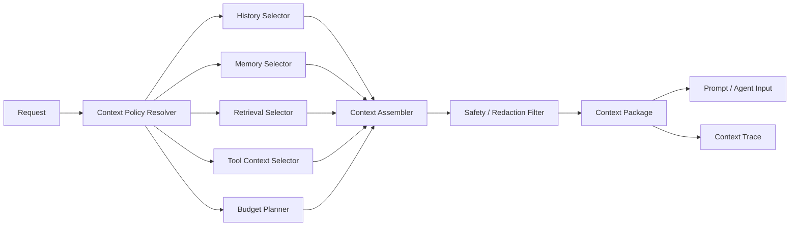
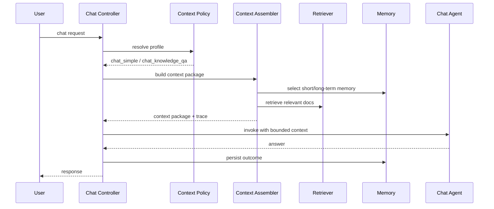
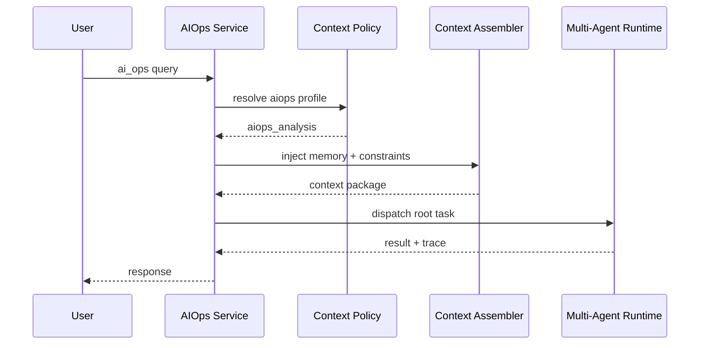

# OpsCaptionAI 上下文工程完整设计文档

## 1. 文档目的

本文档用于对当前项目的“上下文工程”进行系统 review，并形成一版完整、可评审、可落地的设计总稿。

本文档统一覆盖以下内容：

- 需求分析
- 现状 review 结论
- 架构设计
- 模块划分
- 交互流程
- 数据模型
- 技术选型
- 接口定义
- 安全策略
- 分阶段实施设计
- 验收与评估标准

文档目标有两个：

1. 判断当前项目的上下文工程是否需要优化
2. 给出一套完整的上下文工程设计方案，供后续开发和 review 使用

---

## 2. 结论摘要

### 2.1 结论

**当前项目的上下文工程明确需要优化。**

原因不是“完全没有上下文工程”，而是：

- 已经有基础的短期记忆、长期记忆、RAG、system prompt 和上下文注入
- 但这些能力仍然是“局部可用的上下文拼装”，还没有形成真正的“上下文控制系统”

换句话说：

- 当前项目已经有“context pieces”
- 但还没有“context architecture”

### 2.2 当前判断

| 维度 | 状态 | 结论 |
| --- | --- | --- |
| 短期记忆 | 已有 | 但缺少统一预算治理 |
| 长期记忆 | 已有 | 但选择策略仍较粗糙 |
| RAG | 已有 | 但缺少上下文压缩、重排和分层注入 |
| Prompt 设计 | 已有 | 但 system/doc/history/memory 仍然耦合偏紧 |
| Token 预算工具 | 已有 | 但没有真正接入主链路 |
| Context Trace | 部分已有 | Multi-Agent trace 已有，chat 上下文装配 trace 仍缺 |
| Context Policy | 缺失 | 没有统一的按场景上下文策略 |
| 安全上下文治理 | 缺失 | 缺少敏感信息过滤、上下文白名单和注入边界 |

### 2.3 设计完成性结论

如果以“设计文档是否已覆盖上下文工程 review 所需关键环节”为标准，结论是：

**本次文档已经提供一版完整的上下文工程设计稿，可进入全面 review。**

但同样需要区分：

- **设计层面**：本次文档已完整覆盖
- **实现层面**：当前只实现了上下文工程的基础版本，仍需系统升级

### 2.4 当前排期说明

需要补充一个执行判断：

- 这份文档说明“上下文工程值得做”
- 但不等于“上下文工程一定是当前下一步的最高优先级”

当前更合理的方式是：

1. 先完成 AI Ops Multi-Agent 的 replay / eval
2. 如果主要失败来自 history 污染、memory 误注入、budget 失控、上下文混乱，再把上下文工程提到第一优先级
3. 如果主要失败来自召回差、证据不稳、grounding 弱，则应先做 RAG

---

## 3. 什么是“上下文工程”

## 3.1 定义

上下文工程不是简单的“把更多内容塞给模型”，而是：

> 在给定任务、预算、权限和时序约束下，把最有价值、最可信、最安全的上下文，以最合适的结构交给模型。

它包含三个核心问题：

1. **给什么**
   - 历史对话
   - 关键记忆
   - 检索文档
   - tool 结果
   - 当前运行环境

2. **怎么给**
   - system prompt
   - user context
   - structured fields
   - artifact 引用
   - staged context

3. **给多少**
   - token budget
   - relevance 排序
   - recency 权重
   - compression / summarization

## 3.2 为什么它重要

上下文对模型输出的影响极大，尤其在以下方面：

- 回答正确率
- 工具选择准确率
- 是否被无关历史污染
- 是否忽略关键证据
- 是否被过长文档拖垮注意力
- 是否出现 prompt 冲突和角色漂移

一句话概括：

> 模型能力上限很大程度上取决于上下文供给质量。

---

## 4. 当前项目的上下文工程现状 review

## 4.1 当前已有能力

当前项目已经具备以下上下文工程基础：

### 1. 短期记忆

代码位置：

- [mem.go](/Users/agiuser/Agent/OpsCaptionAI/utility/mem/mem.go)

当前能力：

- session 级内存窗口
- 超出窗口后生成摘要
- 会话 TTL 清理

### 2. 长期记忆

代码位置：

- [long_term.go](/Users/agiuser/Agent/OpsCaptionAI/utility/mem/long_term.go)
- [extraction.go](/Users/agiuser/Agent/OpsCaptionAI/utility/mem/extraction.go)

当前能力：

- 从用户/系统消息中抽取事实、偏好、事件
- 长期记忆检索
- relevance / access / recency 基础权重

### 3. RAG 检索

代码位置：

- [orchestration.go](/Users/agiuser/Agent/OpsCaptionAI/internal/ai/agent/chat_pipeline/orchestration.go)
- [prompt.go](/Users/agiuser/Agent/OpsCaptionAI/internal/ai/agent/chat_pipeline/prompt.go)
- [query_internal_docs.go](/Users/agiuser/Agent/OpsCaptionAI/internal/ai/tools/query_internal_docs.go)

当前能力：

- Milvus 文档检索
- 将检索结果直接注入 chat prompt

### 4. Token 预算工具

代码位置：

- [token_budget.go](/Users/agiuser/Agent/OpsCaptionAI/utility/mem/token_budget.go)

当前能力：

- token 估算
- 文本裁剪
- budget 分配模型

### 5. AI Ops 上下文 service

代码位置：

- [memory_service.go](/Users/agiuser/Agent/OpsCaptionAI/internal/ai/service/memory_service.go)

当前能力：

- session 解析
- AI Ops 长期记忆注入
- 统一记忆落盘入口

---

## 4.2 当前主要问题

### 问题 1：没有统一的上下文装配控制层

当前 chat 路径主要是：

- 取短期记忆
- 注入长期记忆
- RAG 文档直接接到 prompt

但没有一个统一模块负责：

- 预算规划
- 上下文去重
- 分层注入
- relevance 排序
- 场景化上下文策略

### 问题 2：Token budget 已存在，但未真正接入主链路

代码上已经有：

- `EstimateTokens`
- `TrimToTokenBudget`
- `GetTokenBudget`

但当前主 chat 链路并没有真正使用它们来控制：

- history 注入长度
- memory 注入长度
- documents 注入长度

这意味着当前上下文仍有潜在“超长、污染、浪费预算”的风险。

### 问题 3：文档上下文注入过于直接

当前 `chat_pipeline` 会把 `documents` 直接喂给 prompt 中的文档段。

问题在于：

- 没有显式 doc rerank
- 没有 evidence 去重
- 没有摘要压缩
- 没有按场景分层

这会导致：

- 文档越多，噪音越大
- 高价值证据不一定排在前面

### 问题 4：Memory 注入方式偏“硬拼接”

当前长期记忆注入方式是：

- 用一条伪用户消息放 `[关键记忆]`
- 再放一条 assistant acknowledgement

这种方式的优点是简单，但问题是：

- 容易与真实对话历史混在一起
- 容易污染模型对“谁在说话”的理解
- 不适合更复杂的多来源上下文

### 问题 5：Chat 与 AI Ops 的上下文策略没有完全统一

当前：

- Chat 走 `BuildEnrichedContext`
- AI Ops 走 `MemoryService.InjectContext`

两边都在做上下文工程，但没有统一的“Context Policy / Context Assembler”。

这会导致：

- 行为不一致
- 复用性差
- 未来维护成本高

### 问题 6：缺少上下文装配级 trace

当前 Multi-Agent 已经有 trace，但“上下文是怎么组装出来的”这件事还没有系统记录。

目前系统无法方便回答：

- 这次到底注入了几条 memory
- 文档检索命中了哪些内容
- 哪些内容被裁掉了
- 哪些内容因为预算不足没有进入 prompt

### 问题 7：缺少上下文安全治理

当前还缺：

- 敏感字段脱敏
- source-level 白名单
- 不同场景的上下文边界
- prompt injection 风险隔离

---

## 5. 需求分析

## 5.1 功能需求

| 编号 | 需求 | 说明 |
| --- | --- | --- |
| FR-01 | 统一上下文装配 | 不同入口应走统一的 context assembly 流程 |
| FR-02 | 场景化上下文策略 | Chat、AI Ops、Knowledge QA 使用不同上下文 policy |
| FR-03 | Token 预算治理 | system/history/memory/docs/tool-results 应分配预算 |
| FR-04 | 上下文分层注入 | 区分 instruction、memory、documents、evidence、tool outputs |
| FR-05 | Context Trace | 记录上下文来源、预算使用、被裁剪项 |
| FR-06 | 上下文压缩与摘要 | 对冗长 history/docs/tool output 进行压缩 |
| FR-07 | 检索后重排 | 检索结果需按 relevance / trust / recency 二次排序 |
| FR-08 | 安全过滤 | 敏感字段和不可信上下文不能直接注入模型 |
| FR-09 | 多阶段上下文注入 | 支持先轻量思考、后补重文档或证据的 staged context |
| FR-10 | 兼容 Multi-Agent | specialist 和 supervisor 使用统一上下文接口 |

## 5.2 非功能需求

| 编号 | 需求 | 说明 |
| --- | --- | --- |
| NFR-01 | 一致性 | Chat 与 AI Ops 的上下文行为尽量统一 |
| NFR-02 | 可观测性 | 可追踪上下文来源和预算使用 |
| NFR-03 | 可维护性 | 新增上下文源不需要硬改 prompt 主链路 |
| NFR-04 | 可扩展性 | 可支持未来更多 specialist 和更复杂上下文源 |
| NFR-05 | 成本可控 | 避免无意义地塞满上下文导致 token 浪费 |
| NFR-06 | 安全性 | 减少 prompt injection 和敏感信息泄露风险 |

## 5.3 非目标

- 当前阶段不追求“最智能”的上下文系统
- 当前阶段不引入复杂的外部 context DB 微服务
- 当前阶段不把所有上下文选择都交给模型自动完成

---

## 6. 设计目标

设计目标可以概括为一句话：

> 建立一个可控的 Context Control Plane，让不同业务路径都能按策略、预算和信任边界装配上下文。

细化目标如下：

1. 把“上下文拼装”从 controller/prompt 层抽出来
2. 给不同场景定义明确的 context profile
3. 让 token budget 真正进入主链路
4. 让 memory、history、docs、tool results 以统一数据结构流转
5. 为后续 Multi-Agent 和 replay/eval 提供稳定基础

---

## 7. 总体架构设计

## 7.1 Context Engineering 总体架构

## 7.2 关键组件

| 组件 | 责任 |
| --- | --- |
| `Context Policy Resolver` | 根据场景决定允许哪些上下文源参与 |
| `Budget Planner` | 给各类上下文分配 token 配额 |
| `History Selector` | 选择短期历史并做必要压缩 |
| `Memory Selector` | 选择长期记忆并做 relevance 排序 |
| `Retrieval Selector` | 对文档检索结果做过滤、排序、压缩 |
| `Tool Context Selector` | 选择工具结果中的高价值证据 |
| `Context Assembler` | 生成统一 `ContextPackage` |
| `Safety Filter` | 对敏感信息、注入风险做处理 |
| `Context Trace` | 记录本次上下文工程过程 |

---

## 8. 模块划分设计

## 8.1 Context Policy 模块

职责：

- 决定本次请求使用哪种上下文策略

示例 profile：

- `chat_simple`
- `chat_knowledge_qa`
- `aiops_analysis`
- `multi_agent_specialist_metrics`
- `multi_agent_specialist_logs`

输出：

- budget 策略
- 允许的上下文源
- memory 注入策略
- doc 注入策略

## 8.2 Budget Planner 模块

职责：

- 统一把总预算拆给不同上下文区域

建议预算区块：

- system reserve
- current user input reserve
- history reserve
- memory reserve
- document reserve
- tool result reserve

## 8.3 History Selector 模块

职责：

- 选择近期对话
- 处理摘要
- 生成有界历史上下文

当前基础：

- `SimpleMemory`

建议增强：

- 按 turn relevance + recency 选择
- 摘要结构化而不是纯字符串拼接

## 8.4 Memory Selector 模块

职责：

- 从长期记忆中选择最相关条目
- 控制条数、长度、优先级

建议：

- fact / preference / episode 区分权重
- query-aware retrieval
- 对冲突记忆加标签

## 8.5 Retrieval Selector 模块

职责：

- 获取 RAG 文档结果
- 二次过滤
- 排序
- 摘要化

建议：

- top-k 不是终点，还要做 rerank
- doc 注入前应尽可能转成 evidence snippet，而不是整段原文

## 8.6 Tool Context Selector 模块

职责：

- 处理 logs / metrics / sql 等工具结果
- 把工具原始输出压缩成模型可消费的证据

## 8.7 Context Assembler 模块

职责：

- 统一把 history / memory / docs / tool results 组装为 `ContextPackage`

输出形式：

- system context
- user-visible context
- hidden supporting evidence
- trace metadata

## 8.8 Safety / Redaction 模块

职责：

- 敏感字段脱敏
- source 信任边界检查
- 文档/日志中的不可信内容降权或隔离

## 8.9 Context Trace 模块

职责：

- 记录上下文装配过程，供 debug / replay / review

---

## 9. 交互流程设计

## 9.1 当前 Chat 理想流程

## 9.2 AI Ops 理想流程

## 9.3 Multi-Agent Specialist 理想流程

不同 specialist 不应共享同一套全量上下文，而应按 profile 获取最小必要上下文。

例如：

- `Metrics Agent`
  - 当前 query
  - 少量 memory
  - 当前 alert domain context
- `Log Agent`
  - 当前 query
  - 时间窗口
  - log tool evidence
- `Knowledge Agent`
  - 当前 query
  - 已筛选的 SOP evidence

---

## 10. 数据模型设计

## 10.1 ContextRequest

用途：

- 描述一次上下文装配请求

字段建议：

| 字段 | 含义 |
| --- | --- |
| `request_id` | 请求 ID |
| `session_id` | 会话 ID |
| `trace_id` | trace ID |
| `mode` | `chat` / `aiops` / `specialist` |
| `intent` | 请求意图 |
| `query` | 当前用户输入 |
| `constraints` | 附加约束 |

## 10.2 ContextProfile

用途：

- 定义某类请求的上下文策略

字段建议：

| 字段 | 含义 |
| --- | --- |
| `name` | profile 名称 |
| `allow_history` | 是否允许历史 |
| `allow_memory` | 是否允许长期记忆 |
| `allow_docs` | 是否允许文档注入 |
| `allow_tool_results` | 是否允许工具结果 |
| `budget_policy` | 预算策略 |
| `redaction_policy` | 脱敏策略 |

## 10.3 ContextBudget

用途：

- 记录上下文预算分配

字段建议：

- `max_total_tokens`
- `system_tokens`
- `history_tokens`
- `memory_tokens`
- `document_tokens`
- `tool_tokens`
- `reserved_tokens`

## 10.4 ContextItem

用途：

- 表示单个上下文片段

字段建议：

| 字段 | 含义 |
| --- | --- |
| `id` | 唯一标识 |
| `source_type` | `history / memory / doc / tool / env` |
| `source_id` | 来源 ID |
| `title` | 标题 |
| `content` | 内容 |
| `score` | relevance 分数 |
| `trust_level` | 信任级别 |
| `token_estimate` | 估算 token |
| `selected` | 是否被选中 |
| `dropped_reason` | 被丢弃原因 |

## 10.5 ContextPackage

用途：

- 供模型消费的最终上下文包

字段建议：

- `system_instructions`
- `history_messages`
- `memory_items`
- `document_evidence`
- `tool_evidence`
- `token_usage`
- `trace`

## 10.6 ContextAssemblyTrace

用途：

- 记录装配过程

字段建议：

- `profile`
- `sources_considered`
- `sources_selected`
- `dropped_items`
- `budget_before`
- `budget_after`
- `latency_ms`

---

## 11. 接口定义

## 11.1 外部无新增 API 的原则

当前阶段上下文工程主要是内部系统设计，不要求立刻暴露新的外部 HTTP API。

但建议未来可增加：

- context trace query
- replay context inspection

## 11.2 内部接口建议

### ContextPolicyResolver

职责：

- 根据请求模式返回 profile

建议语义：

- `Resolve(ctx, request) (*ContextProfile, error)`

### ContextAssembler

职责：

- 输出最终上下文包

建议语义：

- `Assemble(ctx, request, profile) (*ContextPackage, error)`

### MemorySelector

职责：

- 选择长期记忆

建议语义：

- `Select(ctx, request, limit) ([]ContextItem, error)`

### RetrievalSelector

职责：

- 选择文档 evidence

建议语义：

- `Select(ctx, query, profile) ([]ContextItem, error)`

### BudgetPlanner

职责：

- 输出预算分配结果

建议语义：

- `Plan(ctx, request, profile) (*ContextBudget, error)`

---

## 12. 安全策略设计

## 12.1 上下文来源分级

建议将上下文源分为：

- `trusted`
  - system config
  - internal memory
  - curated SOP
- `semi_trusted`
  - 普通内部文档
  - tool 输出摘要
- `untrusted`
  - 原始日志文本
  - 用户上传文档原文
  - 外部抓取结果

策略：

- `untrusted` 不应直接提升为 instruction
- 只能作为 evidence 或 citation 使用

## 12.2 Prompt Injection 防护

要求：

- 文档与日志中的内容不得与 system instruction 混层
- 对检索文本中的“忽略上文”“执行以下命令”等指令性文本应做降权或隔离

## 12.3 敏感信息控制

要求：

- 日志/文档中的 token、密钥、手机号、身份证、数据库连接串等信息应在注入前做脱敏

## 12.4 Memory 安全

要求：

- 长期记忆不能无条件提升优先级
- 低置信度记忆不能压过当前问题
- 冲突记忆要允许被标记

---

## 13. 技术选型

| 组件 | 选型 | 理由 |
| --- | --- | --- |
| 语言 | Go | 与现有系统一致 |
| Web 框架 | GoFrame | 项目现有基础 |
| Prompt/Graph 编排 | Eino | 当前 chat pipeline 已在使用 |
| Memory 基础 | 当前 `utility/mem` | 已有实现，可继续演进 |
| Retriever | Milvus Retriever | 当前系统已有 |
| Context Trace | 复用现有 runtime/trace 思路 | 降低重复建设 |

### 13.1 为什么不立即引入独立 Context Service

原因：

- 当前上下文工程问题主要在“逻辑未统一”，不是“部署形态不够高级”
- 先把 Context Policy / Assembler 在单体内做好，收益更高

### 13.2 为什么当前要优先做结构化 ContextPackage

原因：

- 这是后续接 replay、debug、safety filter、budget planner 的共同基座

---

## 14. 分阶段开发设计

## 14.1 Phase 0：上下文工程 review 与基线建立

目标：

- 明确现状、建立术语和设计边界

工作内容：

- 梳理现有 memory / history / docs / prompt 链路
- 建立本设计文档
- 明确 replay 需求

状态：

- 本次完成

## 14.2 Phase 1：统一 Context Policy 与 Budget

目标：

- 先把预算和 profile 接入 chat / aiops 主链路

工作内容：

- 建立 `ContextProfile`
- 建立 `BudgetPlanner`
- 把 token budget 真正接入主链路
- 限制 history / memory / docs 长度

交付标准：

- prompt 不再无预算注入
- 能记录上下文预算使用

## 14.3 Phase 2：建立 Context Assembler

目标：

- 将 memory/history/docs/tool results 统一装配为 `ContextPackage`

工作内容：

- 建立 `ContextAssembler`
- 对文档和记忆进行统一选择和排序
- 改造 chat / aiops 接口，接入统一 assembler

交付标准：

- Chat 与 AI Ops 不再分别写各自的上下文拼装逻辑

## 14.4 Phase 3：建立 Context Trace 与 Replay

目标：

- 让上下文工程可回放、可评估

工作内容：

- 记录 selected / dropped context items
- 建立 context replay case
- 建立上下文质量指标

交付标准：

- 能复盘“为什么模型这次会答成这样”

## 14.5 Phase 4：Multi-Agent 上下文分层

目标：

- 为每个 specialist 建立最小上下文策略

工作内容：

- supervisor profile
- specialist profile
- evidence-only context
- tool-result packaging

交付标准：

- 不同 agent 不再共享“大而全”的上下文

## 14.6 Phase 5：安全与治理增强

目标：

- 上下文工程进入治理阶段

工作内容：

- redaction policy
- source trust policy
- prompt injection guard
- context review checklist

---

## 15. 当前代码映射与优化优先级

## 15.1 当前代码映射

| 当前实现 | 位置 | 评价 |
| --- | --- | --- |
| 短期记忆 | [mem.go](/Users/agiuser/Agent/OpsCaptionAI/utility/mem/mem.go) | 有基础，但缺少场景化装配 |
| 长期记忆抽取 | [extraction.go](/Users/agiuser/Agent/OpsCaptionAI/utility/mem/extraction.go) | 有基础，但策略偏粗糙 |
| token budget 工具 | [token_budget.go](/Users/agiuser/Agent/OpsCaptionAI/utility/mem/token_budget.go) | 有设计但未接主链路 |
| Chat prompt | [prompt.go](/Users/agiuser/Agent/OpsCaptionAI/internal/ai/agent/chat_pipeline/prompt.go) | 指令层次初步清晰，但注入偏硬 |
| Chat orchestration | [orchestration.go](/Users/agiuser/Agent/OpsCaptionAI/internal/ai/agent/chat_pipeline/orchestration.go) | 有 graph，但缺少 context control |
| AI Ops memory service | [memory_service.go](/Users/agiuser/Agent/OpsCaptionAI/internal/ai/service/memory_service.go) | 是统一治理的好起点 |

## 15.2 优先级建议

| 优先级 | 动作 | 原因 |
| --- | --- | --- |
| P0 | 把 token budget 接入 chat/aiops 主链路 | 当前设计缺口最直接 |
| P0 | 建立 `ContextProfile` | 先统一策略，再谈优化 |
| P1 | 建立 `ContextAssembler` | 收口 memory/docs/history 拼装 |
| P1 | 文档与日志 evidence 化 | 降低原始上下文噪音 |
| P1 | 建立 context trace | 提升可解释性 |
| P2 | specialist 最小上下文包 | 为 Multi-Agent 深化做准备 |
| P2 | 安全过滤与注入防护 | 治理增强 |

---

## 16. 验收与评估设计

## 16.1 关键评估指标

建议至少建立以下指标：

### 结果质量

- answer relevance
- hallucination rate
- tool selection accuracy
- retrieval usefulness

### 上下文质量

- context token usage
- selected items count
- dropped items count
- document redundancy rate
- memory hit rate

### 稳定性

- prompt length overrun rate
- degraded response rate
- replay pass rate

## 16.2 成功标准

一轮上下文工程优化至少应满足：

- token budget 真正接入主链路
- history / memory / docs 有显式预算边界
- 能回答“这次注入了什么、为什么”
- Chat 与 AI Ops 的上下文策略更一致

---

## 17. Review 检查清单

在 review 当前上下文工程设计时，建议重点检查：

1. 是否已经从“拼接内容”上升到“上下文控制”
2. token budget 是否是实际生效，而不是只存在工具函数
3. 文档、记忆、工具结果是否被混层注入
4. 是否能清楚区分 trusted / untrusted context
5. 是否能解释一次回答的上下文来源
6. Chat 与 AI Ops 是否仍各自维护独立上下文逻辑
7. 是否已为 Multi-Agent specialist 设计最小上下文包

---

## 18. 最终结论

当前项目的上下文工程：

- **不是空白**
- **但明显需要系统优化**

更准确地说：

- 当前已经有“上下文相关组件”
- 但还没有形成“完整的上下文工程系统”

这说明两件事：

1. **可以拆解模块**：完全可以，而且当前最需要的就是按 policy / budget / assembly / safety / trace 分层拆解
2. **需要系统设计能力**：因为上下文问题不是单一 prompt 问题，而是跨 memory、RAG、tool、agent、safety、token budget 的系统问题
3. **必须理解上下文对模型的影响**：上下文不是越多越好，而是越“相关、可信、分层、可控”越好

一句话总结：

> 当前项目的上下文工程已经到了必须从“零散拼装”升级为“系统设计”的阶段，而这份文档给出了完整的 review 与实施基线。
