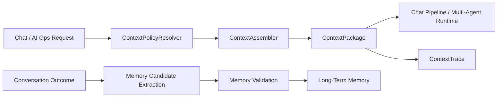

# Context Engineering 优化方案与实现记录

日期：2026-04-05

## 1. 背景

本次改造来自两个连续判断：

1. 当前项目已经有 memory、RAG、Multi-Agent、trace 等“上下文零件”，但还没有形成真正的上下文控制系统。
2. 对照近期关于智能体上下文/记忆的研究后，当前方案的主要缺口不在“缺模块”，而在“缺上下文生命周期建模”。

因此这次没有继续做更大的平台化重构，而是收敛到一版能真正改变主链路行为的 P0/P1：

- 建立统一 `ContextProfile`
- 建立统一 `ContextAssembler`
- 在 Chat / AI Ops 主链路接入 `ContextTrace`
- 把长期记忆写入从“直接抽取后落库”改为“候选 -> 校验 -> 存储”

## 2. 这次为什么这样做

### 2.1 不继续停留在纯设计

之前已经有完整设计稿：

- `todo/context-engineering-complete-design.md`

但设计稿里有两项长期没有真正进入主链路：

- token budget 和上下文选择没有真正成为运行时行为
- memory 写入没有校验层

如果继续只写设计，不改运行时链路，项目会长期停留在“概念上懂上下文工程，代码里还是 prompt 拼接”。

### 2.2 不做完整大重构

本项目当前目标仍然是“校招可上线、可演示、可讲清楚”。

所以这次刻意没有做：

- 不引入外部 context DB 服务
- 不引入复杂的 selector DSL
- 不把所有上下文决策都交给模型
- 不重写整个 Chat pipeline

本次只做最小可运行控制面。

## 3. 对照论文后的核心修正

结合近期关于智能体上下文、记忆和长上下文的公开工作，这次做了三个判断：

1. 上下文不应只看“读时装配”，还要看“写时治理”
2. 上下文对象不应只是文本块，而应带来源、时效、信任和裁剪信息
3. staged context 应先落成工程行为，再谈更复杂的策略学习

因此这次实现重点不是“更多 prompt”，而是：

- `ContextItem`
- `ContextProfile`
- `ContextAssembler`
- `ContextTrace`
- `MemoryValidation`

## 4. 目标架构



这次实现的重点有两条：

- 读链路：统一装配上下文
- 写链路：统一校验记忆写入

## 5. 本次实现的模块拆分

### 5.1 `internal/ai/contextengine`

新增包：

- `types.go`
- `resolver.go`
- `assembler.go`
- `assembler_test.go`

职责如下：

- `ContextRequest`
  - 描述一次上下文装配请求
- `ContextProfile`
  - 定义不同模式下允许使用哪些上下文源
- `ContextBudget`
  - 把 token budget 显式化
- `ContextItem`
  - 统一表示 history / memory 等上下文片段
- `ContextPackage`
  - 模型真正消费的上下文包
- `ContextAssemblyTrace`
  - 记录 selected / dropped / budget usage

### 5.2 `MemoryService`

改造文件：

- `internal/ai/service/memory_service.go`

新增能力：

- `BuildContextPlan`
  - 为 AI Ops / Chat Multi-Agent 生成 memory context + refs + context detail
- `BuildChatPackage`
  - 为 legacy chat 生成统一 `ContextPackage`
- `PersistOutcome`
  - 使用新的候选记忆校验链路

### 5.3 记忆写入校验

改造文件：

- `utility/mem/extraction.go`
- `utility/mem/extraction_test.go`

新增对象：

- `MemoryCandidate`
- `DroppedMemoryCandidate`
- `MemoryExtractionReport`

新增能力：

- `ExtractMemoryCandidates`
- `ValidateMemoryCandidate`
- `ExtractMemoriesWithReport`

当前校验规则是规则驱动的 MVP：

- 非空
- 长度边界
- 行数边界
- 代码块剔除
- assistant boilerplate 剔除

## 6. 数据模型设计

### 6.1 `ContextItem`

本次新增的字段重点不是“多”，而是“让上下文对象有治理属性”：

- `source_type`
- `source_id`
- `title`
- `score`
- `trust_level`
- `token_estimate`
- `dropped_reason`
- `timestamp`
- `freshness_score`
- `safety_label`
- `update_policy`

这让它从“文本片段”升级成“可解释的上下文证据对象”。

### 6.2 `ContextAssemblyTrace`

记录了：

- `profile`
- `stages`
- `sources_considered`
- `sources_selected`
- `dropped_items`
- `budget_before`
- `budget_after`
- `latency_ms`

用途：

- 给 Chat / AI Ops 返回 detail
- 为后续 replay / eval 留接口

## 7. 主链路改造

### 7.1 Chat legacy 路径

修改文件：

- `internal/controller/chat/chat_v1_chat.go`
- `internal/controller/chat/chat_v1_chat_stream.go`

改造前：

- 直接 `mem.BuildEnrichedContext(...)`

改造后：

- 通过 `MemoryService.BuildChatPackage(...)`
- 从 `ContextPackage.HistoryMessages` 取上下文
- 把 `ContextTrace` 转成 `detail`

影响：

- legacy chat 现在也有显式 context detail
- memory/history 不再是黑盒注入

### 7.2 AI Ops 与 Chat Multi-Agent

修改文件：

- `internal/ai/service/ai_ops_service.go`
- `internal/ai/service/chat_multi_agent.go`

改造前：

- 只取字符串形式的 memory context

改造后：

- 通过 `BuildContextPlan(...)` 获取：
  - `memory_context`
  - `memory_refs`
  - `context_detail`
- 把 `context_detail` 合并到返回 detail 里

影响：

- AI Ops / Chat Multi-Agent 现在不仅有 runtime trace，也有 context trace

## 8. staged context 这次是怎么落地的

这次没有直接做复杂的多阶段 selector，而是先实现最小 staged behavior：

- Chat 模式：
  - 先选 long-term memory
  - 再把 memory 作为 `[关键记忆]` 前置注入
  - 再拼接经过预算裁剪的 history

- AI Ops / Chat Multi-Agent：
  - 不使用 history
  - 只提供 memory context
  - triage 仍然基于 raw query

这是刻意的收敛：

- 先保证上下文分层行为正确
- 再考虑更复杂的 staged retrieval

## 9. 关键技术取舍

### 9.1 为什么没有把 docs/tool results 也一起收进 assembler

因为当前最直接的行为缺口在：

- history 无预算治理
- memory 无统一装配
- memory 写入无校验

先把这三件事收口，收益最大，风险最小。

### 9.2 为什么 `ContextTrace` 先做 detail，不先做独立 trace API

因为现在最需要的是：

- 主链路可解释
- 前端可见
- 复盘能读

detail 是最轻的落地方式。

### 9.3 为什么记忆写入先用规则校验

因为当前目标是工程稳定性，不是追求最强抽取。

规则校验的优势：

- 成本低
- 可测试
- 可解释
- 适合当前项目体量

## 10. 测试与验证

新增 / 更新测试包括：

- `internal/ai/contextengine/assembler_test.go`
- `internal/ai/service/memory_service_test.go`
- `internal/ai/service/ai_ops_service_test.go`
- `internal/ai/service/chat_multi_agent_test.go`
- `internal/controller/chat/chat_v1_chat_test.go`
- `utility/mem/extraction_test.go`

本次验证命令：

```bash
env GOCACHE=/tmp/gocache GOTMPDIR=/tmp/go-tmp go test ./internal/ai/contextengine ./internal/ai/service ./internal/controller/chat ./utility/mem
env GOCACHE=/tmp/gocache GOTMPDIR=/tmp/go-tmp go test ./...
env GOCACHE=/tmp/gocache GOTMPDIR=/tmp/go-tmp go build ./...
```

结果：

- 全部通过

## 11. 对系统的影响评估

### 11.1 正向影响

- Chat / AI Ops 现在都有统一上下文 detail
- 长期记忆写入不再是裸存
- 上下文对象开始具备来源、预算和裁剪语义
- 后续 replay / eval / safety filter 有了可复用基座

### 11.2 成本和代价

- 增加了新的上下文包与装配层
- detail 信息更多，调试更方便，但生产 UI 可能需要做折叠
- 还没有把 docs/tool results 一并纳入

## 12. 当前仍然未完成的部分

这次是 P0/P1，不是最终态。

仍未完成：

- `ContextAssembler` 暂未统一装配 docs / tool outputs
- `ContextTrace` 暂无独立查询 API
- memory validation 仍是规则驱动，不是更强的语义分类器
- 没有建立 context replay / ablation eval
- 没有完成 source trust / poisoning 防护的系统化落地

## 13. 下一步建议

如果继续推进，优先级建议是：

1. 把 docs/tool outputs 纳入 `ContextItem`
2. 为 `ContextTrace` 增加独立查询或 artifact 化
3. 建一组 context replay case
4. 再考虑更复杂的 write-time consolidation / quarantine

## 14. 这次实现的核心结论

这次改造的价值不在于“新增了一个上下文包”，而在于：

- 项目第一次把上下文工程真正接入主链路
- 项目第一次同时覆盖了读时装配和写时治理
- 项目开始从“prompt 拼接”转向“上下文控制面”

这也是后续继续做模块化 RAG、上下文安全和更深的 Multi-Agent 时，最值得保留的基础。

## 15. 第二轮推进：把 Documents 并入 ContextAssembler

在第一轮实现完成后，最大的剩余缺口是：

- history 和 memory 已经进入统一上下文层
- docs 仍然留在 `chat_pipeline` graph 内部，是一个黑盒 retriever node

这会导致两个问题：

1. 文档检索不在 `ContextTrace` 里
2. 文档无法作为 `ContextItem` 参与统一预算与裁剪

因此第二轮继续推进时，重点做了：

- 把 Chat 文档检索从 graph 内部移到 `ContextAssembler`
- 让文档成为 `ContextPackage.DocumentItems`
- 让文档选择结果进入 `ContextTrace`

### 15.1 代码变更

新增文件：

- `internal/ai/contextengine/documents.go`

修改文件：

- `internal/ai/contextengine/types.go`
- `internal/ai/contextengine/assembler.go`
- `internal/ai/agent/chat_pipeline/types.go`
- `internal/ai/agent/chat_pipeline/lambda_func.go`
- `internal/ai/agent/chat_pipeline/orchestration.go`
- `internal/controller/chat/chat_v1_chat.go`
- `internal/controller/chat/chat_v1_chat_stream.go`

### 15.2 新行为

1. `ContextAssembler` 现在会在 Chat 模式下选择 documents
2. 选择出来的文档会被转成 `ContextItem`
3. 文档内容受 `DocumentTokens` 预算约束
4. 如果预算不够，会做裁剪或丢弃，并写入 dropped reason
5. Chat pipeline 不再自己调用 retriever node，而是直接消费 `UserMessage.Documents`

### 15.3 为什么要这样改

这一步的本质不是“换一种写法”，而是让 docs 和 memory/history 真正进入同一个上下文治理平面。

只有这样，后面这些动作才有意义：

- 对 docs 和 memory 做统一 replay
- 对 docs、memory、history 做 attribution
- 明确知道是哪个 source 把模型引到某个答案上的

### 15.4 Tool Outputs 当前状态

这次一并给 `ContextRequest` 和 `ContextPackage` 留了 `ToolItems` 支持，但还没有把具体工具结果生产者接进来。

也就是说：

- `tool outputs` 的数据结构支持已预留
- 当前真正完成统一治理的是：
  - history
  - memory
  - docs

后续如果继续推进，下一步应该是把：

- AI Ops specialist 的 structured evidence
- Chat 中直接返回的大块 tool output

也转成 `ContextItem`

### 15.5 第二轮测试结果

执行：

```bash
env GOCACHE=/tmp/gocache GOTMPDIR=/tmp/go-tmp go test ./internal/ai/contextengine ./internal/ai/service ./internal/controller/chat ./internal/ai/agent/chat_pipeline
env GOCACHE=/tmp/gocache GOTMPDIR=/tmp/go-tmp go test ./...
env GOCACHE=/tmp/gocache GOTMPDIR=/tmp/go-tmp go build ./...
```

结果：

- 全部通过

### 15.6 当前完成度判断

到这一轮为止，项目的统一上下文层已经真正覆盖了：

- history
- memory
- docs

还没有完全覆盖：

- tool outputs
- retrieval rerank
- context replay query API
- source trust / poisoning 审计

这意味着当前阶段已经可以说：

> 项目具备了一套最小可运行的模块化上下文工程实现，而不是只停留在设计稿。

## 16. 第三轮推进：把 AI Ops Tool Outputs 转成 ContextItem

在前两轮之后，统一上下文层已经覆盖了：

- history
- memory
- docs

剩下最明显的缺口是：

- AI Ops specialist 已经会产出结构化 `EvidenceItem`
- 但这些 evidence 还没有进入统一上下文层

这会带来两个问题：

1. `reporter` 在聚合时还是直接消费原始 `TaskResult`
2. `tool outputs` 无法进入统一的 `ContextTrace`

因此第三轮继续推进时，重点实现了：

- 将 specialist evidence / summary 转成 `ContextItem`
- 在 reporter 聚合阶段通过 `ContextAssembler` 统一选择 `tool items`
- 将 reporter 级别的 `tool_results` 选择过程写入 trace/detail

### 16.1 代码变更

新增文件：

- `internal/ai/contextengine/tool_items.go`
- `internal/ai/contextengine/tool_items_test.go`
- `internal/ai/agent/reporter/reporter_test.go`

修改文件：

- `internal/ai/contextengine/types.go`
- `internal/ai/contextengine/resolver.go`
- `internal/ai/contextengine/assembler.go`
- `internal/ai/agent/reporter/reporter.go`
- `manifest/config/config.yaml`

### 16.2 这次具体做了什么

1. 给 `ContextProfile` 增加了 `MaxToolItems`
2. 给 `ContextBudget` 增加了 `ToolTokens`
3. 增加 `ToolItemsFromResults(...)`
   - 有 evidence 时优先转换 evidence
   - 没 evidence 时退化为 summary item
4. `reporter` 现在会：
   - 先把 child results 转成 `tool items`
   - 再通过 `ContextAssembler` 做统一选择
   - 将 `tool_results selected=...` 之类的明细写入 trace/detail
5. chat 模式下，`reporter` 的“可参考证据”优先来自 `ToolItemSnippets(...)`

### 16.3 设计意义

这一步的价值是：

- AI Ops 的工具证据第一次进入统一上下文平面
- 上下文工程第一次覆盖到 `tool outputs`
- `reporter` 不再只是字符串拼接器，而是开始消费统一上下文对象

这意味着现在统一上下文层已经覆盖了四类主来源：

- history
- memory
- docs
- tool outputs

### 16.4 这一步为什么放在 reporter

不是所有 tool output 都应该第一时间进入模型上下文。

当前项目里，最自然的收口点是 `reporter`：

- specialist 已经把原始工具输出压缩成 evidence 或 summary
- reporter 正好承担“最终回答前的上下文整理”职责

所以这次先在 reporter 聚合层落地，而不是立刻把所有工具原始输出都直接注入上游 agent。

### 16.5 当前边界

虽然 `tool outputs` 已进入统一上下文层，但当前接入点主要是：

- AI Ops specialist -> reporter

还没有完全覆盖：

- Chat ReAct 工具调用的所有原始输出
- 更细粒度的 tool provenance
- tool-level rerank / trust 策略

### 16.6 第三轮测试结果

执行：

```bash
env GOCACHE=/tmp/gocache GOTMPDIR=/tmp/go-tmp go test ./internal/ai/contextengine ./internal/ai/agent/reporter ./internal/ai/service ./internal/controller/chat
env GOCACHE=/tmp/gocache GOTMPDIR=/tmp/go-tmp go test ./...
env GOCACHE=/tmp/gocache GOTMPDIR=/tmp/go-tmp go build ./...
```

结果：

- 全部通过

### 16.7 当前完成度判断

到这一轮为止，项目已经具备一套最小但完整的模块化上下文骨架：

- `history` 统一选择
- `memory` 统一选择与写入校验
- `docs` 统一检索与裁剪
- `tool outputs` 统一转换与聚合

还未完成的增强项主要是：

- retrieval rerank
- tool trust policy
- context replay / ablation eval
- poisoning / trust / redaction 的系统化治理
