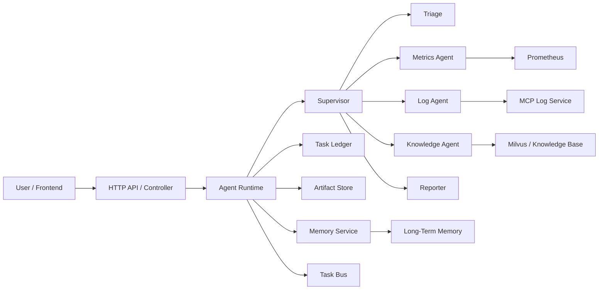
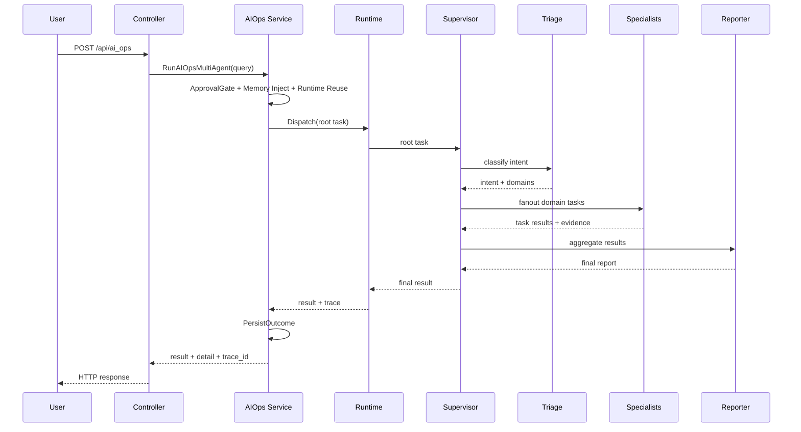
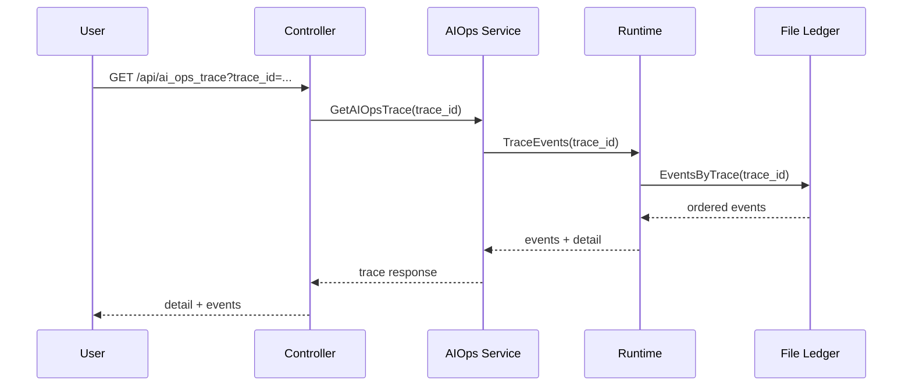
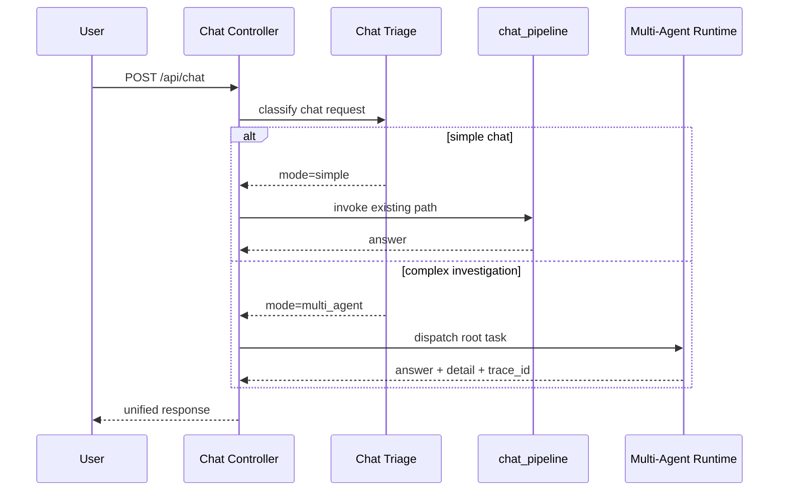

# OpsCaptionAI Multi-Agent 系统完整设计文档

## 1. 文档目的

本文档用于给当前项目提供一版可用于全面 review 的 Multi-Agent 系统总设计稿，统一覆盖：

- 需求分析
- 总体架构
- 模块划分
- 交互流程
- 数据模型
- 技术选型
- 接口定义
- 安全策略
- 分阶段开发设计
- 测试与验收
- 风险与缓解

本文档的目标不是记录某一次局部改动，而是作为当前 Multi-Agent 系统设计工作的“总说明书”。

---

## 2. 设计完成性结论

### 2.1 结论

如果以“设计文档是否已经覆盖完整 review 所需环节”为标准，结论是：

**当前 Multi-Agent 系统设计工作已经完成一版完整设计稿，可以进入全面 review 评估。**

但需要明确区分：

- **设计层面**：本次文档已覆盖完整
- **实现层面**：尚未全部完成，当前主要完成到 AI Ops 单体内 Multi-Agent 的 P1 阶段

### 2.2 当前状态矩阵

| 维度 | 状态 | 说明 |
| --- | --- | --- |
| 需求分析 | 完成 | 已明确业务目标、非目标、非功能要求 |
| 架构设计 | 完成 | 已覆盖单体内 runtime 和未来分布式 A2A 演进 |
| 模块划分 | 完成 | 已定义 controller/runtime/agent/service/tool/memory/persistence |
| 交互流程 | 完成 | 已覆盖 AI Ops、trace 查询、Phase 3 Chat 接入 |
| 数据模型 | 完成 | 已定义任务、结果、事件、产物、记忆等核心模型 |
| 接口定义 | 完成 | 已覆盖现有外部接口和内部关键接口 |
| 安全策略 | 完成 | 已覆盖鉴权、审批、工具边界、CORS、trace 保护等 |
| 技术选型 | 完成 | 已说明 Go / GoFrame / Eino / MCP / Milvus 等选型理由 |
| 分阶段计划 | 完成 | 已覆盖 Phase 0 到 Phase 4 |
| 实现完成度 | 部分完成 | 当前主要完成 AI Ops Phase 1/P1 |

### 2.3 当前执行优先级说明

需要单独强调一个执行层判断：

- AI Ops 控制器已经切到新的 Multi-Agent service
- trace 查询接口已经存在
- runtime 复用已经存在

因此，当前最急迫的下一步不是继续扩写设计，而是：

1. 跑通 AI Ops replay / eval
2. 根据实际失败类型判断 Context 与 RAG 的优先级
3. 在证据支持下进入 Chat Phase 3

这份文档解决的是“系统怎么设计”，不是“今天最先写哪块代码”。执行顺序应以评测结果为准。

---

## 3. 背景与问题定义

### 3.1 业务背景

当前项目不再是单纯的聊天应用，而是同时承担以下能力：

- 普通对话
- 流式对话
- 内部知识库检索
- 告警分析
- 日志查询
- AI Ops 报告生成
- 会话记忆
- trace 回溯

这意味着系统已经从“单模型问答”进入“多工具、多阶段、多角色协作”的复杂阶段。

### 3.2 现阶段核心问题

在单 Agent 或简单链路下，系统会逐步遇到以下问题：

- 工具越来越多，模型容易误选工具
- prompt 和上下文不断膨胀，行为越来越不稳定
- 告警、日志、知识库、数据库等能力混在一条链路里，职责不清
- 缺少统一 trace、artifact、ledger，难以回放和排障
- 不同能力边界不清，安全风险和维护成本上升

### 3.3 设计目标

Multi-Agent 设计要解决的不是“多开几个模型”，而是：

- 让复杂问题能被拆解给合适的 specialist
- 让中间过程可追踪、可回放、可审计
- 让工具权限边界清晰
- 让系统能安全地向更复杂的自动化和分布式协作演进

---

## 4. 需求分析

## 4.1 功能需求

| 编号 | 需求 | 说明 |
| --- | --- | --- |
| FR-01 | 支持复杂任务拆解 | 对告警分析、日志排障、知识问答等请求做路由和拆解 |
| FR-02 | 支持 specialist 协作 | 不同 agent 能分别处理 metrics、logs、knowledge 等域 |
| FR-03 | 支持结果汇总 | 多个 specialist 输出能统一整理成最终报告 |
| FR-04 | 支持任务追踪 | 每个请求都应具备 trace_id、task_id、event 链路 |
| FR-05 | 支持 artifact 管理 | 中间证据和结果要可持久化、可引用 |
| FR-06 | 支持记忆注入与提取 | 会话记忆与长期记忆需要统一管理 |
| FR-07 | 支持审批控制 | 高风险动作不能直接放给 agent 自主执行 |
| FR-08 | 支持降级 | 任意 specialist 或 tool 失败时，主链路可继续并给出解释 |
| FR-09 | 支持 trace 查询 | 外部可根据 trace_id 查询运行过程 |
| FR-10 | 支持未来 Chat 接入 | 设计需兼容后续 `/chat` 的 Multi-Agent 化 |

## 4.2 非功能需求

| 编号 | 需求 | 说明 |
| --- | --- | --- |
| NFR-01 | 可维护性 | 模块边界清晰，后续新增 agent 不需要重写主链路 |
| NFR-02 | 可观测性 | 能基于 trace 和 artifact 回放问题 |
| NFR-03 | 安全性 | 工具调用、审批、鉴权、CORS 要可控 |
| NFR-04 | 可扩展性 | 从单体内 runtime 平滑演进到分布式 A2A |
| NFR-05 | 一致性 | 不同入口对 memory、trace、approval 等行为保持一致 |
| NFR-06 | 成本可控 | 不因为 Multi-Agent 设计无限放大模型开销 |

## 4.3 非目标

- 当前阶段不做 fully autonomous swarm
- 当前阶段不允许 agent 直接执行高风险副作用动作
- 当前阶段不直接把全部普通 chat 流量迁移到 Multi-Agent
- 当前阶段不要求一开始就是分布式 A2A

---

## 5. 当前基础与约束

### 5.1 当前代码基础

当前仓库已具备以下可复用资产：

- 单 Agent 对话链路：`internal/ai/agent/chat_pipeline/`
- AI Ops 控制器：`internal/controller/chat/chat_v1_ai_ops.go`
- Multi-Agent runtime 雏形：`internal/ai/runtime/`
- Specialist：
  - `metrics`
  - `logs`
  - `knowledge`
  - `reporter`
  - `triage`
  - `supervisor`
- Tool 层：
  - Prometheus
  - MCP 日志工具
  - Internal docs RAG
  - MySQL
  - current time
- 记忆层：`utility/mem/`
- 持久化 trace/artifact：文件型 ledger / artifact store

### 5.2 当前设计约束

- 当前主系统仍是 Go 单体服务
- 当前外部基础设施依赖包括 Milvus、MCP、Prometheus、MySQL
- 现阶段更适合做“单体内编排式 Multi-Agent”，而不是直接服务化拆分

---

## 6. 总体架构设计

## 6.1 总体架构图



## 6.2 分层说明

| 层级 | 责任 |
| --- | --- |
| API / Controller | 接收请求、参数校验、响应封装 |
| Service | 业务编排入口、memory/approval/runtime 管理 |
| Runtime | agent 注册、任务派发、event 发布、artifact/ledger 接入 |
| Agent | 任务拆解、专域处理、结果汇总 |
| Tool Adapter | 屏蔽 Prometheus/MCP/Milvus 等外部差异 |
| Persistence | trace、task、artifact、记忆 |

## 6.3 核心设计原则

1. 控制器只负责入参与出参，不直接承担复杂 agent 行为
2. 所有 agent 通过统一协议通信，而不是直接传自然语言字符串
3. 所有中间过程都尽可能沉淀为 event 或 artifact
4. 高风险动作必须经过审批门
5. 先做单体内 runtime，再根据收益决定是否分布式

---

## 7. 分阶段开发设计

## 7.1 Phase 0：设计与基础协议阶段

目标：

- 明确系统边界
- 建立协议对象
- 建立 runtime 基础骨架

关键设计内容：

- `TaskEnvelope`
- `TaskResult`
- `TaskEvent`
- `ArtifactRef`
- runtime context
- in-memory ledger / artifact store

状态：

- 已完成并实现

## 7.2 Phase 1：AI Ops 单体内 Multi-Agent MVP

目标：

- 先在 AI Ops 复杂场景验证 Multi-Agent 的业务价值

关键设计内容：

- `supervisor + triage + metrics + logs + knowledge + reporter`
- AI Ops 控制器切换到 runtime
- 统一 detail 输出

状态：

- 已完成并实现
- `/ai_ops` 控制器已切到 `RunAIOpsMultiAgent`
- 当前阶段的重点应从“接线”转向“评测与归因”

## 7.3 Phase 2：P1 稳定化与可回溯阶段

目标：

- 让系统从“能跑”进入“可维护、可回放、可审计”

关键设计内容：

- file-backed ledger
- file-backed artifact store
- Memory Service
- Approval Gate
- runtime 实例复用
- trace 查询接口
- replay baseline
- bounded async memory extraction

状态：

- 大部分已完成并实现

## 7.4 Phase 3：Chat 链路接入 Multi-Agent

目标：

- 保留现有 `chat_pipeline` 作为 fallback
- 对复杂 chat 请求提供 Multi-Agent 路由能力

关键设计内容：

- chat triage
- dual-path execution
- unified chat response shape
- chat replay/eval

状态：

- 设计已完成
- 实现尚未整体切流

## 7.5 Phase 4：分布式 A2A 演进

目标：

- 当单体内 runtime 的复杂度和吞吐达到上限时，再考虑服务化拆分

关键设计内容：

- 分布式 task bus
- 统一 A2A 协议
- 远程 agent 调用
- 分布式 trace
- artifact 外部存储

状态：

- 仅完成架构设计，尚未实施

---

## 8. 模块划分设计

## 8.1 API / Controller 模块

职责：

- 接收 HTTP 请求
- 验证参数
- 调用对应 service
- 返回统一响应

现有接口：

- `/api/chat`
- `/api/chat_stream`
- `/api/upload`
- `/api/ai_ops`
- `/api/ai_ops_trace`

## 8.2 Service 模块

职责：

- 作为控制器与 runtime 的业务桥梁
- 封装 memory、approval、runtime 复用、trace 查询等通用逻辑

关键 service：

- `RunAIOpsMultiAgent`
- `GetAIOpsTrace`
- `MemoryService`
- `ApprovalGate`

## 8.3 Runtime 模块

职责：

- 管理 agent 生命周期
- 负责任务 dispatch
- 记录 task / event / result
- 管理 artifact 持久化

关键子模块：

- `Registry`
- `Runtime`
- `Ledger`
- `Bus`
- `ArtifactStore`

## 8.4 Agent 模块

职责：

- 处理具体问题域
- 返回结构化 `TaskResult`

当前 agent：

- `Supervisor`
- `Triage`
- `Metrics Agent`
- `Log Agent`
- `Knowledge Agent`
- `Reporter`

未来扩展 agent：

- `SQL Agent`
- `Memory Agent`
- `Action Agent`

## 8.5 Tool Adapter 模块

职责：

- 屏蔽外部系统差异
- 提供统一可调用接口

当前工具域：

- Prometheus
- MCP Log Tools
- Internal Docs Retriever
- MySQL
- Current Time

## 8.6 Persistence 模块

职责：

- 保存 task、result、event、artifact、memory

当前实现：

- Task / result / trace：文件型持久化
- artifact：文件型持久化
- memory：进程内 + 结构化长期记忆

未来演进：

- ledger：Redis / MySQL / message bus
- artifact：对象存储或数据库

---

## 9. Agent 设计

## 9.1 Supervisor

职责：

- 发起 triage
- 根据 triage 结果 fanout specialist
- 聚合 specialist 结果
- 调用 reporter 生成最终答案

输入：

- 用户目标
- session 上下文
- constraints

输出：

- 聚合后的最终 `TaskResult`

## 9.2 Triage

职责：

- 给出意图分类
- 给出 domain 列表
- 给出 priority

当前策略：

- 规则表驱动关键词匹配

未来策略：

- 可升级为配置化规则或轻量模型分类

## 9.3 Metrics Agent

职责：

- 获取当前 Prometheus 活跃告警
- 生成告警证据
- 在工具失败时返回 degraded，而不是直接打断主链路

## 9.4 Log Agent

职责：

- 发现并调用日志 MCP 工具
- 从 JSON 或文本输出中提取日志证据
- 对无结构返回或工具异常做降级

## 9.5 Knowledge Agent

职责：

- 检索知识库文档
- 输出文档摘要和 evidence

## 9.6 Reporter

职责：

- 聚合 specialist 输出
- 生成人类可读报告
- 汇总 evidence

---

## 10. 交互流程设计

## 10.1 AI Ops 请求流程



## 10.2 Trace 查询流程



## 10.3 Phase 3 Chat 双路径流程



---

## 11. 数据模型设计

## 11.1 TaskEnvelope

用途：

- agent 之间传递统一任务对象

关键字段：

| 字段 | 含义 |
| --- | --- |
| `task_id` | 当前任务唯一标识 |
| `parent_task_id` | 父任务 ID |
| `session_id` | 会话标识 |
| `trace_id` | 请求级追踪标识 |
| `goal` | 任务目标 |
| `assignee` | 当前 agent |
| `intent` | triage 结果 |
| `priority` | 优先级 |
| `input` | 结构化输入 |
| `constraints` | 执行约束 |
| `memory_refs` | 注入记忆引用 |
| `artifact_refs` | 上游产物引用 |

## 11.2 TaskResult

用途：

- 表示某个 agent 对某个任务的处理结果

关键字段：

| 字段 | 含义 |
| --- | --- |
| `task_id` | 任务 ID |
| `agent` | agent 名称 |
| `status` | `succeeded / failed / degraded` |
| `summary` | 摘要结论 |
| `confidence` | 置信度 |
| `evidence` | 证据列表 |
| `artifact_refs` | 结果产物引用 |
| `metadata` | 附加元数据 |
| `error` | 结构化错误 |

## 11.3 TaskEvent

用途：

- 表示任务运行过程中的事件

事件类型示例：

- `task_started`
- `task_info`
- `task_completed`
- `task_failed`

## 11.4 Artifact

用途：

- 持久化中间结果，避免大文本直接在 agent 间传输

字段：

- `ref`
- `content`
- `metadata`
- `created_at`

## 11.5 MemoryRef

用途：

- 记录当前任务实际引用了哪些 memory 项

## 11.6 外部 API Trace 响应模型

`AIOpsTraceRes` 字段：

- `trace_id`
- `detail`
- `events`

---

## 12. 接口定义

## 12.1 外部 HTTP 接口

| 方法 | 路径 | 说明 | 当前状态 |
| --- | --- | --- | --- |
| `POST` | `/api/chat` | 普通对话 | 已实现 |
| `POST` | `/api/chat_stream` | 流式对话 | 已实现 |
| `POST` | `/api/upload` | 文件上传 | 已实现 |
| `POST` | `/api/ai_ops` | AI 运维分析 | 已实现 |
| `GET` | `/api/ai_ops_trace` | 查询 AI Ops trace | 已实现 |

### `/api/ai_ops`

请求：

```json
{
  "query": "请分析当前 Prometheus 告警并结合日志排查"
}
```

响应：

```json
{
  "trace_id": "trace-xxx",
  "result": "最终报告",
  "detail": ["[supervisor] ...", "[metrics] ..."]
}
```

### `/api/ai_ops_trace`

请求：

```json
{
  "trace_id": "trace-xxx"
}
```

响应：

```json
{
  "trace_id": "trace-xxx",
  "detail": ["[supervisor] ..."],
  "events": [
    {
      "event_id": "evt-1",
      "task_id": "task-1",
      "trace_id": "trace-xxx",
      "type": "task_started",
      "agent": "supervisor",
      "message": "supervisor started orchestration",
      "created_at": 123456789
    }
  ]
}
```

## 12.2 内部关键接口

### Agent

职责：

- 所有 agent 都必须实现统一接口

语义：

- `Name()`
- `Capabilities()`
- `Handle(ctx, task)`

### Ledger

职责：

- 记录 task / status / result / event

语义：

- `CreateTask`
- `UpdateTaskStatus`
- `AppendResult`
- `AppendEvent`
- `EventsByTrace`
- `ListChildren`

### ArtifactStore

职责：

- 保存和读取 artifact

### Service

关键 service 语义：

- `RunAIOpsMultiAgent`
- `GetAIOpsTrace`
- `MemoryService.ResolveSessionID`
- `MemoryService.InjectContext`
- `MemoryService.PersistOutcome`

---

## 13. 安全策略设计

## 13.1 身份认证与鉴权

要求：

- 生产环境开启鉴权
- 未配置 secret 时拒绝启动
- 认证上下文注入 `user_id` 和 `role`

## 13.2 工具最小权限

原则：

- 每个 specialist 只能看到自己的工具

当前约束：

- `Metrics Agent` 只负责 Prometheus
- `Log Agent` 只负责日志工具
- `Knowledge Agent` 只负责知识库

未来要求：

- 将工具白名单机制进一步显式化

## 13.3 审批门

原则：

- 高风险动作必须先通过 Approval Gate

当前实现：

- 对 `delete/drop/update/insert/删除/修改/执行` 等高风险关键词拦截

未来演进：

- 改为可配置策略 + 人工审批

## 13.4 CORS 与 SSE

要求：

- 只允许白名单 origin
- SSE 不再无条件 `*`

## 13.5 Trace 与 Artifact 数据保护

要求：

- trace 只记录必要信息
- 不在 event/message 中泄露不必要敏感数据
- 后续若对外开放 trace 页面，需要做访问控制和脱敏

## 13.6 Memory 安全

要求：

- 记忆抽取必须有 timeout
- 长期记忆必须有容量上限
- 后续若引入更复杂记忆抽取，必须统一经过 service 层

---

## 14. 技术选型

| 组件 | 选型 | 理由 |
| --- | --- | --- |
| 服务语言 | Go | 与当前项目一致，适合单体内高并发编排 |
| Web 框架 | GoFrame | 项目现有基础 |
| Agent 编排 | Eino / 自定义 runtime | 已有现成依赖与代码基础 |
| 外部工具协议 | MCP | 适合日志工具等外部能力接入 |
| 知识库 | Milvus | 项目现有向量检索基础 |
| 持久化 ledger | 文件型存储 | 当前阶段低依赖、易本地调试 |
| Artifact Store | 文件型存储 | 当前阶段成本低、足够支撑 replay |
| 关系数据 | MySQL | 现有能力，可供后续 SQL Agent 使用 |
| 追踪模型 | trace_id / task_id / event | 低成本可观测方案 |

### 14.1 为什么当前不直接上 Redis / NATS / gRPC

原因：

- 现阶段核心目标是验证协作模型，而不是先把基础设施复杂度做满
- 当前 AI Ops 规模与吞吐还不足以支撑直接服务化的收益

### 14.2 为什么 Phase 3 不直接切换 Chat 主路径

原因：

- `chat_pipeline` 当前是稳定路径
- Chat 与 AI Ops 的复杂度不同
- 应先用双路径和 replay 控制风险

---

## 15. 性能与可扩展性设计

## 15.1 当前性能策略

- specialist fanout 采用并发执行
- runtime 实例复用，避免重复初始化
- bounded async memory extraction，避免后台任务无限增长
- evidence 条数和日志/知识返回数量有限制

## 15.2 当前性能风险

- 文件型 ledger/artifact 在高并发下可能成为瓶颈
- MCP 工具时延波动可能拖慢整体 AI Ops 响应
- reporter 当前为串行汇总，未来复杂度增加后可能成为热点

## 15.3 未来扩展方向

- ledger 切换为 Redis / DB / MQ
- artifact 切换为对象存储
- 对 specialist 加并发和配额控制
- 对 tool 调用引入统一超时、熔断和缓存

---

## 16. 可观测性与复盘设计

## 16.1 当前可观测资产

- `trace_id`
- `task_id`
- `TaskEvent`
- `Task Ledger`
- `Artifact Store`
- `AIOpsTrace` 查询接口

## 16.2 复盘所需最小信息集

一次可复盘请求至少要能拿到：

- 原始 query
- trace_id
- task event 序列
- specialist 输出摘要
- 关键 evidence
- 是否 degraded

## 16.3 Replay / Eval 设计

当前已建立最小 AI Ops replay baseline。

后续要求：

- 增加真实 tool case
- 增加 chat replay
- 增加 degraded / timeout / empty result case

---

## 17. 测试与验收设计

## 17.1 测试分层

| 类型 | 覆盖目标 |
| --- | --- |
| 单元测试 | protocol、runtime、memory、tool adapter、controller 局部行为 |
| 编排测试 | supervisor / triage / reporter 联动 |
| replay 测试 | 典型业务 case 稳定回放 |
| 集成测试 | trace 查询、持久化读写 |
| 安全测试 | approval gate、CORS、鉴权、限流 |

## 17.2 当前验收标准

P1 阶段建议满足：

- `go test ./...` 通过
- `go build ./...` 通过
- AI Ops replay baseline 通过
- trace 查询可读
- bounded memory extraction 生效

## 17.3 Phase 3 验收标准

- Chat triage 可区分简单/复杂请求
- 双路径执行可回退
- chat replay 基线通过
- 普通 chat 质量不下降

---

## 18. 部署与演进设计

## 18.1 当前部署模型

- 单个 Go 服务进程
- 外接 Milvus / MCP / Prometheus / MySQL
- runtime、ledger、artifact 在本进程内协调

## 18.2 未来演进路径

### 路线 A：继续强化单体内 runtime

适用条件：

- 业务吞吐中等
- 主要目标是稳定性和维护性

### 路线 B：演进为分布式 A2A

适用条件：

- specialist 数量显著增加
- 外部依赖复杂度明显上升
- 需要多团队独立维护不同 agent

---

## 19. 风险与缓解

| 风险 | 说明 | 缓解 |
| --- | --- | --- |
| 工具不稳定 | MCP / Prometheus 等外部依赖波动 | timeout + degraded + replay |
| 误路由 | Triage 当前仍是规则表 | 增加 replay case，后续升级分类能力 |
| 产物膨胀 | trace / artifact 随运行增加 | 后续引入归档和 retention 策略 |
| 文件存储瓶颈 | 高并发下文件型 ledger 吞吐有限 | 下一阶段切到外部后端 |
| Chat 全量切换风险 | 影响当前稳定主链路 | 只做双路径灰度，不直接替换 |
| 安全边界不足 | future SQL / Action 风险高 | Approval Gate + tool whitelist + human-in-the-loop |

---

## 20. Review 检查清单

在 review 当前设计时，建议至少检查以下问题：

1. 角色拆分是否与真实业务复杂度匹配
2. runtime 是否承担了过多业务逻辑
3. 是否所有关键路径都可追踪、可回放
4. controller 与 service 的职责边界是否清晰
5. 是否存在未统一收口的 memory / approval / trace 行为
6. file-backed persistence 是否足以支撑当前阶段
7. Phase 3 Chat 接入是否保留了足够的 fallback 能力
8. 安全策略是否覆盖审批、鉴权、CORS、工具边界和数据保护

---

## 21. 当前实现映射

设计与实现的对应关系如下：

| 设计项 | 当前实现状态 |
| --- | --- |
| 协议层 | 已实现 |
| Runtime | 已实现 |
| Supervisor / Triage / Specialists / Reporter | 已实现 |
| AI Ops 切换到 Multi-Agent | 已实现 |
| file-backed ledger / artifact | 已实现 |
| runtime 复用 | 已实现 |
| trace 查询接口 | 已实现 |
| bounded memory extraction | 已实现 |
| replay baseline | 已实现基础版 |
| Chat Phase 3 | 已设计，未整体切流 |
| 分布式 A2A | 已设计，未实现 |

---

## 22. 最终结论

针对当前项目，Multi-Agent 系统设计工作已经形成一版完整、可 review 的总设计稿。

结论可以分成两句：

1. **设计工作：已完成一版完整设计，可进入全面 review。**
2. **工程实现：当前已完成到 AI Ops 的 P1 阶段，后续重点是 Phase 3 Chat 接入与更强的治理能力。**

一句话总结：

> 当前项目的 Multi-Agent 设计已经从“局部想法”收敛成“有目标、有边界、有阶段、有接口、有安全策略、有验收标准”的完整系统设计，可以据此开展体系化 review 和后续实现推进。
