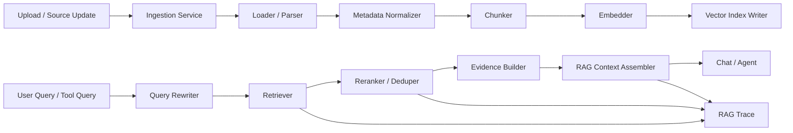
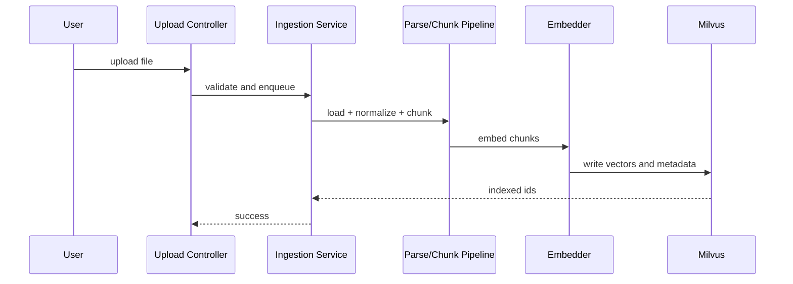
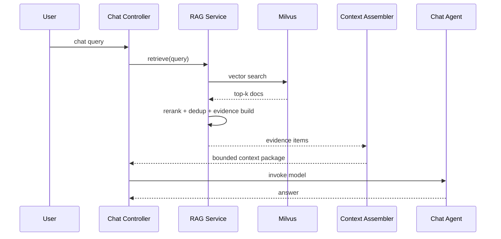
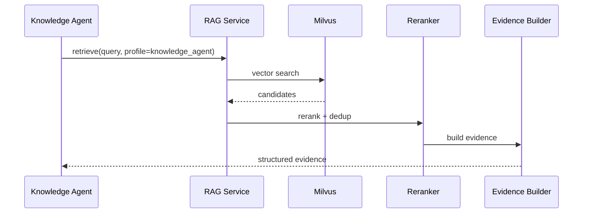

# OnCallAI RAG 工程完整设计文档

## 1. 文档目的

本文档用于对当前项目的 RAG 模块进行系统 review，并形成一版完整、可评审、可实施的 RAG 工程总设计稿。

本文档统一覆盖：

- 需求分析
- 当前实现 review
- 架构设计
- 模块划分
- 交互流程
- 数据模型
- 技术选型
- 接口定义
- 安全策略
- 分阶段开发设计
- 验收与评估体系

本文档目标有三个：

1. 判断当前项目的 RAG 模块是否需要优化
2. 说明当前系统是否适合拆解为模块化 RAG
3. 给出一套可供后续开发和 review 使用的完整系统设计

---

## 2. 结论摘要

### 2.1 结论

**当前项目的 RAG 模块明确需要优化。**

原因不是“完全没有 RAG”，而是：

- 已经有基础的索引、检索、入库和 chat 接入能力
- 但当前实现更接近“可用的 Milvus 检索链路”，还没有形成完整的“RAG 工程系统”

换句话说：

- 当前项目已经有 `index + retrieve + prompt injection`
- 但还缺少真正的 `ingestion control + retrieval quality control + context assembly + evaluation + governance`

### 2.2 当前判断

| 维度 | 状态 | 结论 |
| --- | --- | --- |
| 入库流程 | 已有 | 但格式适配和 metadata 治理较弱 |
| 切分策略 | 已有 | 但当前主要是 markdown header splitter，泛化性不够 |
| 向量索引 | 已有 | 但缺少版本化与多集合治理 |
| 检索流程 | 已有 | 但没有 rerank、去重、混合检索和 query rewrite |
| Chat 接入 | 已有 | 但 documents 注入偏直接 |
| Token 预算联动 | 缺失 | RAG 返回结果没有和上下文预算协同 |
| 检索 trace | 缺失 | 无法完整回答“检索到了什么，为什么选这些” |
| RAG 评测体系 | 缺失 | 没有 offline eval / replay / hit-rate 基线 |
| 安全治理 | 部分缺失 | 缺少 prompt injection 和敏感文档治理 |

### 2.3 设计完成性结论

如果以“RAG 设计文档是否已经覆盖全面 review 所需关键环节”为标准，结论是：

**本次文档已经提供一版完整的 RAG 工程设计稿，可以进入全面 review。**

但同样需要区分：

- **设计层面**：本次文档已完整覆盖
- **实现层面**：当前仍处于基础版 RAG，尚未升级到模块化工程化阶段

### 2.4 当前排期说明

需要补充一个执行判断：

- 这份文档说明“RAG 模块需要优化”
- 但不等于“RAG 一定是当前下一步的最高优先级”

当前更合理的方式是：

1. 先完成 AI Ops Multi-Agent 的 replay / eval
2. 如果主要失败来自召回差、chunk 切分差、citation 弱、grounding 不稳，则优先做模块化 RAG
3. 如果主要失败来自 history 污染、memory 误注入、budget 失控，则应先做上下文工程

---

## 3. 当前项目中的 RAG 现状

## 3.1 当前已有 RAG 相关能力

当前项目已经具备以下 RAG 基础组件：

### 1. 向量检索

代码位置：

- [retriever.go](/Users/agiuser/Agent/OnCallAI/internal/ai/retriever/retriever.go)

当前能力：

- 基于 Milvus 检索文档
- 使用 embedding 模型生成 query embedding
- 支持配置 `top_k`
- 对部分 Milvus 空集合异常做兼容

### 2. 向量索引

代码位置：

- [indexer.go](/Users/agiuser/Agent/OnCallAI/internal/ai/indexer/indexer.go)

当前能力：

- 将切分后的文档写入 Milvus
- 复用统一 embedding 模型

### 3. Embedding

代码位置：

- [embedder.go](/Users/agiuser/Agent/OnCallAI/internal/ai/embedder/embedder.go)

当前能力：

- 使用 OpenAI-compatible embedding provider
- 从配置读取模型、API key 和 base URL

### 4. 入库编排

代码位置：

- [orchestration.go](/Users/agiuser/Agent/OnCallAI/internal/ai/agent/knowledge_index_pipeline/orchestration.go)
- [loader.go](/Users/agiuser/Agent/OnCallAI/internal/ai/agent/knowledge_index_pipeline/loader.go)
- [transformer.go](/Users/agiuser/Agent/OnCallAI/internal/ai/agent/knowledge_index_pipeline/transformer.go)

当前能力：

- 文件加载
- 文档切分
- 向量写入

### 5. 上传入库入口

代码位置：

- [chat_v1_file_upload.go](/Users/agiuser/Agent/OnCallAI/internal/controller/chat/chat_v1_file_upload.go)

当前能力：

- 文件上传
- 基础类型校验
- 入库前删除同源旧记录
- 调用知识库索引图完成索引

### 6. Chat / Tool 接入

代码位置：

- [orchestration.go](/Users/agiuser/Agent/OnCallAI/internal/ai/agent/chat_pipeline/orchestration.go)
- [prompt.go](/Users/agiuser/Agent/OnCallAI/internal/ai/agent/chat_pipeline/prompt.go)
- [query_internal_docs.go](/Users/agiuser/Agent/OnCallAI/internal/ai/tools/query_internal_docs.go)

当前能力：

- Chat 路径会直接把检索结果接到 prompt 中的 `documents`
- Tool 路径可通过 `query_internal_docs` 返回检索结果

---

## 3.2 当前主要问题

### 问题 1：当前更像“向量检索接入”，不是完整 RAG 工程

当前链路大致是：

- 上传文档
- 切分
- embed
- 写 Milvus
- 查询时直接 top-k 检索
- 结果直接注入 prompt

缺少的关键环节包括：

- metadata 标准化
- query rewrite
- rerank
- dedup
- chunk 级质量治理
- context compression
- retrieval trace
- evaluation

### 问题 2：切分策略过于单一

当前知识库切分主要依赖：

- markdown header splitter

问题：

- 对 markdown 文档友好
- 但对 PDF、DOCX、CSV、JSON、YAML 等并不一定合理
- 不同类型文档没有专门 chunking 策略

### 问题 3：检索结果直接进入 prompt，缺少中间“证据层”

当前 chat prompt 中的 `documents` 区块是直接注入的。

问题：

- 没有 evidence 去重
- 没有 relevance 重排
- 没有摘要压缩
- 没有上下文预算协同

这会导致：

- 噪音高
- prompt 负担重
- 高价值片段未必排前面

### 问题 4：RAG 与上下文工程没有真正打通

项目里虽然已经有：

- token budget 工具
- short-term memory
- long-term memory

但 RAG 文档结果没有进入统一上下文预算规划。

这意味着：

- 文档和 history / memory / system prompt 之间没有统一预算协调

### 问题 5：RAG 可观测性不足

当前系统无法方便回答：

- 检索召回了哪些 chunk
- 为什么选了这几个
- 哪些 chunk 被丢弃
- 哪些 chunk 因预算不足没进入最终 prompt

### 问题 6：缺少 RAG 质量评测体系

当前还没有：

- retrieval hit rate 基线
- answer grounding 评估
- replay case
- chunk strategy A/B 评测

### 问题 7：缺少 RAG 安全治理

当前还缺：

- 敏感文档隔离
- 文档级 ACL / source trust
- prompt injection 片段隔离
- 文档版本和过期治理

---

## 4. RAG 工程设计目标

RAG 工程的目标不是单纯提高召回数量，而是：

> 建立一个可模块化、可观测、可评估、可治理的知识检索与证据供给系统，让模型能在受控上下文内使用高质量知识。

细化目标：

1. 把入库、切分、索引、检索、重排、注入、评测拆成可独立演进的模块
2. 让文档结果以 evidence 形式供模型消费，而不是直接堆原文
3. 让 RAG 与上下文工程统一协同
4. 建立 retrieval trace 和评测基线
5. 为未来 Multi-Agent specialist 提供可复用的 RAG 服务层

---

## 5. 需求分析

## 5.1 功能需求

| 编号 | 需求 | 说明 |
| --- | --- | --- |
| FR-01 | 支持多格式文档入库 | Markdown、TXT、PDF、DOCX、CSV、JSON、YAML 等 |
| FR-02 | 支持模块化切分 | 不同文档格式可使用不同 chunk 策略 |
| FR-03 | 支持元数据标准化 | 文档、chunk、来源、版本、时间等信息统一 |
| FR-04 | 支持多阶段检索 | query rewrite / retrieve / rerank / dedup |
| FR-05 | 支持 evidence 组装 | 返回结构化证据而非裸文档 |
| FR-06 | 支持与上下文预算协同 | RAG 输出受上下文预算控制 |
| FR-07 | 支持检索 trace | 可记录召回、重排、丢弃和注入情况 |
| FR-08 | 支持 RAG 工具化 | Chat 与 Multi-Agent specialist 都可复用 |
| FR-09 | 支持索引更新与替换 | 文档重复上传时能替换旧索引 |
| FR-10 | 支持 RAG 评测 | 支持 replay、hit-rate、grounding 评估 |

## 5.2 非功能需求

| 编号 | 需求 | 说明 |
| --- | --- | --- |
| NFR-01 | 可维护性 | 不同环节可以独立优化 |
| NFR-02 | 可观测性 | 能解释一次检索为什么得到这些结果 |
| NFR-03 | 可扩展性 | 能支持更多检索器、reranker 和知识源 |
| NFR-04 | 安全性 | 文档与知识源必须具备隔离、脱敏和可信控制 |
| NFR-05 | 成本可控 | 不因盲目 top-k 扩大 token 和 embedding 成本 |
| NFR-06 | 一致性 | Chat、AI Ops、Knowledge Agent 使用统一 RAG 接口 |

## 5.3 非目标

- 当前阶段不做最复杂的 Graph RAG / Agentic RAG 平台
- 当前阶段不要求同时支持多数据库检索后端
- 当前阶段不把所有检索决策都交给模型自动完成

---

## 6. 总体架构设计

## 6.1 RAG 总体架构图

## 6.2 分层说明

| 层级 | 责任 |
| --- | --- |
| Ingestion | 接收源文档、统一解析输入 |
| Normalization | 统一 metadata、source identity、doc version |
| Chunking | 文档切分策略管理 |
| Embedding / Indexing | 向量生成与入库 |
| Retrieval | 召回候选 chunk |
| Rerank / Dedup | 提升结果质量，减少重复与噪音 |
| Evidence Building | 把 chunk 变成模型可消费的证据 |
| Context Assembly | 和上下文工程协同，控制最终注入 |
| Trace / Eval | 提供可回放和可量化评估能力 |

---

## 7. 模块划分设计

## 7.1 Ingestion 模块

职责：

- 接收上传文档或文档变更
- 校验文件类型、大小和来源
- 触发入库作业

建议职责边界：

- Controller 不直接做复杂入库逻辑
- Service 层调度 ingestion pipeline

## 7.2 Loader / Parser 模块

职责：

- 针对不同格式提取原始文本与结构信息

建议按类型拆分：

- Markdown loader
- Plain text loader
- PDF loader
- Office loader
- Structured data loader（CSV / JSON / YAML）

## 7.3 Metadata Normalizer 模块

职责：

- 标准化：
  - source id
  - source path
  - source type
  - title
  - version
  - upload timestamp
  - chunk order
  - language

### 重要性

这是模块化 RAG 的关键，因为后续 rerank、filter、trace、deletion 都依赖标准 metadata。

## 7.4 Chunker 模块

职责：

- 按文档类型选择合适切分策略

建议策略：

- Markdown：header-aware chunking
- PDF/DOCX：paragraph + heading aware
- CSV/JSON/YAML：record-aware / field-aware
- 长文本：semantic + size constraint

## 7.5 Embedding 模块

职责：

- 统一 embedding provider
- 管理 embedding model 版本与维度

建议增强：

- model version tagging
- embedding retry policy
- embedding cost metrics

## 7.6 Index Writer 模块

职责：

- 把 chunk 与 metadata 写入 Milvus
- 支持按 source 替换旧索引

建议增强：

- source version 化
- soft delete / replace semantics
- bulk write 统计

## 7.7 Retriever 模块

职责：

- 根据 query 召回候选 chunk

建议支持：

- vector retrieval
- metadata filter
- top-k retrieval

未来扩展：

- hybrid retrieval
- sparse + dense

## 7.8 Query Rewriter 模块

职责：

- 对 query 做规范化或重写

适用场景：

- 同义表达统一
- 问题补全
- 中文 / 英文关键字扩展
- 时间窗口补充

## 7.9 Reranker / Deduper 模块

职责：

- 对召回结果二次排序
- 去掉重复或近重复 chunk
- 合并过碎片化结果

## 7.10 Evidence Builder 模块

职责：

- 把原始文档 chunk 转成结构化 evidence

输出示例：

- 标题
- 摘要
- snippet
- source
- score
- reason

## 7.11 RAG Context Assembler 模块

职责：

- 把 evidence 接入统一上下文工程
- 与 token budget 协同控制最终注入量

## 7.12 RAG Trace 模块

职责：

- 记录每次检索过程：
  - rewrite 结果
  - retrieve 结果
  - rerank 结果
  - dropped items
  - final injected evidence

## 7.13 RAG Eval 模块

职责：

- 对 retrieval 和 answer grounding 做离线评估

---

## 8. 交互流程设计

## 8.1 文档入库流程

## 8.2 Chat 检索流程

## 8.3 AI Ops / Knowledge Agent 检索流程

AI Ops 与 specialist 不应直接消费原始 doc 列表，而应消费 evidence package。

---

## 9. 数据模型设计

## 9.1 DocumentSource

用途：

- 表示原始知识源

字段建议：

| 字段 | 含义 |
| --- | --- |
| `source_id` | 源唯一标识 |
| `source_type` | `md / pdf / docx / csv / json / yaml` |
| `title` | 标题 |
| `path` | 文件路径 |
| `checksum` | 内容校验 |
| `version` | 版本号 |
| `uploaded_at` | 上传时间 |
| `status` | `active / replaced / deleted` |

## 9.2 ChunkRecord

用途：

- 表示切分后的知识片段

字段建议：

| 字段 | 含义 |
| --- | --- |
| `chunk_id` | chunk 唯一标识 |
| `source_id` | 所属原始文档 |
| `chunk_index` | chunk 序号 |
| `content` | chunk 内容 |
| `summary` | 可选摘要 |
| `metadata` | 结构化元数据 |
| `token_estimate` | 估算 token |
| `embedding_model` | embedding 模型版本 |

## 9.3 RetrievalRequest

字段建议：

- `request_id`
- `trace_id`
- `query`
- `profile`
- `top_k`
- `filters`
- `budget`

## 9.4 RetrievalHit

字段建议：

- `chunk_id`
- `source_id`
- `score`
- `raw_rank`
- `rerank_score`
- `snippet`
- `selected`
- `dropped_reason`

## 9.5 RAGEvidence

字段建议：

- `evidence_id`
- `source_id`
- `title`
- `snippet`
- `score`
- `reason`
- `uri`

## 9.6 RAGTrace

字段建议：

- `trace_id`
- `query_original`
- `query_rewritten`
- `retrieved_hits`
- `reranked_hits`
- `selected_evidence`
- `dropped_hits`
- `latency_ms`

## 9.7 IndexJob

字段建议：

- `job_id`
- `source_id`
- `status`
- `chunk_count`
- `vector_count`
- `error`
- `started_at`
- `finished_at`

---

## 10. 接口定义

## 10.1 外部 HTTP 接口

当前已有：

- `POST /api/upload`
- `POST /api/chat`
- `POST /api/ai_ops`

未来建议新增：

- `GET /api/rag_trace`
- `POST /api/rag_reindex`
- `GET /api/rag_source_status`

## 10.2 内部接口建议

### IngestionService

建议职责：

- `Ingest(ctx, source) (*IndexJob, error)`
- `ReplaceSource(ctx, source) (*IndexJob, error)`

### Chunker

建议职责：

- `Chunk(ctx, doc, policy) ([]ChunkRecord, error)`

### Retriever

建议职责：

- `Retrieve(ctx, request) ([]RetrievalHit, error)`

### Reranker

建议职责：

- `Rerank(ctx, request, hits) ([]RetrievalHit, error)`

### EvidenceBuilder

建议职责：

- `Build(ctx, hits, budget) ([]RAGEvidence, error)`

### RAGService

建议职责：

- `Search(ctx, request) ([]RAGEvidence, *RAGTrace, error)`

---

## 11. 安全策略设计

## 11.1 文档来源可信度

建议按来源分级：

- curated internal docs
- uploaded business docs
- temporary imported docs

不同来源的策略不同：

- 是否可被直接注入
- 是否需要人工审核
- 是否允许进长期索引

## 11.2 Prompt Injection 防护

要求：

- 检索文档只能作为 evidence，不应提升为 instruction
- 文档中出现“忽略以上所有规则”“执行以下命令”等文本时，应降权或隔离

## 11.3 敏感信息保护

要求：

- 文档入库前和证据生成前，都应有敏感字段检查能力
- 对密钥、数据库连接串、手机号、身份证等内容做脱敏或阻断

## 11.4 索引隔离

未来要求：

- 支持不同租户、环境、知识域的索引隔离

## 11.5 Trace 访问控制

要求：

- 检索 trace 不应对所有用户裸开放
- 对外提供 trace 查询时需鉴权和脱敏

---

## 12. 技术选型

| 组件 | 当前选型 | 说明 |
| --- | --- | --- |
| 向量库 | Milvus | 当前项目已接入 |
| Embedding | OpenAI-compatible embedding | 当前项目已实现 |
| Loader | Eino file loader | 已使用 |
| Chunking | markdown header splitter | 当前实现基础版 |
| 编排 | Eino Graph | 已用于 chat 和 indexing pipeline |
| 工具接口 | Tool + Service 混合 | 当前已有 `query_internal_docs` |

### 12.1 为什么当前适合做模块化 RAG

因为当前代码已经自然分成几段：

- 上传与入库
- 文档加载与切分
- embedding 与索引
- 检索
- prompt 注入

这意味着模块化重构不是推倒重来，而是把已有链路边界显式化。

### 12.2 为什么先不追求复杂 RAG 范式

原因：

- 当前主要缺的是工程化，不是 fancy technique
- 在 rerank、budget、trace、eval 还没建好前，直接上复杂 RAG 范式收益不高

---

## 13. 分阶段开发设计

## 13.1 Phase 0：RAG Review 与设计收敛

目标：

- 梳理当前实现
- 明确设计边界
- 建立本总设计文档

状态：

- 本次完成

## 13.2 Phase 1：模块化基础重构

目标：

- 把入库、切分、检索、组装拆成清晰模块

工作内容：

- 引入 `MetadataNormalizer`
- 引入多策略 `Chunker`
- 抽象 `RAGService`
- 抽象 `EvidenceBuilder`

交付标准：

- 代码层存在清晰模块边界
- Chat 和 Tool 不再直接依赖裸 `Retriever`

## 13.3 Phase 2：检索质量提升

目标：

- 提升召回与注入质量

工作内容：

- query rewrite
- rerank
- dedup
- evidence compression

交付标准：

- 检索结果质量有可量化提升

## 13.4 Phase 3：RAG 与上下文工程打通

目标：

- 让 RAG 与 context budget / context package 协同

工作内容：

- RAG 输出 evidence 化
- 接入 `ContextAssembler`
- 与 history/memory 做统一预算治理

交付标准：

- 文档上下文不再无预算直接注入 prompt

## 13.5 Phase 4：RAG Trace 与 Eval

目标：

- 让 RAG 过程可回放、可量化

工作内容：

- retrieval trace
- replay cases
- offline eval
- answer grounding eval

交付标准：

- 能清楚回答一次检索为什么得到这些 chunk

## 13.6 Phase 5：安全与治理增强

目标：

- 进入生产级 RAG 治理

工作内容：

- source ACL
- source trust policy
- retention / versioning
- sensitive content policy

---

## 14. 当前代码映射与优化优先级

## 14.1 当前代码映射

| 当前实现 | 位置 | 评价 |
| --- | --- | --- |
| Retriever | [retriever.go](/Users/agiuser/Agent/OnCallAI/internal/ai/retriever/retriever.go) | 基础可用，但只有单阶段 dense retrieval |
| Indexer | [indexer.go](/Users/agiuser/Agent/OnCallAI/internal/ai/indexer/indexer.go) | 基础可用，但缺少版本治理 |
| Embedder | [embedder.go](/Users/agiuser/Agent/OnCallAI/internal/ai/embedder/embedder.go) | 简洁，但缺少模型版本治理和缓存策略 |
| Knowledge indexing pipeline | [orchestration.go](/Users/agiuser/Agent/OnCallAI/internal/ai/agent/knowledge_index_pipeline/orchestration.go) | 已有 graph，但 chunking 策略太单一 |
| Upload to index | [chat_v1_file_upload.go](/Users/agiuser/Agent/OnCallAI/internal/controller/chat/chat_v1_file_upload.go) | 入口完整，但入库 service 化不足 |
| Tool RAG | [query_internal_docs.go](/Users/agiuser/Agent/OnCallAI/internal/ai/tools/query_internal_docs.go) | 可复用，但返回的是裸检索结果而不是 evidence |
| Chat 注入 | [prompt.go](/Users/agiuser/Agent/OnCallAI/internal/ai/agent/chat_pipeline/prompt.go) | 直接 documents 注入，需优化 |

## 14.2 优先级建议

| 优先级 | 动作 | 原因 |
| --- | --- | --- |
| P0 | 建立 `RAGService` 与 `EvidenceBuilder` | 先把检索和注入边界分开 |
| P0 | 让 RAG 输出 evidence，而不是裸文档 | 直接提升模型使用质量 |
| P0 | 接入 token budget / context assembly | 当前 prompt 注入方式风险高 |
| P1 | 多策略 chunker | 当前 chunking 是最明显质量瓶颈之一 |
| P1 | 增加 rerank / dedup | 提升召回有效性 |
| P1 | 建立 retrieval trace | 提升可调试性和可 review 性 |
| P2 | 建立 offline eval | 工程长期优化基础 |
| P2 | source trust / ACL / retention | 生产治理增强 |

---

## 15. 验收与评估设计

## 15.1 RAG 关键指标

建议至少跟踪以下指标：

### Retrieval 质量

- hit@k
- MRR
- evidence relevance
- duplicate rate

### Generation 质量

- grounding rate
- hallucination rate
- answer usefulness

### 工程质量

- index latency
- retrieval latency
- token usage
- replay pass rate

## 15.2 成功标准

一轮 RAG 工程升级至少应满足：

- 检索链路已模块化
- evidence 输出替代裸文档输出
- token budget 接入主链路
- retrieval trace 可读
- 至少有一组 replay / eval 基线

---

## 16. Review 检查清单

在 review 当前 RAG 设计时，建议重点检查：

1. 当前系统是否只是“向量检索接入”，还是已经具备完整 RAG 工程边界
2. 文档切分是否按不同格式采用不同策略
3. 检索结果是否有 rerank、dedup 和 evidence 化
4. RAG 是否与上下文工程协同，而不是单独暴力注入
5. 是否能解释一次检索为什么选了这些结果
6. 是否有可量化的 retrieval / grounding 指标
7. 是否考虑了文档可信度、敏感信息和 prompt injection 风险

---

## 17. 最终结论

当前项目的 RAG：

- **不是空白**
- **已经有基础实现**
- **但明确需要工程化升级**

更准确地说：

- 当前项目已经有 `basic RAG pipeline`
- 但还没有真正的 `modular RAG system`

这意味着：

1. **完全可以拆解为模块化 RAG**
   - 而且应该尽快拆
2. **需要系统设计能力**
   - 因为 RAG 问题不只是检索问题，而是跨 ingestion、chunking、retrieval、context、safety、eval 的系统问题
3. **必须理解上下文对模型的影响**
   - RAG 的价值不是检索到更多，而是把更可信、更相关、更适量的知识交给模型

一句话总结：

> 当前项目的 RAG 模块已经具备可演进基础，但确实需要从“单链路检索能力”升级为“模块化、可评测、可治理、可与上下文工程协同的系统级 RAG 工程”。
