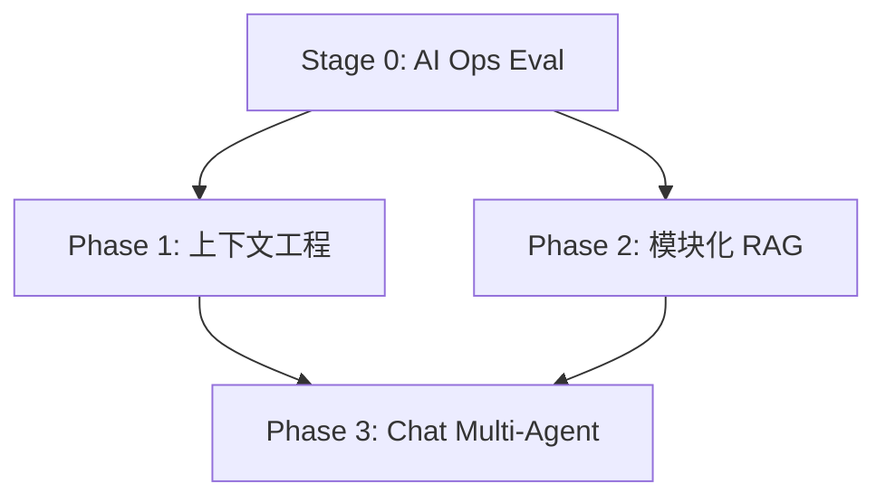

# OnCallAI 三阶段执行计划

## 1. 文档目的

本文档用于把当前项目的三条关键建设线收敛成一套统一执行顺序：

1. 上下文工程
2. 模块化 RAG
3. Multi-Agent 扩展

本文档不是设计总稿的重复，而是面向实施的执行手册。目标是明确：

- 为什么按这个顺序推进
- 每个阶段先做什么、后做什么
- 各项工作的依赖关系
- 每个阶段的交付物、验收标准和风险控制
- 代码层面大致落到哪些目录和接口

---

## 2. 总体结论

当前最合理的推进顺序是：

0. **先完成 AI Ops Multi-Agent 的运行验证与效果评估**
1. **Phase 1：在评测结论支持下推进上下文工程**
2. **Phase 2：在评测结论支持下推进模块化 RAG**
3. **Phase 3：最后扩展 Chat 链路 Multi-Agent**

原因如下：

- 上下文工程决定模型最终“看到什么、看到多少、以什么结构看到”
- 模块化 RAG 是高质量上下文供给系统，必须接在统一上下文控制层之后
- Multi-Agent 会放大上下文质量问题，如果先做，会把当前噪音、预算失控、证据不可追踪这些问题同步放大

当前代码状态需要先明确：

- `/ai_ops` 控制器已经切到新的 Multi-Agent service
- `trace` 查询接口已经存在
- AI Ops runtime 复用已经存在
- 普通 `/chat` 主链路仍然是旧 `chat_pipeline`

因此，当前最急迫的问题不是“继续补设计”，而是：

1. 跑通 AI Ops replay / eval
2. 做失败归因
3. 用数据决定是优先补上下文工程，还是优先补 RAG

一句话概括：

> AI Ops 评测是决策门，上下文工程是地基，模块化 RAG 是供料系统，Multi-Agent 是调度系统。

---

## 3. 执行总览

| 阶段 | 目标 | 预计产出 | 是否建议优先 |
| --- | --- | --- | --- |
| Stage 0 | AI Ops Multi-Agent 运行验证 | replay、评测指标、失败分类、优先级决策 | 最优先 |
| Phase 1 | 建立统一上下文控制系统 | `ContextProfile / ContextAssembler / ContextTrace / Token Budget` 接入主链路 | 取决于评测 |
| Phase 2 | 建立模块化 RAG 工程 | `Retriever / Rewriter / Reranker / Evidence Builder / RAG Trace / Eval` | 取决于评测 |
| Phase 3 | 扩展 Chat Multi-Agent | `Chat Supervisor / Specialists / Shared Evidence Contract` | 后置 |

推荐节奏：

- Stage 0：1 到 2 周
- Phase 1：2 到 3 周
- Phase 2：2 到 4 周
- Phase 3：2 到 4 周

总建议：

- Stage 0 必须先完成，除非你明确接受“凭判断而不是凭证据决定 Context/RAG 优先级”
- 每个阶段都以“先打通最小可用闭环，再增强质量”为策略
- 不建议跨阶段并行大范围开发
- 允许少量前置准备，但不要在 Phase 1/2 未收口前启动 Phase 3 主实现

---

## 4. 阶段依赖关系

更细的依赖如下：

- `AI Ops replay / eval` 是 Context 与 RAG 排期决策的前置依赖
- `ContextProfile` 是 `RAG Context Assembler` 的前置依赖
- `Token Budget` 接入主链路是 `RAG Evidence` 控制注入长度的前置依赖
- `ContextTrace` 是后续 `RAG Trace` 和 `Chat Multi-Agent Trace` 的前置依赖
- `RAG Evidence Contract` 是 Chat specialist agent 共享证据的前置依赖
- `Retrieval Eval` 是后续判断 Multi-Agent 是否真的提升质量的前置量化基础

---

## 5. Stage 0：AI Ops Multi-Agent 运行验证与决策门

## 5.1 阶段目标

在继续扩大设计和实现范围之前，先验证当前 AI Ops Multi-Agent 是否真的带来收益，并建立优先级决策依据。

## 5.2 核心问题

这个阶段要回答的不是“设计是否完整”，而是：

- 当前 AI Ops Multi-Agent 能否稳定工作
- 哪类失败最常见
- 失败主要来自上下文、RAG、路由、工具还是汇总
- 下一阶段最值得投入的是 Context 还是 RAG

## 5.3 核心交付物

- replay case 集
- 评测 rubric
- 延迟 / 降级 / 失败率统计
- 失败分类报告
- 下一阶段优先级决策

## 5.4 工作拆解

### Workstream 1：建立 AI Ops Golden Cases

任务：

- 收集 5 到 10 条典型 AI Ops 请求
- 覆盖：
  - 指标类问题
  - 日志类问题
  - 文档类问题
  - 混合证据问题
  - 工具失败降级问题

### Workstream 2：定义评测维度

建议维度：

- answer quality
- evidence grounding
- tool success rate
- degraded but useful rate
- p95 latency
- trace completeness

### Workstream 3：失败归因

建议分类：

- `context`：历史/记忆注入错误、预算错误、上下文污染
- `rag`：召回差、切分差、证据无关、citation 弱
- `routing`：triage/supervisor 路由错误
- `tool`：外部依赖失败、超时、降级策略差
- `reporting`：总结错误、冲突处理差

### Workstream 4：决策门

判定规则建议：

- 如果主要失败集中在“证据没找对、证据不稳、grounding 弱”，优先做 RAG
- 如果主要失败集中在“上下文过长、历史污染、记忆误注入、预算失控”，优先做上下文工程
- 如果两类问题都明显，则先做最小上下文底座，再做最小 RAG pipeline

## 5.5 退出条件

- 已有可复跑 replay 集
- 已有基础评测结果
- 已完成失败分类
- 已明确 Phase 1/2 实际优先级

---

## 6. Phase 1：上下文工程

## 6.1 阶段目标

建立统一的上下文控制层，让 chat、chat_stream、ai_ops 三条链路都不再各自拼接上下文，而是通过一套统一协议完成：

- 场景判定
- 预算分配
- 历史选择
- 记忆选择
- RAG 证据接入
- 安全过滤
- trace 落盘

## 6.2 业务结果目标

完成后，系统应该能稳定回答以下问题：

- 这次请求用了哪些 history
- 用了哪些 short-term memory / long-term memory
- 用了哪些 RAG 证据
- 为什么保留这些上下文、裁掉哪些上下文
- 当前总 token 预算是多少，各部分占用了多少

## 6.3 核心交付物

- `ContextRequest`
- `ContextProfile`
- `ContextBudget`
- `ContextItem`
- `ContextPackage`
- `ContextTrace`
- `ContextPolicyResolver`
- `BudgetPlanner`
- `HistorySelector`
- `MemorySelector`
- `ContextAssembler`
- `ContextSafetyFilter`

## 6.4 推荐目录落点

- `internal/ai/context/`
- `internal/ai/context/profile/`
- `internal/ai/context/budget/`
- `internal/ai/context/selector/`
- `internal/ai/context/assembler/`
- `internal/ai/context/safety/`
- `internal/ai/context/trace/`
- `internal/ai/service/context_service.go`

## 6.5 工作拆解

### Workstream 1：上下文协议定义

目标：

- 统一 chat、chat_stream、ai_ops 的上下文入参与出参

任务：

- 定义 `ContextRequest`
- 定义 `ContextProfile`
- 定义 `ContextItem`
- 定义 `ContextPackage`
- 定义 `ContextTrace`
- 定义可复用的 `ContextSourceType`、`ContextPriority`、`ContextTrimReason`

建议文件：

- `internal/ai/context/types.go`
- `internal/ai/context/profile/types.go`
- `internal/ai/context/trace/types.go`

验收标准：

- 3 条主链路都能构造标准 `ContextRequest`
- `ContextPackage` 能表达最终注入给模型的结构

### Workstream 2：Token Budget 接主链路

目标：

- 不再让 history、memory、docs 无上限注入

任务：

- 将现有 `utility/mem/token_budget.go` 能力包装到 `BudgetPlanner`
- 为 chat、chat_stream、ai_ops 定义默认预算模板
- 按 source 维度分配 budget：
  - system
  - history
  - short-term memory
  - long-term memory
  - rag evidence
  - tool outputs

建议文件：

- `internal/ai/context/budget/planner.go`
- `internal/ai/context/budget/profile.go`

依赖：

- `ContextProfile`

验收标准：

- 任一主链路都能打印预算分配结果
- 文档、记忆、历史内容注入总长度可控

### Workstream 3：Selector 层落地

目标：

- 把“取什么上下文”从控制器里挪到统一 selector 层

任务：

- `HistorySelector`
- `ShortTermMemorySelector`
- `LongTermMemorySelector`
- `ToolContextSelector`
- 对接现有 `memory_service.go`

建议文件：

- `internal/ai/context/selector/history_selector.go`
- `internal/ai/context/selector/memory_selector.go`
- `internal/ai/context/selector/tool_selector.go`

依赖：

- `BudgetPlanner`

验收标准：

- 各 selector 输出统一 `[]ContextItem`
- 支持 relevance / recency / source priority 基础排序

### Workstream 4：Context Assembler

目标：

- 将所有上下文按统一顺序组装成模型输入

任务：

- 约定注入顺序
- 去重
- 按预算裁剪
- 为 chat prompt 和 specialist prompt 输出结构化上下文

建议顺序：

1. system instructions
2. scenario policy
3. selected history
4. selected memories
5. RAG evidence
6. tool outputs
7. user input

建议文件：

- `internal/ai/context/assembler/assembler.go`
- `internal/ai/context/assembler/formatter.go`

依赖：

- selector 层

验收标准：

- chat 路径和 ai_ops 路径都能通过同一 assembler 产出上下文包

### Workstream 5：Context Trace

目标：

- 让上下文选择过程可审计、可回放

任务：

- 记录 budget 分配
- 记录候选项
- 记录最终入选项
- 记录被裁剪原因
- 与现有 trace / artifact store 对齐

建议文件：

- `internal/ai/context/trace/builder.go`
- `internal/ai/context/trace/store.go`

依赖：

- assembler

验收标准：

- 能按 trace_id 回看上下文构成

### Workstream 6：主链路接入

目标：

- 真正替换 chat / chat_stream / ai_ops 当前分散拼接逻辑

任务：

- 接入 `/chat`
- 接入 `/chat_stream`
- 接入 `/ai_ops`
- 保持现有行为兼容，优先做到输出不退化

建议文件：

- `internal/controller/chat/chat_v1_chat.go`
- `internal/controller/chat/chat_v1_chat_stream.go`
- `internal/controller/chat/chat_v1_ai_ops.go`
- `internal/ai/service/context_service.go`

验收标准：

- 旧链路功能可用
- 新链路可输出 trace
- 关键路径测试通过

## 6.6 测试与验收

必须覆盖：

- unit test：budget、selector、assembler、trace
- integration test：chat、chat_stream、ai_ops
- replay test：超长 history、无 memory、无 docs、budget 不足

成功标准：

- 主链路无明显行为退化
- 上下文长度可控
- trace 可读
- 不再存在各处手写拼接上下文

## 6.7 风险与缓解

风险：

- 一次性替换主链路导致回答风格变化
- budget 太激进导致有用信息被裁掉
- trace 数据过大

缓解：

- 先灰度到 ai_ops，再切 chat
- budget 先保守，逐步收紧
- trace 记录摘要和引用，不直接存大文本全量副本

## 6.8 Phase 1 退出条件

满足以下条件才允许进入 Phase 2 主实现：

- `ContextAssembler` 已成为主入口
- budget 已接入主链路
- context trace 可查询
- chat 和 ai_ops 至少各有 3 个回放案例通过

---

## 7. Phase 2：模块化 RAG

## 7.1 阶段目标

将当前“Milvus 检索 + 直接注入 prompt”的基础链路升级为模块化 RAG 工程系统。

## 7.2 业务结果目标

完成后，系统应该能稳定回答以下问题：

- 为什么检索到这些 chunk
- 哪些 chunk 被 rerank 提前或降权
- 哪些 chunk 因去重、预算或安全原因被丢弃
- 不同文档类型如何切分
- 检索质量是否在提升

## 7.3 核心交付物

- `IngestionPipeline`
- `MetadataNormalizer`
- `ChunkStrategyRegistry`
- `RetrievalRequest`
- `QueryRewriter`
- `Retriever`
- `Reranker`
- `Deduper`
- `EvidenceBuilder`
- `RAGContextAssembler`
- `RAGTrace`
- `RAGEvalSuite`

## 7.4 推荐目录落点

- `internal/ai/rag/`
- `internal/ai/rag/ingestion/`
- `internal/ai/rag/chunking/`
- `internal/ai/rag/retrieval/`
- `internal/ai/rag/evidence/`
- `internal/ai/rag/trace/`
- `internal/ai/rag/eval/`

## 7.5 工作拆解

### Workstream 1：Ingestion 重构

目标：

- 将上传入库从“文件上传后立即粗粒度处理”升级为可治理的 ingestion pipeline

任务：

- 拆出 `DocumentSource`
- 标准化 metadata
- 标准化 `doc_id / source_id / chunk_id / version`
- 预留状态机：
  - uploaded
  - parsed
  - chunked
  - embedded
  - indexed
  - failed

建议文件：

- `internal/ai/rag/ingestion/types.go`
- `internal/ai/rag/ingestion/pipeline.go`
- `internal/ai/rag/ingestion/metadata.go`

依赖：

- Phase 1 的 trace 与 artifact 体系

### Workstream 2：Chunking 模块化

目标：

- 不同文档类型使用不同切分策略

任务：

- 为 markdown / plain text / pdf / docx / csv / json / yaml 定义策略
- 支持 overlap、标题继承、层级路径、表格块、配置块

建议文件：

- `internal/ai/rag/chunking/registry.go`
- `internal/ai/rag/chunking/markdown.go`
- `internal/ai/rag/chunking/text.go`
- `internal/ai/rag/chunking/structured.go`

验收标准：

- 相同语义段落不会被明显切碎
- 非 markdown 类型不再复用单一 splitter

### Workstream 3：Retrieval Pipeline

目标：

- 将 query rewrite、retrieve、rerank、dedup、budget trim 串成标准检索流水线

任务：

- 定义 `RetrievalRequest`
- 可选接入 `QueryRewriter`
- 向量召回
- metadata filter
- rerank
- dedup
- evidence build

建议文件：

- `internal/ai/rag/retrieval/request.go`
- `internal/ai/rag/retrieval/pipeline.go`
- `internal/ai/rag/retrieval/rewriter.go`
- `internal/ai/rag/retrieval/reranker.go`
- `internal/ai/rag/retrieval/deduper.go`

依赖：

- Phase 1 的 budget planner

### Workstream 4：Evidence Builder

目标：

- 不再把裸文档数组直接塞进 prompt

任务：

- 将 retrieval hits 转为结构化 evidence
- 提供 title、source、score、snippet、citation、reason
- 与 `ContextAssembler` 对接

建议文件：

- `internal/ai/rag/evidence/builder.go`
- `internal/ai/rag/evidence/types.go`

验收标准：

- chat / tool / specialist 都消费统一 evidence 结构

### Workstream 5：RAG Trace

目标：

- 全链路回答“检索发生了什么”

任务：

- 记录 query 原文和 rewrite 后 query
- 记录召回集合
- 记录 rerank 分数
- 记录 dedup 原因
- 记录最终 evidence 集

建议文件：

- `internal/ai/rag/trace/types.go`
- `internal/ai/rag/trace/builder.go`

依赖：

- retrieval pipeline

### Workstream 6：RAG Eval

目标：

- 建立检索质量基线

任务：

- 建立小规模基准集
- 定义 hit-rate、citation coverage、grounding rate
- 建立 replay / regression 测试

建议文件：

- `internal/ai/rag/eval/cases/`
- `internal/ai/rag/eval/runner.go`
- `res/rag-eval-cases.md`

验收标准：

- 能比较不同 chunking 和 rerank 策略

### Workstream 7：接入主链路

目标：

- 让 chat、query_internal_docs、knowledge specialist 全部走统一 RAG pipeline

任务：

- 替换 chat pipeline 中的直接 retriever 接入
- 替换 `query_internal_docs`
- 替换 `knowledge agent`

建议文件：

- `internal/ai/agent/chat_pipeline/orchestration.go`
- `internal/ai/tools/query_internal_docs.go`
- `internal/ai/agent/specialists/knowledge/agent.go`

## 7.6 测试与验收

必须覆盖：

- ingestion tests
- chunking tests
- retrieval replay tests
- eval baseline
- citation/grounding smoke tests

成功标准：

- chat 结果 evidence 更稳定
- 证据可追溯
- 文档类型适配更完整
- RAG 行为不再是黑盒

## 7.7 风险与缓解

风险：

- rerank 增加模型成本和延迟
- chunking 重构导致已有知识库行为改变
- retrieval trace 数据膨胀

缓解：

- rerank 先对 top-N 使用
- 新旧 chunking 并行验证后迁移
- trace 记录引用和摘要，不存重复大块正文

## 7.8 Phase 2 退出条件

- chat 和 tool 路径都走统一 evidence pipeline
- 至少一套 eval cases 可稳定跑通
- RAG trace 可按 trace_id 查询
- 文档切分策略不再单一依赖 markdown splitter

---

## 8. Phase 3：Chat 链路 Multi-Agent

## 8.1 阶段目标

在上下文工程和模块化 RAG 稳定后，把普通 chat 从单 Agent 升级为受控的轻量 Multi-Agent。

## 8.2 业务结果目标

完成后，系统应该具备：

- 按问题类型路由 chat 请求
- 在需要时并行查询 knowledge / logs / metrics
- 使用统一 evidence contract 汇总结果
- 保持普通简单问题不被过度调度

## 8.3 核心交付物

- `ChatSupervisor`
- `ChatTriage`
- `Knowledge Specialist`
- `Tool Specialist`
- `Reporter`
- `RoutingPolicy`
- `ChatAgentTrace`

## 8.4 推荐目录落点

- `internal/ai/agent/chat_supervisor/`
- `internal/ai/agent/chat_specialists/`
- `internal/ai/service/chat_runtime_service.go`

## 8.5 工作拆解

### Workstream 1：Chat Routing Policy

目标：

- 决定什么请求仍走单 Agent，什么请求进入 Multi-Agent

任务：

- 定义路由规则
- 支持 feature flag
- 支持低风险灰度

建议规则：

- 简单闲聊：单 Agent
- 明确文档问答：knowledge specialist
- 混合问题：supervisor + specialists
- 高风险动作请求：拒绝或人工审批

建议文件：

- `internal/ai/agent/chat_supervisor/routing_policy.go`
- `internal/ai/service/chat_runtime_service.go`

### Workstream 2：Chat Supervisor

目标：

- 负责拆任务、选择 specialist、汇总结果

任务：

- 接入已有 runtime
- 复用 `TaskEnvelope / TaskResult / ArtifactRef`
- 使用 Phase 1/2 的 ContextPackage 和 RAGEvidence

建议文件：

- `internal/ai/agent/chat_supervisor/supervisor.go`

依赖：

- Phase 1 和 Phase 2 的协议稳定

### Workstream 3：Chat Specialists

目标：

- 将普通 chat 中高价值的专域处理独立出来

建议第一批：

- `Knowledge Specialist`
- `Tools Specialist`
- `Clarification Specialist`

任务：

- 每个 specialist 只暴露受限工具集
- 统一输出 evidence 和 confidence

建议文件：

- `internal/ai/agent/chat_specialists/knowledge/agent.go`
- `internal/ai/agent/chat_specialists/tools/agent.go`
- `internal/ai/agent/chat_specialists/clarify/agent.go`

### Workstream 4：Reporter / Answer Composer

目标：

- 把多个 specialist 结果组装成一个自然回答

任务：

- 冲突处理
- 证据排序
- citation 生成
- 置信度标注

建议文件：

- `internal/ai/agent/chat_supervisor/reporter.go`

### Workstream 5：灰度接入

目标：

- 避免直接全量切换 chat 主链路

任务：

- 新旧链路共存
- 支持 feature flag / 路由策略
- 支持 trace 比对

建议：

- 先只灰度给文档问答类请求
- 再灰度给复杂混合问题
- 最后评估是否扩大覆盖

### Workstream 6：Chat Eval

目标：

- 判断 Multi-Agent 是否真的有收益

任务：

- 建立对比集：
  - 单 Agent 回答
  - Multi-Agent 回答
- 评估：
  - answer quality
  - grounding
  - latency
  - cost

建议文件：

- `res/chat-multi-agent-eval-cases.md`
- `internal/ai/eval/chat_compare_runner.go`

## 8.6 测试与验收

必须覆盖：

- routing tests
- supervisor tests
- replay tests
- single-agent vs multi-agent 对比评估

成功标准：

- 复杂问题质量提升
- 简单问题延迟不显著恶化
- 证据和 trace 可追踪
- 未出现工具权限失控

## 8.7 风险与缓解

风险：

- 过度调度导致延迟和成本上升
- routing 错误导致简单问题走复杂链路
- specialist 输出冲突

缓解：

- 默认保守路由
- 单 Agent fallback 常驻
- reporter 必须输出冲突说明

## 8.8 Phase 3 退出条件

- 已有一组明确收益场景
- 单 Agent 与 Multi-Agent 对比数据成立
- chat 主链路可按策略灰度
- trace、approval、context、evidence 协议保持一致

---

## 9. 跨阶段公共事项

以下事项不应等某个阶段结束后才想起，而应该持续推进：

### 9.1 配置治理

- 所有新能力都要进入配置，而不是硬编码
- 预算、top_k、timeouts、rerank、feature flags 都应配置化

### 9.2 Trace 与可观测性

- 统一 `trace_id`
- 所有阶段都尽量沉淀 artifact
- 对关键路径加延迟、失败率、降级率指标

### 9.3 安全治理

- 工具白名单
- 审批门
- RAG 文档分级
- 敏感上下文过滤
- 跨域和外部接口最小暴露

### 9.4 测试体系

- unit test
- integration test
- replay test
- eval baseline

### 9.5 文档沉淀

- 设计决策写入 `todo/`
- 经验、失败案例写入 `res/todo.md`
- 每阶段结束必须做复盘记录

---

## 10. 推荐执行顺序

最务实的执行顺序如下：

### 第 1 周

- 完成 Stage 0 的 golden cases 和评测 rubric
- 跑第一轮 AI Ops replay
- 完成失败分类

### 第 2 周到第 3 周

- 根据 Stage 0 结论启动 Context 或 RAG 的优先项
- 如果两类问题都明显，先做 Phase 1 的协议、budget、selector

### 第 4 周

- 完成优先项的第一轮闭环
- 做复盘并确认是否启动另一条线

### 第 5 周到第 6 周

- 推进另一条主线
- 如果优先做的是 Context，这里启动 RAG
- 如果优先做的是 RAG，这里补 Context 最小底座

### 第 7 周

- 完成 RAG trace 与 eval baseline
- 做第二轮复盘

### 第 8 周到第 9 周

- 启动 Phase 3 chat routing、supervisor、knowledge specialist 接入
- 新旧 chat 链路并行

### 第 10 周

- 做单 Agent / Multi-Agent 对比评估
- 决定是否继续扩大 chat multi-agent 覆盖

---

## 11. 当前建议的第一步

如果现在立刻开始做，第一步不是继续扩设计，也不是直接开做 Chat Phase 3。

当前应立即启动的工作是：

1. 建 5 到 10 条 AI Ops golden cases
2. 建 answer quality / grounding / latency / degraded rate 的评测表
3. 跑第一轮 replay，按 `context / rag / routing / tool / reporting` 分类失败
4. 用结果决定先做 Phase 1 还是 Phase 2

在没有这一步之前，继续扩大上下文工程或 RAG 的设计范围，收益都不够确定。

---

## 12. 最终结论

当前项目不是不该做 Multi-Agent，而是**不能把 Multi-Agent 放在第一位**。

正确顺序是：

1. 先完成 AI Ops Multi-Agent 的运行验证与效果评估
2. 再根据证据决定先做上下文工程还是先做模块化 RAG
3. 最后扩展 Chat Multi-Agent

如果这个顺序被打乱，最常见的结果是：

- 上下文仍然混乱
- RAG 仍然粗糙
- Multi-Agent 只是把现有问题放大

如果按本文档推进，收益是：

- 先把“输入给模型的内容”做对
- 再把“供给给模型的知识证据”做强
- 最后再把“多角色协作调度”做稳

这条路线返工最少，也最容易获得可验证收益。
